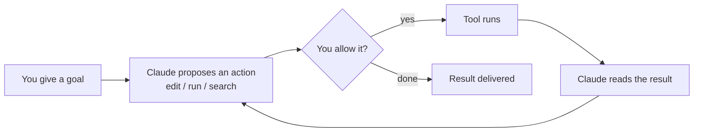

<LevelBadge level="beginner" />

<VerifyNote lastVerified="2026-06-20" source="https://code.claude.com/docs/en/overview">
इंस्टॉल कमांड और सटीक फ़ीचर सेट अक्सर बदलते हैं। सेटअप के लिए आधिकारिक Claude Code डॉक्स को सत्य का स्रोत मानें।
</VerifyNote>

<Callout type="objectives" items={["समझाएँ कि क्या चीज़ Claude Code को एजेंटिक बनाती है, न कि सिर्फ़ एक चैट विंडो", "एजेंटिक लूप की कल्पना करें: लक्ष्य, क्रिया, अनुमति, अवलोकन, दोहराव", "उन सतहों के नाम बताएँ जहाँ Claude Code चलता है और सेटिंग्स आपके साथ कैसे यात्रा करती हैं", "जिन चीज़ों को आप कॉन्फ़िगर करते हैं उन्हें प्रभाव के अनुसार क्रम दें, CLAUDE.md से शुरू करते हुए", "Plan Mode का उपयोग करते हुए एक सुरक्षित पहले सत्र के स्वरूप से गुज़रें"]} />

**Claude Code** Anthropic का *एजेंटिक* कोडिंग टूल है। एक चैट विंडो के विपरीत, यह वास्तव में **आपके प्रोजेक्ट में काम कर सकता है**: फ़ाइलें पढ़ और संपादित कर सकता है, शेल कमांड चला सकता है, कोडबेस खोज सकता है, और बाहरी टूल्स को कॉल कर सकता है — यह सब आपकी अनुमति से।

## मानसिक मॉडल: एक एजेंटिक लूप

यह वह एक विचार है जो बाकी सब कुछ समझ में आने लायक बना देता है। आप सादी भाषा में एक उद्देश्य देते हैं ("auth मॉड्यूल के लिए टेस्ट जोड़ें और जो विफल हो उसे ठीक करें")। Claude **योजना बनाता है, कार्य करता है, परिणाम का अवलोकन करता है, और दोहराता है** जब तक लक्ष्य पूरा न हो जाए। आप [अनुमतियों](/docs/claude-code) और [Plan Mode](/docs/claude-code) के माध्यम से नियंत्रण में रहते हैं।

<Callout type="tip" items={["लूप केवल उन्हीं क्रियाओं पर आगे बढ़ता है जिन्हें आप अनुमति देते हैं। कुछ भी उस अनुमति-गेट से गुज़रे बिना न संपादित होता है न चलता है — और ठीक यही कारण है कि अगले खंड मायने रखते हैं।"]} />

## आप इसे कहाँ चला सकते हैं

वही Claude Code सतहों के बीच आपका अनुसरण करता है — यह जहाँ भी आप काम करें वहाँ **आपकी सेटिंग्स, हुक्स, और अनुमतियाँ साझा करता है**।

- **टर्मिनल (CLI)** — मूल सतह; किसी भी शेल में काम करता है।
- **IDE एक्सटेंशन** — VS Code और JetBrains, इनलाइन डिफ़्स के साथ।
- **डेस्कटॉप और वेब** — और यह आपकी सेटिंग्स, हुक्स, और अनुमतियों को सतहों के बीच साझा करता है।

## आप क्या कॉन्फ़िगर करेंगे (प्रभाव के मोटे क्रम में)

इसे एक सीढ़ी की तरह सोचें: पहले ऊपरी पायदानों में महारत हासिल करें, फिर पावर फ़ीचर्स की परत तभी जोड़ें जब कोई वास्तविक ज़रूरत दिखे।

<Steps items={[{title: "CLAUDE.md", body: "स्थायी प्रोजेक्ट निर्देश। उच्चतम प्रभाव, न्यूनतम प्रयास — यहीं से शुरू करें।"}, {title: "Plan Mode", body: "किसी भी संपादन के चलने से पहले जाँच करें और प्रस्ताव दें।"}, {title: "अनुमतियाँ", body: "तय करें कि Claude बिना पूछे क्या कर सकता है।"}, {title: "settings.json", body: "हर चीज़ के नीचे की पूरी कॉन्फ़िग प्रणाली।"}, {title: "पावर फ़ीचर्स", body: "स्लैश कमांड, हुक्स, स्किल्स, सबएजेंट्स, और MCP सर्वर — ज़रूरत के अनुसार परत-दर-परत जोड़े गए।"}]} />

प्रत्येक पायदान अपने स्वयं के पाठ से जुड़ता है: [CLAUDE.md](/docs/claude-code), [Plan Mode](/docs/claude-code), [अनुमतियाँ](/docs/claude-code), [settings.json](/docs/claude-code), [स्लैश कमांड](/docs/claude-code), [हुक्स](/docs/claude-code), [स्किल्स](/docs/claude-code), [सबएजेंट्स](/docs/claude-code), और [MCP सर्वर](/docs/claude-code)।

## आपका पहला सत्र (इसका स्वरूप)

<Steps items={[{title: "इंस्टॉल और प्रमाणित करें", body: "वर्तमान कमांड के लिए आधिकारिक डॉक्स देखें।"}, {title: "एक प्रोजेक्ट खोलें", body: "किसी प्रोजेक्ट में cd करें और Claude Code शुरू करें।"}, {title: "एक स्टार्टर CLAUDE.md बनाएँ", body: "अपने प्रोजेक्ट निर्देशों को स्कैफ़ोल्ड करने के लिए /init चलाएँ।"}, {title: "कुछ छोटा और ठोस माँगें", body: "आज़माएँ: समझाएँ कि इस ऐप में रूटिंग कैसे काम करती है।"}, {title: "पहले Plan Mode में एक बदलाव करें", body: "प्रस्तावित योजना की समीक्षा करें, फिर उसे निष्पादित होने दें।"}]} />

उस पहले सत्र से दो कमांड याद रखने लायक हैं:

<PromptCard title="प्रोजेक्ट निर्देश स्कैफ़ोल्ड करें">{`/init`}</PromptCard>

<PromptCard title="एक सुरक्षित, केवल-पठन पहली माँग">{`Explain how routing works in this app.`}</PromptCard>

वर्तमान इंस्टॉल और प्रमाणीकरण कमांड के लिए, [आधिकारिक डॉक्स](https://code.claude.com/docs/en/overview) देखें।

<Callout type="tip" items={["केवल-पठन से शुरू करें। अपने पहले वास्तविक कार्य के लिए, Plan Mode का उपयोग करें — Claude जाँच करता है और आपको फ़ाइलें छुए बिना एक योजना दिखाता है। यह विश्वास बनाने का सबसे सुरक्षित तरीका है।"]} />

## एक नज़र में मुख्य शब्द

<Flashcards title="Claude Code शब्दावली" cards={[{front: "एजेंटिक टूल", back: "एक टूल जो आपके प्रोजेक्ट में क्रियाएँ करता है — फ़ाइलें पढ़ता/संपादित करता है, कमांड चलाता है, कोड खोजता है, बाहरी टूल्स कॉल करता है — न कि सिर्फ़ एक चैट विंडो।"}, {front: "एजेंटिक लूप", back: "सादी भाषा में लक्ष्य, फिर Claude योजना बनाता है, कार्य करता है, परिणाम का अवलोकन करता है, और लक्ष्य पूरा होने तक दोहराता है।"}, {front: "Plan Mode", back: "Claude किसी भी संपादन के चलने से पहले जाँच करता है और एक योजना प्रस्तावित करता है — शुरू करने का सबसे सुरक्षित तरीका।"}, {front: "CLAUDE.md", back: "स्थायी प्रोजेक्ट निर्देश। उच्चतम प्रभाव, न्यूनतम प्रयास; /init से बनाए जाते हैं।"}, {front: "अनुमतियाँ", back: "नियंत्रण-गेट: Claude आपसे पहले पूछे बिना क्या कर सकता है।"}]} />

<Quiz title="ख़ुद को जाँचें" questions={[{q: "क्या चीज़ Claude Code को एक चैट विंडो से अलग बनाती है?", options: ["यह लंबे जवाब लिखता है", "यह आपके प्रोजेक्ट में क्रियाएँ कर सकता है — फ़ाइलें संपादित करना, कमांड चलाना, कोड खोजना — आपकी अनुमति से", "यह केवल टर्मिनल में काम करता है"], answer: 1, explain: "Claude Code एजेंटिक है: यह आपके प्रोजेक्ट में कार्य करता है (फ़ाइलें पढ़ना/संपादित करना, शेल कमांड चलाना, खोजना, टूल्स कॉल करना), यह सब आपकी अनुमति से।"}, {q: "एजेंटिक लूप में, Claude द्वारा कोई क्रिया प्रस्तावित करने के ठीक बाद क्या होता है?", options: ["टूल अपने आप चल जाता है", "आप तय करते हैं कि उसे अनुमति देनी है या नहीं", "परिणाम पहुँचा दिया जाता है"], answer: 1, explain: "हर प्रस्तावित क्रिया एक अनुमति-गेट से गुज़रती है — टूल तभी चलता है जब आप अनुमति देते हैं।"}, {q: "कौन-सा सेटअप चरण न्यूनतम प्रयास के लिए सबसे अधिक प्रभाव वाला है?", options: ["MCP सर्वर", "हुक्स", "CLAUDE.md"], answer: 2, explain: "CLAUDE.md — स्थायी प्रोजेक्ट निर्देश — सबसे पहले सूचीबद्ध है क्योंकि इसका न्यूनतम प्रयास के लिए सबसे अधिक प्रभाव है।"}]} />

<Callout type="takeaways" items={["Claude Code एजेंटिक है: यह आपकी अनुमति से आपके प्रोजेक्ट में कार्य करता है, सिर्फ़ बातें नहीं करता।", "लूप है लक्ष्य, प्रस्ताव, अनुमति, चलाना, अवलोकन, दोहराव — आप इसे अनुमतियों और Plan Mode के माध्यम से नियंत्रित करते हैं।", "यह टर्मिनल, VS Code/JetBrains, और डेस्कटॉप व वेब पर चलता है, सतहों के बीच सेटिंग्स, हुक्स, और अनुमतियाँ साझा करते हुए।", "प्रभाव के अनुसार कॉन्फ़िगर करें: पहले CLAUDE.md, फिर Plan Mode, अनुमतियाँ, settings.json, फिर पावर फ़ीचर्स।", "विश्वास बनाने के लिए संपादनों को चलने देने से पहले पहला सत्र Plan Mode में केवल-पठन से शुरू करें।"]} />

## आगे

- सबसे अधिक प्रभाव वाला सेटअप → [CLAUDE.md और मेमोरी फ़ाइलें](/docs/claude-code)
- इसे शुरू से अंत तक करें → [वॉकथ्रू: एक वास्तविक रेपो के लिए Claude Code को कस्टमाइज़ करें](/docs/walkthroughs)
- अपने स्वयं के स्वचालन बनाएँ → [टेम्पलेट्स और रेसिपीज़](/docs/templates)
