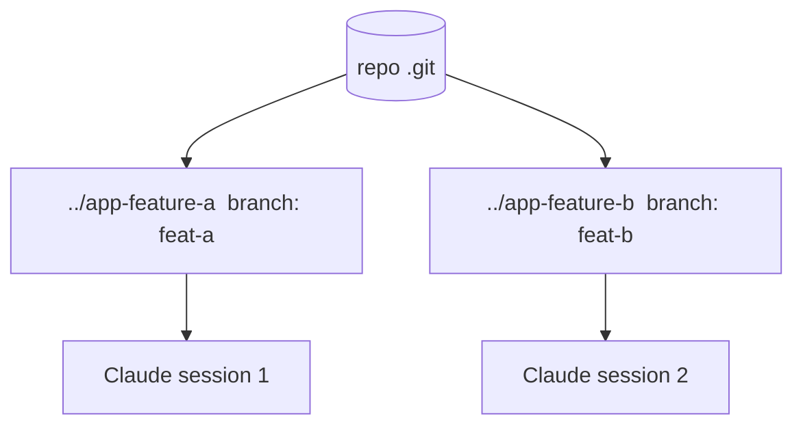

<LevelBadge level="advanced" />

<Callout type="objectives" items={["git worktree क्या है — एक रेपो, कई वर्किंग डायरेक्टरीज़, प्रत्येक अपनी ब्रांच पर","यह जिस ठोस समस्या को हल करता है: समानांतर Claude सत्रों को एक ही फ़ाइलों पर टकराने से रोकना","worktrees जोड़ने, सूचीबद्ध करने और हटाने के चार कमांड","यह तकनीक कब अपनी कीमत वसूल करती है — और मर्ज के समय काटने वाले तीन नुकसान","worktrees सबएजेंट्स के साथ कैसे संयोजित होते हैं: सत्रों के बीच समानांतरता बनाम एक सत्र के भीतर"]} />

एक **git worktree** एक रिपॉज़िटरी को **कई वर्किंग डायरेक्टरीज़** रखने देता है, प्रत्येक एक अलग ब्रांच पर चेक आउट की गई। इसे Claude Code के साथ जोड़ें और आप एक ही प्रोजेक्ट पर **कई सत्र समानांतर** में चला सकते हैं — प्रत्येक अपनी फ़ाइलों को संपादित करते हुए, बिना किसी टकराव के।

## यह जिस समस्या को हल करता है

अगर दो Claude सत्र एक ही वर्किंग डायरेक्टरी को एक साथ संपादित करते हैं, तो वे एक-दूसरे के बदलावों से टकरा जाते हैं। Worktrees प्रत्येक सत्र को उसकी **अपनी डायरेक्टरी और ब्रांच** देते हैं, ताकि समानांतर काम तब तक पृथक रहे जब तक आप मर्ज न करें।

## मूल बातें

चार कमांड पूरे वर्कफ़्लो को संभालते हैं: एक worktree जोड़ें (नई dir + नई ब्रांच), जो मौजूद है उसे सूचीबद्ध करें, और काम पूरा होने पर एक हटाएँ।

<Steps items={[{title: "किसी फ़ीचर के लिए एक worktree जोड़ें", body: "अपने रेपो से, git worktree add ../app-feature-a -b feat-a एक ही झटके में एक नई डायरेक्टरी और एक नई ब्रांच बनाता है।"},{title: "किसी फ़िक्स के लिए एक और जोड़ें", body: "git worktree add ../app-fix-123 -b fix-123 — पहली के साथ-साथ एक दूसरी पृथक dir/ब्रांच।"},{title: "देखें आपके पास क्या है", body: "git worktree list हर वर्किंग डायरेक्टरी और वह जिस ब्रांच पर है उसे दिखाता है।"},{title: "काम पूरा होने पर सफ़ाई करें", body: "git worktree remove ../app-feature-a एक worktree को हटा देता है ताकि बासी डायरेक्टरीज़ जमा न हों।"}]} />

<PromptCard title="चार-कमांड वर्कफ़्लो">{`# from your repo
git worktree add ../app-feature-a -b feat-a   # new dir + new branch
git worktree add ../app-fix-123 -b fix-123
git worktree list
# when done with one:
git worktree remove ../app-feature-a`}</PromptCard>

प्रत्येक worktree डायरेक्टरी में एक Claude Code सत्र खोलें और उन्हें स्वतंत्र रूप से काम करने दें।

## यह कब सार्थक है

- **समानांतर फ़ीचर्स/फ़िक्स** जिन्हें आप एक साथ आगे बढ़ाना चाहते हैं।
- एक worktree में **एक लंबा कार्य चलते हुए** जबकि आप दूसरे में काम करते रहते हैं।
- **जोखिम भरे प्रयोग** आपके मुख्य चेकआउट से पृथक।

## नुकसान

<Callout type="warning" items={["मर्ज-बैक पर नज़र रखें: ब्रांचें अंततः मर्ज होंगी — टकराव तभी सामने आते हैं, उस दौरान नहीं। Worktrees को केंद्रित और अल्पकालिक रखें।","दो worktrees से स्टेटफ़ुल, साझा संसाधन (एक dev DB, एक पोर्ट) उन्हें पृथक किए बिना न चलाएँ।","git worktree remove से सफ़ाई करें ताकि बासी डायरेक्टरीज़ जमा न हों।"]} />

## Worktrees बनाम सबएजेंट्स

समानांतरता के दो अलग-अलग आयाम — ये प्रतिस्पर्धा नहीं करते, ये एक-दूसरे के ऊपर जुड़ते हैं।

| | यह किसे समानांतर करता है | पृथकता |
| --- | --- | --- |
| **[सबएजेंट्स](/docs/claude-code/subagents)** | एक सत्र के *भीतर* काम (प्रत्यायोजन) | पृथक संदर्भ |
| **Worktrees** | डिस्क पर सत्रों के *बीच* काम | पृथक ब्रांचें/फ़ाइलें |

ये अच्छी तरह संयोजित होते हैं: एक worktree में एक सत्र स्वयं सबएजेंट्स उत्पन्न कर सकता है।

<Callout type="tip" items={["worktree का उपयोग तब करें जब आपको एक ही रेपो को एक साथ छूते हुए दो Claude सत्रों की ज़रूरत हो; सबएजेंट का उपयोग तब करें जब एक सत्र को काम के एक हिस्से को पृथक संदर्भ में सौंपने की ज़रूरत हो।"]} />

<Quiz title="स्वयं को परखें" questions={[{q: "एक git worktree आपको क्या देता है?", options: ["एक ही वर्किंग डायरेक्टरी में कई ब्रांचें", "एक रेपो के लिए कई वर्किंग डायरेक्टरीज़, प्रत्येक अपनी ब्रांच पर", "आपके .git फ़ोल्डर की एक बैकअप प्रति"], answer: 1, explain: "एक git worktree एक रिपॉज़िटरी को कई वर्किंग डायरेक्टरीज़ रखने देता है, प्रत्येक एक अलग ब्रांच पर चेक आउट की गई — ताकि समानांतर सत्र आपस में न टकराएँ।"}, {q: "कौन-सा कमांड एक ही चरण में एक नई डायरेक्टरी और एक नई ब्रांच बनाता है?", options: ["git worktree list", "git worktree add ../app-feature-a -b feat-a", "git worktree remove ../app-feature-a"], answer: 1, explain: "git worktree add ../app-feature-a -b feat-a नई डायरेक्टरी और नई ब्रांच को एक साथ बनाता है। list मौजूदा worktrees दिखाता है; remove एक को हटा देता है।"}, {q: "समानांतर worktrees से मर्ज टकराव वास्तव में कब सामने आते हैं?", options: ["लगातार, जबकि दोनों सत्र संपादित करते हैं", "मर्ज-बैक के समय, उस दौरान नहीं", "कभी नहीं, क्योंकि ब्रांचें पृथक होती हैं"], answer: 1, explain: "काम करते समय ब्रांचें पृथक रहती हैं, इसलिए टकराव उस दौरान सामने नहीं आते — वे मर्ज-बैक पर सामने आते हैं। उन्हें सीमित रखने के लिए worktrees को केंद्रित और अल्पकालिक रखें।"}, {q: "worktrees और सबएजेंट्स आपस में कैसे संबंधित हैं?", options: ["वे दो नामों वाला एक ही फ़ीचर हैं", "Worktrees डिस्क पर सत्रों के बीच समानांतरता देते हैं; सबएजेंट्स एक सत्र के भीतर समानांतरता देते हैं — और ये संयोजित होते हैं", "आपको एक चुनना ही पड़ता है; दोनों का उपयोग पृथकता को तोड़ देता है"], answer: 1, explain: "सबएजेंट्स एक सत्र के भीतर समानांतरता हैं (पृथक संदर्भ); worktrees डिस्क पर सत्रों के बीच समानांतरता हैं (पृथक ब्रांचें/फ़ाइलें)। एक worktree में एक सत्र स्वयं सबएजेंट्स उत्पन्न कर सकता है।"}]} />

<Callout type="takeaways" items={["एक git worktree = एक रेपो, कई वर्किंग डायरेक्टरीज़, प्रत्येक अपनी ब्रांच पर — टकराव-रहित समानांतर Claude सत्रों का आधार।","एक ही वर्किंग डायरेक्टरी पर दो सत्र एक-दूसरे से टकराते हैं; प्रति सत्र एक worktree फ़ाइलों और ब्रांचों को तब तक पृथक रखता है जब तक आप मर्ज न करें।","git worktree add ../dir -b branch dir + ब्रांच बनाता है; list उन्हें दिखाता है; remove सफ़ाई करता है।","समानांतर फ़ीचर्स/फ़िक्स, दूसरे काम के साथ-साथ चलने वाले लंबे कार्यों, और पृथक जोखिम भरे प्रयोगों के लिए सार्थक।","मर्ज-बैक से सावधान रहें, worktrees के बीच स्टेटफ़ुल संसाधन (DB, पोर्ट) साझा न करें, और हमेशा सफ़ाई करें — और याद रखें कि worktrees सबएजेंट्स के साथ संयोजित होते हैं।"]} />

## आगे

- [सबएजेंट्स और समानांतर एजेंट](/docs/claude-code/subagents)
- [हेडलेस मोड और Agent SDK](/docs/claude-code/headless-and-agent-sdk)
- [संदर्भ प्रबंधन](/docs/claude-code/context-management)
