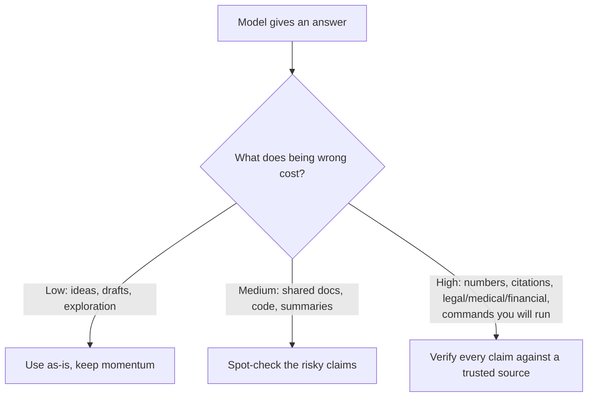

<LevelBadge level="intermediate" />

<Callout type="objectives" items={["समझें कि मॉडल आत्मविश्वासपूर्ण, सुगठित उत्तर क्यों गढ़ते हैं", "उन 5 उच्च-जोखिम वाले क्षेत्रों को पहचानें जहाँ आपको सबसे अधिक संदेहशील रहना चाहिए", "मतिभ्रम को नाटकीय रूप से कम करने के लिए एक 6-भागीय टूलकिट लागू करें", "एक कॉपी-पेस्ट एंटी-हैलुसिनेशन प्रॉम्प्ट का उपयोग करें जो आधारित करता है, एक रास्ता देता है, और उद्धरणों के लिए मजबूर करता है", "वह मानसिकता अपनाएँ जो सत्यापन के प्रयास को गलत होने की लागत के अनुरूप ढालती है"]} />

एक **मतिभ्रम (hallucination)** तब होता है जब कोई मॉडल पूरे आत्मविश्वास के साथ कुछ गलत कहता है। यह न तो झूठ बोल रहा है और न ही खराब है — यह LLMs के काम करने के तरीके का दूसरा पहलू है: वे *प्रशंसनीय* टेक्स्ट उत्पन्न करते हैं, और प्रशंसनीय हमेशा सच नहीं होता (देखें [LLM क्या है?](/docs/foundations/what-is-an-llm))। आप इसे प्रॉम्प्ट से पूरी तरह हटा नहीं सकते, पर आप इसे नाटकीय रूप से कम कर सकते हैं और बाकी को पकड़ सकते हैं।

## यह क्यों होता है

मॉडल एक संभावित continuation की भविष्यवाणी करता है। जब वह कुछ "नहीं जानता", तो *सबसे संभावित दिखने वाला* continuation अक्सर एक आत्मविश्वासपूर्ण, सुगठित — और गलत — उत्तर होता है। कोई अंतर्निहित "मुझे यकीन नहीं है" संकेत नहीं होता जब तक कि आप उसके लिए जगह न बनाएँ।

<Callout type="tip" items={["अधिकांश मतिभ्रमों का समाधान जानबूझकर अनिश्चितता के लिए जगह बनाना है — मॉडल को यह कहने की अनुमति दें कि वह नहीं जानता।"]} />

## उच्च-जोखिम वाले क्षेत्र

सबसे अधिक संदेहशील रहें जब आउटपुट में शामिल हो:

- **उद्धरण, कोट्स और संदर्भ** — गढ़े गए पेपर, नकली URLs, गलत तरीके से जिम्मेदार ठहराए गए कोट्स।
- **विशिष्ट संख्याएँ, तारीखें और आँकड़े** — प्रशंसनीय पर मनगढ़ंत आँकड़े।
- **विशिष्ट या बहुत हाल के तथ्य** — उससे परे जो मॉडल ने विश्वसनीय रूप से सीखा।
- **APIs और लाइब्रेरी विवरण** — ऐसी methods या parameters जो मौजूद ही नहीं हैं।
- **लोग और कानूनी/चिकित्सा विशिष्टताएँ** — दाँव ऊँचा, सूक्ष्म रूप से गलत होना आसान।

## कमी करने वाली टूलकिट

इन्हें एक के ऊपर एक लगाएँ — हर एक मदद करता है:

<Steps items={[
  {title: "इसे स्रोतों में आधारित करें", body: "स्रोत टेक्स्ट पेस्ट करें और कहें \"केवल ऊपर दिए गए टेक्स्ट से उत्तर दो; अगर वह वहाँ नहीं है, तो ऐसा कहो।\" यही RAG (/docs/foundations/rag) के पीछे का मूल विचार है।"},
  {title: "इसे एक रास्ता दें", body: "स्पष्ट रूप से अनुमति दें \"अगर आपको यकीन नहीं है, तो कहो 'मुझे नहीं पता'\" — यह आत्मविश्वासपूर्ण अनुमान लगाने को नाटकीय रूप से कम करता है।"},
  {title: "तर्क और उद्धरण माँगें", body: "\"हर दावे का समर्थन करने वाले सटीक वाक्य को उद्धृत करो।\" असमर्थित दावे स्पष्ट हो जाते हैं।"},
  {title: "रचनात्मकता कम करें", body: "उन तथ्यात्मक कार्यों के लिए जहाँ मॉडल एक temperature नियंत्रण देता है, इसे कम कर दें (देखें सैंपलिंग नियंत्रण /docs/foundations/sampling-controls पर)।"},
  {title: "टूल का उपयोग करें", body: "गणित, वर्तमान डेटा, या लुकअप के लिए, recall पर भरोसा करने के बजाय मॉडल को एक कैलकुलेटर/सर्च/टूल (/docs/api/tool-use) दें।"},
  {title: "क्रॉस-चेक करें", body: "वही प्रश्न दो तरीकों से पूछें, या किसी दूसरे पास से पहले की आलोचना कराएँ।"}
]} />

## एक कॉपी-पेस्ट एंटी-हैलुसिनेशन प्रॉम्प्ट

ऊपर दी गई टूलकिट का अधिकांश हिस्सा एक पुन: प्रयोज्य रैपर में सिमट जाता है। दिखाई गई जगह पर अपना स्रोत पेस्ट करें और अपना प्रश्न पूछें — यह उत्तर को आधारित करता है, मॉडल को एक रास्ता देता है, और एक ही बार में उद्धरणों के लिए मजबूर करता है:

<PromptCard title="एंटी-हैलुसिनेशन रैपर">{`You answer ONLY from the SOURCE below.
Rules:
- If the answer is not in the SOURCE, reply exactly: "Not stated in the source."
- After every claim, quote the exact sentence from the SOURCE that supports it.
- Do not add outside knowledge, estimates, or assumptions.

SOURCE:
"""
[paste the document, transcript, or data here]
"""

QUESTION: [your question]`}</PromptCard>

यह क्यों काम करता है: "Not stated in the source" वाला बचाव-रास्ता अनुमान लगाने का दबाव हटा देता है, और वाक्य-उद्धृत-करने वाला नियम किसी भी असमर्थित दावे को छिपाना असंभव बना देता है। जब आप वाकई मॉडल का अपना ज्ञान चाहते हों तब SOURCE ब्लॉक हटा दें — पर तब सत्यापन की जिम्मेदारी वापस आप पर आ जाती है।

## वह मानसिकता जो वास्तव में आपकी रक्षा करती है

<Callout type="warning" items={["कोई भी प्रॉम्प्ट आउटपुट को 100% विश्वसनीय नहीं बनाता। किसी भी परिणामी चीज़ के लिए — किसी रिपोर्ट में एक संख्या, एक उद्धरण, एक कमांड जो आप चलाएँगे, एक चिकित्सा/कानूनी/वित्तीय विवरण — इसे किसी विश्वसनीय स्रोत के विरुद्ध जाँचें। AI को एक तेज़ पहले मसौदे के रूप में लें, अंतिम प्राधिकरण के रूप में नहीं। यही जिम्मेदार उपयोग (/docs/security/responsible-use) का मर्म है।"]} />

एक सरल नियम: **गलत होने की लागत सत्यापन की मात्रा तय करती है।** विचार-मंथन? स्वतंत्र रूप से भरोसा करें। कोई आँकड़ा प्रकाशित कर रहे हैं? हर बार सत्यापित करें।

<Callout type="takeaways" items={["मतिभ्रम प्रशंसनीयता-आधारित जनरेशन का एक उपोत्पाद है, ऐसा बग नहीं जिसे आप पूरी तरह प्रॉम्प्ट से हटा सकें।", "उद्धरणों, संख्याओं/तारीखों, विशिष्ट या हाल के तथ्यों, API विवरणों, और लोगों/कानूनी/चिकित्सा विशिष्टताओं के साथ सबसे अधिक संदेहशील रहें।", "टूलकिट को एक के ऊपर एक लगाएँ: स्रोतों में आधारित करें, एक रास्ता दें, उद्धरणों की माँग करें, temperature कम करें, टूल का उपयोग करें, क्रॉस-चेक करें।", "एक रैपर प्रॉम्प्ट एक ही बार में आधारित करता है + एक रास्ता देता है + उद्धरणों के लिए मजबूर करता है।", "सत्यापन के प्रयास को गलत होने की लागत के अनुरूप ढालें — जब सस्ता हो तब स्वतंत्र रूप से भरोसा करें, जब परिणामी हो तब हर दावे को सत्यापित करें।"]} />

<Quiz title="खुद को परखें" questions={[
  {
    q: "मॉडल मतिभ्रम क्यों करते हैं?",
    options: [
      "वे जानबूझकर उपयोगकर्ता से झूठ बोल रहे होते हैं",
      "वे सबसे प्रशंसनीय दिखने वाले continuation की भविष्यवाणी करते हैं, जो हमेशा सच नहीं होता",
      "वे खराब हैं और उन्हें फिर से प्रशिक्षित करने की आवश्यकता है",
      "उत्तर के बीच में उनकी मेमोरी हमेशा खत्म हो जाती है"
    ],
    answer: 1,
    explain: "मतिभ्रम LLMs के काम करने के तरीके का दूसरा पहलू है: वे प्रशंसनीय टेक्स्ट उत्पन्न करते हैं, और प्रशंसनीय हमेशा सच नहीं होता। जब मॉडल कुछ नहीं जानता, तो सबसे संभावित दिखने वाला continuation अक्सर आत्मविश्वासपूर्ण, सुगठित और गलत होता है।"
  },
  {
    q: "इनमें से कौन-सा एक उच्च-जोखिम वाला क्षेत्र है जहाँ आपको सबसे अधिक संदेहशील रहना चाहिए?",
    options: [
      "विचारों के लिए मुक्त-अंत विचार-मंथन",
      "एक वाक्य को फिर से लिखना जो आपने पहले ही लिखा है",
      "विशिष्ट संख्याएँ, तारीखें और आँकड़े",
      "एक सरल परिभाषा माँगना जिसकी आप समझदारी से जाँच कर सकें"
    ],
    answer: 2,
    explain: "विशिष्ट संख्याएँ, तारीखें और आँकड़े एक उच्च-जोखिम वाला क्षेत्र हैं — वे प्रशंसनीय पर मनगढ़ंत हो सकते हैं। अन्य उच्च-जोखिम वाले क्षेत्रों में उद्धरण/कोट्स, विशिष्ट या हाल के तथ्य, API विवरण, और लोग/कानूनी/चिकित्सा विशिष्टताएँ शामिल हैं।"
  },
  {
    q: "मॉडल को एक स्पष्ट रास्ता देने का सबसे प्रत्यक्ष प्रभाव क्या है, जैसे \"अगर आपको यकीन नहीं है, तो कहो 'मुझे नहीं पता'\"?",
    options: [
      "यह मॉडल को तेज़ बनाता है",
      "यह आत्मविश्वासपूर्ण अनुमान लगाने को नाटकीय रूप से कम करता है",
      "यह स्वचालित रूप से temperature बढ़ा देता है",
      "यह मॉडल को लाइव सर्च से जोड़ देता है"
    ],
    answer: 1,
    explain: "मॉडल को स्पष्ट रूप से यह कहने की अनुमति देना कि वह नहीं जानता, एक आत्मविश्वासपूर्ण अनुमान देने का दबाव हटा देता है, जो मतिभ्रमित उत्तरों को नाटकीय रूप से कम करता है।"
  },
  {
    q: "कौन-सा नियम तय करता है कि किसी उत्तर को कितने सत्यापन की आवश्यकता है?",
    options: [
      "उत्तर की लंबाई",
      "मॉडल का बताया हुआ आत्मविश्वास स्तर",
      "गलत होने की लागत",
      "प्रॉम्प्ट लिखने में कितना समय लगा"
    ],
    answer: 2,
    explain: "गलत होने की लागत सत्यापन की मात्रा तय करती है। विचार-मंथन? स्वतंत्र रूप से भरोसा करें। कोई आँकड़ा प्रकाशित कर रहे हैं? हर बार सत्यापित करें।"
  },
  {
    q: "एंटी-हैलुसिनेशन रैपर प्रॉम्प्ट में, क्या किसी भी असमर्थित दावे को छिपाना असंभव बना देता है?",
    options: [
      "temperature को शून्य तक कम करना",
      "हर दावे के बाद SOURCE से सटीक समर्थक वाक्य को उद्धृत करने का नियम",
      "प्रश्न को दो बार पूछना",
      "SOURCE ब्लॉक को हटाना"
    ],
    answer: 1,
    explain: "वाक्य-उद्धृत-करने वाला नियम मॉडल को हर दावे का समर्थन SOURCE से एक सटीक वाक्य के साथ करने पर मजबूर करता है, इसलिए कोई भी दावा जो वास्तव में समर्थित नहीं है वह स्पष्ट हो जाता है। \"Not stated in the source\" वाला बचाव-रास्ता अनुमान लगाने का दबाव हटा देता है।"
  }
]} />

## आगे

- [Retrieval-Augmented Generation (RAG)](/docs/foundations/rag)
- [AI गुणवत्ता का मूल्यांकन (Evals)](/docs/foundations/evals)
- [जिम्मेदार उपयोग, नैतिकता और सत्यापन](/docs/security/responsible-use)
