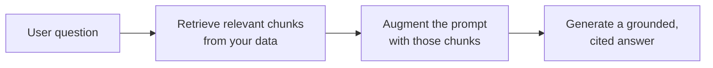

<LevelBadge level="intermediate" />

<Callout type="objectives" items={[
  "RAG क्या है और रिट्रीव-ऑगमेंट-जनरेट लूप",
  "साइटेशन के साथ कैसे इंडेक्स, रिट्रीव, ऑगमेंट और जनरेट करें",
  "'मेरे दस्तावेज़ों के बारे में उत्तर दो' की ज़रूरतों के लिए RAG फ़ाइन-ट्यूनिंग से बेहतर क्यों है",
  "वे पाँच विफलता-तरीके जो RAG की गुणवत्ता को मार देते हैं",
  "एक कॉपी-पेस्ट ग्राउंडिंग प्रॉम्प्ट जो दो सबसे बड़ी कमियों को पाट देता है"
]} />

**RAG** किसी मॉडल से **आपके** डेटा — दस्तावेज़, एक नॉलेज बेस, एक कोडबेस — के बारे में प्रश्नों के उत्तर दिलवाता है जिन पर उसे कभी प्रशिक्षित नहीं किया गया था। विचार सरल है: प्रासंगिक टुकड़ों को **रिट्रीव (पुनः प्राप्त)** करें, प्रॉम्प्ट को उनके साथ **ऑगमेंट (संवर्धित)** करें, फिर उन टुकड़ों में आधारित एक उत्तर **जनरेट (उत्पन्न)** करें।

## लूप

<Steps items={[
  {title: "अपने डेटा को इंडेक्स करें", body: "टुकड़ों में बाँटें, उन्हें एम्बेड करें (देखें /docs/foundations/embeddings), और एक vector (और/या keyword) इंडेक्स में स्टोर करें।"},
  {title: "रिट्रीव करें", body: "प्रश्न से सबसे प्रासंगिक शीर्ष टुकड़ों को खींचें।"},
  {title: "ऑगमेंट करें", body: "उन टुकड़ों को प्रॉम्प्ट में एक निर्देश के साथ रखें जैसे \"केवल नीचे दिए गए संदर्भ से उत्तर दो; अगर वह वहाँ नहीं है, तो ऐसा कहो।\""},
  {title: "जनरेट करें", body: "उत्तर तैयार करें — और आदर्श रूप से उद्धृत करें कि हर दावा किस टुकड़े से आया।"}
]} />

इंडेक्सिंग में एम्बेडिंग चरण के लिए, देखें [एम्बेडिंग्स और वेक्टर सर्च](/docs/foundations/embeddings)।

## फ़ाइन-ट्यूनिंग के बजाय RAG क्यों?

<Callout type="tip" items={[
  "ताज़ा: डेटा अपडेट करें, मॉडल नहीं",
  "सत्यापन-योग्य: उद्धरण प्रदान करता है",
  "सस्ता: पुनः-प्रशिक्षण से कहीं सस्ता"
]} />

अधिकांश "मेरे दस्तावेज़ों के बारे में उत्तर दो" वाली ज़रूरतों के लिए, RAG सही पहला टूल है — देखें [फ़ाइन-ट्यूनिंग बनाम प्रॉम्प्टिंग बनाम RAG](/docs/foundations/finetune-vs-prompt-vs-rag)।

## विफलता-तरीके (जहाँ RAG की गुणवत्ता मर जाती है)

<Callout type="warning" items={[
  "खराब retrieval = खराब उत्तर। अगर सही टुकड़ा रिट्रीव नहीं होता, तो मॉडल उसका उपयोग नहीं कर सकता। अधिकांश 'RAG गलत है' वाली समस्याएँ retrieval की समस्याएँ हैं।",
  "बहुत मोटा/बारीक चंकिंग प्रासंगिकता को बर्बाद कर देता है (देखें embeddings)।",
  "कोई ग्राउंडिंग निर्देश नहीं: मॉडल रिट्रीव किए गए तथ्यों को अपने अनुमानों के साथ मिला देता है। इसे केवल संदर्भ से उत्तर देने और कमियों को स्वीकार करने को कहें।",
  "बहुत अधिक ठूँसना: अप्रासंगिक टुकड़े संकेत को पतला कर देते हैं और टोकन की लागत लगाते हैं। कम, उच्च-गुणवत्ता वाले टुकड़े रिट्रीव करें।",
  "कोई उद्धरण नहीं: आप सत्यापित नहीं कर सकते, इसलिए आप भरोसा नहीं कर सकते।"
]} />

चंकिंग वाली विफलता का संबंध [embeddings](/docs/foundations/embeddings) से है, और अति-ठूँसना [टोकन](/docs/foundations/tokens-and-context) की लागत लगाता है।

<Callout type="tip" items={[
  "retrieval का अलग से मूल्यांकन करें: 'क्या हमने सही टुकड़ा रिट्रीव किया?' को 'क्या मॉडल ने अच्छा उत्तर दिया?' से अलग मापें। यह समस्या को तेज़ी से स्थानीयकृत कर देता है। देखें Evals (/docs/foundations/evals)।"
]} />

## कॉपी-पेस्ट: एक ग्राउंडिंग प्रॉम्प्ट

सबसे अधिक प्रभाव वाला एकल सुधार है एक ग्राउंडिंग निर्देश। अपने रिट्रीव किए गए टुकड़ों को इस तरह के टेम्पलेट में डालें — यह मॉडल को *केवल* संदर्भ से उत्तर देने, हर दावे को उद्धृत करने, और अनुमान लगाने के बजाय कमियों को स्वीकार करने पर बाध्य करता है:

<PromptCard title="ग्राउंडिंग प्रॉम्प्ट">{`You are answering strictly from the context below.

Rules:
- Use ONLY the context to answer. Do not use outside knowledge.
- Cite the source after each claim, like [chunk 2].
- If the answer is not in the context, reply exactly:
  "I don't have that in the provided sources."
- Quote numbers and names verbatim — never paraphrase a figure.

Context:
[chunk 1] ...
[chunk 2] ...
[chunk 3] ...

Question: <the user's question>`}</PromptCard>

इसे *कुछ* उच्च-गुणवत्ता वाले टुकड़ों (वह सब कुछ नहीं जो आपने रिट्रीव किया) के साथ जोड़ें और आप एक ही बार में दो सबसे बड़ी कमियों को पाट देते हैं: हैलुसिनेटेड मिश्रण और असत्यापन-योग्य उत्तर। फिर retrieval और जनरेशन का अलग-अलग [eval](/docs/foundations/evals) करें ताकि आप जान सकें कि किस आधे हिस्से को ट्यून करना है।

## शब्दावली में महारत हासिल करें

<Flashcards cards={[
  {front: "RAG", back: "अपने डेटा के प्रासंगिक टुकड़ों को रिट्रीव करें, प्रॉम्प्ट को उनके साथ ऑगमेंट करें, फिर उन टुकड़ों में आधारित एक उत्तर जनरेट करें।"},
  {front: "इंडेक्स चरण", back: "डेटा को टुकड़ों में बाँटें, उन्हें एम्बेड करें, एक vector और/या keyword इंडेक्स में स्टोर करें।"},
  {front: "ऑगमेंट चरण", back: "रिट्रीव किए गए टुकड़ों को प्रॉम्प्ट में एक ग्राउंडिंग निर्देश के साथ रखें: केवल संदर्भ से उत्तर दो, कमियों को स्वीकार करो।"},
  {front: "फ़ाइन-ट्यूनिंग के बजाय RAG क्यों", back: "ताज़ा (मॉडल नहीं, डेटा अपडेट करें), उद्धरण प्रदान करता है, पुनः-प्रशिक्षण से कहीं सस्ता।"},
  {front: "RAG की #1 विफलता-तरीका", back: "खराब retrieval। अगर सही टुकड़ा रिट्रीव नहीं होता, तो मॉडल उसका उपयोग नहीं कर सकता — अधिकांश 'RAG गलत है' वाली समस्याएँ retrieval की समस्याएँ हैं।"},
  {front: "ग्राउंडिंग निर्देश", back: "मॉडल को केवल संदर्भ से उत्तर देने, हर दावे को उद्धृत करने, और जब उत्तर वहाँ न हो तो ऐसा कहने को कहें।"}
]} />

<Quiz title="खुद को परखें" questions={[
  {
    q: "RAG के तीन अक्षर क्रम में किसके लिए हैं?",
    options: ["Read, Analyze, Generate", "Retrieve, Augment, Generate", "Rank, Aggregate, Group", "Reduce, Append, Generate"],
    answer: 1,
    explain: "RAG = प्रासंगिक टुकड़ों को Retrieve करें, प्रॉम्प्ट को उनके साथ Augment करें, फिर एक आधारित उत्तर Generate करें।"
  },
  {
    q: "जब 'RAG गलत है', तो वास्तविक समस्या अक्सर क्या होती है?",
    options: ["मॉडल बहुत छोटा है", "Retrieval — सही टुकड़ा नहीं खींचा गया", "कॉन्टेक्स्ट विंडो में बहुत कम टोकन", "एम्बेडिंग्स गलत तरीके से फ़ाइन-ट्यून हुई हैं"],
    answer: 1,
    explain: "खराब retrieval = खराब उत्तर। अगर सही टुकड़ा रिट्रीव नहीं होता, तो मॉडल उसका उपयोग नहीं कर सकता। अधिकांश 'RAG गलत है' वाली समस्याएँ retrieval की समस्याएँ हैं।"
  },
  {
    q: "'मेरे दस्तावेज़ों के बारे में उत्तर दो' के लिए RAG आमतौर पर फ़ाइन-ट्यूनिंग से अधिक पसंद क्यों किया जाता है?",
    options: ["यह मॉडल को बड़ा बनाता है", "यह ज्ञान को ताज़ा रखता है, उद्धरण देता है, और पुनः-प्रशिक्षण से सस्ता है", "यह किसी भी प्रॉम्प्ट की ज़रूरत हटा देता है", "यह गारंटी देता है कि मॉडल कभी हैलुसिनेट नहीं करेगा"],
    answer: 1,
    explain: "RAG ज्ञान को ताज़ा रखता है (मॉडल नहीं, डेटा अपडेट करें), उद्धरण प्रदान करता है, और पुनः-प्रशिक्षण से कहीं सस्ता है।"
  },
  {
    q: "मॉडल को तथ्यों को अनुमानों के साथ मिलाने से रोकने का सबसे अधिक प्रभाव वाला एकल सुधार क्या है?",
    options: ["हर संभव टुकड़ा रिट्रीव करें", "एक ग्राउंडिंग निर्देश जो केवल संदर्भ से उत्तर देने पर बाध्य करता है", "तापमान (temperature) बढ़ाएँ", "टोकन बचाने के लिए उद्धरण छोड़ दें"],
    answer: 1,
    explain: "एक ग्राउंडिंग निर्देश मॉडल को केवल संदर्भ से उत्तर देने, हर दावे को उद्धृत करने, और अनुमान लगाने के बजाय कमियों को स्वीकार करने पर बाध्य करता है।"
  },
  {
    q: "retrieval का जनरेशन से अलग मूल्यांकन क्यों करें?",
    options: ["यह मॉडल प्रदाता द्वारा अनिवार्य है", "यह समस्या को तेज़ी से स्थानीयकृत करता है — आप जान जाते हैं कि किस आधे हिस्से को ट्यून करना है", "यह स्वतः टोकन लागत घटाता है", "अन्यथा जनरेशन को मापा नहीं जा सकता"],
    answer: 1,
    explain: "'क्या हमने सही टुकड़ा रिट्रीव किया?' को 'क्या मॉडल ने अच्छा उत्तर दिया?' से अलग मापना समस्या को तेज़ी से स्थानीयकृत करता है और आपको बताता है कि किस आधे हिस्से को ट्यून करना है।"
  }
]} />

<Callout type="takeaways" items={[
  "RAG = प्रासंगिक टुकड़ों को रिट्रीव करें, प्रॉम्प्ट को ऑगमेंट करें, एक आधारित, उद्धृत उत्तर जनरेट करें।",
  "इंडेक्स (चंक + एम्बेड + स्टोर), शीर्ष टुकड़े रिट्रीव करें, एक ग्राउंडिंग निर्देश के साथ ऑगमेंट करें, उद्धरणों के साथ जनरेट करें।",
  "दस्तावेज़ Q&A के लिए फ़ाइन-ट्यूनिंग के बजाय RAG को प्राथमिकता दें: ताज़ा, उद्धृत, सस्ता।",
  "अधिकांश विफलताएँ retrieval की विफलताएँ होती हैं — सब कुछ नहीं, बल्कि कम उच्च-गुणवत्ता वाले टुकड़े रिट्रीव करें।",
  "हमेशा एक ग्राउंडिंग निर्देश जोड़ें और उद्धृत करें; retrieval और जनरेशन का अलग-अलग eval करें।"
]} />

## आगे

- [एम्बेडिंग्स और वेक्टर सर्च](/docs/foundations/embeddings)
- [फ़ाइन-ट्यूनिंग बनाम प्रॉम्प्टिंग बनाम RAG](/docs/foundations/finetune-vs-prompt-vs-rag)
- [शोध और संश्लेषण playbook](/docs/playbooks/research)
