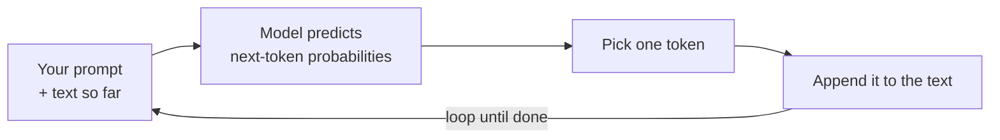

<LevelBadge level="beginner" />

एक **Large Language Model** (LLM) — वह तकनीक जो Claude के पीछे है — एक धोखे की हद तक सरल काम करता है: यह टेक्स्ट पढ़ता है और **भविष्यवाणी करता है कि आगे क्या आता है**, एक बार में एक टुकड़ा। बस इतना ही। बाकी सब कुछ इसी को अद्भुत रूप से अच्छी तरह करने से उभरता है।

<Callout
  type="objectives"
  items={[
    "एक-वाक्य का मानसिक मॉडल समझें: एक LLM एक बहुत ही परिष्कृत ऑटोकम्प्लीट है",
    "देखें कि मॉडल किस तरह एक लूप में, एक बार में एक टोकन, उत्तर बनाता है",
    "समझें कि यह तंत्र क्यों इसकी ताकतों और इसकी विचित्रताओं दोनों को समझाता है",
    "जानें कि एक LLM क्या नहीं है — और यह आपके इसे इस्तेमाल करने के तरीके को कैसे बदलता है"
  ]}
/>

## एक-वाक्य का मानसिक मॉडल

> एक LLM एक बहुत ही परिष्कृत ऑटोकम्प्लीट है जिसने भारी मात्रा में टेक्स्ट पढ़ा है और सीखा है कि भाषा — और उसके भीतर के विचार — किस तरह आगे बढ़ते हैं।

जब आप कोई प्रश्न पूछते हैं, तो मॉडल किसी उत्तर को "ढूँढ़" नहीं रहा होता। यह आपके टेक्स्ट का सबसे प्रशंसनीय continuation, टोकन दर टोकन, उत्पन्न कर रहा होता है (देखें [टोकन और संदर्भ](/docs/foundations/tokens-and-context))। एक अच्छे प्रश्न के प्रशंसनीय continuations आमतौर पर अच्छे उत्तर होते हैं — और यही कारण है कि यह बिल्कुल काम करता है।

:::tip सादृश्य: स्टेरॉयड पर पूर्वानुमान करने वाला कीबोर्ड
अपने फ़ोन के उस ऑटोकम्प्लीट के बारे में सोचिए जो अगला शब्द सुझाता है। अब कल्पना कीजिए कि उसने इंटरनेट पर मौजूद अधिकांश किताबें, लेख और कोड पढ़ लिए हों — और न केवल अगला शब्द, बल्कि एक पूरा निबंध, अनुवाद या प्रोग्राम सुझाए जो फिट बैठे। एक LLM के पीछे यही अंतर्ज्ञान है।
:::

## एक बार में एक टोकन

पूरा इंजन एक लूप है: अब तक का सब कुछ पढ़ो, अगले टुकड़े की भविष्यवाणी करो, उसे जोड़ो, दोहराओ।

<Steps
  items={[
    {title: "पढ़ो", body: "मॉडल आपके प्रॉम्प्ट के साथ-साथ अब तक उत्पन्न किए गए सब कुछ को एक ही टेक्स्ट ब्लॉक के रूप में लेता है।"},
    {title: "भविष्यवाणी करो", body: "यह गणना करता है कि अगला टोकन क्या हो सकता है, इसके लिए संभावनाएँ निकालता है।"},
    {title: "चुनो", body: "यह एक टोकन चुनता है। यह निर्धारक है या थोड़ा यादृच्छिक — यही temperature जैसे सैम्पलिंग नियंत्रण समायोजित करते हैं।"},
    {title: "जोड़ो और दोहराओ", body: "चुना हुआ टोकन टेक्स्ट में जोड़ दिया जाता है, और थोड़ा लंबा टेक्स्ट वापस अंदर डाला जाता है — उत्तर पूरा होने तक लूप चलता रहता है।"}
  ]}
/>

प्रत्येक चरण हमेशा केवल **एक** टोकन की भविष्यवाणी करता है, फिर थोड़े लंबे टेक्स्ट को वापस अंदर डालता है। मॉडल के पास पूरे उत्तर की कोई पहले से बनी योजना नहीं होती — सुसंगतता इस भविष्यवाणी को हज़ारों बार बेहद अच्छी तरह करने से उभरती है। "एक टोकन चुनो" चरण कैसे व्यवहार करता है (लालची बनाम थोड़ा यादृच्छिक) — यही [सैम्पलिंग नियंत्रण](/docs/foundations/sampling-controls) जैसे temperature समायोजित करते हैं।

## यह इसकी ताकतों को क्यों समझाता है

क्योंकि इसने लेखन, कोड और तर्क के पैटर्न सीखे हैं, एक LLM सहजता से **लिख, सारांशित कर, अनुवाद कर, समझा और कोड कर** सकता है — ये सभी कार्य "इस टेक्स्ट को समझदारी से आगे बढ़ाओ" जैसे हैं। इसे एक स्पष्ट सेटअप दीजिए और यह एक मज़बूत continuation तैयार करता है। यही कारण है कि [प्रॉम्प्टिंग](/docs/prompting/basics) इतनी मायने रखती है: आप उस टेक्स्ट की शुरुआत को आकार दे रहे होते हैं जिसे यह आगे बढ़ाता है।

## यह इसकी विचित्रताओं को क्यों समझाता है

वही तंत्र इसके खुरदरे किनारों को समझाता है:

- **यह आत्मविश्वास के साथ गलत हो सकता है।** एक धाराप्रवाह लगने वाला continuation हमेशा सच नहीं होता — यही [hallucination](/docs/foundations/hallucinations) है।
- **यह वास्तव में आज के तथ्यों को "नहीं जानता"** जब तक कि आप उन्हें प्रदान न करें या उसके पास उन्हें खोजने का कोई टूल न हो।
- **इसकी बातचीतों के बीच कोई याददाश्त नहीं होती** जब तक कि आप इसे कुछ न दें।

## एक LLM क्या **नहीं** है

:::warning अपनी अपेक्षाओं को समायोजित करें और आपको बेहतर परिणाम मिलेंगे
- ❌ **डेटाबेस या सर्च इंजन नहीं।** यह उत्पन्न करता है, यह सत्यापित रिकॉर्ड पुनः प्राप्त नहीं करता।
- ❌ **कैलकुलेटर नहीं।** यह गणित के बारे में तर्क कर सकता है पर सटीक होने की गारंटी नहीं है — इसके लिए इसे टूल दीजिए।
- ❌ **व्यक्ति नहीं।** कोई भावनाएँ, इरादे या निरंतर याददाश्त नहीं। यह एक शक्तिशाली टेक्स्ट इंजन है।
:::

इसे एक प्रतिभाशाली, तेज़, पढ़े-लिखे सहायक के रूप में लें जो कभी-कभी गलत याद कर लेता है — और जो मायने रखता है उसे **सत्यापित करें**।

## मुख्य शब्द

<Flashcards
  title="मूल अवधारणाओं की समीक्षा करें"
  cards={[
    {front: "LLM (Large Language Model)", back: "वह तकनीक जो Claude के पीछे है। यह टेक्स्ट पढ़ता है और भविष्यवाणी करता है कि आगे क्या आता है, एक बार में एक टुकड़ा।"},
    {front: "अगले-टोकन की भविष्यवाणी", back: "मूल लूप: अब तक का टेक्स्ट पढ़ो, अगले टोकन की भविष्यवाणी करो, उसे जोड़ो, पूरा होने तक दोहराओ।"},
    {front: "टोकन", back: "टेक्स्ट का वह टुकड़ा जिसकी मॉडल हर चरण में भविष्यवाणी करता है। मॉडल हमेशा एक बार में केवल एक की ही भविष्यवाणी करता है।"},
    {front: "Hallucination", back: "एक धाराप्रवाह लगने वाला continuation जो वास्तव में सच नहीं होता — उत्पन्न करने का, न कि पुनः प्राप्त करने का, एक दुष्प्रभाव।"},
    {front: "सैम्पलिंग / temperature", back: "नियंत्रित करता है कि 'एक टोकन चुनो' चरण कैसे व्यवहार करता है — लालची बनाम थोड़ा यादृच्छिक।"}
  ]}
/>

<Callout
  type="takeaways"
  items={[
    "एक LLM एक बहुत ही परिष्कृत ऑटोकम्प्लीट है — यह अगले टोकन की भविष्यवाणी करता है, उत्तर ढूँढ़ता नहीं",
    "सुसंगतता उस भविष्यवाणी लूप को एक बार में एक टोकन, हज़ारों बार चलाने से उभरती है",
    "वही तंत्र इसकी ताकतों (लिखना, सारांशित करना, अनुवाद, समझाना, कोड) और इसकी विचित्रताओं (आत्मविश्वास से गलत, कोई लाइव तथ्य नहीं, कोई याददाश्त नहीं) को समझाता है",
    "यह न तो डेटाबेस है, न कैलकुलेटर, न व्यक्ति — जो मायने रखता है उसे सत्यापित करें"
  ]}
/>

## स्वयं को जाँचें

<Quiz
  title="स्वयं को जाँचें"
  questions={[
    {
      q: "जब आप किसी LLM से कोई प्रश्न पूछते हैं तो वह मूल रूप से क्या करता है?",
      options: [
        "सत्यापित तथ्यों के डेटाबेस में उत्तर ढूँढ़ता है",
        "आपके टेक्स्ट का सबसे प्रशंसनीय continuation उत्पन्न करता है, एक बार में एक टोकन",
        "सबसे हाल के उत्तर के लिए लाइव वेब पर खोज करता है"
      ],
      answer: 1,
      explain: "एक LLM कुछ भी नहीं ढूँढ़ रहा होता — यह आपके टेक्स्ट का सबसे प्रशंसनीय continuation उत्पन्न करता है, टोकन दर टोकन।"
    },
    {
      q: "एक LLM आत्मविश्वास के साथ गलत क्यों हो सकता है?",
      options: [
        "एक धाराप्रवाह लगने वाला continuation हमेशा सच नहीं होता — यही hallucination है",
        "उत्तर के बीच में इसकी याददाश्त खत्म हो जाती है",
        "यह उन प्रश्नों का उत्तर देने से इनकार कर देता है जिन्हें यह नहीं जानता"
      ],
      answer: 0,
      explain: "यह सत्यापित रिकॉर्ड पुनः प्राप्त करने के बजाय प्रशंसनीय लगने वाला टेक्स्ट उत्पन्न करता है, इसलिए एक धाराप्रवाह continuation फिर भी झूठा हो सकता है — यही hallucination है।"
    },
    {
      q: "एक LLM के बारे में कौन-सा कथन सही है?",
      options: [
        "यह एक सर्च इंजन है जो सत्यापित रिकॉर्ड पुनः प्राप्त करता है",
        "यह एक कैलकुलेटर है जिसके सटीक होने की गारंटी है",
        "यह कोई व्यक्ति नहीं है और बातचीतों के बीच इसकी कोई निरंतर याददाश्त नहीं होती जब तक कि आप इसे कुछ न दें"
      ],
      answer: 2,
      explain: "एक LLM एक शक्तिशाली टेक्स्ट इंजन है — न डेटाबेस, न कैलकुलेटर, न व्यक्ति। बातचीतों के बीच इसकी कोई याददाश्त नहीं होती जब तक कि आप इसे प्रदान न करें।"
    }
  ]}
/>

## आगे

- [टोकन, संदर्भ और याददाश्त](/docs/foundations/tokens-and-context)
- [Hallucinations और उन्हें कैसे कम करें](/docs/foundations/hallucinations)
- [प्रॉम्प्टिंग की मूल बातें](/docs/prompting/basics)
