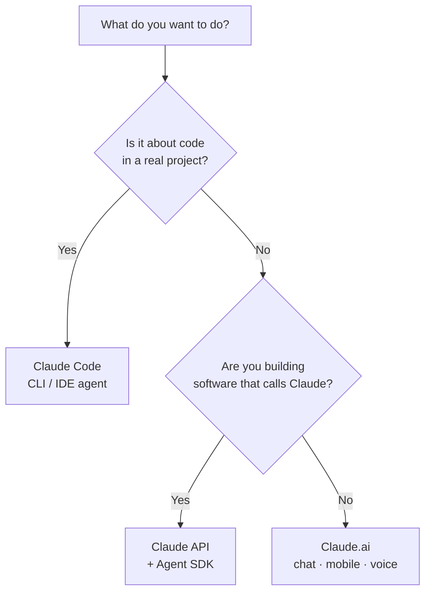

<LevelBadge level="beginner" />

"Claude" कुछ रूपों में आता है। यह इस आधार पर चुनें कि **आप क्या करने की कोशिश कर रहे हैं**, न कि इस आधार पर कि आपने किसके बारे में सुना है।

<Callout type="objectives" items={[
  "अपने लक्ष्य को सही Claude सतह से मिलाएँ: चैट, Claude Code, या API",
  "जानें कि तस्वीर में मोबाइल और आवाज़ कब फिट होते हैं",
  "समझें कि जैसे-जैसे आप आगे बढ़ते हैं, तीनों सतहें कैसे साथ मिलकर काम करती हैं",
  "जब आप निर्माण शुरू करें तो कौन-सा मॉडल चुनना है, इसका एक त्वरित अंदाज़ा पाएँ"
]} />

## 30-सेकंड का निर्णय

## एक नज़र में तीन सतहें

| सतह | किसके लिए सर्वोत्तम | कौन | यहाँ से शुरू करें |
|---|---|---|---|
| **Claude.ai** | लेखन, शोध, विश्लेषण, सीखना, योजना बनाना, रोज़मर्रा के सवाल | हर कोई, कोई सेटअप नहीं | [Claude.ai के साथ शुरुआत करना](/docs/claude-app/getting-started) |
| **Claude Code** | एक *कोडबेस के भीतर* काम करना — पढ़ना, संपादित करना, कमांड चलाना, टेस्ट ठीक करना | डेवलपर (और तकनीकी रूप से जिज्ञासु लोग) | [Claude Code क्या है](/docs/claude-code/what-is-claude-code) |
| **API और Agent SDK** | ऐप्स, स्वचालन, और एजेंट जो प्रोग्रामेटिक रूप से Claude को कॉल करते हैं | ऐसे डेवलपर जो कोई उत्पाद या पाइपलाइन शिप कर रहे हैं | [आपका पहला API कॉल](/docs/api/first-call) |

### Claude.ai — चैट ऐप्स

Claude.ai हर किसी के लिए बिना किसी सेटअप वाला शुरुआती बिंदु है। आपको यह **मोबाइल** ([iOS/Android](/docs/claude-app/mobile)) पर और **[आवाज़](/docs/claude-app/voice-mode)** द्वारा भी मिलता है — चलते-फिरते विचार दर्ज करने के लिए बढ़िया। इसे [प्रोजेक्ट्स](/docs/claude-app/projects), [कस्टम निर्देशों](/docs/claude-app/custom-instructions), और [Artifacts](/docs/claude-app/artifacts) से और सशक्त बनाएँ।

### Claude Code — एजेंटिक कोडिंग उपकरण

Claude Code आपके प्रोजेक्ट के *भीतर* काम करता है। यह पढ़ता है, संपादित करता है, कमांड चलाता है, और टेस्ट ठीक करता है — आपकी अनुमति से आपकी फ़ाइलों पर कार्य करते हुए।

### API और Agent SDK — Claude को अपने सॉफ़्टवेयर में बनाएँ

API और Agent SDK आपके अपने सॉफ़्टवेयर को प्रोग्रामेटिक रूप से Claude को कॉल करने देते हैं, ताकि आप AI सुविधाएँ, स्वचालन, और एजेंट शिप कर सकें।

## ये साथ मिलकर काम करते हैं

ये प्रतिद्वंद्वी उत्पाद नहीं हैं — अधिकांश लोग इनके बीच आगे बढ़ते हैं:

| आप चाहते हैं… | उपयोग करें |
|---|---|
| एक ईमेल का मसौदा बनाना, एक PDF सारांशित करना, विचार-मंथन करना | Claude.ai (या आवाज़/मोबाइल) |
| एक मॉड्यूल रिफैक्टर करना, टेस्ट जोड़ना, एक बग ठीक करना | Claude Code |
| *आपके* ऐप में एक AI सुविधा जोड़ना | API / Agent SDK |

:::tip तय नहीं कर पा रहे? चैट से शुरू करें
[Claude.ai](/docs/claude-app/getting-started) को किसी सेटअप की ज़रूरत नहीं है और यह आपको सिखाता है कि Claude कैसे "सोचता" है। ये कौशल बाक़ी हर जगह काम आते हैं।
:::

## जब आप निर्माण करने लगें, तो कौन-सा मॉडल?

एक *सतह* चुनना पहला कदम है। जब आप Claude Code या API की ओर बढ़ते हैं, तो आप एक *मॉडल* भी चुनते हैं — Haiku, Sonnet, या Opus। तीन त्वरित सवालों के जवाब दें और यह पिकर एक शुरुआती बिंदु सुझाता है:

<ModelPicker />

:::note नामों को हार्ड-कोड न करें
मॉडल लाइनअप और कीमतें बदलती रहती हैं। शिप करने से पहले हमेशा [एक Claude मॉडल चुनना](/docs/api/choosing-a-model) पेज पर वर्तमान मॉडल ID की पुष्टि करें।
:::

## खुद को परखें

<Quiz title="खुद को परखें" questions={[
  {
    q: "आप एक ईमेल का मसौदा बनाना और एक PDF सारांशित करना चाहते हैं — कोई सेटअप नहीं। कौन-सी सतह?",
    options: ["Claude Code", "Claude.ai (चैट / मोबाइल / आवाज़)", "API और Agent SDK"],
    answer: 1,
    explain: "Claude.ai लेखन, शोध, और रोज़मर्रा के सवालों के लिए बिना सेटअप वाली चैट सतह है — वेब, मोबाइल पर और आवाज़ द्वारा उपलब्ध।"
  },
  {
    q: "आपको एक वास्तविक प्रोजेक्ट के भीतर एक मॉड्यूल रिफैक्टर करना और विफल हो रहे टेस्ट ठीक करने हैं। कौन-सी सतह?",
    options: ["Claude.ai", "Claude Code", "API और Agent SDK"],
    answer: 1,
    explain: "Claude Code आपके कोडबेस के भीतर काम करता है — आपकी अनुमति से पढ़ना, संपादित करना, कमांड चलाना, और टेस्ट ठीक करना।"
  },
  {
    q: "आपको वर्तमान मॉडल नामों और कीमतों की पुष्टि कहाँ करनी चाहिए?",
    options: ["इस पेज पर", "एक Claude मॉडल चुनना पेज पर", "ऊपर दिए गए Mermaid आरेख में"],
    answer: 1,
    explain: "मॉडल लाइनअप बदलते रहते हैं, इसलिए यह पेज उन्हें हार्ड-कोड नहीं करता — वर्तमान ID और कीमतों के लिए एक Claude मॉडल चुनना पेज देखें।"
  }
]} />

<Callout type="takeaways" items={[
  "Claude.ai: लेखन, शोध, और रोज़मर्रा के काम के लिए बिना सेटअप वाली चैट — मोबाइल पर और आवाज़ द्वारा भी",
  "Claude Code: एक एजेंट जो आपके कोडबेस के भीतर कार्य करता है",
  "API और Agent SDK: Claude को अपने स्वयं के सॉफ़्टवेयर में बनाएँ",
  "ये एक-दूसरे के साथ जुड़ते हैं — अधिकांश लोग चैट से शुरू करते हैं और Code तथा API की ओर बढ़ते हैं",
  "एक मॉडल (Haiku / Sonnet / Opus) तभी चुनें जब आप निर्माण करने लगें, और शिप करने से पहले वर्तमान ID सत्यापित करें"
]} />

## आगे

- [आपके पहले 5 मिनट](/docs/start-here/your-first-5-minutes)
- [लर्निंग पाथ](/docs/start-here/learning-paths)
- [एक Claude मॉडल चुनना](/docs/api/choosing-a-model) (जब आप निर्माण करने लगें)
