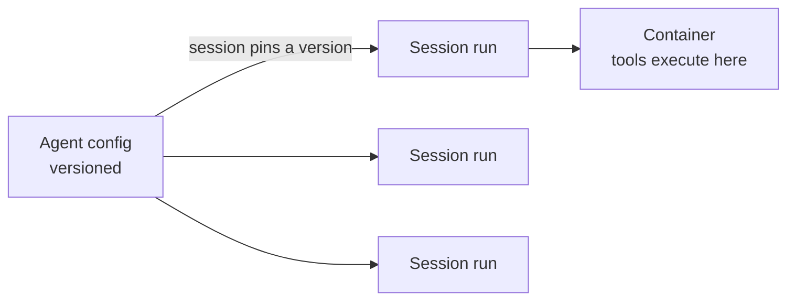

<LevelBadge level="advanced" />

<VerifyNote lastVerified="2026-06-26" source="https://docs.anthropic.com/en/docs/agents-and-tools">
Le capacità e la disponibilità degli agenti gestiti cambiano: l'API è in beta. Conferma endpoint, nomi dei campi e accesso nella documentazione ufficiale prima di costruirci sopra.
</VerifyNote>

<Callout type="objectives" items={["Capire cosa delega al posto tuo un loop dell'agente gestito (ospitato da Anthropic)", "Distinguere i due oggetti fondamentali: un Agent versionato vs una Session per singola esecuzione", "Iniettare i segreti in sicurezza con i Vault, senza che il modello li veda mai", "Mettere un agente su una pianificazione cron con i Deployment pianificati, senza scheduler da ospitare", "Sapere quando il gestito batte un loop personalizzato, e quali guardrail restano comunque validi"]} />

Se [costruire il tuo loop dell'agente](/docs/api/building-agents) è più infrastruttura di quella che vuoi gestire, un agente **gestito** (ospitato da Anthropic) esegue il loop al posto tuo, così ti concentri sul *lavoro* dell'agente, non sull'idraulica delle sessioni, sui retry, sullo stato e sulla pianificazione.

## I due oggetti: Agent vs Session

Questo è il modello mentale a cui tutto il resto si aggancia. Sono separati di proposito.

- Un **Agent** è una *configurazione persistente e versionata*: modello, system prompt, tool, server MCP e skill. Lo crei una volta. Ogni aggiornamento crea una nuova versione immutabile.
- Una **Session** è un'*istanza di runtime*: una singola esecuzione che punta a un agente tramite ID. La configurazione vive sull'agente, mai sulla sessione.

<Callout type="tip">
Le sessioni **agganciano** la versione dell'agente con cui sono state create: le sessioni in esecuzione mantengono la loro versione, le nuove sessioni ottengono l'ultima. È così che distribuisci modifiche di configurazione senza rompere il lavoro in corso.
</Callout>

## Cosa ti garantisce il "gestito"

Invece di costruire e ospitare il loop a mano, ottieni building block già ospitati:

- **Sessioni**: esecuzioni persistenti che crei per ogni esecuzione e riprendi; trasmettono gli eventi via SSE.
- **Ambienti**: infrastruttura di container, o `cloud` (ospitata da Anthropic) o `self_hosted` (i tool vengono eseguiti nella tua VPC). Un container per sessione è lo spazio di lavoro dell'agente.
- **Memory store**: stato persistente tra le sessioni, con versionamento e redazione, senza che tu debba collegare un database.
- **Vault**: segreti per l'autenticazione MCP e altri servizi.
- **Deployment pianificati**: agenti che vengono eseguiti su una pianificazione cron, in modo non presidiato.

<PromptCard title="Crea un agente (config versionata), poi esegui una sessione su di esso">{`# 1. Create the agent once
POST /v1/agents        -> returns $AGENT_ID
# 2. Each execution is a session pinned to that agent
POST /v1/sessions      { "agent": "$AGENT_ID" }`}</PromptCard>

## Vault: segreti che il modello non vede mai

Un agente autonomo spesso ha bisogno di una chiave API, ma il *modello* non dovrebbe mai leggerla. Le credenziali del vault (`mcp_oauth`, `static_bearer`, `environment_variable`) vengono sostituite in uscita: una credenziale `environment_variable` viene iniettata nella sandbox al momento dell'esecuzione e non è *mai visibile* al modello.

<Callout type="warning">
Questo è il pattern sicuro per dare a un agente un accesso potente. Non incollare le chiavi nel system prompt o in un messaggio: diventano parte del contesto che il modello (e i tuoi log) possono vedere. Mettile in un vault.
</Callout>

## Deployment pianificati: un agente su un cron

Un **deployment** collega una pianificazione cron a un agente. Quando la pianificazione scatta, avvia una nuova sessione e completa il suo compito, senza nessuno scheduler da costruire o ospitare per te. Ottimo per una sincronizzazione dati notturna, una scansione di compliance settimanale o un digest giornaliero.

<Steps items={[
  {title: "Definisci la pianificazione", body: "POST /v1/deployments con agent, environment_id, initial_events (deve includere un user.message) e una schedule: un'espressione cron POSIX più un timezone IANA."},
  {title: "Ogni scatto = un'esecuzione", body: "Ogni tentativo di trigger crea un record di esecuzione (prefisso drun_). Il successo porta con sé un session_id; il fallimento porta un error.type (es. environment_archived, session_rate_limited). Elenca le esecuzioni tramite GET /v1/deployment_runs?deployment_id=..."},
  {title: "Controlla il ciclo di vita", body: "La pausa sopprime i trigger futuri (le esecuzioni manuali continuano a funzionare); la rimozione della pausa riprende alla prossima occorrenza e NON recupera i trigger mancati; l'archiviazione è terminale."},
  {title: "Attiva su richiesta", body: "POST /v1/deployments/{id}/run avvia una sessione immediatamente, anche in pausa, con trigger_context.type: manual."}
]} />

<PromptCard title="Una scansione di compliance settimanale, il venerdì alle 20:00 ora di New York">{`POST /v1/deployments
{
  "name": "Weekly compliance scan",
  "agent": "$AGENT_ID",
  "environment_id": "$ENVIRONMENT_ID",
  "initial_events": [
    {"type": "user.message", "content": [{"type": "text", "text": "Run the compliance scan and summarize findings."}]}
  ],
  "schedule": {"type": "cron", "expression": "0 20 * * 5", "timezone": "America/New_York"}
}`}</PromptCard>

<Callout type="tip">
Cron è `minute hour day-of-month month day-of-week`, con granularità al minuto. Il DST usa la semantica dell'orario da parete: un orario che non esiste nello spostamento in avanti viene saltato; un orario che ricorre due volte nello spostamento indietro scatta due volte. Scegli un timezone e un'ora che evitino questi casi limite per qualsiasi cosa sensibile.
</Callout>

## Quando scegliere il gestito vs il personalizzato

| Scegli il **gestito** quando… | Scegli un **loop personalizzato / SDK** quando… |
|---|---|
| Vuoi che hosting, stato, pianificazione e segreti siano gestiti | Hai bisogno del controllo completo su loop e tool |
| Stai prototipando velocemente | Hai esigenze rigide di infrastruttura/compliance personalizzate |
| La semplicità operativa conta più del controllo | Stai integrando in profondità nel tuo stack |

È uno spettro: chiamata singola → workflow → agente personalizzato (SDK) → gestito. Parti dal più semplice che il compito consente; sali di livello solo quando ne hai bisogno.

## Valgono gli stessi guardrail

Ospitato o meno, un agente autonomo compie comunque azioni. Mantieni il **privilegio minimo**, **costi/iterazioni limitati** e l'**approvazione umana per i passaggi rischiosi**: vedi [Mettere in sicurezza gli agenti](/docs/security/securing-agents) e [Irrobustire le esecuzioni autonome](/docs/security/hardening-autonomous-runs).

<Callout type="takeaways" items={["Gli agenti gestiti delegano loop, sessioni, ambienti, memoria, vault e pianificazione così ti concentri sul lavoro", "Un Agent è config versionata; una Session è una singola esecuzione che si aggancia a una versione: la config vive sull'agente, non sulla sessione", "Le credenziali environment_variable del vault vengono iniettate all'esecuzione e non sono mai visibili al modello: il modo sicuro per dare segreti a un agente", "Un deployment pianificato è un'espressione cron + un timezone IANA; ogni scatto crea un'esecuzione, e la rimozione della pausa non recupera i trigger mancati", "Il gestito si colloca all'estremità ospitata di chiamata singola -> workflow -> personalizzato -> gestito; i guardrail sull'autonomia restano validi"]} />

## Mettiti alla prova

<Quiz title="Mettiti alla prova" questions={[
  {
    q: "Qual è la differenza tra un Agent e una Session?",
    options: [
      "Sono due nomi per lo stesso oggetto",
      "Un Agent è configurazione versionata; una Session è una singola esecuzione di runtime che si aggancia a una versione dell'agente",
      "Una Session contiene il modello e il system prompt; un Agent è solo un ID",
      "Un Agent esegue i tool; una Session memorizza i segreti"
    ],
    answer: 1,
    explain: "Un Agent è la config persistente e versionata (modello, prompt, tool, MCP, skill). Una Session è un'istanza per singola esecuzione che fa riferimento all'agente e si aggancia alla sua versione al momento della creazione."
  },
  {
    q: "Come dovresti dare a un agente gestito una chiave API di cui ha bisogno?",
    options: [
      "Metterla nel system prompt così l'agente può leggerla",
      "Passarla nel primo messaggio utente della sessione",
      "Memorizzarla come credenziale del vault, iniettata all'esecuzione e mai visibile al modello",
      "Inserirla hard-coded nella definizione del tool"
    ],
    answer: 2,
    explain: "Le credenziali del vault (es. un tipo environment_variable) vengono sostituite in uscita e non sono mai visibili al modello: le chiavi nel prompt o in un messaggio diventano parte del contesto visibile."
  },
  {
    q: "Un deployment pianificato è stato messo in pausa per due giorni e poi riattivato. Cosa succede ai trigger che sarebbero scattati durante la pausa?",
    options: [
      "Vengono recuperati: ogni esecuzione mancata viene eseguita alla riattivazione",
      "Non vengono recuperati; il deployment riprende semplicemente alla prossima occorrenza pianificata",
      "Il deployment viene archiviato automaticamente",
      "Tutte le esecuzioni mancate vengono accodate ed eseguite a un minuto di distanza l'una dall'altra"
    ],
    answer: 1,
    explain: "La rimozione della pausa riprende alla prossima occorrenza e non recupera i trigger mancati. (Puoi comunque forzare un'esecuzione in qualsiasi momento con il trigger manuale, anche in pausa.)"
  }
]} />

## Avanti

- [Costruire agenti sull'API](/docs/api/building-agents)
- [Cowork e team di agenti](/docs/api/cowork-and-agent-teams)
- [Modalità headless e Agent SDK](/docs/claude-code/headless-and-agent-sdk)
- [Mettere in sicurezza gli agenti](/docs/security/securing-agents)
