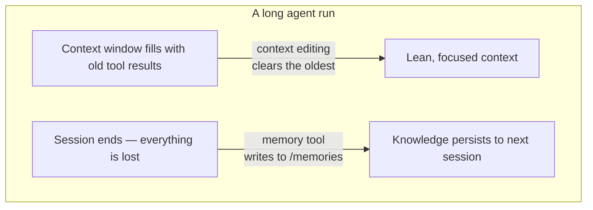

import Tabs from '@theme/Tabs';
import TabItem from '@theme/TabItem';

<LevelBadge level="advanced" />

<VerifyNote lastVerified="2026-06-26" source="https://platform.claude.com/docs/en/agents-and-tools/tool-use/memory-tool">
Entrambe le funzionalità sono in beta. Le stringhe del tipo di strumento, l'header beta, i valori predefiniti e i miglioramenti di benchmark riportati possono cambiare — verifica nella documentazione ufficiale di memory-tool e context-editing prima di costruirci sopra.
</VerifyNote>

Un agente a lunga esecuzione ha due nemici: **dimentica** ciò che ha imparato nel momento in cui la conversazione finisce, e la sua finestra di contesto **si riempie** con output di strumenti ormai obsoleti finché non trabocca. Anthropic fornisce una primitiva per ciascun problema — il **memory tool** (persistenza) e il **context editing** (potatura) — e sono progettati per essere usati insieme.

<Callout type="objectives" items={["Cos'è il memory tool — un archivio di file lato client in /memories che implementi tu, non Anthropic", "I sei comandi a cui deve rispondere il tuo handler: view, create, str_replace, insert, delete, rename", "Perché la validazione contro il path-traversal è irrinunciabile quando lo colleghi", "Come il context editing cancella automaticamente i vecchi risultati degli strumenti quando il contesto supera una soglia di token", "Come combinare entrambi sotto un unico header beta, e le insidie con caching e ordinamento"]} />

## Due problemi, due strumenti



Tieni le due idee separate nella tua testa:

- **Memory tool** = *persistenza tra le sessioni*. Claude legge e scrive file; **tu** li memorizzi.
- **Context editing** = *potatura all'interno di una sessione*. L'API rimuove i risultati degli strumenti ormai obsoleti dal prompt prima che raggiunga Claude.

Questa pagina si accompagna a [Prompt Caching](/docs/api/prompt-caching) e alla [token economy](/docs/power-user/token-economy) per il lato costi, e a [Context Engineering](/docs/frontiers/context-engineering) e agli [harness per agenti a lunga esecuzione](/docs/frontiers/long-running-agent-harnesses) per il *perché*.

<Flashcards title="Vocabolario di memoria e contesto" cards={[{front:"Memory tool","back":"Uno strumento lato client (tipo memory_20250818) che permette a Claude di creare/leggere/aggiornare/eliminare file in una directory /memories. Il backend di storage lo implementi tu."},{front:"/memories","back":"L'unica directory a cui sono confinate tutte le operazioni di memoria. Ogni percorso deve essere validato per rimanere al suo interno."},{front:"Context editing","back":"Una strategia lato server che cancella i vecchi risultati degli strumenti dal prompt una volta superata una soglia di token — l'intera cronologia continua a risiedere sul tuo client."},{front:"clear_tool_uses_20250919","back":"La strategia di context editing che rimuove i risultati degli strumenti più vecchi, sostituendoli con un segnaposto in modo che Claude sappia che sono stati potati."},{front:"Compaction","back":"Una funzionalità lato server separata che riassume l'intera conversazione in prossimità del limite di contesto — complementare al context editing lato client."}]} />

## Il memory tool è uno strumento che implementi *tu*

Questo manda in confusione: abilitare il memory tool **non** ti fornisce uno storage ospitato da Anthropic. È uno strumento **lato client**. Claude emette chiamate di strumento come `view` o `create`; la tua applicazione le esegue contro il backend che scegli — file locali, un database, blob crittografati, cloud storage — e restituisce il risultato. Sei tu il proprietario di dove risiedono i byte (motivo per cui è anche idoneo allo [Zero-Data-Retention](/docs/foundations/privacy)).

Quando lo strumento è abilitato, Anthropic inietta un'istruzione di sistema che dice a Claude di **controllare la sua directory di memoria prima di fare qualsiasi altra cosa**, e di registrare i progressi mentre lavora in modo che nulla vada perso se il contesto si azzera.

### Passo 1 — abilita lo strumento

Aggiungi lo strumento alla tua richiesta. La stringa del tipo è la versione datata `memory_20250818`.

<Tabs groupId="lang">
<TabItem value="python" label="Python">

```python
import anthropic

client = anthropic.Anthropic()

message = client.messages.create(
    model="claude-opus-4-8",
    max_tokens=2048,
    messages=[{"role": "user", "content": "Help me respond to this support ticket."}],
    tools=[{"type": "memory_20250818", "name": "memory"}],
)

print(message)
```

</TabItem>
<TabItem value="typescript" label="TypeScript">

```typescript
import Anthropic from "@anthropic-ai/sdk";

const anthropic = new Anthropic();

const message = await anthropic.messages.create({
  model: "claude-opus-4-8",
  max_tokens: 2048,
  messages: [{ role: "user", content: "Help me respond to this support ticket." }],
  tools: [{ type: "memory_20250818", name: "memory" }],
});

console.log(message);
```

</TabItem>
</Tabs>

Gli SDK ufficiali forniscono helper per la memoria così non devi implementare a mano l'interfaccia dello strumento — fai il subclass di `BetaAbstractMemoryTool` (Python, C#), usa `betaMemoryTool` (TypeScript), oppure implementa `BetaMemoryToolHandler` (Java). Ti offrono un hook pulito dove collegare il tuo storage.

### Passo 2 — rispondi ai sei comandi

Il tuo handler deve implementarli. Le stringhe che Claude si aspetta di ricevere sono specifiche — facci corrispondere in modo che il modello interpreti correttamente i risultati.

<Steps items={[{title: "view", body: "Elenca una directory (file fino a 2 livelli di profondità, con dimensioni leggibili dall'uomo) oppure restituisci il contenuto di un file con numeri di riga a base 1. view_range opzionale per leggere una porzione."},{title: "create", body: "Scrivi un nuovo file da file_text. Restituisci un errore se esiste già invece di sovrascriverlo silenziosamente."},{title: "str_replace", body: "Sostituisci un old_str esatto con new_str. Rifiuta se old_str è assente, o compare più di una volta (ambiguo) — segnala i numeri di riga."},{title: "insert", body: "Inserisci insert_text in insert_line. Valida che la riga sia compresa in [0, n_lines]."},{title: "delete", body: "Rimuovi un file, oppure una directory e il suo contenuto in modo ricorsivo."},{title: "rename", body: "Sposta/rinomina un percorso. Rifiuta se la destinazione esiste già — non sovrascrivere mai."}]} />

Una vera `view` della directory restituisce qualcosa di simile a questo — nota l'header letterale e le dimensioni separate da tabulazione, che il modello è addestrato a interpretare:

```text
Here're the files and directories up to 2 levels deep in /memories, excluding hidden items and node_modules:
4.0K	/memories
1.5K	/memories/customer_service_guidelines.xml
2.0K	/memories/refund_policies.xml
```

### Passo 3 — blinda i percorsi (non saltare questo passaggio)

Il memory tool permette a un modello di emettere stringhe di percorso arbitrarie. Una conversazione avvelenata o un payload di prompt-injection può tentare di evadere da `/memories` e leggere o sovrascrivere file altrove sulla tua macchina. Tratta ogni percorso in ingresso come ostile.

<Callout type="warning" items={["Rifiuta qualsiasi percorso che non si risolva all'interno di /memories.","Canonicalizza prima di controllare — in Python, Path(p).resolve() poi verifica che .relative_to(memories_root) non sollevi eccezioni.","Blocca ../, ..\\, e il traversal codificato in URL come %2e%2e%2f.","Limita le dimensioni dei file e la lunghezza di lettura così che un agente fuori controllo non possa esaurire il disco o far esplodere il prompt successivo."]} />

Questo validatore è tutto ciò che conta — fissalo e testalo prima di mettere in produzione qualsiasi altra cosa:

<PromptCard title="Protezione contro il path-traversal (Python)">{`from pathlib import Path

MEMORY_ROOT = Path("/srv/agent/memories").resolve()

def safe_path(requested: str) -> Path:
    # Map the model's /memories/... onto your real root, then prove containment.
    rel = requested.removeprefix("/memories").lstrip("/")
    candidate = (MEMORY_ROOT / rel).resolve()
    candidate.relative_to(MEMORY_ROOT)  # raises ValueError if it escaped
    return candidate`}</PromptCard>

## Il context editing evita che la finestra trabocchi

La memoria risolve la *dimenticanza*. Il problema opposto — una finestra di contesto imbottita di vecchi blocchi `tool_result` di 40 ricerche web fa — è ciò che risolve il **context editing**. Una volta che il prompt supera una soglia di token, l'API cancella i risultati degli strumenti **più vecchi** (sostituendoli con un breve segnaposto in modo che Claude sappia che sono stati rimossi) prima che il prompt venga inviato al modello. Il tuo client mantiene l'intera cronologia, non editata; viene tagliato solo ciò che raggiunge il modello.

Si appoggia su un header beta:

```text
anthropic-beta: context-management-2025-06-27
```

Lo configuri con un array `context_management.edits`. La strategia principale è `clear_tool_uses_20250919`:

<Tabs groupId="lang">
<TabItem value="python" label="Python">

```python
message = client.beta.messages.create(
    model="claude-opus-4-8",
    max_tokens=2048,
    betas=["context-management-2025-06-27"],
    messages=[...],
    tools=[{"type": "memory_20250818", "name": "memory"}],
    context_management={
        "edits": [
            {
                "type": "clear_tool_uses_20250919",
                "trigger": {"type": "input_tokens", "value": 30000},  # start clearing past 30k
                "keep": {"type": "tool_uses", "value": 3},            # always keep the last 3
                "clear_at_least": {"type": "input_tokens", "value": 5000},
                "exclude_tools": ["memory"],                          # never clear memory calls
                "clear_tool_inputs": False,                           # keep the call args, drop results
            }
        ]
    },
)
```

</TabItem>
<TabItem value="typescript" label="TypeScript">

```typescript
const message = await anthropic.beta.messages.create({
  model: "claude-opus-4-8",
  max_tokens: 2048,
  betas: ["context-management-2025-06-27"],
  messages: [...],
  tools: [{ type: "memory_20250818", name: "memory" }],
  context_management: {
    edits: [
      {
        type: "clear_tool_uses_20250919",
        trigger: { type: "input_tokens", value: 30000 },
        keep: { type: "tool_uses", value: 3 },
        clear_at_least: { type: "input_tokens", value: 5000 },
        exclude_tools: ["memory"],
        clear_tool_inputs: false,
      },
    ],
  },
});
```

</TabItem>
</Tabs>

Cosa significano le manopole:

| Parametro | Valore predefinito | Cosa controlla |
|-----------|---------|------------------|
| `trigger` | 100.000 token di input | Quando entra in azione la cancellazione |
| `keep` | 3 utilizzi di strumenti | Quante coppie recenti di uso/risultato dello strumento sono sempre preservate |
| `clear_at_least` | nessuno | Token minimi liberati per ogni attivazione — usalo così che un'invalidazione della cache valga davvero la pena |
| `exclude_tools` | nessuno | Strumenti mai cancellati (es. `memory`, `web_search`) |
| `clear_tool_inputs` | `false` | Se rimuovere anche gli *argomenti della chiamata* dello strumento, non solo il risultato |

La risposta ti dice cosa ha fatto, sotto `context_management.applied_edits` — es. `cleared_tool_uses` e `cleared_input_tokens` — così puoi registrare quanto è stato recuperato.

Esiste una strategia gemella, `clear_thinking_20251015`, che pota i vecchi blocchi di [extended-thinking](/docs/api/thinking-and-effort). Se le usi entrambe, **elenca `clear_thinking_20251015` per primo** nell'array `edits`.

<Callout type="tip" items={["Cancellare i risultati degli strumenti invalida qualsiasi prefisso di prompt-cache nel punto di cancellazione — abbinalo a clear_at_least così paghi quell'invalidazione solo quando stai liberando una porzione significativa.","exclude_tools: [\"memory\"] è la mossa abituale: vuoi che le note dell'agente stesso persistano, non che vengano spazzate via insieme ai risultati di ricerca obsoleti.","Context editing (taglio lato client) e compaction (riassunto lato server) sono funzionalità diverse — per esecuzioni molto lunghe puoi sovrapporle entrambe."]} />

## Perché abbinarli — i numeri

Usati insieme, le due funzionalità permettono a un agente di andare ben oltre una singola finestra di contesto: il context editing mantiene snella la finestra attiva, e tutto ciò che conta viene scritto in memoria prima che venga cancellato. Anthropic riporta che combinare la memoria con il context editing ha prodotto un **miglioramento del 39%** in una valutazione di ricerca agentica, e che il context editing da solo ha ridotto l'uso dei token dell'**84%** in un test di ricerca web da 100 turni.

<VerifyNote lastVerified="2026-06-26" source="https://www.anthropic.com/news/context-management">
Queste percentuali sono cifre di benchmark di Anthropic stessa e riflettono configurazioni di valutazione specifiche — trattale come indicative, non come garanzie per il tuo carico di lavoro. Verifica nell'annuncio di context-management.
</VerifyNote>

## Un pattern che funziona: il log di progetto multi-sessione

L'uso più pulito della memoria è inizializzarla deliberatamente invece di scrivere file alla rinfusa:

<Steps items={[{title: "Sessione inizializzatrice", body: "Prima di qualsiasi lavoro reale, scrivi un log di progresso, una checklist di funzionalità e una nota che punti a qualsiasi script di avvio di cui il progetto ha bisogno."},{title: "Ogni sessione successiva si apre leggendo quei file", body: "Recupera l'intero stato del progetto in pochi secondi — senza bisogno di riesplorare il codebase o ripercorrere le decisioni."},{title: "Ogni sessione si chiude aggiornando il log", body: "Registra cosa è stato fatto e cosa viene dopo, così che la sessione successiva abbia un punto di partenza accurato."},{title: "Una funzionalità alla volta, verificata", body: "Marca una funzionalità come completa solo dopo la verifica end-to-end — non solo dopo che il codice è stato scritto — così che il log rimanga affidabile."}]} />

## Metti alla prova la tua comprensione

<Quiz questions={[{q:"Dove vengono effettivamente memorizzati i dati del memory tool?",options:["Sui server di Anthropic, gestiti per te","Nella tua infrastruttura — lo strumento è lato client e implementi tu il backend","Nei pesi del modello","Nella prompt cache"],answer:1,explain:"Il memory tool è lato client. Claude emette chiamate di strumento; la tua app le esegue contro uno storage che controlli tu, confinato a /memories."},{q:"Cosa rimuove la strategia clear_tool_uses_20250919 del context editing?",options:["Il system prompt","I risultati degli strumenti più recenti","I risultati degli strumenti più vecchi una volta superata una soglia di token","Tutti i messaggi dell'utente"],answer:2,explain:"Cancella per primi i risultati degli strumenti più vecchi, dopo la soglia di trigger, mantenendo i più recenti (predefinito: gli ultimi 3) e lasciando l'intera cronologia sul tuo client."},{q:"Perché devi validare ogni percorso che il memory tool riceve?",options:["Per risparmiare spazio su disco","Per impedire fughe di directory-traversal fuori da /memories tramite input come ../","Per velocizzare il modello","Perché Anthropic rifiuta i percorsi lunghi"],answer:1,explain:"Un percorso malevolo o iniettato potrebbe tentare di leggere o sovrascrivere file fuori da /memories. Canonicalizza il percorso e dimostra che rimane dentro la radice della memoria prima di agire."}]} />

## Fonti e approfondimenti

- [Memory tool — documentazione Claude API](https://platform.claude.com/docs/en/agents-and-tools/tool-use/memory-tool) — il tipo di strumento `memory_20250818`, i sei comandi e le linee guida di sicurezza.
- [Context editing — documentazione Claude API](https://platform.claude.com/docs/en/build-with-claude/context-editing) — la beta `context-management-2025-06-27`, i campi della strategia e i valori predefiniti.
- [Gestire il contesto sulla Claude Developer Platform](https://www.anthropic.com/news/context-management) — l'annuncio con le cifre di benchmark del 39% / 84%.
- [Effective context engineering for AI agents](https://www.anthropic.com/engineering/effective-context-engineering-for-ai-agents) — il pattern di recupero just-in-time per cui la memoria è costruita.
- [Effective harnesses for long-running agents](https://www.anthropic.com/engineering/effective-harnesses-for-long-running-agents) — il caso di studio del log di progetto multi-sessione.
- Correlati su AILmanac: [Context Engineering](/docs/frontiers/context-engineering) · [Harness per agenti a lunga esecuzione](/docs/frontiers/long-running-agent-harnesses) · [Prompt Caching](/docs/api/prompt-caching) · [Tool Use](/docs/api/tool-use)
