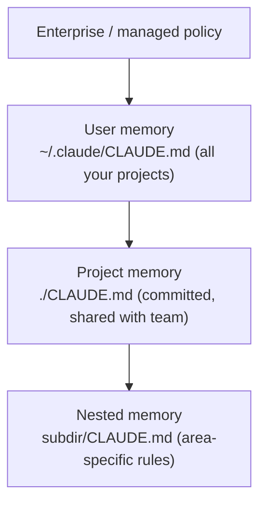

<LevelBadge level="beginner" />

<VerifyNote lastVerified="2026-06-20" source="https://code.claude.com/docs/en/memory">
Le posizioni dei file di memoria e la sintassi degli import possono cambiare: verifica i dettagli nella documentazione ufficiale sulla memoria di Claude Code.
</VerifyNote>

Se fai **una** sola cosa per migliorare [Claude Code](/docs/claude-code/what-is-claude-code), fai questa. `CLAUDE.md` è un file di testo semplice che Claude legge all'inizio di ogni sessione: il briefing permanente del tuo progetto.

<Callout type="objectives" items={["Perché CLAUDE.md è l'impostazione di Claude Code con il maggior impatto", "Come la gerarchia della memoria si fonde dal globale allo specifico per progetto", "Come generare un file di partenza con /init e snellirlo", "Cosa va in CLAUDE.md e cosa tenerne fuori", "Come gli @import ti permettono di riferire documenti senza duplicarli"]} />

## Perché è l'impostazione con il maggior impatto

Senza di esso, devi rispiegare il tuo progetto a ogni sessione ("usiamo pnpm, i test sono in `__tests__`, non toccare `/generated`…"). Con esso, Claude lo sa già. Buone istruzioni qui migliorano *ogni* interazione futura in un colpo solo.

## La gerarchia della memoria

Claude Code legge la memoria da diversi punti e li fonde, all'incirca dal più globale al più specifico:

- **Memoria utente** — le tue preferenze personali su ogni progetto.
- **Memoria di progetto** (`./CLAUDE.md`, sotto commit) — come funziona *questo* repo. Condivisa con il tuo team.
- **Annidata** — metti un `CLAUDE.md` in una sottocartella per regole che valgono solo lì.

<Flashcards title="Conosci i tuoi livelli di memoria" cards={[{front: "Memoria utente", back: "~/.claude/CLAUDE.md — le tue preferenze personali che valgono su ogni progetto."}, {front: "Memoria di progetto", back: "./CLAUDE.md — sotto commit e condivisa con il team; descrive come funziona questo repo."}, {front: "Memoria annidata", back: "subdir/CLAUDE.md — regole specifiche per area che valgono solo dentro quella sottocartella."}, {front: "Enterprise / managed policy", back: "Il livello più globale; policy a livello di organizzazione che sta sopra la tua memoria utente."}]} />

## Genera un punto di partenza

<Steps items={[{title: "Esegui /init nel progetto", body: "Claude ispeziona il codice e redige un CLAUDE.md per te in automatico."}, {title: "Snelliscilo", body: "La bozza è un punto di partenza, non il traguardo. Riducila a ciò che è vero e utile."}, {title: "Prendi spunto da un template", body: "Recupera uno starter già pronto dalla pagina Template CLAUDE.md e adattalo al tuo repo."}]} />

<PromptCard title="Genera una bozza di CLAUDE.md">{`/init`}</PromptCard>

Recupera uno starter già pronto da [Template CLAUDE.md](/docs/templates/claude-md).

## Cosa metterci dentro

- Cos'è il progetto, in due frasi.
- Lo stack tecnologico e come **eseguire / testare / fare il lint**.
- Convenzioni che Claude non può dedurre (nomenclatura, struttura, stile dei commit).
- **Protezioni**: "esegui i test prima di dichiarare concluso", "non modificare mai `/vendor`", "non committare mai segreti".

## Cosa NON metterci dentro

<Callout type="warning" items={["Claude segue CLAUDE.md alla lettera: istruzioni obsolete, vaghe o velleitarie fanno attivamente danni.", "Descrivi come il progetto funziona realmente oggi; breve e veritiero batte lungo e ambizioso.", "Evita documenti incollati giganteschi (usa invece gli @import), i segreti e le regole che in realtà non segui.", "Rivedilo periodicamente in modo che resti accurato man mano che il progetto evolve."]} />

## Import

Includi i documenti esistenti invece di duplicarli: ad esempio, riferisci la tua guida di stile con un import `@path/to/file` così da avere un'unica fonte autorevole. Vedi la [documentazione ufficiale sulla memoria](https://code.claude.com/docs/en/memory) per la sintassi esatta.

<Callout type="tip" items={["Un'unica fonte autorevole: riferisci un file con gli @import invece di incollarne il contenuto in CLAUDE.md.", "Se un documento esiste già, collegalo: non copiarlo. Le copie si disallineano col tempo."]} />

## Mettiti alla prova

<Quiz title="Mettiti alla prova" questions={[{q: "Quale file legge Claude Code all'inizio di ogni sessione come briefing permanente del tuo progetto?", options: ["README.md", "CLAUDE.md", "package.json"], answer: 1, explain: "CLAUDE.md è il file di memoria in testo semplice che Claude legge all'inizio di ogni sessione."}, {q: "Cosa fa l'esecuzione di /init in un progetto?", options: ["Esegue il commit di CLAUDE.md nel repo del tuo team", "Redige un CLAUDE.md ispezionando il codice, che poi tu snellisci", "Elimina i file di memoria obsoleti"], answer: 1, explain: "/init redige un CLAUDE.md di partenza a partire dal codice: la bozza è un punto di partenza, quindi dopo la snellisci."}, {q: "Qual è il modo consigliato per includere un documento esistente di grandi dimensioni come una guida di stile?", options: ["Incollare l'intero documento in CLAUDE.md", "Riferirlo con un import @path/to/file", "Conservarlo come segreto"], answer: 1, explain: "Usa gli @import per puntare al file in modo da avere un'unica fonte autorevole anziché una copia duplicata che si disallinea."}]} />

<Callout type="takeaways" items={["CLAUDE.md è l'impostazione con il maggior impatto: migliora ogni sessione futura in un colpo solo.", "La memoria si fonde dal globale allo specifico: policy enterprise, poi i file CLAUDE.md utente, di progetto e annidati.", "Inizia con /init, poi snellisci la bozza fino a ciò che è davvero vero.", "Includi il riepilogo del progetto, i comandi run/test/lint, le convenzioni e le protezioni.", "Tienilo breve e veritiero: usa gli @import per i documenti grandi e non committare mai segreti."]} />

## Avanti

- [Modalità Piano](/docs/claude-code/plan-mode) — prime modifiche sicure
- [Permessi e modalità](/docs/claude-code/permissions) — cosa Claude può fare senza supervisione
- [Tutorial: personalizza Claude Code per un repository reale](/docs/walkthroughs/customize-claude-code)
