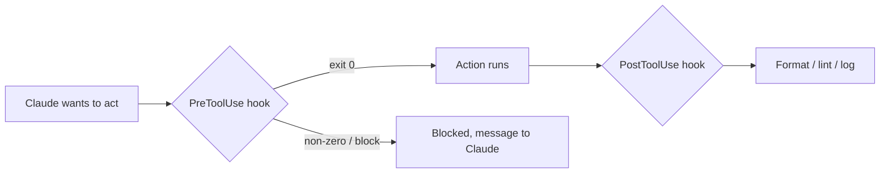

<LevelBadge level="advanced" />

<VerifyNote lastVerified="2026-06-23" source="https://code.claude.com/docs/en/hooks">
I nomi esatti degli eventi hook, il payload su stdin e il protocollo di blocco evolvono — verifica rispetto alla documentazione ufficiale sugli hook prima di affidarti a un evento o a un campo specifico.
</VerifyNote>

Gli hook sono **comandi shell che Claude Code esegue automaticamente** in punti definiti del suo ciclo di vita. Mentre i [permessi](/docs/claude-code/permissions) decidono *se* un'azione è consentita, gli hook permettono a *te* di eseguire logica deterministica attorno a essa — formattazione, validazione, logging, gate. Sono il modo per rendere un comportamento garantito anziché un "ricordati di".

<Callout type="objectives" items={["Quando ricorrere a un hook invece che a un'istruzione o a un permesso", "Come si configura un hook: evento, matcher e il payload JSON su stdin", "I due modi in cui un hook blocca un'azione — codice di uscita 2 contro JSON su stdout", "Le buone pratiche e gli errori comuni che distinguono gli hook veloci e sicuri da quelli lenti e silenziosi"]} />

## Quando ricorrere a un hook

Ricorri a un hook quando vuoi che un comportamento sia *garantito*, non semplicemente richiesto. Ogni compito comune si associa a un evento del ciclo di vita:

- **Auto-formattazione / lint** dopo ogni modifica di file (`PostToolUse`).
- **Bloccare** un'azione che viola una regola prima che venga eseguita (`PreToolUse`).
- **Notificare o registrare** quando una sessione termina o un'attività si conclude (`Stop`).
- **Iniettare contesto** all'avvio della sessione.

<Flashcards title="Gli eventi hook a colpo d'occhio" cards={[{front: "PreToolUse", back: "Scatta prima che un'azione venga eseguita. Usalo per bloccare o filtrare — ad es. rifiuta un comando distruttivo prima che venga eseguito."}, {front: "PostToolUse", back: "Scatta dopo un'azione corrispondente. Usalo per formattare, fare lint o registrare ciò che è appena cambiato."}, {front: "Stop", back: "Scatta quando una sessione termina o un'attività si conclude. Usalo per notificare o registrare."}, {front: "Session start", back: "Scatta all'inizio di una sessione. Usalo per iniettare contesto."}]} />

## Come funzionano

Registri gli hook in [`settings.json`](/docs/claude-code/settings), associandoli a un **evento** (e spesso a un matcher di strumento). Quando l'evento si verifica, Claude esegue il tuo comando, passando un **payload JSON su stdin** (il nome dello strumento, i suoi input, la sessione). Il codice di uscita e l'output del tuo comando decidono cosa succede dopo.

<Steps items={[{title: "Associa un evento", body: "Registra l'hook in settings.json sotto l'evento del ciclo di vita che ti interessa — per esempio PostToolUse."}, {title: "Restringi con un matcher", body: "Aggiungi un matcher di strumento così l'hook scatta solo sugli strumenti rilevanti, ad es. matcher \"Edit|Write\" per le modifiche ai file."}, {title: "Leggi il payload da stdin", body: "Quando l'evento si verifica, Claude esegue il tuo comando e convoglia un payload JSON su stdin — il nome dello strumento, i suoi input, la sessione."}, {title: "Decidi cosa succede dopo", body: "Il codice di uscita e l'output del tuo comando determinano il risultato: lasciare procedere l'azione, eseguire la tua logica o bloccarla."}]} />

```json
{
  "hooks": {
    "PostToolUse": [
      {
        "matcher": "Edit|Write",
        "hooks": [
          { "type": "command", "command": "jq -r '.tool_input.file_path' | xargs npx prettier --write" }
        ]
      }
    ]
  }
}
```

L'hook qui sopra legge il percorso del file modificato dal JSON su stdin (`.tool_input.file_path`) e lo formatta. Non dare per scontato che una variabile d'ambiente contenga il percorso — **leggilo da stdin.** Utili segnaposto di percorso come `${CLAUDE_PROJECT_DIR}` *sono* disponibili per individuare gli script.

## Come un hook blocca

Due modi, a seconda dell'evento:

- **Codice di uscita 2** — l'hook fa fallire l'azione e qualunque cosa abbia scritto su **stderr** diventa il messaggio che Claude vede. Semplice e funziona per gli hook di tipo command.
- **JSON su stdout (uscita 0)** — restituisci una decisione strutturata. Per `PreToolUse`, è un `permissionDecision` pari a `deny`; per `PostToolUse`/`Stop`/ecc. è `{"decision": "block", "reason": "…"}`.

Lo script qui sotto è un hook `PreToolUse` sullo strumento Bash. Leggilo dall'alto in basso: estrae il comando da stdin e, se sembra distruttivo, scrive una motivazione su stderr ed esce con codice 2 per bloccare.

```bash
#!/usr/bin/env bash
# PreToolUse hook on the Bash tool: refuse to delete things.
command=$(jq -r '.tool_input.command' < /dev/stdin)
if [[ "$command" == rm\ * || "$command" == *"rm -rf"* ]]; then
  echo "Blocked: destructive 'rm' is not allowed by policy." >&2
  exit 2
fi
exit 0
```

## Il modello mentale

Un hook `PreToolUse` viene eseguito *prima* dell'azione e può bloccarla; un hook `PostToolUse` viene eseguito *dopo* che ha avuto successo e reagisce al risultato.



## Buone pratiche

- **Mantieni gli hook veloci e idempotenti** — vengono eseguiti molto spesso.
- **Segnala forte i problemi reali**, ma non bloccare per questioni estetiche.
- **Tratta l'output dell'hook come feedback per Claude** — un messaggio chiaro lo aiuta a correggersi da solo.
- Gli hook vengono eseguiti con i privilegi della tua shell — rivedi qualsiasi hook che non hai scritto tu ([Revisione del codice di terze parti](/docs/security/reviewing-third-party-code)).

## Errori comuni

- **Leggere il percorso del file da una variabile d'ambiente.** Il percorso vive nel JSON su stdin (`.tool_input.file_path`), non in `$CLAUDE_FILE_PATH`. Fai passare stdin attraverso `jq`.
- **Blocchi silenziosi.** Se un hook `PreToolUse` esce con codice 2 senza nulla su stderr, Claude è bloccato ma non sa *perché* e non può adattarsi. Scrivi sempre una motivazione chiara.
- **Hook lenti.** Un hook `PostToolUse` viene eseguito dopo *ogni* modifica corrispondente. Un linter da 3 secondi rende l'intera sessione lenta e pesante — mantieni gli hook veloci e, idealmente, fai agire solo su ciò che è cambiato.
- **Matcher troppo ampi.** `matcher: ".*"` scatta su ogni strumento. Restringi con un nome esatto, una lista `Edit|Write`, o il campo `if` per singolo handler (ad es. `"if": "Bash(git push *)"`).
- **Fidarsi di hook che non hai scritto.** Un hook esegue shell arbitraria con i tuoi privilegi. Rivedi prima ogni hook proveniente da un plugin o da un template — vedi [Revisione del codice di terze parti](/docs/security/reviewing-third-party-code).

<Callout type="warning" items={["Un hook esegue shell arbitraria con i tuoi privilegi — non configurare mai un hook proveniente da un plugin o da un template senza prima leggerlo."]} />

Starter da copia-incolla si trovano in [Ricette per hook e settings.json](/docs/templates/hooks-settings).

<PromptCard title="Auto-formattare i file modificati (PostToolUse su Edit|Write)">{`{
  "hooks": {
    "PostToolUse": [
      {
        "matcher": "Edit|Write",
        "hooks": [
          { "type": "command", "command": "jq -r '.tool_input.file_path' | xargs npx prettier --write" }
        ]
      }
    ]
  }
}`}</PromptCard>

<Quiz title="Mettiti alla prova" questions={[{q: "Dove trova un hook il percorso del file appena modificato?", options: ["Nella variabile d'ambiente $CLAUDE_FILE_PATH", "Nel payload JSON su stdin, in .tool_input.file_path", "In un argomento da riga di comando passato da Claude"], answer: 1, explain: "Il percorso vive nel JSON su stdin (.tool_input.file_path), non in una variabile d'ambiente. Fai passare stdin attraverso jq per leggerlo."}, {q: "Un hook PreToolUse esce con codice 2. Cosa succede?", options: ["L'azione è consentita e stdout viene registrato", "L'azione è bloccata, e qualunque cosa l'hook abbia scritto su stderr diventa il messaggio che Claude vede", "Claude ignora il risultato perché il codice 2 è riservato"], answer: 1, explain: "Il codice di uscita 2 fa fallire l'azione; stderr diventa il messaggio che Claude vede. Scrivi sempre una motivazione chiara così Claude può adattarsi."}, {q: "Perché matcher \".*\" è considerato un errore comune?", options: ["È JSON non valido e rompe settings.json", "Scatta su ogni strumento, quindi l'hook viene eseguito molto più del previsto — restringilo con un nome esatto, una lista Edit|Write o il campo if", "Corrisponde solo allo strumento Bash"], answer: 1, explain: "Un matcher troppo ampio scatta su ogni strumento. Restringilo per mantenere gli hook veloci e mirati."}]} />

<Callout type="takeaways" items={["Gli hook rendono un comportamento garantito, non richiesto — eseguono logica deterministica attorno ad azioni che i permessi si limitano a consentire o negare.", "Registra un hook in settings.json contro un evento più un matcher; Claude convoglia un payload JSON su stdin e legge il tuo codice di uscita e il tuo output.", "Leggi il percorso del file da stdin (.tool_input.file_path) — non da una variabile d'ambiente.", "Blocca con il codice di uscita 2 (stderr diventa il messaggio) o con JSON strutturato su stdout (uscita 0); includi sempre una motivazione chiara.", "Mantieni gli hook veloci, idempotenti e con matcher ristretto — e rivedi qualsiasi hook che non hai scritto tu, dato che viene eseguito con i privilegi della tua shell."]} />

## Prossimi passi

- [settings.json](/docs/claude-code/settings) · [Permessi](/docs/claude-code/permissions)
- [Skill](/docs/claude-code/skills) — competenza contro automazione
- [Rendere robuste le esecuzioni autonome](/docs/security/hardening-autonomous-runs)
