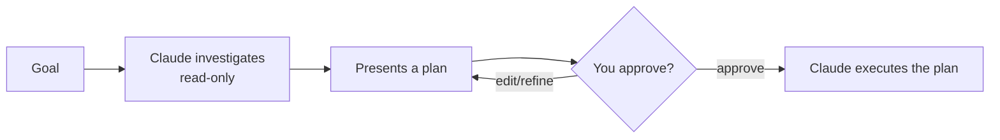

<LevelBadge level="beginner" />

<Callout type="objectives" items={["Spiegare cosa fa la Modalità Piano e perché è in sola lettura", "Decidere quando pianificare prima e quando puoi saltare il passaggio", "Percorrere il ciclo investiga-proponi-approva-esegui", "Distinguere la Modalità Piano dai Permessi e usarli insieme"]} />

<VerifyNote lastVerified="2026-06-20" source="https://code.claude.com/docs/en">
Il modo in cui entri in Modalità Piano (scorciatoia/flag) può cambiare tra le release — controlla la documentazione ufficiale di Claude Code.
</VerifyNote>

## L'idea di fondo

Immagina di consegnare le chiavi di casa a un artigiano oppure di chiedergli prima di fare un sopralluogo e mettere per iscritto *cosa* cambierebbe. La Modalità Piano è il sopralluogo.

La **Modalità Piano** rende Claude Code **in sola lettura**: può esplorare il tuo codebase, eseguire ricerche e ragionare — ma **non modificherà i file né eseguirà comandi che alterano lo stato**. Produce invece un piano e attende la tua approvazione.

<Callout type="tip" items={["Sola lettura significa che Claude PENSA ma non AGISCE — nessuna modifica ai file, nessun comando che altera lo stato, finché non dici via."]} />

## Perché è il modo più sicuro per iniziare

Per qualsiasi cosa grande, rischiosa o sconosciuta, vuoi vedere *cosa* Claude intende fare prima che tocchi il tuo repository. La Modalità Piano separa il **pensare** dal **fare**:

Il vantaggio: cogli le assunzioni sbagliate *prima* che diventino codice sbagliato.

## Quando usarla

<Callout type="tip" items={["SEMPRE per cambiamenti grandi o su più file, migrazioni o refactoring", "Quando lavori in un codebase che non conosci ancora del tutto", "Quando vuoi un piano revisionabile da condividere con un collega"]} />

Per modifiche minuscole e ovvie puoi saltarla — ma nel dubbio, pianifica prima.

## Come funziona in pratica

Segui il ciclo. Ogni passo guadagna il successivo — Claude passa a modificare *solo dopo* la tua approvazione.

<Steps items={[{title: "Entra in Modalità Piano e dichiara il tuo obiettivo", body: "Passa alla modalità in sola lettura, poi descrivi cosa vuoi ottenere."}, {title: "Claude investiga", body: "Legge i file pertinenti e pone domande di chiarimento."}, {title: "Claude restituisce un piano passo passo", body: "I file da cambiare, l'approccio e come verificare il risultato."}, {title: "Tu approvi o affini", body: "Solo dopo l'approvazione Claude passa a effettuare le modifiche."}]} />

### Provala tu stesso

Copia questo in una vera sessione di pianificazione e osserva il ciclo svolgersi:

<PromptCard title="Avvia una sessione di pianificazione">{`I want to migrate our auth from sessions to JWT. Stay in Plan Mode: investigate the current setup, ask anything you need, then propose a step-by-step plan with files to change and how to verify — don't edit anything yet.`}</PromptCard>

:::tip Abbinala a CLAUDE.md
Un buon [CLAUDE.md](/docs/claude-code/claude-md) rende i piani più affilati — Claude pianifica avendo già a mente le tue convenzioni e protezioni.
:::

## Modalità Piano contro Permessi

Una classica confusione. Risolvono problemi diversi e lavorano insieme:

- **Modalità Piano** = "investiga e proponi, non agire ancora". (Questa pagina.)
- **[Permessi](/docs/claude-code/permissions)** = una volta in azione, *quali* azioni sono consentite senza chiedere.

Pensala come **se agire ora** (Modalità Piano) contro **quali azioni sono consentite una volta in azione** (Permessi).

<Flashcards cards={[{front: "In quale stato la Modalità Piano mette Claude Code?", back: "In sola lettura — può esplorare, cercare e ragionare, ma non modificherà i file né eseguirà comandi che alterano lo stato finché non approvi."}, {front: "Qual è il ciclo della Modalità Piano?", back: "Investiga (in sola lettura) → presenta un piano → tu approvi o affini → Claude esegue."}, {front: "Quando dovresti ricorrere alla Modalità Piano?", back: "Per impostazione predefinita per lavori grandi, rischiosi o sconosciuti (cambiamenti su più file, migrazioni, refactoring, codebase sconosciuti). Salta solo le modifiche minuscole e ovvie."}, {front: "Modalità Piano contro Permessi?", back: "La Modalità Piano governa SE agire ora; i Permessi governano QUALI azioni sono consentite una volta in azione."}]} />

<Callout type="takeaways" items={["La Modalità Piano è in sola lettura: Claude esplora e propone ma non modifica mai né esegue comandi che alterano lo stato finché non approvi", "Usala per impostazione predefinita per lavori grandi, rischiosi o sconosciuti; salta solo le modifiche minuscole e ovvie", "Il ciclo è investiga, poi proponi, poi approva/affina, poi esegui", "La Modalità Piano governa SE agire ora; i Permessi governano QUALI azioni sono consentite una volta in azione"]} />

<Quiz title="Mettiti alla prova" questions={[{q: "Cosa può fare Claude Code mentre è in Modalità Piano?", options: ["Modificare i file ed eseguire qualsiasi comando", "Esplorare, cercare e ragionare — ma non modificare i file né eseguire comandi che alterano lo stato", "Solo rispondere alle domande, senza alcun accesso ai file"], answer: 1, explain: "La Modalità Piano è in sola lettura: Claude può esplorare il codebase, eseguire ricerche e ragionare, ma non modificherà i file né eseguirà comandi che alterano lo stato."}, {q: "Quando dovresti ricorrere alla Modalità Piano?", options: ["Solo per correzioni di refusi su una riga", "Per cambiamenti grandi o su più file, migrazioni, refactoring o codebase sconosciuti", "Mai — ti rallenta e basta"], answer: 1, explain: "Usala sempre per cambiamenti grandi o su più file, migrazioni o refactoring, e quando lavori in un codebase che non conosci ancora del tutto. Le modifiche minuscole e ovvie possono saltarla."}, {q: "Qual è l'ordine corretto del ciclo della Modalità Piano?", options: ["Esegui, poi investiga, poi approva", "Investiga (in sola lettura), presenta un piano, tu approvi o affini, poi Claude esegue", "Approva prima, poi Claude investiga e modifica"], answer: 1, explain: "Claude investiga in sola lettura, presenta un piano, tu approvi o affini, e solo allora passa a eseguire il piano."}, {q: "In cosa differiscono la Modalità Piano e i Permessi?", options: ["Sono due nomi per la stessa funzionalità", "Modalità Piano = investiga e proponi, non agire ancora; Permessi = una volta in azione, quali azioni sono consentite senza chiedere", "I Permessi decidono se pianificare; la Modalità Piano decide quali file modificare"], answer: 1, explain: "La Modalità Piano separa il pensare dal fare. I Permessi controllano quali azioni sono consentite senza chiedere una volta che Claude è in azione. Lavorano insieme."}]} />

## Avanti

- [Permessi e modalità dei permessi](/docs/claude-code/permissions)
- [Gestione del contesto](/docs/claude-code/context-management) — mantieni efficaci le sessioni lunghe
- [Tutorial: personalizza Claude Code per un repository reale](/docs/walkthroughs/customize-claude-code)
