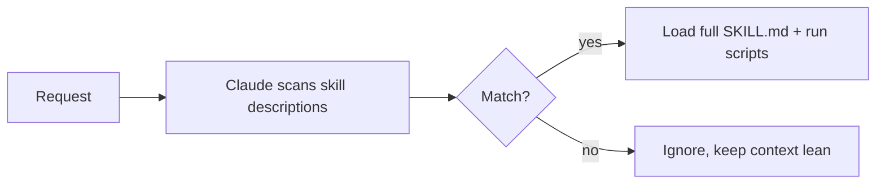

<LevelBadge level="advanced" />

<VerifyNote lastVerified="2026-06-23" source="https://code.claude.com/docs/en/skills">
La struttura dei file di skill, la divulgazione progressiva e dove le skill vengono eseguite (Claude Code, Claude.ai, Cowork) si stanno evolvendo — verifica nella documentazione ufficiale sulle Skill.
</VerifyNote>

<Callout type="objectives" items={["Definire cos'è una Skill e in cosa differisce dallo stipare tutto in CLAUDE.md", "Leggere e scrivere un SKILL.md — frontmatter più istruzioni — e capire perché la description è il trigger", "Spiegare la divulgazione progressiva e perché permette a molte skill di scalare senza gonfiare il contesto", "Conoscere i tre posti in cui risiedono le skill: personale, progetto e raggruppate in un plugin", "Scegliere correttamente tra Skill, comando slash, subagent e MCP", "Evitare i quattro errori comuni che impediscono alle skill di attivarsi"]} />

Una **Skill** impacchetta competenza — istruzioni più script e risorse facoltativi — che Claude carica **solo quando è pertinente**. Invece di stipare tutto in [CLAUDE.md](/docs/claude-code/claude-md), dai a Claude una libreria di capacità che richiama su richiesta.

## Anatomia

Una skill è una cartella con un `SKILL.md`: frontmatter YAML + istruzioni.

```markdown
---
name: pdf-forms
description: Use when the user needs to fill, read, or generate PDF forms.
---

# PDF Forms
Steps and rules for working with PDF forms…
(optionally reference scripts/ or resources/ in this folder)
```

<Callout type="tip" items={["La description è il trigger — Claude la legge per decidere quando attivare la skill. Scrivila come \"Use when…\", abbastanza specifica da farla caricare al momento giusto e non altrimenti."]} />

## Divulgazione progressiva (perché le skill scalano)

Claude non carica in anticipo il corpo completo di ogni skill — vede il leggero `name` + `description`, e richiama le istruzioni complete (ed esegue gli script) solo quando una richiesta corrisponde. Questo mantiene snello il contesto anche con molte skill installate.



## Dove risiedono

<Steps items={[{title:"Personali", body:"~/.claude/skills/<name>/SKILL.md — restano tue, disponibili in tutti i tuoi progetti."},{title:"Progetto (condivisibili)", body:".claude/skills/<name>/SKILL.md — committala su git e tutto il team ottiene la capacità."},{title:"Raggruppate in un plugin", body:"Impacchetta le skill dentro un plugin per la distribuzione al team. Vedi Plugin e marketplace."}]} />

AILmanac fornisce [7 pacchetti di skill pronti all'uso](/docs/templates/skills) — copiane uno per provarlo.

## Esempio pratico: una skill che si attiva da sola

Crea `~/.claude/skills/release-notes/SKILL.md`:

```markdown
---
name: release-notes
description: Use when the user asks to write release notes or a changelog from git history.
---

# Release Notes
1. Run `git log <last-tag>..HEAD --oneline` to get the commits.
2. Group them into Features / Fixes / Breaking changes.
3. Write user-facing notes — what changed for *users*, not commit messages.
4. Output Markdown ready to paste into a GitHub release.
```

Più tardi digiti il prompt qui sotto. Claude non aveva mai avuto questi passaggi nel contesto — ma la richiesta corrisponde alla `description`, quindi richiama il `SKILL.md` completo, esegue il `git log` e produce note raggruppate. Non hai invocato nulla per nome; è stata la **description a fare il routing**. Aggiungi un file `scripts/` nella stessa cartella e la skill potrà eseguirlo come parte del passaggio 1.

<PromptCard title="Attiva la skill in base all'intento — senza alcun nome">{`Draft release notes since v1.4.`}</PromptCard>

## Skill contro comando contro subagent contro MCP

| Strumento | Cos'è | Lo attivi tu o Claude |
|---|---|---|
| [Comando slash](/docs/claude-code/slash-commands) | Un prompt salvato | Lo invochi **tu** |
| **Skill** | Competenza su richiesta + script | Lo carica **Claude** quando è pertinente |
| [Subagent](/docs/claude-code/subagents) | Un agente delegato con il proprio contesto | Claude delega |
| [MCP](/docs/claude-code/mcp) | Una connessione a strumenti/dati esterni | Fornisce strumenti da chiamare |

<Callout type="takeaways" items={["Vuoi attivarlo su richiesta → comando slash.", "Claude dovrebbe conoscere la procedura e applicarla quando è pertinente → skill.", "Il lavoro deve avvenire in un contesto separato → subagent.", "Devi raggiungere un sistema esterno → MCP."]} />

## Errori comuni

<Callout type="warning" items={["Una description che non si attiva. \"Helps with PDFs\" è troppo vaga; \"Use when the user needs to fill, read, or generate PDF forms\" dice a Claude esattamente quando caricarla. La description è l'intero meccanismo di attivazione — scrivila per il matching, non per gli esseri umani.", "Mettere invece tutto in CLAUDE.md. CLAUDE.md si carica a ogni sessione e costa sempre contesto; una skill si carica solo quando è pertinente. Sposta le procedure situazionali nelle skill e tieni CLAUDE.md per le regole di progetto sempre valide.", "Una skill gigante e unica. Molte skill piccole e descritte con precisione fanno un routing migliore di una sola tuttofare — la divulgazione progressiva aiuta solo se ogni description è specifica.", "Dimenticare che è condivisibile. Una skill di progetto in .claude/skills/ committata su git dà la capacità a tutto il team; una personale in ~/.claude/skills/ resta tua."]} />

## Ripassa i termini

<Flashcards cards={[{front:"Cos'è una Skill?", back:"Una cartella con un SKILL.md che impacchetta istruzioni più script e risorse facoltativi, che Claude carica solo quando è pertinente."},{front:"Qual è il trigger di una skill?", back:"Il campo description — Claude lo legge per decidere quando attivare la skill. Scrivilo come \"Use when…\", abbastanza specifico da caricarla al momento giusto e non altrimenti."},{front:"Cos'è la divulgazione progressiva?", back:"Claude vede in anticipo solo il leggero name + description, e richiama il SKILL.md completo (ed esegue gli script) solo quando una richiesta corrisponde — mantenendo snello il contesto anche con molte skill."},{front:"Posizione delle skill personali contro quelle di progetto?", back:"Personale: ~/.claude/skills/<name>/SKILL.md (resta tua). Progetto: .claude/skills/<name>/SKILL.md (committala su git per condividerla col team)."},{front:"Skill contro comando slash?", back:"Tu invochi un comando slash su richiesta; Claude carica una skill automaticamente quando la richiesta corrisponde alla sua description."},{front:"Skill contro CLAUDE.md?", back:"CLAUDE.md si carica a ogni sessione e costa sempre contesto; una skill si carica solo quando è pertinente. Tieni le regole sempre valide in CLAUDE.md, le procedure situazionali nelle skill."}]} />

## Mettiti alla prova

<Quiz title="Mettiti alla prova" questions={[{q:"In un SKILL.md, cosa decide effettivamente quando Claude attiva la skill?", options:["Il nome della cartella","Il campo description nel frontmatter","La prima intestazione nel corpo","L'invocazione manuale da parte dell'utente"], answer:1, explain:"La description è il trigger — Claude la legge per decidere quando attivare la skill. Scrivila come \"Use when…\", abbastanza specifica da caricarla al momento giusto."},{q:"Cos'è la divulgazione progressiva?", options:["Claude carica in anticipo il corpo completo di ogni skill","Claude vede solo name + description, e carica il SKILL.md completo solo quando una richiesta corrisponde","Le skill rivelano i loro passaggi all'utente una riga alla volta","CLAUDE.md viene caricato gradualmente nel corso di una sessione"], answer:1, explain:"La divulgazione progressiva significa che Claude vede il leggero name + description e richiama le istruzioni complete (ed esegue gli script) solo quando una richiesta corrisponde — mantenendo snello il contesto anche con molte skill installate."},{q:"Vuoi che TUTTO IL TEAM ottenga una capacità tramite git. Dove metti la skill?", options:["~/.claude/skills/<name>/SKILL.md","/etc/claude/skills/","\.claude/skills/<name>/SKILL.md committata su git","Dentro CLAUDE.md"], answer:2, explain:"Una skill di progetto in .claude/skills/ committata su git dà la capacità a tutto il team; una personale in ~/.claude/skills/ resta tua."},{q:"Vuoi attivare qualcosa tu stesso, su richiesta, per nome. Quale strumento è adatto?", options:["Skill","Comando slash","Subagent","MCP"], answer:1, explain:"Regola pratica: vuoi attivarlo su richiesta → comando slash. Claude carica una procedura quando è pertinente → skill; contesto separato → subagent; raggiungere un sistema esterno → MCP."},{q:"Perché preferire una skill al mettere una procedura situazionale in CLAUDE.md?", options:["CLAUDE.md non può contenere procedure","CLAUDE.md si carica a ogni sessione e costa sempre contesto, mentre una skill si carica solo quando è pertinente","Le skill girano più velocemente di CLAUDE.md","CLAUDE.md non può essere condiviso tramite git"], answer:1, explain:"CLAUDE.md si carica a ogni sessione e costa sempre contesto; una skill si carica solo quando è pertinente. Sposta le procedure situazionali nelle skill e tieni CLAUDE.md per le regole di progetto sempre valide."}]} />

## Prossimi passi

- [Scrivi la tua prima skill (guida pratica)](/docs/walkthroughs/first-skill)
- [Template SKILL.md](/docs/templates/skills)
- [Plugin e marketplace](/docs/claude-code/plugins-marketplaces)
