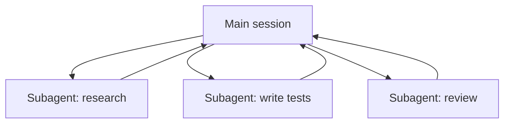

<LevelBadge level="advanced" />

<VerifyNote lastVerified="2026-06-23" source="https://code.claude.com/docs/en/sub-agents">
I campi del frontmatter dei subagent, l'elenco degli agenti integrati e l'interfaccia `/agents` cambiano nel tempo — verifica nella documentazione ufficiale.
</VerifyNote>

<Callout type="objectives" items={["Cos'è un subagent — un Claude separato con la propria finestra di contesto e un set di strumenti circoscritto","I tre motivi per delegare: proteggere il contesto, specializzare e parallelizzare","Gli agenti integrati a cui Claude delega già: Explore, Plan, General-purpose","Come definire il tuo subagent in .claude/agents/ e perché description + tools sono i due campi portanti","Quando NON parallelizzare, e come questo si collega agli agenti API e ai workflow su scala di flotta"]} />

Un **subagent** è un'istanza separata di Claude con la **propria finestra di contesto** e un **set di strumenti circoscritto**, a cui la tua sessione principale delega una porzione di lavoro. Ti riporta un risultato, non l'intera trascrizione — così la sessione principale resta concentrata e senza ingombri.

## Perché delegare

Tre compiti, un solo strumento. Tienili a mente ogni volta che ricorri a un subagent:

- **Proteggi il contesto principale.** Un'indagine di ricerca o una scansione di file di grandi dimensioni possono bruciare migliaia di token; falla in un subagent e tornerà solo la conclusione.
- **Specializza.** Dai a un subagent un system prompt su misura e solo gli strumenti di cui ha bisogno (ad es. un revisore in sola lettura).
- **Parallelizza.** Esegui contemporaneamente sottoattività indipendenti — ad es. esplora tre moduli simultaneamente.

## Quelli integrati che hai già

Prima di definirne di tuoi, sappi che Claude Code include subagent a cui delega automaticamente:

| Integrato | Cosa fa |
| --- | --- |
| **Explore** | Un agente veloce e in sola lettura (gira su un modello più economico) per cercare e comprendere una codebase senza toccarla. |
| **Plan** | Raccoglie contesto durante la modalità di pianificazione, così la ricerca resta fuori dalla conversazione principale, in sola lettura. |
| **General-purpose** | Un agente con strumenti completi per lavori complessi e multi-step che combinano esplorazione e modifiche. |

Raramente li invochi per nome; Claude vi ricorre quando un'attività è adatta. I subagent personalizzati servono per i lavoratori che *tu* continui a ricreare con le stesse istruzioni.

## Definire i tuoi

Un subagent è un file Markdown con frontmatter YAML (il corpo diventa il suo system prompt). Solo `name` e `description` sono obbligatori; tutto il resto è opzionale. Conservalo per progetto in `.claude/agents/` (mettilo sotto git così il team lo condivide) o per utente in `~/.claude/agents/`. Creane uno con il comando `/agents` o a mano.

<Steps items={[{title: "Scegli una posizione", body: "Per progetto in .claude/agents/ (committalo così il team lo condivide) oppure per utente in ~/.claude/agents/."},{title: "Crea il file", body: "Usa il comando /agents, oppure scrivi a mano un file Markdown con frontmatter YAML."},{title: "Imposta i campi obbligatori", body: "Solo name e description sono obbligatori. Tutto il resto è opzionale."},{title: "Scrivi il corpo come system prompt", body: "Il corpo Markdown sotto il frontmatter diventa il system prompt del subagent."},{title: "Circoscrivi gli strumenti", body: "Aggiungi una allowlist di strumenti così il subagent può fare solo ciò che il suo compito richiede."}]} />

Un subagent `code-reviewer` di partenza:

<PromptCard title="subagent code-reviewer (.claude/agents/code-reviewer.md)">{`---
name: code-reviewer
description: Expert code reviewer. Use proactively after code changes.
tools: Read, Glob, Grep
model: sonnet
---

You are a senior reviewer. Read the changed files, then report only
high-confidence issues: correctness bugs, security risks, and missing
tests. For each, show the file:line, the problem, and a concrete fix.
Do not restate what the code does. Never edit files.`}</PromptCard>

Due cose rendono buono un subagent:

- **La `description` è il segnale di routing.** Claude la legge per decidere *quando* delegare, quindi scrivila come un trigger — "Use proactively after code changes" lo richiama automaticamente; un vago "helps with code" no. Questa è la singola riga del file con la maggiore leva.
- **Circoscrivi gli strumenti in modo stretto.** Il campo `tools` è una allowlist (oppure usa `disallowedTools` come denylist). Un revisore che può solo `Read, Glob, Grep` *non può* modificare accidentalmente il tuo codice: la restrizione è una garanzia, non un suggerimento. Ometti `tools` e il subagent eredita tutto ciò che ha la sessione principale.

## Esempio pratico: un fan-out di revisione parallela

Hai terminato una funzionalità che tocca tre moduli e vuoi un controllo rapido e indipendente di ciascuno. Nella tua sessione principale:

<PromptCard title="Distribuisci tre revisori in una volta">{`Review the changes in auth/, billing/, and api/ — use the code-reviewer subagent on each, in parallel.`}</PromptCard>

Claude genera tre istanze di `code-reviewer` contemporaneamente. Ognuna legge solo il proprio modulo, consuma il proprio contesto sul contenuto dei file e restituisce un breve elenco di rilievi. La tua sessione principale non vede mai i diff grezzi — solo tre report ordinati — e l'intera operazione termina all'incirca nel tempo della singola istanza di revisione più lenta anziché nella somma di tutte e tre. Poiché il revisore è in sola lettura, tre agenti che lavorano contemporaneamente non possono entrare in conflitto su una scrittura.

## Quando NON parallelizzare

<Callout type="warning" items={["I passaggi dipendenti devono essere sequenziali — non distribuire lavoro in cui il passaggio B ha bisogno dell'output del passaggio A.","Le scritture su file condivisi possono entrare in conflitto; isolale (vedi Git Worktree) o serializzale.","Il sovraccarico di coordinamento può superare il beneficio per attività piccole. Delega quando la sottoattività è consistente e indipendente."]} />

Per isolare scritture in conflitto, vedi [Git Worktree](/docs/claude-code/worktrees).

## Subagent vs gli "agent" dell'API/SDK

Questa pagina riguarda la delega integrata di Claude Code. Costruire i *tuoi* agenti in modo programmatico è descritto in [Costruire agenti sull'API](/docs/api/building-agents). Il modello mentale — un obiettivo, un loop di strumenti, contesto isolato — è lo stesso.

## Errori comuni

<Flashcards title="Insidie — gira ogni carta per la soluzione" cards={[{front: "Una description vaga", back: "Se non dice QUANDO usare il subagent, Claude non delegherà al momento giusto (o non delegherà affatto). Inizia con \"Use when…\" / \"Use proactively after…\"."},{front: "Lasciare gli strumenti completamente aperti", back: "Un subagent pensato per revisionare non dovrebbe poter scrivere. Una allowlist trasforma l'intento in una garanzia."},{front: "Aspettarsi memoria condivisa", back: "Un subagent riceve la sua description, il suo system prompt e l'attività che gli affidi — non la tua conversazione principale. Passa nella delega il contesto di cui ha bisogno."},{front: "Distribuire lavoro dipendente", back: "Il parallelismo aiuta solo per sottoattività indipendenti; se B ha bisogno dell'output di A, eseguili in sequenza."}]} />

## Quando pochi agenti non bastano

Delegare una manciata di subagent per turno è il pane quotidiano di questa pagina. Quando un'attività richiede **decine o centinaia** di agenti — una scansione su tutta la codebase, una migrazione di 500 file, ricerche incrociate su molte fonti — l'orchestrazione supera una singola finestra di contesto. È a questo che servono i [Workflow dinamici e ultracode](/docs/claude-code/dynamic-workflows): Claude scrive uno script che custodisce il piano, e un runtime distribuisce gli agenti in background.

<Quiz title="Mettiti alla prova" questions={[{q: "Quale campo nel frontmatter di un subagent è il segnale di routing che Claude legge per decidere QUANDO delegare?", options: ["name", "description", "model"], answer: 1, explain: "La description è la singola riga con la maggiore leva — Claude la legge per decidere quando delegare. Scrivila come un trigger, ad es. \"Use proactively after code changes\"."}, {q: "A un subagent revisore vengono assegnati tools: Read, Glob, Grep. Cosa garantisce questa allowlist?", options: ["Gira su un modello più economico", "Non può modificare accidentalmente il tuo codice", "Eredita gli strumenti della sessione principale"], answer: 1, explain: "Il campo tools è una allowlist, quindi un revisore limitato a Read, Glob, Grep non può scrivere — la restrizione è una garanzia, non un suggerimento. Omettere tools farebbe invece ereditare tutto."}, {q: "Quando parallelizzare i subagent NON aiuta?", options: ["Quando le sottoattività sono indipendenti e consistenti", "Quando il passaggio B ha bisogno dell'output del passaggio A", "Quando ogni agente legge un modulo diverso"], answer: 1, explain: "I passaggi dipendenti devono essere eseguiti in sequenza. Il parallelismo aiuta solo per sottoattività indipendenti; se B ha bisogno dell'output di A, eseguili in sequenza."}]} />

<Callout type="takeaways" items={["Un subagent è un Claude separato con la propria finestra di contesto e strumenti circoscritti; restituisce un risultato, non la sua trascrizione.","Delega per proteggere il contesto principale, per specializzare o per parallelizzare lavoro indipendente.","Claude include già gli integrati Explore, Plan e General-purpose e vi ricorre automaticamente.","name e description sono gli unici campi obbligatori del frontmatter — e description è il segnale di routing che decide quando Claude delega.","Una allowlist di strumenti trasforma l'intento in una garanzia; distribuisci solo sottoattività indipendenti e isola le scritture condivise."]} />

## Prossimi passi

- [Workflow dinamici e ultracode](/docs/claude-code/dynamic-workflows) — orchestra i subagent su scala di flotta
- [Progettare un workflow multi-subagent (guida pratica)](/docs/walkthroughs/multi-subagent-workflow)
- [Gestione del contesto](/docs/claude-code/context-management)
- [Git Worktree](/docs/claude-code/worktrees)
