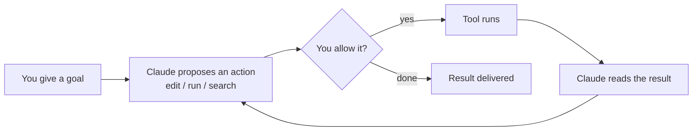

<LevelBadge level="beginner" />

<VerifyNote lastVerified="2026-06-20" source="https://code.claude.com/docs/en/overview">
I comandi di installazione e l'esatto insieme di funzionalità cambiano spesso. Considera la documentazione ufficiale di Claude Code come la fonte autorevole per la configurazione.
</VerifyNote>

<Callout type="objectives" items={["Spiegare cosa rende Claude Code agentico, non solo una finestra di chat", "Visualizzare il ciclo agentico: obiettivo, azione, permesso, osservazione, ripetizione", "Nominare le superfici su cui gira Claude Code e come le impostazioni ti seguono", "Ordinare le cose da configurare per leva, partendo da CLAUDE.md", "Ripercorrere la forma di una prima sessione sicura usando la Modalità Piano"]} />

**Claude Code** è lo strumento di coding *agentico* di Anthropic. A differenza di una finestra di chat, può davvero **fare cose nel tuo progetto**: leggere e modificare file, eseguire comandi shell, cercare nel codebase e richiamare strumenti esterni — tutto con il tuo permesso.

## Il modello mentale: un ciclo agentico

Questa è l'unica idea che fa quadrare tutto il resto. Dai un obiettivo in linguaggio naturale ("aggiungi i test per il modulo di autenticazione e correggi ciò che fallisce"). Claude **pianifica, agisce, osserva il risultato e ripete** finché l'obiettivo non è raggiunto. Tu mantieni il controllo tramite i [permessi](/docs/claude-code) e la [Modalità Piano](/docs/claude-code).

<Callout type="tip" items={["Il ciclo avanza solo sulle azioni che autorizzi. Niente viene modificato o eseguito senza passare per quel cancello dei permessi — ed è esattamente per questo che le sezioni successive contano."]} />

## Dove puoi eseguirlo

Lo stesso Claude Code ti segue tra le varie superfici — **condivide le tue impostazioni, hook e permessi** ovunque tu lavori.

- **Terminale (CLI)** — la superficie originale; funziona in qualsiasi shell.
- **Estensioni IDE** — VS Code e JetBrains, con diff inline.
- **Desktop e web** — e condivide le tue impostazioni, hook e permessi tra le varie superfici.

## Cosa configurerai (più o meno in ordine di leva)

Pensalo come una scala: padroneggia prima i gradini più alti, poi aggiungi le funzionalità avanzate solo quando emerge una vera necessità.

<Steps items={[{title: "CLAUDE.md", body: "Istruzioni di progetto persistenti. Impatto massimo, sforzo minimo — inizia da qui."}, {title: "Modalità Piano", body: "Investiga e proponi prima che venga eseguita qualsiasi modifica."}, {title: "Permessi", body: "Decidi cosa Claude può fare senza chiedere."}, {title: "settings.json", body: "Il sistema di configurazione completo che sta sotto a tutto."}, {title: "Funzionalità avanzate", body: "Comandi slash, hook, skill, subagent e server MCP — da aggiungere man mano che ne hai bisogno."}]} />

Ogni gradino rimanda alla propria lezione: [CLAUDE.md](/docs/claude-code), [Modalità Piano](/docs/claude-code), [Permessi](/docs/claude-code), [settings.json](/docs/claude-code), [Comandi slash](/docs/claude-code), [hook](/docs/claude-code), [skill](/docs/claude-code), [subagent](/docs/claude-code) e [server MCP](/docs/claude-code).

## La tua prima sessione (la sua forma)

<Steps items={[{title: "Installa e autenticati", body: "Consulta la documentazione ufficiale per i comandi attuali."}, {title: "Apri un progetto", body: "Esegui cd in un progetto e avvia Claude Code."}, {title: "Genera un CLAUDE.md iniziale", body: "Esegui /init per impalcare le tue istruzioni di progetto."}, {title: "Chiedi qualcosa di piccolo e concreto", body: "Prova: Spiega come funziona il routing in questa app."}, {title: "Fai prima una modifica in Modalità Piano", body: "Rivedi il piano proposto, poi lascialo eseguire."}]} />

Due comandi che vale la pena memorizzare da quella prima sessione:

<PromptCard title="Impalca le istruzioni di progetto">{`/init`}</PromptCard>

<PromptCard title="Una prima richiesta sicura, in sola lettura">{`Explain how routing works in this app.`}</PromptCard>

Per i comandi attuali di installazione e autenticazione, consulta la [documentazione ufficiale](https://code.claude.com/docs/en/overview).

<Callout type="tip" items={["Inizia in sola lettura. Per la tua prima attività reale, usa la Modalità Piano — Claude investiga e ti mostra un piano senza toccare i file. È il modo più sicuro per costruire fiducia."]} />

## I termini chiave a colpo d'occhio

<Flashcards title="Vocabolario di Claude Code" cards={[{front: "Strumento agentico", back: "Uno strumento che compie azioni nel tuo progetto — legge/modifica file, esegue comandi, cerca nel codice, richiama strumenti esterni — non solo una finestra di chat."}, {front: "Ciclo agentico", back: "Obiettivo in linguaggio naturale, poi Claude pianifica, agisce, osserva il risultato e ripete finché l'obiettivo non è raggiunto."}, {front: "Modalità Piano", back: "Claude investiga e propone un piano prima che venga eseguita qualsiasi modifica — il modo più sicuro per iniziare."}, {front: "CLAUDE.md", back: "Istruzioni di progetto persistenti. Impatto massimo, sforzo minimo; generate con /init."}, {front: "Permessi", back: "Il cancello di controllo: cosa Claude può fare senza chiederti prima."}]} />

<Quiz title="Mettiti alla prova" questions={[{q: "Cosa distingue Claude Code da una finestra di chat?", options: ["Scrive risposte più lunghe", "Può compiere azioni nel tuo progetto — modificare file, eseguire comandi, cercare nel codice — con il tuo permesso", "Funziona solo nel terminale"], answer: 1, explain: "Claude Code è agentico: agisce nel tuo progetto (legge/modifica file, esegue comandi shell, cerca, richiama strumenti), tutto con il tuo permesso."}, {q: "Nel ciclo agentico, cosa succede subito dopo che Claude propone un'azione?", options: ["Lo strumento viene eseguito automaticamente", "Decidi tu se autorizzarla", "Il risultato viene consegnato"], answer: 1, explain: "Ogni azione proposta passa per un cancello dei permessi — lo strumento viene eseguito solo se la autorizzi."}, {q: "Quale passo di configurazione ha l'impatto più alto con lo sforzo minore?", options: ["Server MCP", "Hook", "CLAUDE.md"], answer: 2, explain: "CLAUDE.md — istruzioni di progetto persistenti — è elencato per primo perché ha l'impatto più alto con lo sforzo minore."}]} />

<Callout type="takeaways" items={["Claude Code è agentico: agisce nel tuo progetto con il tuo permesso, non si limita a chiacchierare.", "Il ciclo è obiettivo, proporre, autorizzare, eseguire, osservare, ripetere — lo controlli tramite i permessi e la Modalità Piano.", "Gira nel terminale, in VS Code/JetBrains e su desktop e web, condividendo impostazioni, hook e permessi tra le superfici.", "Configura per leva: prima CLAUDE.md, poi Modalità Piano, Permessi, settings.json, infine le funzionalità avanzate.", "Avvia una prima sessione in sola lettura nella Modalità Piano per costruire fiducia prima di lasciar eseguire le modifiche."]} />

## Avanti

- La configurazione a più alta leva → [CLAUDE.md e file di memoria](/docs/claude-code)
- Fallo dall'inizio alla fine → [Tutorial: personalizza Claude Code per un repository reale](/docs/walkthroughs)
- Costruisci le tue automazioni → [Template e ricette](/docs/templates)
