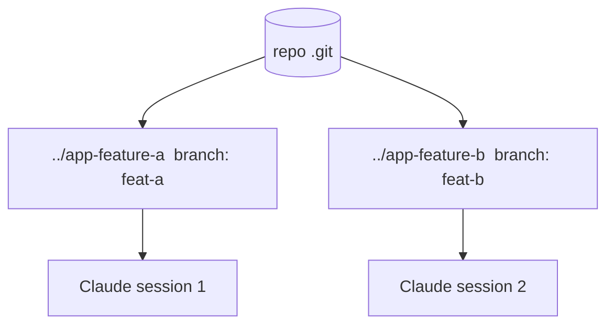

<LevelBadge level="advanced" />

<Callout type="objectives" items={["Cos'è un git worktree — un solo repository, più directory di lavoro, ciascuna sul proprio branch","Il problema preciso che risolve: impedire alle sessioni Claude parallele di collidere sugli stessi file","I quattro comandi per aggiungere, elencare e rimuovere i worktree","Quando la tecnica vale lo sforzo — e le tre insidie che mordono al momento del merge","Come i worktree si compongono con i subagent: parallelismo tra sessioni vs all'interno di una sola"]} />

Un **git worktree** permette a un singolo repository di avere **più directory di lavoro**, ciascuna con checkout su un branch diverso. Abbinalo a Claude Code e potrai eseguire **diverse sessioni in parallelo** sullo stesso progetto — ciascuna che modifica i propri file, senza collisioni.

## Il problema che risolve

Se due sessioni Claude modificano la stessa directory di lavoro contemporaneamente, si pestano i piedi a vicenda con le rispettive modifiche. I worktree danno a ogni sessione la **propria directory e il proprio branch**, così il lavoro parallelo resta isolato finché non fai il merge.

## Le basi

Quattro comandi reggono l'intero flusso di lavoro: aggiungere un worktree (nuova directory + nuovo branch), elencare quelli esistenti e rimuoverne uno quando hai finito.

<Steps items={[{title: "Aggiungi un worktree per una feature", body: "Dal tuo repository, git worktree add ../app-feature-a -b feat-a crea una nuova directory E un nuovo branch in un colpo solo."},{title: "Aggiungine un altro per un fix", body: "git worktree add ../app-fix-123 -b fix-123 — una seconda directory/branch isolata, affiancata alla prima."},{title: "Vedi cosa hai", body: "git worktree list mostra ogni directory di lavoro e il branch su cui si trova."},{title: "Fai pulizia quando hai finito", body: "git worktree remove ../app-feature-a smonta un worktree così le directory obsolete non si accumulano."}]} />

<PromptCard title="Il flusso di lavoro a quattro comandi">{`# from your repo
git worktree add ../app-feature-a -b feat-a   # new dir + new branch
git worktree add ../app-fix-123 -b fix-123
git worktree list
# when done with one:
git worktree remove ../app-feature-a`}</PromptCard>

Apri una sessione di Claude Code in ogni directory di worktree e lasciale lavorare in modo indipendente.

## Quando ne vale la pena

- **Feature/fix paralleli** che vuoi far avanzare contemporaneamente.
- **Un'attività lunga in esecuzione** in un worktree mentre continui a lavorare in un altro.
- **Esperimenti rischiosi** isolati dal tuo checkout principale.

## Insidie

<Callout type="warning" items={["Attenzione al merge-back: i branch alla fine verranno uniti — i conflitti emergono allora, non durante. Mantieni i worktree focalizzati e di breve durata.","Non eseguire risorse condivise con stato (un solo DB di sviluppo, una sola porta) da due worktree senza separarle.","Fai pulizia con git worktree remove così le directory obsolete non si accumulano."]} />

## Worktree contro subagent

Due assi diversi di parallelismo — non competono, si sommano.

| | Cosa parallelizza | Isolamento |
| --- | --- | --- |
| **[Subagent](/docs/claude-code/subagents)** | Lavoro *all'interno* di una sessione (delega) | Contesto isolato |
| **Worktree** | Lavoro *tra* sessioni su disco | Branch/file isolati |

Si compongono bene: una sessione in un worktree può a sua volta generare subagent.

<Callout type="tip" items={["Usa un worktree quando hai bisogno di due sessioni Claude che toccano lo stesso repository contemporaneamente; usa un subagent quando una sessione deve scaricare una porzione di lavoro in un contesto isolato."]} />

<Quiz title="Mettiti alla prova" questions={[{q: "Cosa ti dà un git worktree?", options: ["Più branch in un'unica directory di lavoro", "Più directory di lavoro per un solo repository, ciascuna sul proprio branch", "Una copia di backup della tua cartella .git"], answer: 1, explain: "Un git worktree permette a un singolo repository di avere più directory di lavoro, ciascuna con checkout su un branch diverso — così le sessioni parallele non collidono."}, {q: "Quale comando crea una nuova directory E un nuovo branch in un solo passaggio?", options: ["git worktree list", "git worktree add ../app-feature-a -b feat-a", "git worktree remove ../app-feature-a"], answer: 1, explain: "git worktree add ../app-feature-a -b feat-a crea insieme la nuova directory e il nuovo branch. list mostra i worktree esistenti; remove ne smonta uno."}, {q: "Quando emergono davvero i conflitti di merge dei worktree paralleli?", options: ["Continuamente, mentre entrambe le sessioni modificano", "Al momento del merge-back, non durante", "Mai, perché i branch sono isolati"], answer: 1, explain: "I branch restano isolati mentre lavori, quindi i conflitti non compaiono durante — emergono al merge-back. Mantieni i worktree focalizzati e di breve durata per limitarli."}, {q: "Come si relazionano worktree e subagent?", options: ["Sono la stessa funzionalità con due nomi", "I worktree parallelizzano tra sessioni su disco; i subagent parallelizzano all'interno di una sola sessione — e si compongono", "Devi sceglierne uno; usarli entrambi rompe l'isolamento"], answer: 1, explain: "I subagent sono parallelismo all'interno di una sola sessione (contesto isolato); i worktree sono parallelismo tra sessioni su disco (branch/file isolati). Una sessione in un worktree può a sua volta generare subagent."}]} />

<Callout type="takeaways" items={["Un git worktree = un solo repository, più directory di lavoro, ciascuna sul proprio branch — la base per sessioni Claude parallele senza collisioni.","Due sessioni su una sola directory di lavoro si pestano i piedi a vicenda; un worktree per sessione mantiene file e branch isolati finché non fai il merge.","git worktree add ../dir -b branch crea directory + branch; list li mostra; remove fa pulizia.","Ne vale la pena per feature/fix paralleli, attività di lunga durata accanto ad altro lavoro ed esperimenti rischiosi isolati.","Attenzione al merge-back, non condividere risorse con stato (DB, porta) tra i worktree e fai sempre pulizia — e ricorda che i worktree si compongono con i subagent."]} />

## Avanti

- [Subagent e agenti paralleli](/docs/claude-code/subagents)
- [Modalità headless e l'Agent SDK](/docs/claude-code/headless-and-agent-sdk)
- [Gestione del contesto](/docs/claude-code/context-management)
