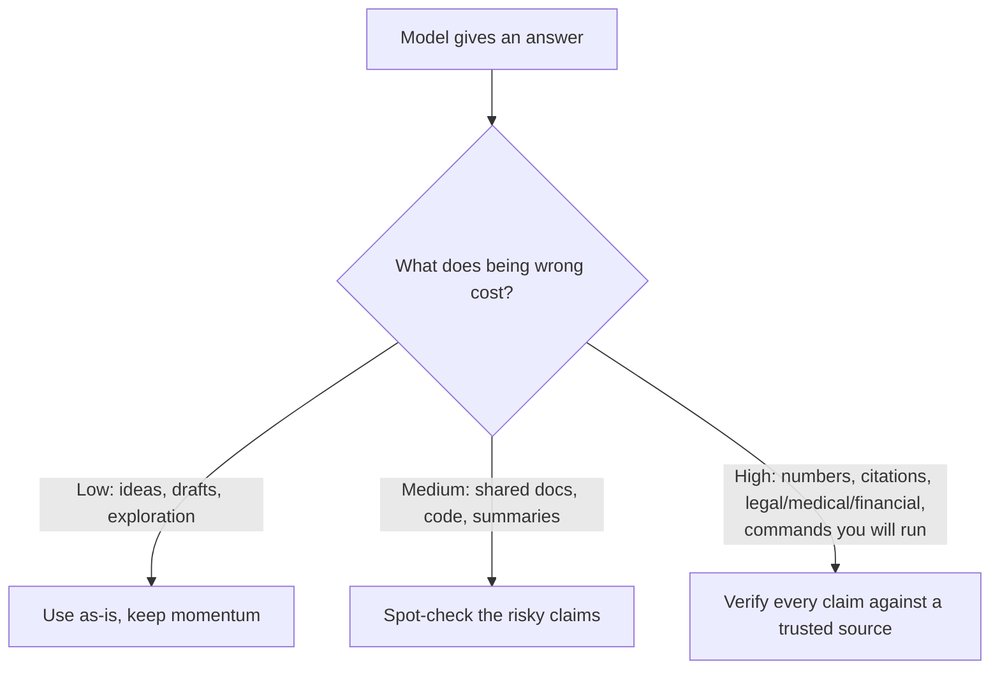

<LevelBadge level="intermediate" />

<Callout type="objectives" items={["Capire PERCHÉ i modelli inventano risposte sicure e ben formate", "Riconoscere le 5 zone ad alto rischio in cui essere più scettici", "Applicare una cassetta degli attrezzi in 6 parti per ridurre drasticamente le allucinazioni", "Usare un prompt anti-allucinazione pronto da copiare che àncora alle fonti, dà una via d'uscita e impone le citazioni", "Adottare la mentalità che adegua lo sforzo di verifica al costo dell'errore"]} />

Un'**allucinazione** è quando un modello afferma qualcosa di falso con totale sicurezza. Non sta mentendo e non è guasto: è il rovescio della medaglia di come funzionano gli LLM: generano testo *plausibile*, e plausibile non sempre significa vero (vedi [Cos'è un LLM?](/docs/foundations/what-is-an-llm)). Non puoi eliminarla del tutto con il prompt, ma puoi ridurla drasticamente e intercettare il resto.

## Perché succede

Il modello predice una continuazione probabile. Quando non "sa" qualcosa, la continuazione *dall'aspetto più probabile* è spesso una risposta sicura, ben formata — e sbagliata. Non c'è un segnale integrato di "non sono sicuro" a meno che tu non crei lo spazio perché ci sia.

<Callout type="tip" items={["La soluzione per la maggior parte delle allucinazioni è creare deliberatamente spazio per l'incertezza: dai al modello il permesso di dire che non lo sa."]} />

## Le zone ad alto rischio

Sii il più scettico possibile quando l'output riguarda:

- **Citazioni, virgolettati e riferimenti** — articoli inventati, URL falsi, citazioni attribuite male.
- **Numeri, date e statistiche specifici** — cifre plausibili ma inventate.
- **Fatti di nicchia o molto recenti** — al di là di ciò che il modello ha appreso in modo affidabile.
- **Dettagli di API e librerie** — metodi o parametri che non esistono.
- **Specifiche su persone e ambito legale/medico** — alta posta in gioco, facile sbagliare in modo sottile.

## La cassetta degli attrezzi per la riduzione

Combinali — ciascuno aiuta:

<Steps items={[
  {title: "Ancoralo alle fonti", body: "Incolla il testo sorgente e di' \"rispondi solo dal testo qui sopra; se non c'è, dillo.\" È l'idea centrale dietro la RAG (/docs/foundations/rag)."},
  {title: "Dagli una via d'uscita", body: "Consenti esplicitamente \"Se non sei sicuro, di' 'Non lo so'\": riduce drasticamente le ipotesi avanzate con sicurezza."},
  {title: "Chiedi ragionamento e citazioni", body: "\"Cita la frase esatta che supporta ogni affermazione.\" Le affermazioni non supportate diventano evidenti."},
  {title: "Abbassa la creatività", body: "Per i task fattuali dove il modello espone un controllo della temperatura, abbassala (vedi Controlli di campionamento su /docs/foundations/sampling-controls)."},
  {title: "Usa gli strumenti", body: "Per la matematica, dati attuali o ricerche, dai al modello una calcolatrice/ricerca/strumento (/docs/api/tool-use) invece di fidarti del ricordo."},
  {title: "Verifica incrociata", body: "Poni la stessa domanda in due modi, o fai criticare la prima risposta da un secondo passaggio."}
]} />

## Un prompt anti-allucinazione da copiare e incollare

Gran parte della cassetta degli attrezzi qui sopra si condensa in un unico wrapper riutilizzabile. Incolla la tua fonte dove indicato e poni la tua domanda: àncora la risposta, dà al modello una via d'uscita e impone le citazioni in un colpo solo:

<PromptCard title="Wrapper anti-allucinazione">{`You answer ONLY from the SOURCE below.
Rules:
- If the answer is not in the SOURCE, reply exactly: "Not stated in the source."
- After every claim, quote the exact sentence from the SOURCE that supports it.
- Do not add outside knowledge, estimates, or assumptions.

SOURCE:
"""
[paste the document, transcript, or data here]
"""

QUESTION: [your question]`}</PromptCard>

Perché funziona: la via di fuga "Not stated in the source" elimina la pressione a tirare a indovinare, e la regola di citare la frase rende impossibile nascondere qualsiasi affermazione non supportata. Togli il blocco SOURCE quando vuoi davvero la conoscenza propria del modello — ma a quel punto la verifica torna a carico tuo.

## La mentalità che ti protegge davvero

<Callout type="warning" items={["Nessun prompt rende l'output affidabile al 100%. Per qualsiasi cosa importante — un numero in un report, una citazione, un comando che eseguirai, un dettaglio medico/legale/finanziario — verificalo rispetto a una fonte affidabile. Tratta l'AI come una bozza rapida, non come autorità finale. Questo è il cuore dell'Uso responsabile (/docs/security/responsible-use)."]} />

Una regola semplice: **il costo di sbagliare determina la quantità di verifica.** Brainstorming? Fidati liberamente. Pubblicare una statistica? Verifica ogni volta.

<Callout type="takeaways" items={["Le allucinazioni sono un sottoprodotto della generazione basata sulla plausibilità, non un bug che puoi eliminare del tutto con il prompt.", "Sii più scettico con citazioni, numeri/date, fatti di nicchia o recenti, dettagli di API e specifiche su persone/legali/mediche.", "Combina la cassetta degli attrezzi: àncora alle fonti, dài una via d'uscita, pretendi citazioni, abbassa la temperatura, usa gli strumenti, fai verifiche incrociate.", "Un unico prompt wrapper àncora alle fonti + dà una via d'uscita + impone le citazioni in un colpo solo.", "Adegua lo sforzo di verifica al costo di sbagliare — fidati liberamente quando costa poco, verifica ogni affermazione quando ha conseguenze."]} />

<Quiz title="Mettiti alla prova" questions={[
  {
    q: "Perché i modelli hanno allucinazioni?",
    options: [
      "Stanno deliberatamente mentendo all'utente",
      "Predicono la continuazione dall'aspetto più plausibile, che non sempre è vera",
      "Sono guasti e vanno riaddestrati",
      "Esauriscono sempre la memoria a metà risposta"
    ],
    answer: 1,
    explain: "L'allucinazione è il rovescio della medaglia di come funzionano gli LLM: generano testo plausibile, e plausibile non sempre significa vero. Quando il modello non sa qualcosa, la continuazione dall'aspetto più probabile è spesso sicura, ben formata e sbagliata."
  },
  {
    q: "Quale tra queste è una zona ad alto rischio in cui dovresti essere più scettico?",
    options: [
      "Brainstorming aperto per generare idee",
      "Riformulare una frase che hai già scritto",
      "Numeri, date e statistiche specifici",
      "Chiedere una semplice definizione che puoi verificare al volo"
    ],
    answer: 2,
    explain: "Numeri, date e statistiche specifici sono una zona ad alto rischio: possono essere plausibili ma inventati. Altre zone ad alto rischio includono citazioni/virgolettati, fatti di nicchia o recenti, dettagli di API e specifiche su persone/legali/mediche."
  },
  {
    q: "Qual è l'effetto più diretto del dare al modello una via d'uscita esplicita come \"Se non sei sicuro, di' 'Non lo so'\"?",
    options: [
      "Rende il modello più veloce",
      "Riduce drasticamente le ipotesi avanzate con sicurezza",
      "Aumenta automaticamente la temperatura",
      "Collega il modello a una ricerca in tempo reale"
    ],
    answer: 1,
    explain: "Consentire esplicitamente al modello di dire che non lo sa toglie la pressione a produrre un'ipotesi avanzata con sicurezza, riducendo drasticamente le risposte allucinate."
  },
  {
    q: "Quale regola decide quanta verifica serve a una risposta?",
    options: [
      "La lunghezza della risposta",
      "Il livello di sicurezza dichiarato dal modello",
      "Il costo di sbagliare",
      "Quanto tempo è servito a scrivere il prompt"
    ],
    answer: 2,
    explain: "Il costo di sbagliare determina la quantità di verifica. Brainstorming? Fidati liberamente. Pubblicare una statistica? Verifica ogni volta."
  },
  {
    q: "Nel prompt wrapper anti-allucinazione, cosa rende impossibile nascondere qualsiasi affermazione non supportata?",
    options: [
      "Abbassare la temperatura a zero",
      "La regola di citare dopo ogni affermazione la frase esatta della SOURCE che la supporta",
      "Porre la domanda due volte",
      "Rimuovere il blocco SOURCE"
    ],
    answer: 1,
    explain: "La regola di citare la frase costringe il modello a sostenere ogni affermazione con una frase esatta della SOURCE, così qualsiasi affermazione non realmente supportata diventa evidente. La via di fuga \"Not stated in the source\" elimina la pressione a tirare a indovinare."
  }
]} />

## Prossimi passi

- [Retrieval-Augmented Generation (RAG)](/docs/foundations/rag)
- [Valutare la qualità dell'AI (Evals)](/docs/foundations/evals)
- [Uso responsabile, etica e verifica](/docs/security/responsible-use)
