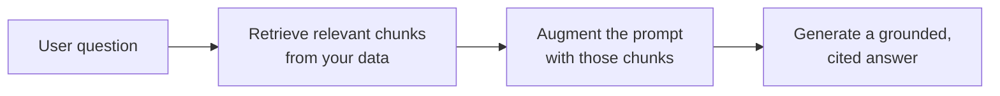

<LevelBadge level="intermediate" />

<Callout type="objectives" items={[
  "Cos'è il RAG e il ciclo recupera-arricchisci-genera",
  "Come indicizzare, recuperare, arricchire e generare con le citazioni",
  "Perché il RAG batte il fine-tuning per le esigenze di 'rispondi sui miei documenti'",
  "Le cinque modalità di fallimento che uccidono la qualità del RAG",
  "Un prompt di ancoraggio copia-e-incolla che chiude le due lacune più grandi"
]} />

Il **RAG** fa rispondere un modello a domande sui **tuoi** dati — documenti, una base di conoscenza, un codebase — su cui non è mai stato addestrato. L'idea è semplice: **recupera** i pezzi rilevanti, **arricchisci** il prompt con essi, poi **genera** una risposta ancorata a quei pezzi.

## Il ciclo

<Steps items={[
  {title: "Indicizza i tuoi dati", body: "Suddividi in chunk, crea i loro embedding (vedi /docs/foundations/embeddings) e memorizza in un indice vettoriale (e/o per parole chiave)."},
  {title: "Recupera", body: "Estrai i chunk più rilevanti per la domanda."},
  {title: "Arricchisci", body: "Inserisci quei chunk nel prompt con un'istruzione come \"Rispondi solo dal contesto qui sotto; se non c'è, dillo\"."},
  {title: "Genera", body: "Produci la risposta — e idealmente cita da quale chunk proviene ciascuna affermazione."}
]} />

Per il passaggio di embedding nell'indicizzazione, vedi [Embedding e ricerca vettoriale](/docs/foundations/embeddings).

## Perché il RAG invece del fine-tuning?

<Callout type="tip" items={[
  "Fresco: aggiorni i dati, non il modello",
  "Verificabile: fornisce citazioni",
  "Economico: molto più economico del riaddestramento"
]} />

Per la maggior parte delle esigenze "rispondi sui miei documenti", il RAG è il primo strumento giusto — vedi [Fine-tuning vs Prompting vs RAG](/docs/foundations/finetune-vs-prompt-vs-rag).

## Le modalità di fallimento (dove muore la qualità del RAG)

<Callout type="warning" items={[
  "Recupero scadente = risposta scadente. Se il chunk giusto non viene recuperato, il modello non può usarlo. La maggior parte dei problemi 'il RAG sbaglia' sono problemi di recupero.",
  "Un chunking troppo grossolano/fine rovina la rilevanza (vedi embedding).",
  "Nessuna istruzione di ancoraggio: il modello mescola i fatti recuperati con le proprie ipotesi. Digli di rispondere solo dal contesto e di ammettere le lacune.",
  "Inserire troppo: i chunk irrilevanti diluiscono il segnale e costano token. Recupera pochi chunk di alta qualità.",
  "Nessuna citazione: non puoi verificare, quindi non puoi fidarti."
]} />

Il fallimento del chunking si ricollega agli [embedding](/docs/foundations/embeddings), e l'eccesso di inserimento costa [token](/docs/foundations/tokens-and-context).

<Callout type="tip" items={[
  "Valuta il recupero separatamente: misura 'abbiamo recuperato il chunk giusto?' separatamente da 'il modello ha risposto bene?'. Localizza il problema in fretta. Vedi Evals (/docs/foundations/evals)."
]} />

## Copia-e-incolla: un prompt di ancoraggio

La singola correzione con la leva più alta è un'istruzione di ancoraggio. Inserisci i tuoi chunk recuperati in un template come questo — costringe il modello a rispondere *solo* dal contesto, a citare ciascuna affermazione e ad ammettere le lacune invece di tirare a indovinare:

<PromptCard title="Prompt di ancoraggio">{`You are answering strictly from the context below.

Rules:
- Use ONLY the context to answer. Do not use outside knowledge.
- Cite the source after each claim, like [chunk 2].
- If the answer is not in the context, reply exactly:
  "I don't have that in the provided sources."
- Quote numbers and names verbatim — never paraphrase a figure.

Context:
[chunk 1] ...
[chunk 2] ...
[chunk 3] ...

Question: <the user's question>`}</PromptCard>

Abbinalo a *pochi* chunk di alta qualità (non tutto ciò che hai recuperato) e chiudi le due lacune più grandi in un colpo solo: la fusione allucinata e le risposte non verificabili. Poi [valuta](/docs/foundations/evals) recupero e generazione separatamente, così sai quale metà mettere a punto.

## Padroneggia i termini

<Flashcards cards={[
  {front: "RAG", back: "Recupera i pezzi rilevanti dei tuoi dati, arricchisci il prompt con essi, poi genera una risposta ancorata a quei pezzi."},
  {front: "Passaggio di indicizzazione", back: "Suddividi i dati in chunk, crea i loro embedding, memorizza in un indice vettoriale e/o per parole chiave."},
  {front: "Passaggio di arricchimento", back: "Inserisci i chunk recuperati nel prompt con un'istruzione di ancoraggio: rispondi solo dal contesto, ammetti le lacune."},
  {front: "Perché il RAG invece del fine-tuning", back: "Fresco (aggiorni i dati, non il modello), fornisce citazioni, molto più economico del riaddestramento."},
  {front: "Modalità di fallimento n.1 del RAG", back: "Recupero scadente. Se il chunk giusto non viene recuperato, il modello non può usarlo — la maggior parte dei problemi 'il RAG sbaglia' sono problemi di recupero."},
  {front: "Istruzione di ancoraggio", back: "Di' al modello di rispondere SOLO dal contesto, di citare ciascuna affermazione e di dirlo quando la risposta non c'è."}
]} />

<Quiz title="Mettiti alla prova" questions={[
  {
    q: "Cosa rappresentano le tre lettere di RAG, in ordine?",
    options: ["Read, Analyze, Generate", "Retrieve, Augment, Generate", "Rank, Aggregate, Group", "Reduce, Append, Generate"],
    answer: 1,
    explain: "RAG = Retrieve (recupera) i chunk rilevanti, Augment (arricchisci) il prompt con essi, poi Generate (genera) una risposta ancorata."
  },
  {
    q: "Quando 'il RAG sbaglia', qual è più spesso il vero problema?",
    options: ["Il modello è troppo piccolo", "Il recupero — il chunk giusto non è stato estratto", "Troppo pochi token nella finestra di contesto", "Gli embedding sono soggetti a fine-tuning sbagliato"],
    answer: 1,
    explain: "Recupero scadente = risposta scadente. Se il chunk giusto non viene recuperato, il modello non può usarlo. La maggior parte dei problemi 'il RAG sbaglia' sono problemi di recupero."
  },
  {
    q: "Perché il RAG è solitamente preferito al fine-tuning per 'rispondi sui miei documenti'?",
    options: ["Rende il modello più grande", "Mantiene la conoscenza fresca, fornisce citazioni ed è più economico del riaddestramento", "Elimina la necessità di qualsiasi prompt", "Garantisce che il modello non abbia mai allucinazioni"],
    answer: 1,
    explain: "Il RAG mantiene la conoscenza fresca (aggiorni i dati, non il modello), fornisce citazioni ed è molto più economico del riaddestramento."
  },
  {
    q: "Qual è la singola correzione con la leva più alta per impedire al modello di mescolare i fatti con le ipotesi?",
    options: ["Recuperare ogni chunk possibile", "Un'istruzione di ancoraggio che costringe a rispondere solo dal contesto", "Aumentare la temperatura", "Saltare le citazioni per risparmiare token"],
    answer: 1,
    explain: "Un'istruzione di ancoraggio costringe il modello a rispondere solo dal contesto, a citare ciascuna affermazione e ad ammettere le lacune invece di tirare a indovinare."
  },
  {
    q: "Perché valutare il recupero separatamente dalla generazione?",
    options: ["È richiesto dal fornitore del modello", "Localizza il problema in fretta — sai quale metà mettere a punto", "Riduce automaticamente il costo dei token", "La generazione non può essere misurata altrimenti"],
    answer: 1,
    explain: "Misurare 'abbiamo recuperato il chunk giusto?' separatamente da 'il modello ha risposto bene?' localizza il problema in fretta e ti dice quale metà mettere a punto."
  }
]} />

<Callout type="takeaways" items={[
  "RAG = recupera i chunk rilevanti, arricchisci il prompt, genera una risposta ancorata e citata.",
  "Indicizza (chunk + embedding + memorizzazione), recupera i chunk migliori, arricchisci con un'istruzione di ancoraggio, genera con le citazioni.",
  "Preferisci il RAG al fine-tuning per il Q&A sui documenti: fresco, citato, più economico.",
  "La maggior parte dei fallimenti sono fallimenti di recupero — recupera pochi chunk di alta qualità, non tutto.",
  "Aggiungi sempre un'istruzione di ancoraggio e cita; valuta recupero e generazione separatamente."
]} />

## Prossimi passi

- [Embedding e ricerca vettoriale](/docs/foundations/embeddings)
- [Fine-tuning vs Prompting vs RAG](/docs/foundations/finetune-vs-prompt-vs-rag)
- [Playbook di ricerca e sintesi](/docs/playbooks/research)
