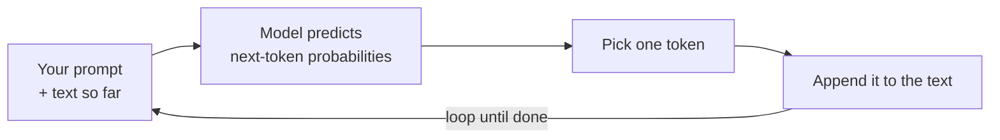

<LevelBadge level="beginner" />

Un **Large Language Model** (LLM) — la tecnologia dietro Claude — fa una cosa ingannevolmente semplice: legge il testo e **prevede cosa viene dopo**, un frammento alla volta. Tutto qui. Tutto il resto emerge dal farlo straordinariamente bene.

<Callout
  type="objectives"
  items={[
    "Cogliere il modello mentale in una frase: un LLM è un autocompletamento molto sofisticato",
    "Vedere come il modello costruisce una risposta un token alla volta, in un ciclo",
    "Capire perché questo meccanismo spiega sia i suoi punti di forza sia le sue stranezze",
    "Sapere cosa un LLM NON è — e come questo cambia il modo in cui lo usi"
  ]}
/>

## Il modello mentale in una frase

> Un LLM è un autocompletamento molto sofisticato che ha letto un'enorme quantità di testo e ha appreso gli schemi di come il linguaggio — e le idee al suo interno — tende a continuare.

Quando poni una domanda, il modello non sta "cercando" una risposta. Sta generando la continuazione più plausibile del tuo testo, token per token (vedi [Token e contesto](/docs/foundations/tokens-and-context)). Le continuazioni plausibili di una buona domanda sono di solito buone risposte — ed è per questo che tutto ciò funziona.

:::tip Analogia: la tastiera predittiva sotto steroidi
Pensa all'autocompletamento del tuo telefono che suggerisce la parola successiva. Ora immagina che avesse letto la maggior parte dei libri, degli articoli e del codice su internet — e che suggerisse non solo la parola successiva, ma un intero saggio, una traduzione o un programma adatto. Questa è l'intuizione dietro un LLM.
:::

## Un token alla volta

L'intero motore è un ciclo: leggi tutto ciò che c'è finora, prevedi il frammento successivo, aggiungilo, ripeti.

<Steps
  items={[
    {title: "Leggere", body: "Il modello prende in input il tuo prompt più tutto ciò che è stato generato finora come un unico blocco di testo."},
    {title: "Prevedere", body: "Calcola le probabilità su quale potrebbe essere il token successivo."},
    {title: "Scegliere", body: "Seleziona un token. Che questo sia deterministico o un po' casuale è ciò che regolano i controlli di campionamento come la temperatura."},
    {title: "Aggiungere e ripetere", body: "Il token scelto viene aggiunto al testo, e il testo leggermente più lungo rientra in input — ripetendo il ciclo finché la risposta non è completa."}
  ]}
/>

Ogni passo prevede sempre e soltanto **un** token, poi rimanda in input il testo leggermente più lungo. Il modello non ha un piano per l'intera risposta fin dall'inizio — la coerenza emerge dal fare questa previsione estremamente bene, migliaia di volte. Come si comporta il passo "scegli un token" (greedy oppure un po' casuale) è ciò che regolano i [controlli di campionamento](/docs/foundations/sampling-controls) come la temperatura.

## Perché questo spiega i suoi punti di forza

Poiché ha appreso schemi attraverso scrittura, codice e ragionamento, un LLM può **scrivere, riassumere, tradurre, spiegare e programmare** con fluidità — task che sono tutti "continua questo testo in modo sensato". Dagli una configurazione chiara e produce una continuazione solida. Ecco perché il [prompting](/docs/prompting/basics) conta così tanto: stai dando forma all'inizio del testo che continuerà.

## Perché questo spiega le sue stranezze

Lo stesso meccanismo spiega i lati ruvidi:

- **Può sbagliare con sicurezza.** Una continuazione dal suono fluente non è sempre veritiera — è l'[allucinazione](/docs/foundations/hallucinations).
- **Non "conosce" davvero i fatti di oggi** a meno che tu non glieli fornisca o disponga di uno strumento per cercarli.
- **Non ha memoria** tra le conversazioni a meno che tu non gliene dia una.

## Cosa un LLM **non** è

:::warning Adatta le tue aspettative e otterrai risultati migliori
- ❌ **Non è un database o un motore di ricerca.** Genera, non recupera record verificati.
- ❌ **Non è una calcolatrice.** Può ragionare sulla matematica ma non è garantito che sia esatto — dagli degli strumenti per quello.
- ❌ **Non è una persona.** Nessun sentimento, intenzione o memoria continua. È un potente motore di testo.
:::

Trattalo come un assistente brillante, veloce e colto che a volte ricorda male — e **verifica** ciò che conta.

## Termini chiave

<Flashcards
  title="Ripassa i concetti fondamentali"
  cards={[
    {front: "LLM (Large Language Model)", back: "La tecnologia dietro Claude. Legge il testo e prevede cosa viene dopo, un frammento alla volta."},
    {front: "Previsione del token successivo", back: "Il ciclo fondamentale: leggi il testo finora, prevedi il token successivo, aggiungilo, ripeti finché non è finito."},
    {front: "Token", back: "Il frammento di testo che il modello prevede a ogni passo. Il modello ne prevede sempre e soltanto uno alla volta."},
    {front: "Allucinazione", back: "Una continuazione dal suono fluente che però non è effettivamente vera — un effetto collaterale del generare, non del recuperare."},
    {front: "Campionamento / temperatura", back: "Controlla come si comporta il passo 'scegli un token' — greedy oppure un po' casuale."}
  ]}
/>

<Callout
  type="takeaways"
  items={[
    "Un LLM è un autocompletamento molto sofisticato — prevede il token successivo, non cerca una risposta",
    "La coerenza emerge dall'eseguire quel ciclo di previsione un token alla volta, migliaia di volte",
    "Lo stesso meccanismo spiega i suoi punti di forza (scrivere, riassumere, tradurre, spiegare, programmare) e le sue stranezze (sbaglia con sicurezza, niente fatti in tempo reale, niente memoria)",
    "Non è un database, una calcolatrice o una persona — verifica ciò che conta"
  ]}
/>

## Mettiti alla prova

<Quiz
  title="Mettiti alla prova"
  questions={[
    {
      q: "Cosa fa fondamentalmente un LLM quando gli poni una domanda?",
      options: [
        "Cerca la risposta in un database di fatti verificati",
        "Genera la continuazione più plausibile del tuo testo, un token alla volta",
        "Cerca sul web in tempo reale la risposta più recente"
      ],
      answer: 1,
      explain: "Un LLM non sta cercando nulla — genera la continuazione più plausibile del tuo testo, token per token."
    },
    {
      q: "Perché un LLM può sbagliare con sicurezza?",
      options: [
        "Una continuazione dal suono fluente non è sempre veritiera — è l'allucinazione",
        "Esaurisce la memoria a metà risposta",
        "Si rifiuta di rispondere alle domande che non conosce"
      ],
      answer: 0,
      explain: "Genera testo dal suono plausibile invece di recuperare record verificati, quindi una continuazione fluente può comunque essere falsa — è l'allucinazione."
    },
    {
      q: "Quale affermazione su un LLM è corretta?",
      options: [
        "È un motore di ricerca che recupera record verificati",
        "È una calcolatrice garantita esatta",
        "Non è una persona e non ha memoria continua tra le conversazioni a meno che tu non gliene dia una"
      ],
      answer: 2,
      explain: "Un LLM è un potente motore di testo — non un database, una calcolatrice o una persona. Non ha memoria tra le conversazioni a meno che tu non gliela fornisca."
    }
  ]}
/>

## Prossimi passi

- [Token, contesto e memoria](/docs/foundations/tokens-and-context)
- [Allucinazioni e come ridurle](/docs/foundations/hallucinations)
- [Basi del prompting](/docs/prompting/basics)
