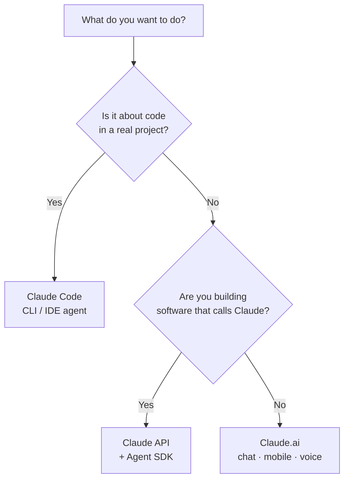

<LevelBadge level="beginner" />

"Claude" esiste in alcune varianti. Scegli in base a **ciò che stai cercando di fare**, non a quella di cui hai sentito parlare.

<Callout type="objectives" items={[
  "Associa il tuo obiettivo alla giusta interfaccia di Claude: chat, Claude Code o l'API",
  "Sappi quando mobile e voce entrano in gioco",
  "Capisci come le tre interfacce lavorano insieme man mano che cresci",
  "Fatti un'idea rapida di quale modello scegliere una volta che inizi a costruire"
]} />

## La decisione in 30 secondi

## Le tre interfacce a colpo d'occhio

| Interfaccia | Ideale per | Chi | Inizia qui |
|---|---|---|---|
| **Claude.ai** | Scrittura, ricerca, analisi, apprendimento, pianificazione, domande di tutti i giorni | Tutti, senza configurazione | [Primi passi con Claude.ai](/docs/claude-app/getting-started) |
| **Claude Code** | Lavorare *in una codebase* — leggere, modificare, eseguire comandi, sistemare i test | Sviluppatori (e i tecnicamente curiosi) | [Che cos'è Claude Code](/docs/claude-code/what-is-claude-code) |
| **API e Agent SDK** | App, automazioni e agenti che chiamano Claude in modo programmatico | Sviluppatori che distribuiscono un prodotto o una pipeline | [La tua prima chiamata API](/docs/api/first-call) |

### Claude.ai — le app di chat

Claude.ai è il punto di partenza senza configurazione per tutti. Lo ottieni anche su **mobile** ([iOS/Android](/docs/claude-app/mobile)) e tramite **[voce](/docs/claude-app/voice-mode)** — ottimo per catturare idee in movimento. Potenzialo con [Progetti](/docs/claude-app/projects), [istruzioni personalizzate](/docs/claude-app/custom-instructions) e [Artefatti](/docs/claude-app/artifacts).

### Claude Code — lo strumento di coding agentico

Claude Code lavora *dentro* il tuo progetto. Legge, modifica, esegue comandi e sistema i test — agendo sui tuoi file con il tuo permesso.

### L'API e l'Agent SDK — integra Claude nel tuo software

L'API e l'Agent SDK permettono al tuo software di chiamare Claude in modo programmatico, così puoi distribuire funzionalità IA, automazioni e agenti.

## Lavorano insieme

Non sono prodotti rivali — la maggior parte delle persone passa gradualmente dall'uno all'altro:

| Vuoi… | Usa |
|---|---|
| Scrivere una bozza di email, riassumere un PDF, fare brainstorming | Claude.ai (o voce/mobile) |
| Rifattorizzare un modulo, aggiungere test, sistemare un bug | Claude Code |
| Aggiungere una funzionalità IA alla *tua* app | L'API / Agent SDK |

:::tip Non sei sicuro? Inizia dalla chat
[Claude.ai](/docs/claude-app/getting-started) non richiede alcuna configurazione e ti insegna come "pensa" Claude. Le competenze si trasferiscono ovunque altro.
:::

## Quale modello, una volta che inizi a costruire?

Scegliere un'*interfaccia* è il primo passo. Quando passi a Claude Code o all'API, scegli anche un *modello* — Haiku, Sonnet o Opus. Rispondi a tre domande veloci e questo selettore ti suggerisce un punto di partenza:

<ModelPicker />

:::note Non fissare i nomi nel codice
Le gamme di modelli e i prezzi cambiano. Conferma sempre gli ID dei modelli attuali sulla pagina [Scegliere un modello Claude](/docs/api/choosing-a-model) prima di distribuire.
:::

## Mettiti alla prova

<Quiz title="Mettiti alla prova" questions={[
  {
    q: "Vuoi scrivere la bozza di un'email e riassumere un PDF — senza configurazione. Quale interfaccia?",
    options: ["Claude Code", "Claude.ai (chat / mobile / voce)", "L'API e l'Agent SDK"],
    answer: 1,
    explain: "Claude.ai è l'interfaccia di chat senza configurazione per scrittura, ricerca e domande di tutti i giorni — disponibile su web, mobile e tramite voce."
  },
  {
    q: "Devi rifattorizzare un modulo e sistemare test che falliscono dentro un progetto reale. Quale interfaccia?",
    options: ["Claude.ai", "Claude Code", "L'API e l'Agent SDK"],
    answer: 1,
    explain: "Claude Code lavora dentro la tua codebase — leggendo, modificando, eseguendo comandi e sistemando i test con il tuo permesso."
  },
  {
    q: "Dove dovresti confermare i nomi dei modelli e i prezzi attuali?",
    options: ["Questa pagina", "La pagina Scegliere un modello Claude", "Il diagramma Mermaid qui sopra"],
    answer: 1,
    explain: "Le gamme di modelli cambiano, quindi questa pagina non li fissa nel codice — controlla la pagina Scegliere un modello Claude per gli ID e i prezzi attuali."
  }
]} />

<Callout type="takeaways" items={[
  "Claude.ai: chat senza configurazione per scrittura, ricerca e lavoro di tutti i giorni — anche su mobile e tramite voce",
  "Claude Code: un agente che agisce dentro la tua codebase",
  "API e Agent SDK: integra Claude nel tuo software",
  "Si combinano — la maggior parte delle persone inizia dalla chat e passa gradualmente a Code e all'API",
  "Scegli un modello (Haiku / Sonnet / Opus) solo quando inizi a costruire, e verifica gli ID attuali prima di distribuire"
]} />

## Avanti

- [I tuoi primi 5 minuti](/docs/start-here/your-first-5-minutes)
- [Percorsi di apprendimento](/docs/start-here/learning-paths)
- [Scegliere un modello Claude](/docs/api/choosing-a-model) (una volta che inizi a costruire)
