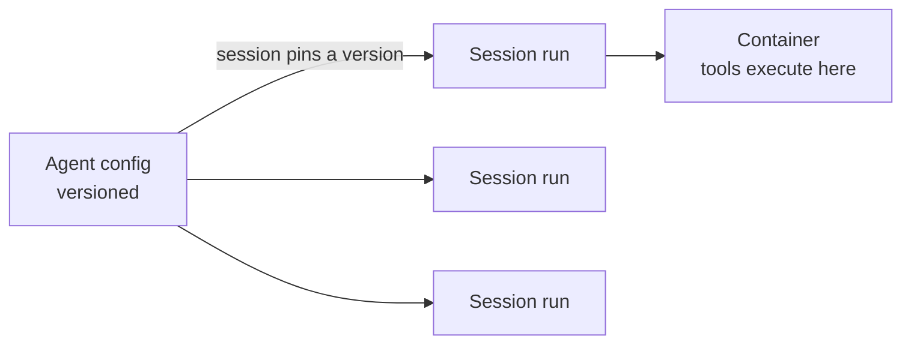

<LevelBadge level="advanced" />

<VerifyNote lastVerified="2026-06-26" source="https://docs.anthropic.com/en/docs/agents-and-tools">
マネージドエージェントの機能と提供状況は変化します。API はベータ版です。これを基盤に構築する前に、公式ドキュメントでエンドポイント、フィールド名、アクセス権を確認してください。
</VerifyNote>

<Callout type="objectives" items={["マネージド (Anthropic ホスト) のエージェントループが何を肩代わりしてくれるかを理解する", "2 つの中核オブジェクトを区別する: バージョン管理された Agent と実行ごとの Session", "Vault でシークレットを安全に注入する — モデルにそれを一度も見せることなく", "Scheduled Deployments でエージェントを cron スケジュールに乗せる — ホストすべきスケジューラ不要", "マネージドがカスタムループに勝る場面と、それでも適用されるガードレールを知る"]} />

[自前のエージェントループを構築する](/docs/api/building-agents)のが、あなたが所有したいよりも多くのインフラを伴うなら、**マネージド** (Anthropic ホスト) なエージェントがループをあなたの代わりに実行します。そのためあなたは、セッションの配管、リトライ、状態、スケジューリングではなく、エージェントの*仕事*に集中できます。

## 2 つのオブジェクト: Agent と Session

これは他のすべてが依拠するメンタルモデルです。これらは意図的に分離されています。

- **Agent** は*永続化された、バージョン管理された設定*です — モデル、システムプロンプト、ツール、MCP サーバー、スキル。一度作成します。更新するたびに新しいイミュータブルなバージョンが作成されます。
- **Session** は*ランタイムインスタンス*です — ID でエージェントを指す 1 回の実行。設定はエージェントに存在し、セッションには決して存在しません。

<Callout type="tip">
セッションは作成時のエージェントバージョンに**ピン留め**されます: 実行中のセッションは自身のバージョンを保持し、新しいセッションは最新のものを取得します。これが、進行中の作業を壊さずに設定変更を出荷する方法です。
</Callout>

## 「マネージド」が手に入れてくれるもの

ループを手作りしてホストする代わりに、ホストされたビルディングブロックが手に入ります:

- **Sessions** — 実行ごとに作成して再開する永続的な実行。SSE 経由でイベントをストリーミングします。
- **Environments** — コンテナインフラ。`cloud` (Anthropic ホスト) か `self_hosted` (ツールは自分の VPC 内で実行される) のいずれか。セッションごとに 1 つのコンテナがエージェントのワークスペースです。
- **Memory stores** — セッションをまたいだ永続的な状態。バージョン管理と編集 (redaction) 付きで、データベースを自分で配線する必要はありません。
- **Vaults** — MCP 認証やその他のサービス向けのシークレット。
- **Scheduled deployments** — cron スケジュールで無人実行されるエージェント。

<PromptCard title="エージェント (バージョン管理された設定) を作成し、それに対してセッションを実行する">{`# 1. Create the agent once
POST /v1/agents        -> returns $AGENT_ID
# 2. Each execution is a session pinned to that agent
POST /v1/sessions      { "agent": "$AGENT_ID" }`}</PromptCard>

## Vaults: モデルが決して見ないシークレット

自律的なエージェントはしばしば API キーを必要とします — しかし*モデル*はそれを決して読むべきではありません。Vault の資格情報 (`mcp_oauth`、`static_bearer`、`environment_variable`) は egress で置換されます: `environment_variable` 資格情報は実行時にサンドボックスへ注入され、モデルには*決して見えません*。

<Callout type="warning">
これは、エージェントに強力なアクセス権を与えるための安全なパターンです。キーをシステムプロンプトやメッセージに貼り付けないでください — それらはモデル (そしてあなたのログ) が見られるコンテキストの一部になります。ボールトに入れてください。
</Callout>

## Scheduled deployments: cron 上のエージェント

**deployment** はエージェントに cron スケジュールを取り付けます。スケジュールが発火すると、新しいセッションを開始してタスクを完了します — あなたが構築したりホストしたりするスケジューラは不要です。夜次のデータ同期、週次のコンプライアンススキャン、毎日のダイジェストに最適です。

<Steps items={[
  {title: "スケジュールを定義する", body: "POST /v1/deployments に agent、environment_id、initial_events (user.message を含む必要がある)、そして schedule を指定する: POSIX cron 式と IANA タイムゾーン。"},
  {title: "発火ごと = 1 回の実行", body: "トリガー試行ごとに run レコード (drun_ プレフィックス) が作成されます。成功には session_id が伴い、失敗には error.type (例: environment_archived、session_rate_limited) が伴います。GET /v1/deployment_runs?deployment_id=... で実行を一覧します。"},
  {title: "ライフサイクルを制御する", body: "Pause は将来のトリガーを抑制します (手動実行は依然として機能します); unpause は次の発生時に再開し、見逃したトリガーをバックフィルしません; archive は終端です。"},
  {title: "オンデマンドでトリガーする", body: "POST /v1/deployments/{id}/run は直ちにセッションを開始します — 一時停止中でも — trigger_context.type: manual で。"}
]} />

<PromptCard title="週次のコンプライアンススキャン、ニューヨーク時間で金曜の 20:00">{`POST /v1/deployments
{
  "name": "Weekly compliance scan",
  "agent": "$AGENT_ID",
  "environment_id": "$ENVIRONMENT_ID",
  "initial_events": [
    {"type": "user.message", "content": [{"type": "text", "text": "Run the compliance scan and summarize findings."}]}
  ],
  "schedule": {"type": "cron", "expression": "0 20 * * 5", "timezone": "America/New_York"}
}`}</PromptCard>

<Callout type="tip">
Cron は `minute hour day-of-month month day-of-week` で、分単位の粒度です。DST は壁時計のセマンティクスを使います: 春の前進で存在しない時刻はスキップされ、秋の後退で 2 回発生する時刻は 2 回発火します。機微なものについては、それらの端を避けるタイムゾーンと時刻を選んでください。
</Callout>

## マネージドとカスタムをいつ選ぶか

| **マネージド**を選ぶのは… | **カスタムループ / SDK** を選ぶのは… |
|---|---|
| ホスティング、状態、スケジューリング、シークレットを処理してほしいとき | ループとツールを完全に制御する必要があるとき |
| 素早くプロトタイピングしているとき | 厳格なカスタムインフラ/コンプライアンス要件があるとき |
| 制御よりも運用のシンプルさが重要なとき | 自分のスタックに深く組み込んでいるとき |

これはスペクトラムです — 単一呼び出し → ワークフロー → カスタムエージェント (SDK) → マネージド。タスクが許す限りシンプルに始めましょう。必要になったときだけ上に移行してください。

## 同じガードレールが適用される

ホストされていようといまいと、自律的なエージェントは依然としてアクションを取ります。**最小権限**、**コスト/反復の上限**、**リスクのあるステップへの人間の承認**を維持してください — [エージェントのセキュリティ確保](/docs/security/securing-agents)と[自律実行のハードニング](/docs/security/hardening-autonomous-runs)を参照。

<Callout type="takeaways" items={["マネージドエージェントはループ、セッション、環境、メモリ、ボールト、スケジューリングを肩代わりするので、あなたは仕事に集中できる", "Agent はバージョン管理された設定であり、Session はバージョンにピン留めされた 1 回の実行である — 設定はセッションではなくエージェントに存在する", "Vault の environment_variable 資格情報は実行時に注入され、モデルには決して見えない — エージェントにシークレットを与える安全な方法", "スケジュールされたデプロイメントは cron 式 + IANA タイムゾーンである; 発火ごとに実行が作成され、unpause は見逃したトリガーをバックフィルしない", "マネージドは 単一呼び出し -> ワークフロー -> カスタム -> マネージド のホストされた端に位置する; 自律性のガードレールは依然として適用される"]} />

## 自分でチェック

<Quiz title="自分でチェック" questions={[
  {
    q: "Agent と Session の違いは何ですか?",
    options: [
      "同じオブジェクトの 2 つの名前である",
      "Agent はバージョン管理された設定であり、Session はエージェントバージョンにピン留めされる 1 回のランタイム実行である",
      "Session がモデルとシステムプロンプトを保持し、Agent は単なる ID である",
      "Agent がツールを実行し、Session がシークレットを保存する"
    ],
    answer: 1,
    explain: "Agent は永続化された、バージョン管理された設定 (モデル、プロンプト、ツール、MCP、スキル) です。Session は、エージェントを参照し作成時にそのバージョンにピン留めされる、実行ごとのインスタンスです。"
  },
  {
    q: "マネージドエージェントが必要とする API キーをどのように与えるべきですか?",
    options: [
      "エージェントが読めるようにシステムプロンプトに入れる",
      "セッションの最初のユーザーメッセージで渡す",
      "vault 資格情報として保存し、実行時に注入してモデルには決して見えないようにする",
      "ツール定義にハードコードする"
    ],
    answer: 2,
    explain: "Vault 資格情報 (例: environment_variable タイプ) は egress で置換され、モデルには決して見えません — プロンプトやメッセージ内のキーは見えるコンテキストの一部になります。"
  },
  {
    q: "スケジュールされたデプロイメントが 2 日間一時停止され、その後一時停止解除されました。一時停止中に発火するはずだったトリガーはどうなりますか?",
    options: [
      "バックフィルされる — 見逃したすべての実行が一時停止解除時に実行される",
      "バックフィルされない; デプロイメントは単に次のスケジュールされた発生時に再開する",
      "デプロイメントは自動的にアーカイブされる",
      "見逃したすべての実行がキューに入れられ、1 分間隔で実行される"
    ],
    answer: 1,
    explain: "Unpause は次の発生時に再開し、見逃したトリガーをバックフィルしません。(一時停止中でも、手動トリガーでいつでも実行を強制できます。)"
  }
]} />

## 次へ

- [API 上でのエージェント構築](/docs/api/building-agents)
- [Cowork とエージェントチーム](/docs/api/cowork-and-agent-teams)
- [ヘッドレスモードと Agent SDK](/docs/claude-code/headless-and-agent-sdk)
- [エージェントのセキュリティ確保](/docs/security/securing-agents)
