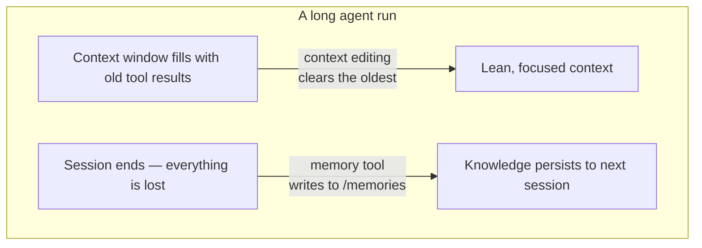

import Tabs from '@theme/Tabs';
import TabItem from '@theme/TabItem';

<LevelBadge level="advanced" />

<VerifyNote lastVerified="2026-06-26" source="https://platform.claude.com/docs/en/agents-and-tools/tool-use/memory-tool">
両機能はベータ版です。ツールタイプの文字列、ベータヘッダー、デフォルト値、報告されているベンチマークの改善値は変わります — これらを土台にする前に、公式の memory-tool とコンテキスト編集のドキュメントで確認してください。
</VerifyNote>

長時間動作するエージェントには2つの敵があります。会話が終わった瞬間に学んだことを**忘れ**てしまうこと、そしてコンテキストウィンドウが古いツール出力で**埋め尽くされ**、あふれてしまうことです。Anthropic はそれぞれに対応するプリミティブを1つずつ提供しています — **memory tool**（永続化）と**コンテキスト編集**（整理） — そしてこれらは一緒に使われるように設計されています。

<Callout type="objectives" items={["memory tool とは何か — Anthropic ではなく、あなたが実装する /memories にあるクライアント側のファイルストアであること", "ハンドラーが応答しなければならない6つのコマンド: view, create, str_replace, insert, delete, rename", "配線する際にパストラバーサルの検証が譲れない理由", "コンテキストがトークンのしきい値を超えると、コンテキスト編集がどのように古いツール結果を自動的に削除するか", "両方を1つのベータヘッダーの下で組み合わせる方法と、キャッシングおよび順序に関する落とし穴"]} />

## 2つの問題、2つのツール



2つのアイデアを頭の中で分けておきましょう。

- **memory tool** = *セッションをまたいだ永続化*。Claude がファイルを読み書きし、**あなた**がそれを保存します。
- **コンテキスト編集** = *セッション内での整理*。API は、プロンプトが Claude に届く前に、古いツール結果を削除します。

このページは、コストの面では [Prompt Caching](/docs/api/prompt-caching) と[トークンエコノミー](/docs/power-user/token-economy)と対になり、*なぜ*の面では [Context Engineering](/docs/frontiers/context-engineering) と[長時間動作するエージェントハーネス](/docs/frontiers/long-running-agent-harnesses)と対になります。

<Flashcards title="メモリとコンテキストの用語" cards={[{front:"memory tool","back":"Claude が /memories ディレクトリ内でファイルを作成・読み取り・更新・削除できるようにするクライアント側のツール（タイプ memory_20250818）。ストレージのバックエンドはあなたが実装します。"},{front:"/memories","back":"すべてのメモリ操作が限定される唯一のディレクトリ。すべてのパスは、その内部にとどまることを検証しなければなりません。"},{front:"コンテキスト編集","back":"トークンのしきい値を超えると、プロンプトから古いツール結果を削除するサーバー側の戦略 — 完全な履歴は依然としてあなたのクライアント上に残ります。"},{front:"clear_tool_uses_20250919","back":"最も古いツール結果を削除し、それらが整理されたことを Claude が分かるようプレースホルダーに置き換えるコンテキスト編集戦略。"},{front:"コンパクション","back":"コンテキスト上限の近くで会話全体を要約する、別個のサーバー側機能 — クライアント側のコンテキスト編集を補完します。"}]} />

## memory tool は*あなた*が実装するツール

ここでつまずく人がいます。memory tool を有効にしても、Anthropic がホストするストレージは得られ**ません**。これは**クライアント側**のツールです。Claude は `view` や `create` のようなツール呼び出しを発行し、あなたのアプリケーションが、選択した任意のバックエンド（ローカルファイル、データベース、暗号化されたブロブ、クラウドストレージ）に対してそれらを実行し、結果を返します。バイトがどこに存在するかはあなたが所有します（これが、[Zero-Data-Retention](/docs/foundations/privacy) の対象となる理由でもあります）。

ツールが有効になると、Anthropic は、**他のことをする前にメモリディレクトリを確認する**よう Claude に指示し、コンテキストがリセットされても何も失われないよう作業中に進捗を記録するよう指示するシステム命令を注入します。

### ステップ 1 — ツールを有効にする

ツールをリクエストに追加します。タイプ文字列は日付付きバージョンの `memory_20250818` です。

<Tabs groupId="lang">
<TabItem value="python" label="Python">

```python
import anthropic

client = anthropic.Anthropic()

message = client.messages.create(
    model="claude-opus-4-8",
    max_tokens=2048,
    messages=[{"role": "user", "content": "Help me respond to this support ticket."}],
    tools=[{"type": "memory_20250818", "name": "memory"}],
)

print(message)
```

</TabItem>
<TabItem value="typescript" label="TypeScript">

```typescript
import Anthropic from "@anthropic-ai/sdk";

const anthropic = new Anthropic();

const message = await anthropic.messages.create({
  model: "claude-opus-4-8",
  max_tokens: 2048,
  messages: [{ role: "user", content: "Help me respond to this support ticket." }],
  tools: [{ type: "memory_20250818", name: "memory" }],
});

console.log(message);
```

</TabItem>
</Tabs>

公式 SDK にはメモリのヘルパーが付属しているので、ツールインターフェースを自前で組み立てる必要はありません — `BetaAbstractMemoryTool`（Python、C#）をサブクラス化するか、`betaMemoryTool`（TypeScript）を使うか、`BetaMemoryToolHandler`（Java）を実装します。これらは、ストレージを差し込めるクリーンなフックを提供します。

### ステップ 2 — 6つのコマンドに応答する

ハンドラーはこれらを実装しなければなりません。Claude が期待して返ってくる文字列は厳密です — モデルが結果を正しく解釈できるよう、それらに一致させてください。

<Steps items={[{title: "view", body: "ディレクトリの一覧を返す（最大2階層分の深さのファイルを、人間が読めるサイズ付きで）か、ファイルの内容を1始まりの行番号付きで返します。一部を読むためのオプションの view_range が使えます。"},{title: "create", body: "file_text から新しいファイルを書き込みます。すでに存在する場合は、黙って上書きするのではなくエラーにします。"},{title: "str_replace", body: "厳密に一致する old_str を new_str に置換します。old_str が見つからない場合、または複数回出現する場合（あいまい）は拒否し、行番号を報告します。"},{title: "insert", body: "insert_line に insert_text を挿入します。行が [0, n_lines] の範囲内であることを検証します。"},{title: "delete", body: "ファイルを削除するか、ディレクトリとその内容を再帰的に削除します。"},{title: "rename", body: "パスを移動・リネームします。宛先がすでに存在する場合は拒否します — 決して上書きしません。"}]} />

ディレクトリの実際の `view` は、次のようなものを返します — モデルが解析するよう訓練されている、リテラルなヘッダーとタブ区切りのサイズに注目してください。

```text
Here're the files and directories up to 2 levels deep in /memories, excluding hidden items and node_modules:
4.0K	/memories
1.5K	/memories/customer_service_guidelines.xml
2.0K	/memories/refund_policies.xml
```

### ステップ 3 — パスをロックダウンする（これを飛ばさないこと）

memory tool により、モデルは任意のパス文字列を発行できます。汚染された会話やプロンプトインジェクションのペイロードは、`/memories` から脱出して、あなたのマシン上の他の場所にあるファイルを読んだり上書きしたりしようとする可能性があります。入ってくるすべてのパスを敵対的なものとして扱ってください。

<Callout type="warning" items={["/memories の内部に解決されないパスはすべて拒否します。","チェックの前に正規化します — Python では Path(p).resolve() の後に、.relative_to(memories_root) が例外を発生させないことを確認します。","../、..\\、および %2e%2e%2f のような URL エンコードされたトラバーサルをブロックします。","暴走したエージェントがディスクを使い果たしたり次のプロンプトを膨張させたりできないよう、ファイルサイズと読み取り長さに上限を設けます。"]} />

このバリデーターがすべての決め手です — 他の何をリリースするよりも前に、これを固定してテストしてください。

<PromptCard title="パストラバーサルガード（Python）">{`from pathlib import Path

MEMORY_ROOT = Path("/srv/agent/memories").resolve()

def safe_path(requested: str) -> Path:
    # Map the model's /memories/... onto your real root, then prove containment.
    rel = requested.removeprefix("/memories").lstrip("/")
    candidate = (MEMORY_ROOT / rel).resolve()
    candidate.relative_to(MEMORY_ROOT)  # raises ValueError if it escaped
    return candidate`}</PromptCard>

## コンテキスト編集はウィンドウのあふれを防ぐ

メモリは*忘却*を解決します。その逆の問題 — 40回前のウェブ検索からの古い `tool_result` ブロックで詰まったコンテキストウィンドウ — を解決するのが**コンテキスト編集**です。プロンプトがトークンのしきい値を超えると、API は、プロンプトがモデルに送られる前に、**最も古い**ツール結果を削除します（それらが削除されたことを Claude が分かるよう短いプレースホルダーに置き換えます）。あなたのクライアントは完全で未編集の履歴を保持します。トリミングされるのはモデルに届くものだけです。

これはベータヘッダーに乗ります。

```text
anthropic-beta: context-management-2025-06-27
```

`context_management.edits` 配列で設定します。主な戦略は `clear_tool_uses_20250919` です。

<Tabs groupId="lang">
<TabItem value="python" label="Python">

```python
message = client.beta.messages.create(
    model="claude-opus-4-8",
    max_tokens=2048,
    betas=["context-management-2025-06-27"],
    messages=[...],
    tools=[{"type": "memory_20250818", "name": "memory"}],
    context_management={
        "edits": [
            {
                "type": "clear_tool_uses_20250919",
                "trigger": {"type": "input_tokens", "value": 30000},  # start clearing past 30k
                "keep": {"type": "tool_uses", "value": 3},            # always keep the last 3
                "clear_at_least": {"type": "input_tokens", "value": 5000},
                "exclude_tools": ["memory"],                          # never clear memory calls
                "clear_tool_inputs": False,                           # keep the call args, drop results
            }
        ]
    },
)
```

</TabItem>
<TabItem value="typescript" label="TypeScript">

```typescript
const message = await anthropic.beta.messages.create({
  model: "claude-opus-4-8",
  max_tokens: 2048,
  betas: ["context-management-2025-06-27"],
  messages: [...],
  tools: [{ type: "memory_20250818", name: "memory" }],
  context_management: {
    edits: [
      {
        type: "clear_tool_uses_20250919",
        trigger: { type: "input_tokens", value: 30000 },
        keep: { type: "tool_uses", value: 3 },
        clear_at_least: { type: "input_tokens", value: 5000 },
        exclude_tools: ["memory"],
        clear_tool_inputs: false,
      },
    ],
  },
});
```

</TabItem>
</Tabs>

各ノブの意味:

| パラメータ | デフォルト | 何を制御するか |
|-----------|---------|------------------|
| `trigger` | 100,000 入力トークン | 削除が始まるタイミング |
| `keep` | 3 tool uses | 最近のツール使用／結果のペアをいくつ常に保持するか |
| `clear_at_least` | なし | 1回の発動あたり解放される最小トークン数 — キャッシュの無効化が本当に見合うよう使います |
| `exclude_tools` | なし | 決して削除されないツール（例: `memory`、`web_search`） |
| `clear_tool_inputs` | `false` | 結果だけでなく、ツールの*呼び出し引数*も削除するかどうか |

レスポンスは、`context_management.applied_edits` の下で何をしたかを伝えます — 例えば `cleared_tool_uses` や `cleared_input_tokens` — ので、どれだけ回収されたかをログに記録できます。

兄弟戦略として、古い[拡張思考](/docs/api/thinking-and-effort)ブロックを整理する `clear_thinking_20251015` があります。両方を使う場合は、`edits` 配列で**`clear_thinking_20251015` を先にリストしてください**。

<Callout type="tip" items={["ツール結果の削除は、その削除地点におけるプロンプトキャッシュのプレフィックスを無効化します — clear_at_least と組み合わせて、意味のある量を解放するときだけその無効化のコストを払うようにします。","exclude_tools: [\"memory\"] が通常の手段です。エージェント自身のノートは永続化させたく、古い検索結果と一緒に流し去られたくはないからです。","コンテキスト編集（クライアント側のトリミング）とコンパクション（サーバー側の要約）は別個の機能です — 非常に長い実行では両方を重ねて使えます。"]} />

## なぜ両方を組み合わせるのか — 数値

両方を一緒に使うと、エージェントは単一のコンテキストウィンドウをはるかに超えて実行できます。コンテキスト編集がライブのウィンドウを軽量に保ち、重要なものは削除される前にメモリに書き込まれます。Anthropic は、メモリとコンテキスト編集を組み合わせることで、エージェント検索の評価で **39% の改善**が得られ、コンテキスト編集だけでも100ターンのウェブ検索テストでトークン使用量を **84%** 削減したと報告しています。

<VerifyNote lastVerified="2026-06-26" source="https://www.anthropic.com/news/context-management">
これらのパーセンテージは Anthropic 自身のベンチマーク数値であり、特定の評価セットアップを反映しています — あなたのワークロードに対する保証ではなく、方向性を示すものとして扱ってください。context-management のアナウンスメントで確認してください。
</VerifyNote>

## うまくいくパターン: マルチセッションのプロジェクトログ

メモリの最もきれいな使い方は、その場限りでファイルを書くのではなく、意図的にブートストラップすることです。

<Steps items={[{title: "イニシャライザーセッション", body: "実際の作業の前に、進捗ログ、機能チェックリスト、そしてプロジェクトが必要とする起動スクリプトを指すノートを書きます。"},{title: "後続の各セッションは、それらのファイルを読むことで始まる", body: "数秒でプロジェクトの完全な状態を回復します — コードベースを再探索したり決定をたどり直したりする必要はありません。"},{title: "各セッションは、ログを更新して閉じる", body: "何が完了し、次に何をするかを記録し、次のセッションが正確な出発点を持てるようにします。"},{title: "一度に1つの機能、検証済みで", body: "コードが書かれた後だけでなく、エンドツーエンドの検証が済んだ後にのみ機能を完了とマークします — そうすればログは信頼できるものであり続けます。"}]} />

## 理解度を確認する

<Quiz questions={[{q:"memory tool のデータは実際にはどこに保存されますか？",options:["Anthropic のサーバー上で、あなたのために管理される","あなた自身のインフラ内 — ツールはクライアント側で、バックエンドはあなたが実装する","モデルの重みの中","プロンプトキャッシュの中"],answer:1,explain:"memory tool はクライアント側です。Claude がツール呼び出しを発行し、あなたのアプリが、あなたが制御し /memories に限定されたストレージに対してそれらを実行します。"},{q:"コンテキスト編集の clear_tool_uses_20250919 戦略は何を削除しますか？",options:["システムプロンプト","最も新しいツール結果","トークンのしきい値を超えると、最も古いツール結果","すべてのユーザーメッセージ"],answer:2,explain:"トリガーのしきい値を超えた後、最も古いツール結果から削除し、最も新しいもの（デフォルト: 直近3つ）を保持し、完全な履歴はあなたのクライアント上に残します。"},{q:"memory tool が受け取るすべてのパスを検証しなければならないのはなぜですか？",options:["ディスク容量を節約するため","../ のような入力を通じた /memories からのディレクトリトラバーサルの脱出を防ぐため","モデルを高速化するため","Anthropic が長いパスを拒否するため"],answer:1,explain:"悪意のあるパスや注入されたパスは、/memories の外にあるファイルを読んだり上書きしたりしようとする可能性があります。動作する前にパスを正規化し、メモリルートの内部にとどまることを証明してください。"}]} />

## 出典とさらなる参考資料

- [memory tool — Claude API ドキュメント](https://platform.claude.com/docs/en/agents-and-tools/tool-use/memory-tool) — ツールタイプ `memory_20250818`、6つのコマンド、そしてセキュリティガイダンス。
- [コンテキスト編集 — Claude API ドキュメント](https://platform.claude.com/docs/en/build-with-claude/context-editing) — `context-management-2025-06-27` ベータ、戦略フィールド、そしてデフォルト値。
- [Claude Developer Platform でのコンテキスト管理](https://www.anthropic.com/news/context-management) — 39% / 84% のベンチマーク数値が載ったアナウンスメント。
- [AI エージェントのための効果的なコンテキストエンジニアリング](https://www.anthropic.com/engineering/effective-context-engineering-for-ai-agents) — メモリがそのために作られたジャストインタイム取得パターン。
- [長時間動作するエージェントのための効果的なハーネス](https://www.anthropic.com/engineering/effective-harnesses-for-long-running-agents) — マルチセッションのプロジェクトログのケーススタディ。
- AILmanac の関連記事: [Context Engineering](/docs/frontiers/context-engineering) · [長時間動作するエージェントハーネス](/docs/frontiers/long-running-agent-harnesses) · [Prompt Caching](/docs/api/prompt-caching) · [Tool Use](/docs/api/tool-use)
