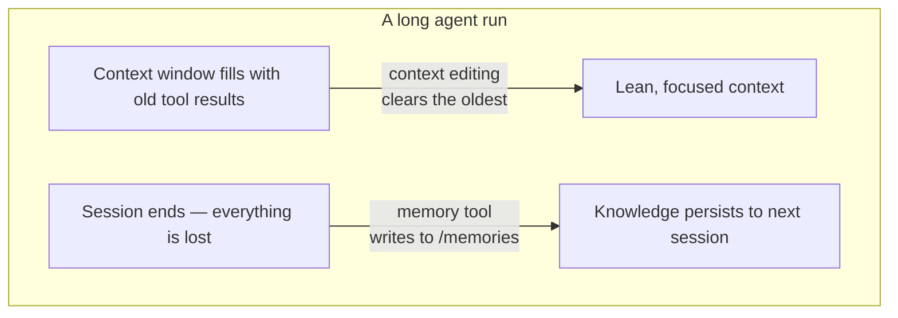

import Tabs from '@theme/Tabs';
import TabItem from '@theme/TabItem';

<LevelBadge level="advanced" />

<VerifyNote lastVerified="2026-06-26" source="https://platform.claude.com/docs/en/agents-and-tools/tool-use/memory-tool">
두 기능 모두 베타입니다. 도구 타입 문자열, 베타 헤더, 기본값, 보고된 벤치마크 향상치는 변동됩니다 — 이를 기반으로 구축하기 전에 공식 memory-tool 및 context-editing 문서에서 확인하세요.
</VerifyNote>

오래 실행되는 에이전트에는 두 가지 적이 있습니다. 대화가 끝나는 순간 학습한 내용을 **잊어버리고**, 컨텍스트 윈도가 오래된 도구 출력으로 **가득 차** 넘쳐버립니다. Anthropic은 각각에 대한 원시 기능을 제공합니다 — **memory tool**(영속성)과 **컨텍스트 편집**(정리) — 그리고 이 둘은 함께 사용되도록 설계되었습니다.

<Callout type="objectives" items={["memory tool이 무엇인지 — Anthropic이 아니라 당신이 구현하는, /memories에 위치한 클라이언트 측 파일 저장소", "당신의 핸들러가 응답해야 하는 여섯 가지 명령: view, create, str_replace, insert, delete, rename", "이를 연결할 때 경로 탐색(path-traversal) 검증이 타협 불가능한 이유", "컨텍스트가 토큰 임계값을 넘으면 컨텍스트 편집이 어떻게 오래된 도구 결과를 자동으로 비우는지", "하나의 베타 헤더 아래에서 둘을 결합하는 방법, 그리고 캐싱과 순서에 관한 함정들"]} />

## 두 가지 문제, 두 가지 도구



두 개념을 머릿속에서 분리해 두세요:

- **memory tool** = *세션 간 영속성*. Claude는 파일을 읽고 쓰며, **당신**이 그것을 저장합니다.
- **컨텍스트 편집** = *세션 내 정리*. API는 프롬프트가 Claude에 도달하기 전에 오래된 도구 결과를 떨궈냅니다.

이 페이지는 비용 측면에서는 [Prompt Caching](/docs/api/prompt-caching) 및 [토큰 경제](/docs/power-user/token-economy)와, *이유* 측면에서는 [Context Engineering](/docs/frontiers/context-engineering) 및 [오래 실행되는 에이전트 하네스](/docs/frontiers/long-running-agent-harnesses)와 짝을 이룹니다.

<Flashcards title="메모리 & 컨텍스트 용어" cards={[{front:"memory tool","back":"Claude가 /memories 디렉터리에서 파일을 생성/읽기/업데이트/삭제할 수 있게 해주는 클라이언트 측 도구(타입 memory_20250818). 저장 백엔드는 당신이 구현합니다."},{front:"/memories","back":"모든 메모리 작업이 한정되는 단일 디렉터리. 모든 경로는 그 안에 머무르도록 검증되어야 합니다."},{front:"컨텍스트 편집","back":"토큰 임계값을 넘으면 프롬프트에서 오래된 도구 결과를 비우는 서버 측 전략 — 전체 기록은 여전히 당신의 클라이언트에 남아 있습니다."},{front:"clear_tool_uses_20250919","back":"가장 오래된 도구 결과를 제거하고, Claude가 정리되었음을 알 수 있도록 자리표시자로 대체하는 컨텍스트 편집 전략."},{front:"Compaction","back":"컨텍스트 한계 부근에서 전체 대화를 요약하는 별도의 서버 측 기능 — 클라이언트 측 컨텍스트 편집을 보완합니다."}]} />

## memory tool은 *당신*이 구현하는 도구입니다

여기서 사람들이 걸려 넘어집니다. memory tool을 활성화한다고 해서 Anthropic이 호스팅하는 저장소가 주어지는 것은 **아닙니다**. 이것은 **클라이언트 측** 도구입니다. Claude는 `view`나 `create` 같은 도구 호출을 내보내고, 당신의 애플리케이션이 선택한 백엔드 — 로컬 파일, 데이터베이스, 암호화된 블롭, 클라우드 스토리지 — 에 대해 그것을 실행하여 결과를 반환합니다. 바이트가 어디에 사는지는 당신이 소유합니다(이 때문에 [Zero-Data-Retention](/docs/foundations/privacy) 자격도 갖춥니다).

도구가 활성화되면 Anthropic은 Claude에게 **다른 무엇이든 하기 전에 메모리 디렉터리를 확인하고**, 작업하면서 진행 상황을 기록하여 컨텍스트가 초기화되더라도 아무것도 잃지 않도록 하라는 시스템 지시를 주입합니다.

### 1단계 — 도구 활성화

요청에 도구를 추가하세요. 타입 문자열은 날짜가 붙은 버전 `memory_20250818`입니다.

<Tabs groupId="lang">
<TabItem value="python" label="Python">

```python
import anthropic

client = anthropic.Anthropic()

message = client.messages.create(
    model="claude-opus-4-8",
    max_tokens=2048,
    messages=[{"role": "user", "content": "Help me respond to this support ticket."}],
    tools=[{"type": "memory_20250818", "name": "memory"}],
)

print(message)
```

</TabItem>
<TabItem value="typescript" label="TypeScript">

```typescript
import Anthropic from "@anthropic-ai/sdk";

const anthropic = new Anthropic();

const message = await anthropic.messages.create({
  model: "claude-opus-4-8",
  max_tokens: 2048,
  messages: [{ role: "user", content: "Help me respond to this support ticket." }],
  tools: [{ type: "memory_20250818", name: "memory" }],
});

console.log(message);
```

</TabItem>
</Tabs>

공식 SDK는 메모리 헬퍼를 제공하므로 도구 인터페이스를 직접 손으로 만들 필요가 없습니다 — `BetaAbstractMemoryTool`을 서브클래싱하거나(Python, C#), `betaMemoryTool`을 사용하거나(TypeScript), `BetaMemoryToolHandler`를 구현하세요(Java). 이들은 당신의 저장소를 연결할 수 있는 깔끔한 훅을 제공합니다.

### 2단계 — 여섯 가지 명령에 응답

당신의 핸들러는 이들을 구현해야 합니다. Claude가 되돌려받기를 기대하는 문자열은 구체적입니다 — 모델이 결과를 올바르게 해석하도록 그것들을 정확히 맞추세요.

<Steps items={[{title: "view", body: "디렉터리를 나열하거나(파일을 최대 2단계 깊이까지, 사람이 읽기 쉬운 크기와 함께) 1부터 시작하는 행 번호와 함께 파일 내용을 반환합니다. 일부만 읽으려면 선택적 view_range를 사용합니다."},{title: "create", body: "file_text로 새 파일을 작성합니다. 이미 존재하면 조용히 덮어쓰지 말고 오류를 내세요."},{title: "str_replace", body: "정확한 old_str을 new_str로 교체합니다. old_str이 없거나 두 번 이상 나타나면(모호함) 거부하고 — 행 번호를 보고하세요."},{title: "insert", body: "insert_line에 insert_text를 삽입합니다. 그 행이 [0, n_lines] 범위 안에 있는지 검증하세요."},{title: "delete", body: "파일을, 또는 디렉터리와 그 내용을 재귀적으로 제거합니다."},{title: "rename", body: "경로를 이동/이름 변경합니다. 대상이 이미 존재하면 거부하세요 — 절대 덮어쓰지 마세요."}]} />

디렉터리에 대한 실제 `view`는 다음과 같은 것을 반환합니다 — 모델이 파싱하도록 훈련된 리터럴 헤더와 탭으로 구분된 크기에 주목하세요:

```text
Here're the files and directories up to 2 levels deep in /memories, excluding hidden items and node_modules:
4.0K	/memories
1.5K	/memories/customer_service_guidelines.xml
2.0K	/memories/refund_policies.xml
```

### 3단계 — 경로를 잠그세요 (이 단계를 건너뛰지 마세요)

memory tool은 모델이 임의의 경로 문자열을 내보내게 합니다. 오염된 대화나 프롬프트 인젝션 페이로드는 `/memories`를 벗어나 당신 머신의 다른 곳에 있는 파일을 읽거나 덮어쓰려 시도할 수 있습니다. 들어오는 모든 경로를 적대적인 것으로 취급하세요.

<Callout type="warning" items={["/memories 내부로 해석되지 않는 경로는 모두 거부하세요.","확인 전에 정규화하세요 — Python에서는 Path(p).resolve() 후 .relative_to(memories_root)가 예외를 발생시키지 않는지 검증하세요.","../, ..\\, 그리고 %2e%2e%2f 같은 URL 인코딩된 탐색을 차단하세요.","폭주하는 에이전트가 디스크를 소진하거나 다음 프롬프트를 폭발시키지 못하도록 파일 크기와 읽기 길이에 상한을 두세요."]} />

이 검증기가 모든 것을 결정합니다 — 다른 무엇이든 출시되기 전에 고정하고 테스트하세요:

<PromptCard title="경로 탐색 가드 (Python)">{`from pathlib import Path

MEMORY_ROOT = Path("/srv/agent/memories").resolve()

def safe_path(requested: str) -> Path:
    # Map the model's /memories/... onto your real root, then prove containment.
    rel = requested.removeprefix("/memories").lstrip("/")
    candidate = (MEMORY_ROOT / rel).resolve()
    candidate.relative_to(MEMORY_ROOT)  # raises ValueError if it escaped
    return candidate`}</PromptCard>

## 컨텍스트 편집은 윈도가 넘치지 않게 합니다

메모리는 *망각*을 해결합니다. 반대 문제 — 40번 전 웹 검색에서 나온 오래된 `tool_result` 블록으로 가득 찬 컨텍스트 윈도 — 는 **컨텍스트 편집**이 해결합니다. 프롬프트가 토큰 임계값을 넘으면, API는 프롬프트가 모델에 전송되기 전에 **가장 오래된** 도구 결과를 비웁니다(Claude가 제거되었음을 알 수 있도록 짧은 자리표시자로 대체). 당신의 클라이언트는 편집되지 않은 전체 기록을 유지하며, 모델에 도달하는 것만 잘려나갑니다.

이것은 베타 헤더에 의존합니다:

```text
anthropic-beta: context-management-2025-06-27
```

`context_management.edits` 배열로 구성합니다. 주요 전략은 `clear_tool_uses_20250919`입니다:

<Tabs groupId="lang">
<TabItem value="python" label="Python">

```python
message = client.beta.messages.create(
    model="claude-opus-4-8",
    max_tokens=2048,
    betas=["context-management-2025-06-27"],
    messages=[...],
    tools=[{"type": "memory_20250818", "name": "memory"}],
    context_management={
        "edits": [
            {
                "type": "clear_tool_uses_20250919",
                "trigger": {"type": "input_tokens", "value": 30000},  # start clearing past 30k
                "keep": {"type": "tool_uses", "value": 3},            # always keep the last 3
                "clear_at_least": {"type": "input_tokens", "value": 5000},
                "exclude_tools": ["memory"],                          # never clear memory calls
                "clear_tool_inputs": False,                           # keep the call args, drop results
            }
        ]
    },
)
```

</TabItem>
<TabItem value="typescript" label="TypeScript">

```typescript
const message = await anthropic.beta.messages.create({
  model: "claude-opus-4-8",
  max_tokens: 2048,
  betas: ["context-management-2025-06-27"],
  messages: [...],
  tools: [{ type: "memory_20250818", name: "memory" }],
  context_management: {
    edits: [
      {
        type: "clear_tool_uses_20250919",
        trigger: { type: "input_tokens", value: 30000 },
        keep: { type: "tool_uses", value: 3 },
        clear_at_least: { type: "input_tokens", value: 5000 },
        exclude_tools: ["memory"],
        clear_tool_inputs: false,
      },
    ],
  },
});
```

</TabItem>
</Tabs>

각 다이얼이 의미하는 바:

| 파라미터 | 기본값 | 무엇을 제어하는가 |
|-----------|---------|------------------|
| `trigger` | 입력 토큰 100,000 | 비우기가 시작되는 시점 |
| `keep` | 도구 사용 3건 | 항상 보존되는 최근 도구 사용/결과 쌍의 개수 |
| `clear_at_least` | 없음 | 활성화당 해제되는 최소 토큰 — 캐시 무효화가 정말로 가치 있도록 이를 사용하세요 |
| `exclude_tools` | 없음 | 절대 비워지지 않는 도구(예: `memory`, `web_search`) |
| `clear_tool_inputs` | `false` | 결과만이 아니라 도구 *호출 인자*도 떨궈낼지 여부 |

응답은 `context_management.applied_edits` 아래에서 무엇을 했는지 알려줍니다 — 예를 들어 `cleared_tool_uses`와 `cleared_input_tokens` — 그래서 얼마나 회수되었는지 로깅할 수 있습니다.

오래된 [확장 사고](/docs/api/thinking-and-effort) 블록을 정리하는 자매 전략 `clear_thinking_20251015`가 있습니다. 둘 다 사용한다면 `edits` 배열에서 **`clear_thinking_20251015`를 먼저 나열하세요**.

<Callout type="tip" items={["도구 결과를 비우면 비우기 지점의 프롬프트 캐시 접두사가 무효화됩니다 — clear_at_least와 짝지어, 의미 있는 덩어리를 해제할 때만 그 무효화 비용을 치르도록 하세요.","exclude_tools: [\"memory\"]가 흔한 선택입니다: 에이전트 자신의 메모가 오래된 검색 결과와 함께 쓸려나가지 않고 영속되기를 원하기 때문입니다.","컨텍스트 편집(클라이언트 측 트림)과 compaction(서버 측 요약)은 서로 다른 기능입니다 — 아주 긴 실행에서는 둘을 겹쳐 쓸 수 있습니다."]} />

## 왜 둘을 짝지어야 하는가 — 수치

함께 사용하면 두 기능은 에이전트가 단일 컨텍스트 윈도를 훨씬 넘어 실행되게 합니다: 컨텍스트 편집은 라이브 윈도를 가볍게 유지하고, 중요한 것은 무엇이든 비워지기 전에 메모리에 기록됩니다. Anthropic은 메모리를 컨텍스트 편집과 결합했을 때 에이전틱 검색 평가에서 **39% 향상**을 얻었고, 컨텍스트 편집만으로도 100턴 웹 검색 테스트에서 토큰 사용을 **84%** 줄였다고 보고합니다.

<VerifyNote lastVerified="2026-06-26" source="https://www.anthropic.com/news/context-management">
이 백분율은 Anthropic 자체의 벤치마크 수치이며 특정 평가 설정을 반영합니다 — 당신의 워크로드에 대한 보장이 아니라 방향성으로 받아들이세요. context-management 발표에서 확인하세요.
</VerifyNote>

## 효과적인 패턴: 다중 세션 프로젝트 로그

메모리의 가장 깔끔한 사용은 파일을 임시방편으로 쓰는 대신 의도적으로 부트스트랩하는 것입니다:

<Steps items={[{title: "초기화 세션", body: "실제 작업 전에 진행 로그, 기능 체크리스트, 그리고 프로젝트에 필요한 시작 스크립트를 가리키는 메모를 작성하세요."},{title: "이후 각 세션은 그 파일들을 읽는 것으로 시작", body: "전체 프로젝트 상태를 몇 초 만에 복구합니다 — 코드베이스를 다시 탐색하거나 결정을 되짚을 필요가 없습니다."},{title: "각 세션은 로그를 업데이트하며 종료", body: "무엇이 완료되었고 무엇이 다음인지 기록하여, 다음 세션이 정확한 시작점을 갖도록 하세요."},{title: "한 번에 하나의 기능, 검증됨", body: "코드가 작성된 후가 아니라 종단 간 검증 후에만 기능을 완료로 표시하세요 — 그래야 로그가 신뢰할 만하게 유지됩니다."}]} />

## 이해도 점검

<Quiz questions={[{q:"memory tool 데이터는 실제로 어디에 저장되나요?",options:["Anthropic의 서버에, 당신을 위해 관리됨","당신 자신의 인프라에 — 도구는 클라이언트 측이며 당신이 백엔드를 구현함","모델의 가중치에","프롬프트 캐시에"],answer:1,explain:"memory tool은 클라이언트 측입니다. Claude가 도구 호출을 내보내고, 당신의 앱이 당신이 제어하는 저장소에 대해 그것을 실행하며, /memories에 한정됩니다."},{q:"컨텍스트 편집의 clear_tool_uses_20250919 전략은 무엇을 제거하나요?",options:["시스템 프롬프트","가장 최근의 도구 결과","토큰 임계값을 넘으면 가장 오래된 도구 결과","모든 사용자 메시지"],answer:2,explain:"트리거 임계값 이후, 가장 최근의 것(기본값: 마지막 3건)을 유지하고 전체 기록을 당신의 클라이언트에 남겨둔 채, 가장 오래된 도구 결과를 먼저 비웁니다."},{q:"memory tool이 받는 모든 경로를 검증해야 하는 이유는 무엇인가요?",options:["디스크 공간을 절약하려고","../ 같은 입력을 통해 /memories를 벗어나는 디렉터리 탐색 탈출을 막으려고","모델 속도를 높이려고","Anthropic이 긴 경로를 거부하기 때문에"],answer:1,explain:"악의적이거나 주입된 경로는 /memories 밖의 파일을 읽거나 덮어쓰려 시도할 수 있습니다. 작업하기 전에 경로를 정규화하고 메모리 루트 안에 머무르는지 증명하세요."}]} />

## 출처 & 더 읽을거리

- [Memory tool — Claude API 문서](https://platform.claude.com/docs/en/agents-and-tools/tool-use/memory-tool) — 도구 타입 `memory_20250818`, 여섯 가지 명령, 그리고 보안 지침.
- [컨텍스트 편집 — Claude API 문서](https://platform.claude.com/docs/en/build-with-claude/context-editing) — `context-management-2025-06-27` 베타, 전략 필드, 그리고 기본값.
- [Claude Developer Platform에서 컨텍스트 관리하기](https://www.anthropic.com/news/context-management) — 39% / 84% 벤치마크 수치가 담긴 발표.
- [AI 에이전트를 위한 효과적인 컨텍스트 엔지니어링](https://www.anthropic.com/engineering/effective-context-engineering-for-ai-agents) — 메모리가 설계된 적시(just-in-time) 검색 패턴.
- [오래 실행되는 에이전트를 위한 효과적인 하네스](https://www.anthropic.com/engineering/effective-harnesses-for-long-running-agents) — 다중 세션 프로젝트 로그 사례 연구.
- AILmanac 관련 문서: [Context Engineering](/docs/frontiers/context-engineering) · [오래 실행되는 에이전트 하네스](/docs/frontiers/long-running-agent-harnesses) · [Prompt Caching](/docs/api/prompt-caching) · [Tool Use](/docs/api/tool-use)
