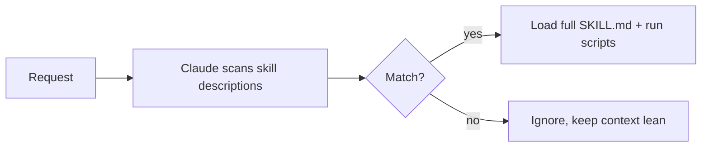

<LevelBadge level="advanced" />

<VerifyNote lastVerified="2026-06-23" source="https://code.claude.com/docs/en/skills">
스킬 파일 레이아웃, 점진적 공개, 그리고 스킬이 실행되는 곳(Claude Code, Claude.ai, Cowork)은 진화하고 있습니다 — 공식 스킬 문서에서 확인하세요.
</VerifyNote>

**스킬**은 전문성 — 지침과 선택적 스크립트 및 리소스 — 을 패키징하여 Claude가 **관련 있을 때만** 로드하게 합니다. 모든 것을 [CLAUDE.md](/docs/claude-code/claude-md)에 욱여넣는 대신, Claude에게 필요할 때 끌어오는 기능 라이브러리를 줍니다.

## 구조

스킬은 `SKILL.md`가 있는 폴더입니다: YAML frontmatter + 지침.

```markdown
---
name: pdf-forms
description: Use when the user needs to fill, read, or generate PDF forms.
---

# PDF Forms
Steps and rules for working with PDF forms…
(optionally reference scripts/ or resources/ in this folder)
```

**`description`이 트리거입니다** — Claude는 이를 읽고 *언제* 스킬을 활성화할지 결정합니다. 적절한 때에 로드되고 그 외에는 로드되지 않을 만큼 구체적으로, "Use when…"으로 작성하세요.

## 점진적 공개 (스킬이 확장되는 이유)

Claude는 모든 스킬의 전체 본문을 미리 로드하지 않습니다 — 가벼운 `name` + `description`을 보고, 요청이 매칭될 때만 전체 지침을 끌어옵니다(그리고 스크립트를 실행합니다). 그 덕분에 많은 스킬이 설치되어 있어도 컨텍스트가 군더더기 없이 유지됩니다.



## 어디에 위치하는가

- 개인: `~/.claude/skills/<name>/SKILL.md`
- 프로젝트 (공유 가능): `.claude/skills/<name>/SKILL.md`
- 팀 배포를 위해 [플러그인](/docs/claude-code/plugins-marketplaces)에 번들됨.

AILmanac는 [바로 쓸 수 있는 스킬 팩 7개](/docs/templates/skills)를 제공합니다 — 하나를 복사해 넣어 시험해보세요.

## 실전 예시: 스스로를 트리거하는 스킬

`~/.claude/skills/release-notes/SKILL.md`를 만드세요:

```markdown
---
name: release-notes
description: Use when the user asks to write release notes or a changelog from git history.
---

# Release Notes
1. Run `git log <last-tag>..HEAD --oneline` to get the commits.
2. Group them into Features / Fixes / Breaking changes.
3. Write user-facing notes — what changed for *users*, not commit messages.
4. Output Markdown ready to paste into a GitHub release.
```

나중에 입력합니다: *"v1.4 이후의 릴리스 노트를 작성해줘."* Claude는 이 단계들을 컨텍스트에 가진 적이 없지만 — 요청이 `description`과 매칭되므로, 전체 `SKILL.md`를 끌어와 `git log`를 실행하고 그룹화된 노트를 생성합니다. 당신은 이름으로 아무것도 호출하지 않았습니다. **description이 라우팅을 했습니다.** 같은 폴더에 `scripts/` 파일을 추가하면 스킬은 1단계의 일부로 그것을 실행할 수 있습니다.

## 스킬 대 명령 대 서브에이전트 대 MCP

| 도구 | 무엇인가 | 당신 vs Claude가 트리거 |
|---|---|---|
| [슬래시 명령](/docs/claude-code/slash-commands) | 저장된 프롬프트 | **당신**이 호출함 |
| **스킬** | 온디맨드 전문성 + 스크립트 | **Claude**가 관련 있을 때 로드함 |
| [서브에이전트](/docs/claude-code/subagents) | 자체 컨텍스트를 가진 위임된 에이전트 | Claude가 위임함 |
| [MCP](/docs/claude-code/mcp) | 외부 도구/데이터로의 연결 | 호출할 도구를 제공함 |

경험칙: **당신**이 필요할 때 발동하고 싶다 → 슬래시 명령. **Claude**가 절차를 알고 관련 있을 때 적용해야 한다 → 스킬. 작업이 별도 컨텍스트에서 일어나야 한다 → 서브에이전트. 외부 시스템에 도달해야 한다 → MCP.

## 흔한 실수

- **트리거되지 않는 description.** "Helps with PDFs"는 너무 모호합니다. "Use when the user needs to fill, read, or generate PDF forms"는 Claude에게 언제 로드할지 정확히 알려줍니다. description이 전체 활성화 메커니즘입니다 — 사람을 위해서가 아니라 매칭을 위해 작성하세요.
- **대신 모든 것을 CLAUDE.md에 넣기.** [CLAUDE.md](/docs/claude-code/claude-md)는 *매* 세션마다 로드되어 항상 컨텍스트를 소모합니다. 스킬은 *관련 있을 때만* 로드됩니다. 상황적 절차는 스킬로 옮기고 CLAUDE.md는 항상 참인 프로젝트 규칙을 위해 남겨두세요.
- **하나의 거대한 스킬.** 작고 날카롭게 기술된 많은 스킬이 하나의 포괄 스킬보다 라우팅이 잘 됩니다 — 점진적 공개는 각 description이 구체적일 때만 도움이 됩니다.
- **공유 가능하다는 점을 잊기.** git에 커밋된 `.claude/skills/`의 프로젝트 스킬은 팀 전체에 기능을 부여합니다. `~/.claude/skills/`의 개인 스킬은 당신만의 것으로 남습니다.

## 다음

- [첫 스킬 작성하기 (둘러보기)](/docs/walkthroughs/first-skill)
- [SKILL.md 템플릿](/docs/templates/skills)
- [플러그인 & 마켓플레이스](/docs/claude-code/plugins-marketplaces)
