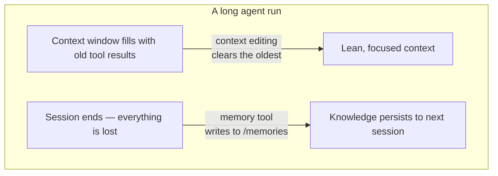

import Tabs from '@theme/Tabs';
import TabItem from '@theme/TabItem';

<LevelBadge level="advanced" />

<VerifyNote lastVerified="2026-06-26" source="https://platform.claude.com/docs/en/agents-and-tools/tool-use/memory-tool">
Ambos os recursos estão em beta. As strings de tipo de ferramenta, o cabeçalho beta, os padrões e os ganhos de benchmark reportados mudam — confirme na documentação oficial da memory-tool e da context-editing antes de construir com base neles.
</VerifyNote>

Um agente de execução longa tem dois inimigos: ele **esquece** o que aprendeu no momento em que a conversa termina, e sua janela de contexto **enche** com saídas de ferramentas obsoletas até transbordar. A Anthropic fornece uma primitiva para cada um — a **memory tool** (persistência) e a **edição de contexto** (poda) — e elas são projetadas para serem usadas juntas.

<Callout type="objectives" items={["O que é a memory tool — um armazenamento de arquivos do lado do cliente em /memories que você implementa, não a Anthropic", "Os seis comandos que seu handler deve responder: view, create, str_replace, insert, delete, rename", "Por que a validação de path-traversal é inegociável quando você a integra", "Como a edição de contexto limpa automaticamente resultados de ferramentas antigos quando o contexto ultrapassa um limite de tokens", "Como combinar ambos sob um único cabeçalho beta, e as armadilhas com caching e ordenação"]} />

## Dois problemas, duas ferramentas



Mantenha as duas ideias separadas na sua cabeça:

- **Memory tool** = *persistência entre sessões*. Claude lê e escreve arquivos; **você** os armazena.
- **Edição de contexto** = *poda dentro de uma sessão*. A API descarta resultados de ferramentas obsoletos do prompt antes que ele chegue ao Claude.

Esta página combina com [Prompt Caching](/docs/api/prompt-caching) e com a [economia de tokens](/docs/power-user/token-economy) para o lado de custo, e com [Engenharia de Contexto](/docs/frontiers/context-engineering) e [harnesses de agentes de execução longa](/docs/frontiers/long-running-agent-harnesses) para o *porquê*.

<Flashcards title="Vocabulário de memória e contexto" cards={[{front:"Memory tool","back":"Uma ferramenta do lado do cliente (tipo memory_20250818) que permite ao Claude criar/ler/atualizar/excluir arquivos em um diretório /memories. Você implementa o backend de armazenamento."},{front:"/memories","back":"O único diretório ao qual todas as operações de memória estão confinadas. Todo path deve ser validado para permanecer dentro dele."},{front:"Edição de contexto","back":"Uma estratégia do lado do servidor que limpa resultados de ferramentas antigos do prompt quando um limite de tokens é ultrapassado — o histórico completo ainda vive no seu cliente."},{front:"clear_tool_uses_20250919","back":"A estratégia de edição de contexto que remove os resultados de ferramentas mais antigos, substituindo-os por um placeholder para que o Claude saiba que foram podados."},{front:"Compactação","back":"Um recurso separado do lado do servidor que resume toda a conversa próximo ao limite de contexto — complementar à edição de contexto do lado do cliente."}]} />

## A memory tool é uma ferramenta que *você* implementa

Isto confunde as pessoas: habilitar a memory tool **não** lhe dá armazenamento hospedado pela Anthropic. É uma ferramenta do **lado do cliente**. Claude emite chamadas de ferramenta como `view` ou `create`; sua aplicação as executa contra qualquer backend que você escolher — arquivos locais, um banco de dados, blobs criptografados, armazenamento em nuvem — e retorna o resultado. Você é dono de onde os bytes ficam (e é também por isso que ela é elegível para [Zero-Data-Retention](/docs/foundations/privacy)).

Quando a ferramenta está habilitada, a Anthropic injeta uma instrução de sistema dizendo ao Claude para **verificar seu diretório de memória antes de fazer qualquer outra coisa**, e para registrar o progresso enquanto trabalha, de modo que nada se perca se o contexto for reiniciado.

### Passo 1 — habilitar a ferramenta

Adicione a ferramenta à sua requisição. A string de tipo é a versão datada `memory_20250818`.

<Tabs groupId="lang">
<TabItem value="python" label="Python">

```python
import anthropic

client = anthropic.Anthropic()

message = client.messages.create(
    model="claude-opus-4-8",
    max_tokens=2048,
    messages=[{"role": "user", "content": "Help me respond to this support ticket."}],
    tools=[{"type": "memory_20250818", "name": "memory"}],
)

print(message)
```

</TabItem>
<TabItem value="typescript" label="TypeScript">

```typescript
import Anthropic from "@anthropic-ai/sdk";

const anthropic = new Anthropic();

const message = await anthropic.messages.create({
  model: "claude-opus-4-8",
  max_tokens: 2048,
  messages: [{ role: "user", content: "Help me respond to this support ticket." }],
  tools: [{ type: "memory_20250818", name: "memory" }],
});

console.log(message);
```

</TabItem>
</Tabs>

Os SDKs oficiais incluem helpers de memória para que você não precise montar a interface da ferramenta na mão — faça subclasse de `BetaAbstractMemoryTool` (Python, C#), use `betaMemoryTool` (TypeScript), ou implemente `BetaMemoryToolHandler` (Java). Eles lhe entregam um hook limpo onde você pluga seu armazenamento.

### Passo 2 — responder aos seis comandos

Seu handler deve implementar estes. As strings que o Claude espera de volta são específicas — combine com elas para que o modelo interprete os resultados corretamente.

<Steps items={[{title: "view", body: "Liste um diretório (arquivos até 2 níveis de profundidade, com tamanhos legíveis por humanos) ou retorne o conteúdo de um arquivo com números de linha indexados a partir de 1. view_range opcional para ler uma fatia."},{title: "create", body: "Escreva um novo arquivo a partir de file_text. Gere erro se ele já existir em vez de sobrescrever silenciosamente."},{title: "str_replace", body: "Substitua um old_str exato por new_str. Recuse se old_str estiver ausente, ou aparecer mais de uma vez (ambíguo) — reporte os números de linha."},{title: "insert", body: "Insira insert_text em insert_line. Valide que a linha está dentro de [0, n_lines]."},{title: "delete", body: "Remova um arquivo, ou um diretório e seu conteúdo recursivamente."},{title: "rename", body: "Mova/renomeie um path. Recuse se o destino já existir — nunca sobrescreva."}]} />

Um `view` real do diretório retorna algo como isto — note o cabeçalho literal e os tamanhos separados por tabulação, que o modelo é treinado para parsear:

```text
Here're the files and directories up to 2 levels deep in /memories, excluding hidden items and node_modules:
4.0K	/memories
1.5K	/memories/customer_service_guidelines.xml
2.0K	/memories/refund_policies.xml
```

### Passo 3 — proteja os paths (não pule isto)

A memory tool permite que um modelo emita strings de path arbitrárias. Uma conversa envenenada ou um payload de prompt-injection pode tentar escapar de `/memories` e ler ou sobrescrever arquivos em outro lugar da sua máquina. Trate todo path recebido como hostil.

<Callout type="warning" items={["Rejeite qualquer path que não resolva para dentro de /memories.","Canonicalize antes de verificar — em Python, Path(p).resolve() e então verifique que .relative_to(memories_root) não levanta exceção.","Bloqueie ../, ..\\, e traversal codificado em URL como %2e%2e%2f.","Limite os tamanhos de arquivo e o comprimento de leitura para que um agente desgovernado não possa esgotar o disco ou explodir o próximo prompt."]} />

Este validador é o jogo inteiro — fixe-o e teste-o antes de qualquer outra coisa entrar em produção:

<PromptCard title="Guarda contra path-traversal (Python)">{`from pathlib import Path

MEMORY_ROOT = Path("/srv/agent/memories").resolve()

def safe_path(requested: str) -> Path:
    # Map the model's /memories/... onto your real root, then prove containment.
    rel = requested.removeprefix("/memories").lstrip("/")
    candidate = (MEMORY_ROOT / rel).resolve()
    candidate.relative_to(MEMORY_ROOT)  # raises ValueError if it escaped
    return candidate`}</PromptCard>

## A edição de contexto evita que a janela transborde

A memória resolve o *esquecimento*. O problema oposto — uma janela de contexto entupida com blocos `tool_result` antigos de 40 buscas web atrás — é o que a **edição de contexto** resolve. Assim que o prompt ultrapassa um limite de tokens, a API limpa os resultados de ferramentas **mais antigos** (substituindo-os por um placeholder curto para que o Claude saiba que foram removidos) antes que o prompt seja enviado ao modelo. Seu cliente mantém o histórico completo e não editado; apenas o que chega ao modelo é aparado.

Ela depende de um cabeçalho beta:

```text
anthropic-beta: context-management-2025-06-27
```

Você a configura com um array `context_management.edits`. A estratégia principal é `clear_tool_uses_20250919`:

<Tabs groupId="lang">
<TabItem value="python" label="Python">

```python
message = client.beta.messages.create(
    model="claude-opus-4-8",
    max_tokens=2048,
    betas=["context-management-2025-06-27"],
    messages=[...],
    tools=[{"type": "memory_20250818", "name": "memory"}],
    context_management={
        "edits": [
            {
                "type": "clear_tool_uses_20250919",
                "trigger": {"type": "input_tokens", "value": 30000},  # start clearing past 30k
                "keep": {"type": "tool_uses", "value": 3},            # always keep the last 3
                "clear_at_least": {"type": "input_tokens", "value": 5000},
                "exclude_tools": ["memory"],                          # never clear memory calls
                "clear_tool_inputs": False,                           # keep the call args, drop results
            }
        ]
    },
)
```

</TabItem>
<TabItem value="typescript" label="TypeScript">

```typescript
const message = await anthropic.beta.messages.create({
  model: "claude-opus-4-8",
  max_tokens: 2048,
  betas: ["context-management-2025-06-27"],
  messages: [...],
  tools: [{ type: "memory_20250818", name: "memory" }],
  context_management: {
    edits: [
      {
        type: "clear_tool_uses_20250919",
        trigger: { type: "input_tokens", value: 30000 },
        keep: { type: "tool_uses", value: 3 },
        clear_at_least: { type: "input_tokens", value: 5000 },
        exclude_tools: ["memory"],
        clear_tool_inputs: false,
      },
    ],
  },
});
```

</TabItem>
</Tabs>

O que os botões significam:

| Parâmetro | Padrão | O que controla |
|-----------|---------|------------------|
| `trigger` | 100.000 tokens de entrada | Quando a limpeza entra em ação |
| `keep` | 3 usos de ferramenta | Quantos pares recentes de uso/resultado de ferramenta são sempre preservados |
| `clear_at_least` | nenhum | Mínimo de tokens liberados por ativação — use-o para que uma invalidação de cache realmente valha a pena |
| `exclude_tools` | nenhum | Ferramentas nunca limpas (ex.: `memory`, `web_search`) |
| `clear_tool_inputs` | `false` | Se também deve descartar os *argumentos da chamada* da ferramenta, não apenas o resultado |

A resposta lhe diz o que ela fez, sob `context_management.applied_edits` — ex.: `cleared_tool_uses` e `cleared_input_tokens` — para que você possa registrar quanto foi recuperado.

Há uma estratégia irmã, `clear_thinking_20251015`, que poda blocos antigos de [extended-thinking](/docs/api/thinking-and-effort). Se você usar ambas, **liste `clear_thinking_20251015` primeiro** no array `edits`.

<Callout type="tip" items={["Limpar resultados de ferramentas invalida qualquer prefixo de prompt-cache no ponto de limpeza — combine-o com clear_at_least para que você só pague essa invalidação quando estiver liberando um pedaço significativo.","exclude_tools: [\"memory\"] é a jogada usual: você quer que as próprias anotações do agente persistam, não que sejam varridas junto com resultados de busca obsoletos.","Edição de contexto (corte do lado do cliente) e compactação (sumarização do lado do servidor) são recursos diferentes — para execuções muito longas você pode combinar os dois."]} />

## Por que combiná-los — os números

Usados juntos, os dois recursos permitem que um agente execute muito além de uma única janela de contexto: a edição de contexto mantém a janela viva enxuta, e tudo o que importa é escrito na memória antes de ser limpo. A Anthropic relata que combinar memória com edição de contexto deu uma **melhoria de 39%** em uma avaliação de busca agêntica, e que a edição de contexto sozinha cortou o uso de tokens em **84%** em um teste de busca web de 100 turnos.

<VerifyNote lastVerified="2026-06-26" source="https://www.anthropic.com/news/context-management">
Estas porcentagens são as próprias cifras de benchmark da Anthropic e refletem configurações de avaliação específicas — trate-as como direcionais, não como garantias para sua carga de trabalho. Confirme no anúncio de context-management.
</VerifyNote>

## Um padrão que funciona: o log de projeto multi-sessão

O uso mais limpo da memória é inicializá-la deliberadamente em vez de escrever arquivos de forma improvisada:

<Steps items={[{title: "Sessão inicializadora", body: "Antes de qualquer trabalho real, escreva um log de progresso, um checklist de funcionalidades, e uma nota apontando para qualquer script de inicialização que o projeto precise."},{title: "Cada sessão posterior abre lendo esses arquivos", body: "Ela recupera o estado completo do projeto em segundos — sem necessidade de re-explorar o código ou refazer decisões."},{title: "Cada sessão encerra atualizando o log", body: "Registre o que foi feito e o que vem a seguir, para que a próxima sessão tenha um ponto de partida preciso."},{title: "Uma funcionalidade por vez, verificada", body: "Só marque uma funcionalidade como completa após verificação ponta a ponta — não apenas após o código ser escrito — para que o log permaneça confiável."}]} />

## Teste seu entendimento

<Quiz questions={[{q:"Onde os dados da memory tool de fato são armazenados?",options:["Nos servidores da Anthropic, gerenciados para você","Na sua própria infraestrutura — a ferramenta é do lado do cliente e você implementa o backend","Nos pesos do modelo","No prompt cache"],answer:1,explain:"A memory tool é do lado do cliente. Claude emite chamadas de ferramenta; sua aplicação as executa contra um armazenamento que você controla, confinado a /memories."},{q:"O que a estratégia clear_tool_uses_20250919 da edição de contexto remove?",options:["O prompt de sistema","Os resultados de ferramentas mais recentes","Os resultados de ferramentas mais antigos quando um limite de tokens é ultrapassado","Todas as mensagens do usuário"],answer:2,explain:"Ela limpa primeiro os resultados de ferramentas mais antigos, após o limite de gatilho, mantendo os mais recentes (padrão: últimos 3) e deixando o histórico completo no seu cliente."},{q:"Por que você deve validar todo path que a memory tool recebe?",options:["Para economizar espaço em disco","Para evitar escapes de directory-traversal para fora de /memories via entradas como ../","Para acelerar o modelo","Porque a Anthropic rejeita paths longos"],answer:1,explain:"Um path malicioso ou injetado poderia tentar ler ou sobrescrever arquivos fora de /memories. Canonicalize o path e prove que ele permanece dentro da raiz de memória antes de agir."}]} />

## Fontes e leitura adicional

- [Memory tool — documentação da Claude API](https://platform.claude.com/docs/en/agents-and-tools/tool-use/memory-tool) — tipo de ferramenta `memory_20250818`, os seis comandos e orientação de segurança.
- [Edição de contexto — documentação da Claude API](https://platform.claude.com/docs/en/build-with-claude/context-editing) — o beta `context-management-2025-06-27`, os campos de estratégia e os padrões.
- [Gerenciando contexto na Claude Developer Platform](https://www.anthropic.com/news/context-management) — o anúncio com as cifras de benchmark de 39% / 84%.
- [Engenharia de contexto eficaz para agentes de IA](https://www.anthropic.com/engineering/effective-context-engineering-for-ai-agents) — o padrão de recuperação just-in-time para o qual a memória foi construída.
- [Harnesses eficazes para agentes de execução longa](https://www.anthropic.com/engineering/effective-harnesses-for-long-running-agents) — o estudo de caso do log de projeto multi-sessão.
- Relacionado no AILmanac: [Engenharia de Contexto](/docs/frontiers/context-engineering) · [Harnesses de agentes de execução longa](/docs/frontiers/long-running-agent-harnesses) · [Prompt Caching](/docs/api/prompt-caching) · [Tool Use](/docs/api/tool-use)
