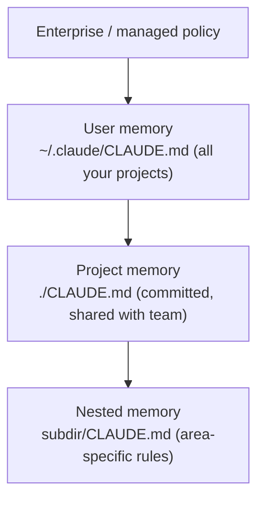

<LevelBadge level="beginner" />

<VerifyNote lastVerified="2026-06-20" source="https://code.claude.com/docs/en/memory">
As localizações dos arquivos de memória e a sintaxe de importação podem mudar — confirme os detalhes na documentação oficial de memória do Claude Code.
</VerifyNote>

Se você fizer **uma** coisa para melhorar o [Claude Code](/docs/claude-code/what-is-claude-code), faça esta. O `CLAUDE.md` é um arquivo de texto simples que o Claude lê no início de cada sessão — o briefing permanente do seu projeto.

<Callout type="objectives" items={["Por que o CLAUDE.md é a configuração de maior alavancagem do Claude Code", "Como a hierarquia de memória se mescla do global ao específico do projeto", "Como gerar um arquivo inicial com /init e enxugá-lo", "O que vai no CLAUDE.md — e o que deixar de fora", "Como as @imports permitem referenciar documentos sem duplicá-los"]} />

## Por que é a configuração de maior alavancagem

Sem ele, você reexplica seu projeto a cada sessão ("usamos pnpm, os testes ficam em `__tests__`, não mexa em `/generated`…"). Com ele, o Claude já sabe. Boas instruções aqui melhoram *todas* as interações futuras de uma só vez.

## A hierarquia de memória

O Claude Code lê a memória de vários lugares e os mescla, aproximadamente do mais global ao mais específico:

- **Memória de usuário** — suas preferências pessoais em todos os projetos.
- **Memória de projeto** (`./CLAUDE.md`, versionada) — como *este* repositório funciona. Compartilhada com sua equipe.
- **Aninhada** — coloque um `CLAUDE.md` em uma subpasta para regras que se aplicam apenas ali.

<Flashcards title="Conheça suas camadas de memória" cards={[{front: "Memória de usuário", back: "~/.claude/CLAUDE.md — suas preferências pessoais que valem para todos os projetos."}, {front: "Memória de projeto", back: "./CLAUDE.md — versionada e compartilhada com a equipe; descreve como este repositório funciona."}, {front: "Memória aninhada", back: "subdir/CLAUDE.md — regras específicas de uma área que se aplicam apenas dentro daquela subpasta."}, {front: "Política empresarial / gerenciada", back: "A camada mais global; política em nível de organização que fica acima da sua memória de usuário."}]} />

## Gere um ponto de partida

<Steps items={[{title: "Execute /init no projeto", body: "O Claude inspeciona o código e esboça um CLAUDE.md para você automaticamente."}, {title: "Enxugue-o", body: "O rascunho é um ponto de partida, não a linha de chegada. Reduza-o ao que é verdadeiro e útil."}, {title: "Aproveite um modelo", body: "Pegue um modelo pronto na página de Modelos de CLAUDE.md e adapte-o ao seu repositório."}]} />

<PromptCard title="Gerar um rascunho de CLAUDE.md">{`/init`}</PromptCard>

Pegue um modelo pronto em [Modelos de CLAUDE.md](/docs/templates/claude-md).

## O que colocar nele

- O que é o projeto, em duas frases.
- A stack tecnológica e como **executar / testar / fazer lint**.
- Convenções que o Claude não consegue inferir (nomenclatura, estrutura, estilo de commit).
- **Proteções**: "execute os testes antes de declarar concluído", "nunca edite `/vendor`", "nunca faça commit de segredos".

## O que NÃO colocar nele

<Callout type="warning" items={["O Claude segue o CLAUDE.md literalmente — instruções desatualizadas, vagas ou idealizadas prejudicam ativamente.", "Descreva como o projeto realmente funciona hoje; curto e verdadeiro vence longo e aspiracional.", "Evite documentos gigantes colados (use @imports em vez disso), segredos e regras que você não segue de fato.", "Revise-o periodicamente para que continue preciso à medida que o projeto evolui."]} />

## Importações

Traga documentos existentes em vez de duplicá-los — por exemplo, referencie seu guia de estilo com uma importação `@path/to/file` para que haja uma única fonte da verdade. Veja a [documentação oficial de memória](https://code.claude.com/docs/en/memory) para a sintaxe exata.

<Callout type="tip" items={["Uma única fonte da verdade: referencie um arquivo com @imports em vez de colar o conteúdo dele no CLAUDE.md.", "Se um documento já existe, faça um link para ele — não o copie. Cópias ficam desatualizadas."]} />

## Teste seus conhecimentos

<Quiz title="Teste seus conhecimentos" questions={[{q: "Qual arquivo o Claude Code lê no início de cada sessão como o briefing permanente do seu projeto?", options: ["README.md", "CLAUDE.md", "package.json"], answer: 1, explain: "O CLAUDE.md é o arquivo de memória em texto simples que o Claude lê no início de cada sessão."}, {q: "O que executar /init faz em um projeto?", options: ["Faz commit do CLAUDE.md no repositório da sua equipe", "Esboça um CLAUDE.md inspecionando o código, que você depois enxuga", "Apaga arquivos de memória desatualizados"], answer: 1, explain: "/init esboça um CLAUDE.md inicial a partir do código — o rascunho é um ponto de partida, então você o enxuga depois."}, {q: "Qual é a maneira recomendada de incluir um documento grande já existente, como um guia de estilo?", options: ["Colar o documento inteiro no CLAUDE.md", "Referenciá-lo com uma importação @path/to/file", "Armazená-lo como um segredo"], answer: 1, explain: "Use @imports para apontar para o arquivo, de modo que haja uma única fonte da verdade em vez de uma cópia duplicada e desatualizada."}]} />

<Callout type="takeaways" items={["O CLAUDE.md é a configuração de maior alavancagem: melhora todas as sessões futuras de uma só vez.", "A memória se mescla do global ao específico: política empresarial, depois arquivos CLAUDE.md de usuário, de projeto e aninhados.", "Comece com /init, depois enxugue o rascunho para o que é de fato verdadeiro.", "Inclua o resumo do projeto, os comandos de executar/testar/lint, as convenções e as proteções.", "Mantenha-o curto e verdadeiro — use @imports para documentos grandes e nunca faça commit de segredos."]} />

## Próximos passos

- [Modo Plano](/docs/claude-code/plan-mode) — primeiras mudanças seguras
- [Permissões e Modos](/docs/claude-code/permissions) — o que o Claude pode fazer sem supervisão
- [Passo a passo: Personalize o Claude Code para um repositório real](/docs/walkthroughs/customize-claude-code)
