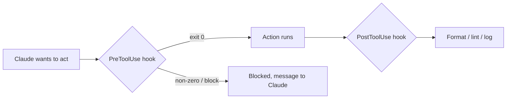

<LevelBadge level="advanced" />

<VerifyNote lastVerified="2026-06-23" source="https://code.claude.com/docs/en/hooks">
Os nomes exatos dos eventos de hook, o payload de stdin e o protocolo de bloqueio evoluem — confirme na documentação oficial de hooks antes de depender de um evento ou campo específico.
</VerifyNote>

Hooks são **comandos de shell que o Claude Code executa automaticamente** em pontos definidos do seu ciclo de vida. Enquanto as [permissões](/docs/claude-code/permissions) decidem *se* uma ação é permitida, os hooks permitem que *você* execute uma lógica determinística em torno dela — formatação, validação, registro de logs, barreiras. É assim que você torna o comportamento garantido em vez de "por favor, lembre-se de".

<Callout type="objectives" items={["Quando recorrer a um hook em vez de uma instrução ou uma permissão", "Como um hook é configurado: evento, matcher e o payload JSON no stdin", "As duas formas pelas quais um hook bloqueia uma ação — código de saída 2 vs JSON no stdout", "As boas práticas e os erros comuns que separam hooks rápidos e seguros dos lentos e silenciosos"]} />

## Quando recorrer a um hook

Recorra a um hook quando quiser que um comportamento seja *garantido*, não apenas solicitado. Cada tarefa comum mapeia para um evento do ciclo de vida:

- **Formatar / fazer lint automaticamente** após cada edição de arquivo (`PostToolUse`).
- **Bloquear** uma ação que viola uma regra antes que ela seja executada (`PreToolUse`).
- **Notificar ou registrar em log** quando uma sessão termina ou uma tarefa é concluída (`Stop`).
- **Injetar contexto** no início da sessão.

<Flashcards title="Eventos de hook em resumo" cards={[{front: "PreToolUse", back: "Dispara antes de uma ação ser executada. Use-o para bloquear ou criar uma barreira — ex.: recusar um comando destrutivo antes de ele ser executado."}, {front: "PostToolUse", back: "Dispara após uma ação correspondente. Use-o para formatar, fazer lint ou registrar o que acabou de mudar."}, {front: "Stop", back: "Dispara quando uma sessão termina ou uma tarefa é concluída. Use-o para notificar ou registrar em log."}, {front: "Início de sessão", back: "Dispara no início de uma sessão. Use-o para injetar contexto."}]} />

## Como funcionam

Você registra hooks em [`settings.json`](/docs/claude-code/settings), associando um **evento** (e, muitas vezes, um matcher de ferramenta). Quando o evento dispara, o Claude executa seu comando, passando um **payload JSON no stdin** (o nome da ferramenta, suas entradas, a sessão). O código de saída e a saída do seu comando decidem o que acontece em seguida.

<Steps items={[{title: "Associe a um evento", body: "Registre o hook em settings.json sob o evento do ciclo de vida que lhe interessa — por exemplo, PostToolUse."}, {title: "Restrinja com um matcher", body: "Adicione um matcher de ferramenta para que o hook dispare apenas em ferramentas relevantes, ex.: matcher \"Edit|Write\" para edições de arquivo."}, {title: "Leia o payload do stdin", body: "Quando o evento dispara, o Claude executa seu comando e canaliza um payload JSON no stdin — o nome da ferramenta, suas entradas, a sessão."}, {title: "Decida o que acontece em seguida", body: "O código de saída e a saída do seu comando determinam o resultado: deixar a ação prosseguir, executar sua lógica ou bloqueá-la."}]} />

```json
{
  "hooks": {
    "PostToolUse": [
      {
        "matcher": "Edit|Write",
        "hooks": [
          { "type": "command", "command": "jq -r '.tool_input.file_path' | xargs npx prettier --write" }
        ]
      }
    ]
  }
}
```

O hook acima lê o caminho do arquivo editado a partir do JSON de stdin (`.tool_input.file_path`) e o formata. Não presuma que uma variável de ambiente contém o caminho — **leia-o do stdin.** Placeholders de caminho úteis como `${CLAUDE_PROJECT_DIR}` *estão* disponíveis para localizar scripts.

## Como um hook bloqueia

Duas formas, dependendo do evento:

- **Código de saída 2** — o hook faz a ação falhar e o que quer que ele tenha escrito no **stderr** se torna a mensagem que o Claude vê. Simples e funciona para hooks de comando.
- **JSON no stdout (saída 0)** — retorne uma decisão estruturada. Para `PreToolUse`, isso é uma `permissionDecision` de `deny`; para `PostToolUse`/`Stop`/etc. é `{"decision": "block", "reason": "…"}`.

O script abaixo é um hook `PreToolUse` na ferramenta Bash. Leia-o de cima para baixo: ele extrai o comando do stdin e, se ele parecer destrutivo, escreve uma razão no stderr e sai com código 2 para bloquear.

```bash
#!/usr/bin/env bash
# PreToolUse hook on the Bash tool: refuse to delete things.
command=$(jq -r '.tool_input.command' < /dev/stdin)
if [[ "$command" == rm\ * || "$command" == *"rm -rf"* ]]; then
  echo "Blocked: destructive 'rm' is not allowed by policy." >&2
  exit 2
fi
exit 0
```

## O modelo mental

Um hook `PreToolUse` roda *antes* da ação e pode bloqueá-la; um hook `PostToolUse` roda *depois* que ela tem sucesso e reage ao resultado.



## Boas práticas

- **Mantenha os hooks rápidos e idempotentes** — eles rodam muito.
- **Falhe de forma ruidosa em problemas reais**, mas não bloqueie por questões cosméticas.
- **Trate a saída do hook como feedback para o Claude** — uma mensagem clara o ajuda a se autocorrigir.
- Hooks rodam com os privilégios do seu shell — revise qualquer hook que você não escreveu ([Revisando Código de Terceiros](/docs/security/reviewing-third-party-code)).

## Erros comuns

- **Ler o caminho do arquivo a partir de uma variável de ambiente.** O caminho vive no JSON de stdin (`.tool_input.file_path`), não em `$CLAUDE_FILE_PATH`. Encaminhe o stdin através do `jq`.
- **Bloqueios silenciosos.** Se um hook `PreToolUse` sai com código 2 sem nada no stderr, o Claude é bloqueado, mas não sabe *por quê* e não consegue se adaptar. Sempre escreva uma razão clara.
- **Hooks lentos.** Um hook `PostToolUse` roda após *cada* edição correspondente. Um linter de 3 segundos faz toda a sessão parecer lenta — mantenha os hooks rápidos e, idealmente, atue apenas sobre o que mudou.
- **Matchers excessivamente amplos.** `matcher: ".*"` dispara em cada ferramenta. Restrinja com um nome exato, uma lista `Edit|Write`, ou o campo `if` por handler (ex.: `"if": "Bash(git push *)"`).
- **Confiar em hooks que você não escreveu.** Um hook executa shell arbitrário com os seus privilégios. Revise primeiro qualquer hook vindo de um plugin ou template — veja [Revisando Código de Terceiros](/docs/security/reviewing-third-party-code).

<Callout type="warning" items={["Um hook executa shell arbitrário com os seus privilégios — nunca configure um hook de um plugin ou template sem lê-lo primeiro."]} />

Modelos prontos para copiar e colar estão em [Receitas de Hooks e settings.json](/docs/templates/hooks-settings).

<PromptCard title="Formatar automaticamente arquivos editados (PostToolUse em Edit|Write)">{`{
  "hooks": {
    "PostToolUse": [
      {
        "matcher": "Edit|Write",
        "hooks": [
          { "type": "command", "command": "jq -r '.tool_input.file_path' | xargs npx prettier --write" }
        ]
      }
    ]
  }
}`}</PromptCard>

<Quiz title="Teste seus conhecimentos" questions={[{q: "Onde um hook encontra o caminho do arquivo que acabou de ser editado?", options: ["Na variável de ambiente $CLAUDE_FILE_PATH", "No payload JSON do stdin, em .tool_input.file_path", "Em um argumento de linha de comando passado pelo Claude"], answer: 1, explain: "O caminho vive no JSON de stdin (.tool_input.file_path), não em uma variável de ambiente. Encaminhe o stdin através do jq para lê-lo."}, {q: "Um hook PreToolUse sai com código 2. O que acontece?", options: ["A ação é permitida e o stdout é registrado em log", "A ação é bloqueada, e o que quer que o hook tenha escrito no stderr se torna a mensagem que o Claude vê", "O Claude ignora o resultado porque a saída 2 é reservada"], answer: 1, explain: "O código de saída 2 faz a ação falhar; o stderr se torna a mensagem que o Claude vê. Sempre escreva uma razão clara para que o Claude possa se adaptar."}, {q: "Por que o matcher \".*\" é considerado um erro comum?", options: ["Ele é JSON inválido e quebra o settings.json", "Ele dispara em cada ferramenta, então o hook roda muito mais do que o pretendido — restrinja-o com um nome exato, uma lista Edit|Write ou o campo if", "Ele só corresponde à ferramenta Bash"], answer: 1, explain: "Um matcher excessivamente amplo dispara em cada ferramenta. Restrinja-o para manter os hooks rápidos e direcionados."}]} />

<Callout type="takeaways" items={["Hooks tornam o comportamento garantido, não solicitado — eles executam lógica determinística em torno de ações que as permissões apenas permitem ou negam.", "Registre um hook em settings.json contra um evento mais um matcher; o Claude canaliza um payload JSON no stdin e lê seu código de saída e sua saída.", "Leia o caminho do arquivo do stdin (.tool_input.file_path) — não de uma variável de ambiente.", "Bloqueie com o código de saída 2 (o stderr se torna a mensagem) ou com JSON estruturado no stdout (saída 0); sempre inclua uma razão clara.", "Mantenha os hooks rápidos, idempotentes e estreitamente associados — e revise qualquer hook que você não escreveu, já que ele roda com os privilégios do seu shell."]} />

## Próximos passos

- [settings.json](/docs/claude-code/settings) · [Permissões](/docs/claude-code/permissions)
- [Skills](/docs/claude-code/skills) — expertise vs automação
- [Fortalecendo Execuções Autônomas](/docs/security/hardening-autonomous-runs)
