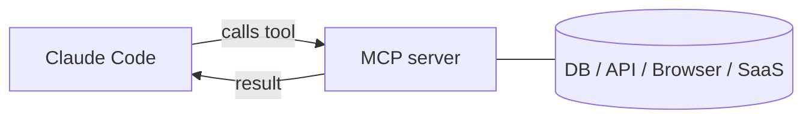

<LevelBadge level="advanced" />

<VerifyNote lastVerified="2026-06-23" source="https://code.claude.com/docs/en/mcp">
Os comandos `claude mcp`, os escopos de configuração e os transportes evoluem — confirme na documentação oficial de MCP do Claude Code e em modelcontextprotocol.io.
</VerifyNote>

O **Model Context Protocol (MCP)** é um padrão aberto para conectar a IA a ferramentas e dados externos. Um **servidor MCP** expõe capacidades (consultar um banco de dados, abrir um PR no GitHub, controlar um navegador); o Claude Code se conecta a ele e pode **chamar essas ferramentas** durante uma sessão. É assim que você estende o Claude para além do seu sistema de arquivos e shell.

<Callout type="objectives" items={["Explicar o que é um servidor MCP e como o Claude Code chama suas ferramentas", "Distinguir os dois transportes: stdio local vs. HTTP/SSE remoto", "Adicionar um servidor com claude mcp add e entender o JSON que ele escreve", "Escolher o escopo certo (local, project, user) para quem enxerga um servidor", "Conectar um banco de dados real ao Claude de ponta a ponta", "Evitar as armadilhas de segurança e configuração que pegam a maioria das pessoas"]} />

## O formato disso



Você declara os servidores que o Claude pode usar; cada servidor publica um conjunto de ferramentas com schemas; o Claude as escolhe e chama como qualquer outra ferramenta.

<Flashcards title="Vocabulário de MCP" cards={[{front: "Model Context Protocol (MCP)", back: "Um padrão aberto para conectar a IA a ferramentas e dados externos."}, {front: "Servidor MCP", back: "Um programa que expõe capacidades — consultar um banco de dados, abrir um PR no GitHub, controlar um navegador — como ferramentas chamáveis."}, {front: "Ferramenta", back: "Uma capacidade que um servidor MCP publica com um schema; o Claude a escolhe e chama como qualquer outra ferramenta."}, {front: "Transporte", back: "Como o Claude alcança um servidor: stdio (processo local) ou HTTP/SSE remoto (hospedado, frequentemente com OAuth)."}, {front: "Escopo", back: "Quem enxerga um servidor: local (você, neste projeto), project (a equipe, com commit) ou user (você, em todo lugar)."}]} />

## Transportes

Há duas formas de o Claude alcançar um servidor. Escolha pelo lugar onde o servidor roda.

- **stdio** — um processo local que o Claude inicia (ótimo para ferramentas/CLIs locais).
- **Remoto (HTTP/SSE)** — um servidor hospedado, frequentemente com OAuth.

## Configurando servidores

O caminho mais rápido é o comando `claude mcp add` — ele escreve a configuração para você. Siga esta sequência para sair do zero até um servidor conectado.

<Steps items={[{title: "Adicione um servidor stdio local", body: "Execute claude mcp add — tudo após o -- é o comando de inicialização que o Claude roda para você."}, {title: "Ou adicione um servidor HTTP remoto", body: "Passe --transport http e um escopo, depois a URL do servidor. Servidores remotos costumam ser hospedados e usam OAuth."}, {title: "Veja o que está conectado", body: "Execute claude mcp list para ver os servidores configurados e o status de conexão deles."}, {title: "Inspecione e autentique", body: "Use /mcp dentro de uma sessão para inspecionar as ferramentas de um servidor e autenticar servidores remotos."}]} />

<PromptCard title="Adicione um servidor stdio local">{`# A local stdio server (everything after -- is the launch command)
claude mcp add github -- npx -y @modelcontextprotocol/server-github`}</PromptCard>

<PromptCard title="Adicione um servidor HTTP remoto (compartilhado com o projeto)">{`# A remote HTTP server, shared with everyone on the project
claude mcp add --transport http --scope project linear https://mcp.linear.app/mcp`}</PromptCard>

Por baixo dos panos, isso é apenas JSON. Um servidor com escopo **project** vai para um `.mcp.json` na raiz do repositório — faça o commit dele e toda a sua equipe recebe as mesmas ferramentas:

```json
{
  "mcpServers": {
    "github": { "command": "npx", "args": ["-y", "@modelcontextprotocol/server-github"] }
  }
}
```

### O escopo decide quem enxerga o servidor

| Escopo | Onde fica | Use para |
|---|---|---|
| `local` (padrão) | suas configurações de usuário, apenas neste projeto | experimentos pessoais, segredos |
| `project` | `.mcp.json` no repositório (com commit) | ferramentas que toda a equipe deve compartilhar |
| `user` | suas configurações de usuário, todos os projetos | servidores que você quer em todo lugar |

Execute `claude mcp list` para ver o que está conectado e `/mcp` dentro de uma sessão para inspecionar ferramentas e autenticar servidores remotos. Veja [Configuração de MCP e Esqueletos de Servidor](/docs/templates/mcp-config) para modelos prontos para copiar e colar.

## Exemplo prático: dê ao Claude seu banco de dados

Digamos que você queira que o Claude responda perguntas consultando um Postgres local em vez de você colar os resultados das consultas. Adicione o servidor (escopo project, para que os colegas o herdem):

<PromptCard title="Adicione um servidor Postgres com escopo project">{`claude mcp add --scope project db -- npx -y @modelcontextprotocol/server-postgres "postgresql://localhost/app"`}</PromptCard>

Agora, em uma sessão, você pode fazer a pergunta em linguagem natural e deixar o Claude executar o ciclo de consulta por você:

<PromptCard title="Faça uma pergunta ao banco de dados">{`How many users signed up last week? Check the DB.`}</PromptCard>

O Claude chama a ferramenta `query` do servidor, recebe as linhas de volta e responde — sem o ciclo de copiar e colar. Como o escopo é project, um colega que fizer pull do repositório ganha a mesma capacidade no momento em que abrir o Claude Code. Mantenha a string de conexão somente leitura se você quiser apenas leituras.

## Confiança e segurança

<Callout type="warning" items={["Um servidor MCP executa código e pode ler dados e tomar ações — conecte apenas servidores em que você confia.", "Dê a cada servidor o menor privilégio de que ele precisa.", "Qualquer conteúdo externo que um servidor retorne pode carregar injeção de prompt.", "Revise servidores de terceiros antes de conectá-los."]} />

:::warning Trate servidores MCP como instalar software
Um servidor MCP executa código e pode ler dados e tomar ações. Conecte apenas servidores em que você confia, dê a eles o **menor privilégio** necessário e lembre-se de que qualquer conteúdo externo que eles retornem pode carregar [injeção de prompt](/docs/security/prompt-injection). Revise servidores de terceiros primeiro — veja [Revisando Código de Terceiros](/docs/security/reviewing-third-party-code).
:::

## MCP também nos apps

O MCP também alimenta os **Conectores** nos apps do Claude — mesmo padrão, superfície diferente. Veja [Conectores (MCP) nos Apps](/docs/claude-app/connectors) e, para a API, [MCP e Conexão com Ferramentas](/docs/api/mcp).

## Erros comuns

- **Escopo errado.** Um servidor adicionado no escopo `local` não aparecerá para os colegas; um que você queria apenas para si mesmo não deveria ter commit no escopo `project`. Escolha deliberadamente.
- **Servidores demais, ferramentas demais.** Cada servidor conectado adiciona os schemas de suas ferramentas ao contexto. Conecte o que a tarefa exige, não todo o seu catálogo.
- **Conexões com privilégios excessivos.** Dê a um servidor de banco de dados um papel somente leitura, a menos que o Claude realmente precise escrever. O MCP torna as capacidades reais — restrinja-as.
- **Esquecer o risco de injeção.** Qualquer coisa que um servidor retorne (uma página web, o corpo de uma issue, uma linha) é texto não confiável que pode carregar [injeção de prompt](/docs/security/prompt-injection). Não conecte um servidor poderoso com capacidade de escrita ao lado de um servidor não confiável com capacidade de leitura sem pensar bem nisso.

<Quiz title="Teste seus conhecimentos" questions={[{q: "Qual transporte é um processo local que o próprio Claude inicia?", options: ["HTTP/SSE remoto", "stdio", "OAuth"], answer: 1, explain: "stdio é um processo local que o Claude inicia — ideal para ferramentas e CLIs locais. O HTTP/SSE remoto é um servidor hospedado, frequentemente com OAuth."}, {q: "Onde um servidor com escopo project é escrito, e qual é o benefício?", options: ["Nas suas configurações de usuário; só você o enxerga", "Em um .mcp.json na raiz do repositório; faça o commit e toda a equipe recebe as mesmas ferramentas", "Em um cache global oculto; ninguém pode editá-lo"], answer: 1, explain: "O escopo project vai para um .mcp.json com commit na raiz do repositório, então colegas que fazem pull do repositório herdam as mesmas ferramentas."}, {q: "Por que manter uma conexão de banco de dados somente leitura quando o Claude só precisa ler?", options: ["Isso faz as consultas rodarem mais rápido", "Menor privilégio — o MCP torna as capacidades reais, então não conceda acesso de escrita a menos que seja realmente necessário", "Somente leitura é exigido pelo protocolo"], answer: 1, explain: "Dê aos servidores o menor privilégio de que precisam. O MCP torna as capacidades reais, então um papel somente leitura evita escritas não intencionais."}]} />

<Callout type="takeaways" items={["O MCP é um padrão aberto; um servidor MCP expõe ferramentas que o Claude Code chama como qualquer outra ferramenta.", "Dois transportes: stdio local (um processo que o Claude inicia) e HTTP/SSE remoto (hospedado, frequentemente OAuth).", "claude mcp add escreve a configuração para você; por baixo dos panos é JSON, e o escopo project fica em um .mcp.json com commit.", "O escopo controla a visibilidade: local (você, neste projeto), project (com commit para a equipe), user (você, em todo lugar).", "Trate servidores como instalar software: confiança, menor privilégio e atenção à injeção de prompt em tudo o que eles retornam."]} />

## Próximos passos

- [Construa e Conecte Seu Primeiro Servidor MCP (passo a passo)](/docs/walkthroughs/first-mcp-server)
- [Configuração de MCP e Esqueletos de Servidor](/docs/templates/mcp-config)
- [Protegendo Agentes e Ferramentas](/docs/security/securing-agents)
