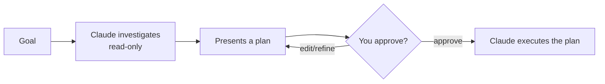

<LevelBadge level="beginner" />

<Callout type="objectives" items={["Explicar o que o Modo Plano faz e por que ele é somente leitura", "Decidir quando planejar primeiro e quando você pode pular essa etapa", "Percorrer o ciclo investigar-propor-aprovar-executar", "Distinguir o Modo Plano das Permissões e usá-los juntos"]} />

<VerifyNote lastVerified="2026-06-20" source="https://code.claude.com/docs/en">
A forma como você entra no Modo Plano (atalho/flag) pode mudar entre versões — verifique a documentação oficial do Claude Code.
</VerifyNote>

## A grande ideia

Imagine entregar as chaves da sua casa a um empreiteiro versus primeiro pedir que ele faça uma visita e descreva *o que* mudaria. O Modo Plano é essa visita.

O **Modo Plano** torna o Claude Code **somente leitura**: ele pode explorar sua base de código, executar buscas e raciocinar — mas **não vai editar arquivos nem executar comandos que alterem o estado**. Em vez disso, ele produz um plano e aguarda sua aprovação.

<Callout type="tip" items={["Somente leitura significa que o Claude PENSA, mas não AGE — nenhuma edição de arquivo, nenhum comando que altere o estado, até você dar o sinal verde."]} />

## Por que é a forma mais segura de começar

Para qualquer coisa grande, arriscada ou desconhecida, você quer ver *o que* o Claude pretende fazer antes que ele toque no seu repositório. O Modo Plano separa **pensar** de **fazer**:

A recompensa: você pega suposições erradas *antes* que elas virem código errado.

## Quando usá-lo

<Callout type="tip" items={["SEMPRE para mudanças grandes ou em múltiplos arquivos, migrações ou refatorações", "Quando estiver trabalhando em uma base de código que você ainda não conhece totalmente", "Quando você quiser um plano revisável para compartilhar com um colega de equipe"]} />

Para edições pequenas e óbvias, você pode pulá-lo — mas, na dúvida, planeje primeiro.

## Como funciona na prática

Siga o ciclo. Cada etapa conquista a próxima — o Claude só muda para o modo de edição *depois* que você aprova.

<Steps items={[{title: "Entre no Modo Plano e declare seu objetivo", body: "Mude para o modo somente leitura e, em seguida, descreva o que você quer alcançar."}, {title: "O Claude investiga", body: "Ele lê os arquivos relevantes e faz perguntas esclarecedoras."}, {title: "O Claude retorna um plano passo a passo", body: "Arquivos a mudar, a abordagem e como verificar o resultado."}, {title: "Você aprova ou refina", body: "Só após a aprovação o Claude muda para fazer as alterações."}]} />

### Experimente você mesmo

Copie isto em uma sessão de planejamento real e observe o ciclo acontecer:

<PromptCard title="Inicie uma sessão de planejamento">{`I want to migrate our auth from sessions to JWT. Stay in Plan Mode: investigate the current setup, ask anything you need, then propose a step-by-step plan with files to change and how to verify — don't edit anything yet.`}</PromptCard>

:::tip Combine com o CLAUDE.md
Um bom [CLAUDE.md](/docs/claude-code/claude-md) torna os planos mais precisos — o Claude planeja já tendo em mente suas convenções e proteções.
:::

## Modo Plano vs Permissões

Uma confusão clássica. Eles resolvem problemas diferentes e funcionam juntos:

- **Modo Plano** = "investigue e proponha, não aja ainda." (Esta página.)
- **[Permissões](/docs/claude-code/permissions)** = uma vez agindo, *quais* ações são permitidas sem perguntar.

Pense nisso como **se deve agir agora** (Modo Plano) versus **quais ações são permitidas uma vez agindo** (Permissões).

<Flashcards cards={[{front: "Em que estado o Modo Plano coloca o Claude Code?", back: "Somente leitura — ele pode explorar, buscar e raciocinar, mas não vai editar arquivos nem executar comandos que alterem o estado até você aprovar."}, {front: "Qual é o ciclo do Modo Plano?", back: "Investigar (somente leitura) → apresentar um plano → você aprova ou refina → o Claude executa."}, {front: "Quando você deve recorrer ao Modo Plano?", back: "Por padrão, para trabalhos grandes, arriscados ou desconhecidos (mudanças em múltiplos arquivos, migrações, refatorações, bases de código desconhecidas). Pule apenas edições pequenas e óbvias."}, {front: "Modo Plano vs Permissões?", back: "O Modo Plano governa SE deve agir agora; as Permissões governam QUAIS ações são permitidas uma vez agindo."}]} />

<Callout type="takeaways" items={["O Modo Plano é somente leitura: o Claude explora e propõe, mas nunca edita nem executa comandos que alterem o estado até você aprovar", "Use-o por padrão para trabalhos grandes, arriscados ou desconhecidos; pule apenas edições pequenas e óbvias", "O ciclo é investigar, propor, aprovar/refinar e executar", "O Modo Plano governa SE deve agir agora; as Permissões governam QUAIS ações são permitidas uma vez agindo"]} />

<Quiz title="Teste seus conhecimentos" questions={[{q: "O que o Claude Code pode fazer enquanto está no Modo Plano?", options: ["Editar arquivos e executar qualquer comando", "Explorar, buscar e raciocinar — mas não editar arquivos nem executar comandos que alterem o estado", "Apenas responder perguntas, sem nenhum acesso a arquivos"], answer: 1, explain: "O Modo Plano é somente leitura: o Claude pode explorar a base de código, executar buscas e raciocinar, mas não vai editar arquivos nem executar comandos que alterem o estado."}, {q: "Quando você deve recorrer ao Modo Plano?", options: ["Apenas para correções de erros de digitação de uma linha", "Para mudanças grandes ou em múltiplos arquivos, migrações, refatorações ou bases de código desconhecidas", "Nunca — ele só atrasa você"], answer: 1, explain: "Use-o sempre para mudanças grandes ou em múltiplos arquivos, migrações ou refatorações, e quando estiver trabalhando em uma base de código que você ainda não conhece totalmente. Edições pequenas e óbvias podem dispensá-lo."}, {q: "Qual é a ordem correta do ciclo do Modo Plano?", options: ["Executar, depois investigar, depois aprovar", "Investigar (somente leitura), apresentar um plano, você aprova ou refina, e então o Claude executa", "Aprovar primeiro, depois o Claude investiga e edita"], answer: 1, explain: "O Claude investiga em modo somente leitura, apresenta um plano, você aprova ou refina, e só então ele muda para executar o plano."}, {q: "Como o Modo Plano e as Permissões diferem?", options: ["São dois nomes para o mesmo recurso", "Modo Plano = investigar e propor, não agir ainda; Permissões = uma vez agindo, quais ações são permitidas sem perguntar", "As Permissões decidem se deve planejar; o Modo Plano decide quais arquivos editar"], answer: 1, explain: "O Modo Plano separa o pensar do fazer. As Permissões controlam quais ações são permitidas sem perguntar uma vez que o Claude está agindo. Eles funcionam juntos."}]} />

## Próximos passos

- [Permissões e Modos de Permissão](/docs/claude-code/permissions)
- [Gerenciamento de Contexto](/docs/claude-code/context-management) — mantenha sessões longas eficazes
- [Passo a passo: Personalize o Claude Code para um repositório real](/docs/walkthroughs/customize-claude-code)
