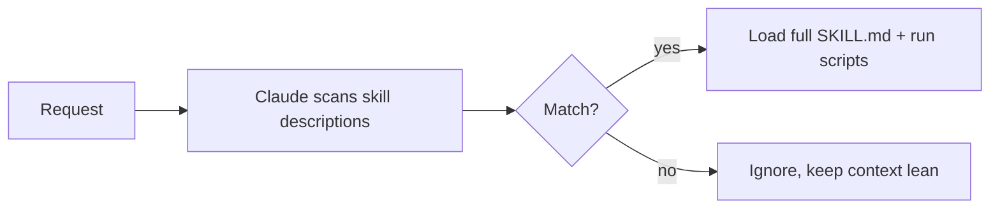

<LevelBadge level="advanced" />

<VerifyNote lastVerified="2026-06-23" source="https://code.claude.com/docs/en/skills">
O layout de arquivos de uma Skill, a divulgação progressiva e onde as skills rodam (Claude Code, Claude.ai, Cowork) estão evoluindo — confirme na documentação oficial de Skills.
</VerifyNote>

<Callout type="objectives" items={["Definir o que é uma Skill e como ela difere de enfiar tudo no CLAUDE.md", "Ler e escrever um SKILL.md — frontmatter mais instruções — e entender por que a description é o gatilho", "Explicar a divulgação progressiva e por que ela permite escalar muitas skills sem inchar o contexto", "Conhecer os três lugares onde as skills ficam: pessoal, projeto e empacotada em um plugin", "Escolher corretamente entre Skill, comando slash, subagente e MCP", "Evitar os quatro erros comuns que impedem as skills de serem acionadas"]} />

Uma **Skill** empacota expertise — instruções mais scripts e recursos opcionais — que o Claude carrega **apenas quando relevante**. Em vez de enfiar tudo no [CLAUDE.md](/docs/claude-code/claude-md), você dá ao Claude uma biblioteca de capacidades que ele puxa sob demanda.

## Anatomia

Uma skill é uma pasta com um `SKILL.md`: frontmatter YAML + instruções.

```markdown
---
name: pdf-forms
description: Use when the user needs to fill, read, or generate PDF forms.
---

# PDF Forms
Steps and rules for working with PDF forms…
(optionally reference scripts/ or resources/ in this folder)
```

<Callout type="tip" items={["A description é o gatilho — o Claude a lê para decidir quando ativar a skill. Escreva-a como \"Use when…\", específica o suficiente para que ela carregue no momento certo e não em outros casos."]} />

## Divulgação progressiva (por que as skills escalam)

O Claude não carrega o corpo completo de cada skill de antemão — ele vê o leve `name` + `description` e só puxa as instruções completas (e roda scripts) quando uma solicitação corresponde. Isso mantém o contexto enxuto mesmo com muitas skills instaladas.



## Onde elas ficam

<Steps items={[{title:"Pessoal", body:"~/.claude/skills/<name>/SKILL.md — permanece sua, disponível em todos os seus projetos."},{title:"Projeto (compartilhável)", body:".claude/skills/<name>/SKILL.md — faça o commit no git e toda a equipe ganha a capacidade."},{title:"Empacotada em um plugin", body:"Empacote skills dentro de um plugin para distribuição na equipe. Veja Plugins e Marketplaces."}]} />

O AILmanac fornece [7 pacotes de skills prontos](/docs/templates/skills) — copie um para experimentar.

## Exemplo prático: uma skill que aciona a si mesma

Crie `~/.claude/skills/release-notes/SKILL.md`:

```markdown
---
name: release-notes
description: Use when the user asks to write release notes or a changelog from git history.
---

# Release Notes
1. Run `git log <last-tag>..HEAD --oneline` to get the commits.
2. Group them into Features / Fixes / Breaking changes.
3. Write user-facing notes — what changed for *users*, not commit messages.
4. Output Markdown ready to paste into a GitHub release.
```

Mais tarde você digita o prompt abaixo. O Claude nunca teve essas etapas no contexto — mas a solicitação corresponde à `description`, então ele puxa o `SKILL.md` completo, roda o `git log` e produz notas agrupadas. Você não invocou nada pelo nome; a **description fez o roteamento**. Adicione um arquivo `scripts/` na mesma pasta e a skill pode executá-lo como parte do passo 1.

<PromptCard title="Acione a skill por intenção — sem precisar de nome">{`Draft release notes since v1.4.`}</PromptCard>

## Skill vs comando vs subagente vs MCP

| Ferramenta | O que é | Quem aciona: você vs Claude |
|---|---|---|
| [Comando slash](/docs/claude-code/slash-commands) | Um prompt salvo | **Você** o invoca |
| **Skill** | Expertise sob demanda + scripts | O **Claude** a carrega quando relevante |
| [Subagente](/docs/claude-code/subagents) | Um agente delegado com seu próprio contexto | O Claude delega |
| [MCP](/docs/claude-code/mcp) | Uma conexão com ferramentas/dados externos | Fornece ferramentas para chamar |

<Callout type="takeaways" items={["Você quer dispará-la sob demanda → comando slash.", "O Claude deve conhecer o procedimento e aplicá-lo quando relevante → skill.", "O trabalho deve acontecer em um contexto separado → subagente.", "Você precisa alcançar um sistema externo → MCP."]} />

## Erros comuns

<Callout type="warning" items={["Uma descrição que não aciona. \"Helps with PDFs\" é vago demais; \"Use when the user needs to fill, read, or generate PDF forms\" diz ao Claude exatamente quando carregá-la. A descrição é todo o mecanismo de ativação — escreva-a para correspondência, não para humanos.", "Colocar tudo no CLAUDE.md em vez disso. O CLAUDE.md carrega em toda sessão e custa contexto sempre; uma skill carrega apenas quando relevante. Mova procedimentos situacionais para skills e mantenha o CLAUDE.md para regras de projeto que são sempre verdadeiras.", "Uma única skill gigante. Muitas skills pequenas e descritas com precisão roteiam melhor do que uma que tenta abarcar tudo — a divulgação progressiva só ajuda se cada descrição for específica.", "Esquecer que é compartilhável. Uma skill de projeto em .claude/skills/ com commit no git dá a capacidade a toda a equipe; uma pessoal em ~/.claude/skills/ permanece sua."]} />

## Revisão dos termos

<Flashcards cards={[{front:"O que é uma Skill?", back:"Uma pasta com um SKILL.md que empacota instruções mais scripts e recursos opcionais, que o Claude carrega apenas quando relevante."},{front:"Qual é o gatilho de uma skill?", back:"O campo description — o Claude o lê para decidir quando ativar a skill. Escreva-o como \"Use when…\", específico o suficiente para carregar no momento certo e não em outros casos."},{front:"O que é divulgação progressiva?", back:"O Claude vê apenas o leve name + description de antemão e puxa o SKILL.md completo (e roda scripts) só quando uma solicitação corresponde — mantendo o contexto enxuto mesmo com muitas skills."},{front:"Localização da skill pessoal vs de projeto?", back:"Pessoal: ~/.claude/skills/<name>/SKILL.md (permanece sua). Projeto: .claude/skills/<name>/SKILL.md (faça commit no git para compartilhar com a equipe)."},{front:"Skill vs comando slash?", back:"Você invoca um comando slash sob demanda; o Claude carrega uma skill automaticamente quando a solicitação corresponde à descrição dela."},{front:"Skill vs CLAUDE.md?", back:"O CLAUDE.md carrega em toda sessão e sempre custa contexto; uma skill carrega apenas quando relevante. Mantenha as regras sempre verdadeiras no CLAUDE.md e os procedimentos situacionais nas skills."}]} />

## Teste seus conhecimentos

<Quiz title="Teste seus conhecimentos" questions={[{q:"Em um SKILL.md, o que realmente decide quando o Claude ativa a skill?", options:["O nome da pasta","O campo description no frontmatter","O primeiro título do corpo","A invocação manual pelo usuário"], answer:1, explain:"A description é o gatilho — o Claude a lê para decidir quando ativar a skill. Escreva-a como \"Use when…\", específica o suficiente para carregar no momento certo."},{q:"O que é divulgação progressiva?", options:["O Claude carrega o corpo completo de cada skill de antemão","O Claude vê apenas name + description, e carrega o SKILL.md completo só quando uma solicitação corresponde","As skills revelam suas etapas uma linha por vez ao usuário","O CLAUDE.md é carregado gradualmente ao longo de uma sessão"], answer:1, explain:"Divulgação progressiva significa que o Claude vê o leve name + description e só puxa as instruções completas (e roda scripts) quando uma solicitação corresponde — mantendo o contexto enxuto mesmo com muitas skills instaladas."},{q:"Você quer que TODA A EQUIPE ganhe uma capacidade via git. Onde você coloca a skill?", options:["~/.claude/skills/<name>/SKILL.md","/etc/claude/skills/","\.claude/skills/<name>/SKILL.md com commit no git","Dentro do CLAUDE.md"], answer:2, explain:"Uma skill de projeto em .claude/skills/ com commit no git dá a capacidade a toda a equipe; uma pessoal em ~/.claude/skills/ permanece sua."},{q:"Você quer disparar algo você mesmo, sob demanda, pelo nome. Qual ferramenta serve?", options:["Skill","Comando slash","Subagente","MCP"], answer:1, explain:"Regra prática: você quer dispará-la sob demanda → comando slash. O Claude carregando um procedimento quando relevante → skill; contexto separado → subagente; alcançar um sistema externo → MCP."},{q:"Por que preferir uma skill a colocar um procedimento situacional no CLAUDE.md?", options:["O CLAUDE.md não pode conter procedimentos","O CLAUDE.md carrega em toda sessão e sempre custa contexto, enquanto uma skill carrega apenas quando relevante","As skills rodam mais rápido que o CLAUDE.md","O CLAUDE.md não pode ser compartilhado via git"], answer:1, explain:"O CLAUDE.md carrega em toda sessão e custa contexto sempre; uma skill carrega apenas quando relevante. Mova procedimentos situacionais para skills e mantenha o CLAUDE.md para regras de projeto que são sempre verdadeiras."}]} />

## Próximos passos

- [Escreva Sua Primeira Skill (passo a passo)](/docs/walkthroughs/first-skill)
- [Modelos de SKILL.md](/docs/templates/skills)
- [Plugins e Marketplaces](/docs/claude-code/plugins-marketplaces)
