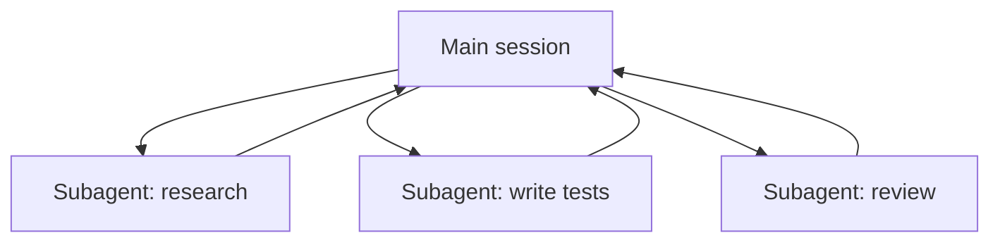

<LevelBadge level="advanced" />

<VerifyNote lastVerified="2026-06-23" source="https://code.claude.com/docs/en/sub-agents">
Os campos de frontmatter dos subagentes, o conjunto de agentes integrados e a interface `/agents` mudam ao longo do tempo — confirme na documentação oficial.
</VerifyNote>

<Callout type="objectives" items={["O que é um subagente — um Claude separado, com sua própria janela de contexto e um conjunto restrito de ferramentas","Os três motivos para delegar: proteger o contexto, especializar e paralelizar","Os agentes integrados aos quais o Claude já delega: Explore, Plan, General-purpose","Como definir o seu próprio subagente em .claude/agents/ e por que description + tools são os dois campos decisivos","Quando NÃO paralelizar, e como isso se conecta aos agentes da API e aos fluxos de trabalho em escala de frota"]} />

Um **subagente** é uma instância separada do Claude com sua **própria janela de contexto** e um **conjunto restrito de ferramentas**, ao qual sua sessão principal delega uma parte do trabalho. Ele reporta de volta um resultado, não toda a sua transcrição — então a sessão principal permanece focada e organizada.

## Por que delegar

Três funções, uma só ferramenta. Tenha-as em mente toda vez que recorrer a um subagente:

- **Proteja o contexto principal.** Uma investigação de pesquisa ou uma varredura grande de arquivos pode queimar milhares de tokens; faça isso em um subagente e apenas a conclusão retorna.
- **Especialize.** Dê a um subagente um system prompt sob medida e apenas as ferramentas de que ele precisa (por exemplo, um revisor somente leitura).
- **Paralelize.** Execute subtarefas independentes ao mesmo tempo — por exemplo, explore três módulos simultaneamente.

## Os integrados que você já tem

Antes de definir os seus próprios, saiba que o Claude Code vem com subagentes aos quais ele delega automaticamente:

| Integrado | O que faz |
| --- | --- |
| **Explore** | Um agente rápido e somente leitura (roda em um modelo mais barato) para buscar e entender uma base de código sem tocá-la. |
| **Plan** | Reúne contexto durante o modo de planejamento, para que a pesquisa fique fora da conversa principal somente leitura. |
| **General-purpose** | Um agente com todas as ferramentas para trabalho complexo e de múltiplas etapas que mistura exploração e mudanças. |

Você raramente invoca esses pelo nome; o Claude recorre a eles quando uma tarefa se encaixa. Subagentes personalizados são para os trabalhadores que *você* fica recriando com as mesmas instruções.

## Definindo os seus próprios

Um subagente é um arquivo Markdown com frontmatter YAML (o corpo se torna seu system prompt). Apenas `name` e `description` são obrigatórios; todo o resto é opcional. Armazene-o por projeto em `.claude/agents/` (faça commit no git para que a equipe compartilhe) ou por usuário em `~/.claude/agents/`. Crie um com o comando `/agents` ou manualmente.

<Steps items={[{title: "Escolha um local", body: "Por projeto em .claude/agents/ (faça commit para que a equipe compartilhe) ou por usuário em ~/.claude/agents/."},{title: "Crie o arquivo", body: "Use o comando /agents, ou escreva manualmente um arquivo Markdown com frontmatter YAML."},{title: "Defina os campos obrigatórios", body: "Apenas name e description são obrigatórios. Todo o resto é opcional."},{title: "Escreva o corpo como o system prompt", body: "O corpo Markdown abaixo do frontmatter se torna o system prompt do subagente."},{title: "Restrinja as ferramentas", body: "Adicione uma lista de permissões de ferramentas para que o subagente só possa fazer o que sua função exige."}]} />

Um subagente `code-reviewer` inicial:

<PromptCard title="subagente code-reviewer (.claude/agents/code-reviewer.md)">{`---
name: code-reviewer
description: Expert code reviewer. Use proactively after code changes.
tools: Read, Glob, Grep
model: sonnet
---

You are a senior reviewer. Read the changed files, then report only
high-confidence issues: correctness bugs, security risks, and missing
tests. For each, show the file:line, the problem, and a concrete fix.
Do not restate what the code does. Never edit files.`}</PromptCard>

Duas coisas tornam um subagente bom:

- **A `description` é o sinal de roteamento.** O Claude a lê para decidir *quando* delegar, então escreva-a como um gatilho — "Use proactively after code changes" o ativa automaticamente; um vago "helps with code" não vai. Esta é a linha de maior alavancagem do arquivo.
- **Restrinja as ferramentas com rigor.** O campo `tools` é uma lista de permissões (ou use `disallowedTools` como lista de negações). Um revisor que só consegue `Read, Glob, Grep` *não pode* editar seu código acidentalmente — a restrição é uma garantia, não uma sugestão. Omita `tools` e o subagente herda tudo o que a sessão principal tem.

## Exemplo prático: uma distribuição paralela de revisão

Você terminou uma funcionalidade que toca três módulos e quer uma verificação rápida e independente de cada um. Na sua sessão principal:

<PromptCard title="Distribua três revisores ao mesmo tempo">{`Review the changes in auth/, billing/, and api/ — use the code-reviewer subagent on each, in parallel.`}</PromptCard>

O Claude gera três instâncias `code-reviewer` ao mesmo tempo. Cada uma lê apenas seu módulo, consome seu próprio contexto com o conteúdo dos arquivos e retorna uma lista curta de achados. Sua sessão principal nunca vê os diffs brutos — apenas três relatórios organizados — e tudo termina em aproximadamente o tempo da instância de revisão mais lenta, em vez da soma das três. Como o revisor é somente leitura, três agentes trabalhando ao mesmo tempo não podem colidir em uma escrita.

## Quando NÃO paralelizar

<Callout type="warning" items={["Passos dependentes precisam ser sequenciais — não distribua trabalho onde o passo B precisa da saída do passo A.","Escritas compartilhadas de arquivos podem entrar em conflito; isole-as (veja Git Worktrees) ou serialize-as.","A sobrecarga de coordenação pode exceder o benefício em tarefas pequenas. Delegue quando a subtarefa for grande e independente."]} />

Para isolar escritas conflitantes, veja [Git Worktrees](/docs/claude-code/worktrees).

## Subagente vs os "agentes" da API/SDK

Esta página é sobre a delegação integrada do Claude Code. Construir seus *próprios* agentes programaticamente é [Construindo Agentes sobre a API](/docs/api/building-agents). O modelo mental — um objetivo, um loop de ferramentas, contexto isolado — é o mesmo.

## Erros comuns

<Flashcards title="Armadilhas — vire cada cartão para ver a solução" cards={[{front: "Uma description vaga", back: "Se ela não disser QUANDO usar o subagente, o Claude não vai delegar no momento certo (ou não vai delegar de jeito nenhum). Comece com \"Use when…\" / \"Use proactively after…\"."},{front: "Deixar as ferramentas totalmente abertas", back: "Um subagente destinado a revisar não deveria poder escrever. Uma lista de permissões transforma intenção em garantia."},{front: "Esperar memória compartilhada", back: "Um subagente recebe sua description, seu system prompt e a tarefa que você lhe entrega — não a sua conversa principal. Passe o contexto de que ele precisa na delegação."},{front: "Distribuir trabalho dependente", back: "O paralelismo só ajuda em subtarefas independentes; se B precisa da saída de A, execute-as em sequência."}]} />

## Quando alguns agentes não bastam

Delegar um punhado de subagentes por turno é o pão com manteiga desta página. Quando uma tarefa precisa de **dezenas ou centenas** de agentes — uma varredura por toda a base de código, uma migração de 500 arquivos, uma pesquisa cruzada entre muitas fontes — a orquestração ultrapassa uma única janela de contexto. É para isso que existem os [Fluxos de Trabalho Dinâmicos e o ultracode](/docs/claude-code/dynamic-workflows): o Claude escreve um script que mantém o plano, e um runtime distribui os agentes em segundo plano.

<Quiz title="Teste-se" questions={[{q: "Qual campo no frontmatter de um subagente é o sinal de roteamento que o Claude lê para decidir QUANDO delegar?", options: ["name", "description", "model"], answer: 1, explain: "A description é a linha de maior alavancagem — o Claude a lê para decidir quando delegar. Escreva-a como um gatilho, por exemplo \"Use proactively after code changes\"."}, {q: "Um subagente revisor recebe tools: Read, Glob, Grep. O que essa lista de permissões garante?", options: ["Que ele roda em um modelo mais barato", "Que ele não pode editar seu código acidentalmente", "Que ele herda as ferramentas da sessão principal"], answer: 1, explain: "O campo tools é uma lista de permissões, então um revisor limitado a Read, Glob, Grep não pode escrever — a restrição é uma garantia, não uma sugestão. Omitir tools, ao contrário, herdaria tudo."}, {q: "Quando paralelizar subagentes NÃO ajuda?", options: ["Quando as subtarefas são independentes e grandes", "Quando o passo B precisa da saída do passo A", "Quando cada agente lê um módulo diferente"], answer: 1, explain: "Passos dependentes precisam rodar sequencialmente. O paralelismo só ajuda em subtarefas independentes; se B precisa da saída de A, execute-as em sequência."}]} />

<Callout type="takeaways" items={["Um subagente é um Claude separado, com sua própria janela de contexto e ferramentas restritas; ele retorna um resultado, não sua transcrição.","Delegue para proteger o contexto principal, para especializar ou para paralelizar trabalho independente.","O Claude já vem com os integrados Explore, Plan e General-purpose e recorre a eles automaticamente.","name e description são os únicos campos obrigatórios do frontmatter — e a description é o sinal de roteamento que decide quando o Claude delega.","Uma lista de permissões de ferramentas transforma intenção em garantia; distribua apenas subtarefas independentes e isole escritas compartilhadas."]} />

## Próximos passos

- [Fluxos de Trabalho Dinâmicos e ultracode](/docs/claude-code/dynamic-workflows) — orqueste subagentes em escala de frota
- [Projete um Fluxo de Trabalho com Múltiplos Subagentes (passo a passo)](/docs/walkthroughs/multi-subagent-workflow)
- [Gerenciamento de Contexto](/docs/claude-code/context-management)
- [Git Worktrees](/docs/claude-code/worktrees)
