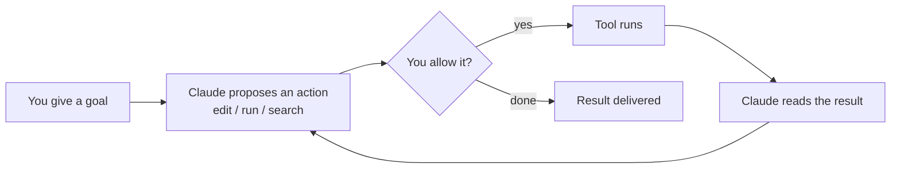

<LevelBadge level="beginner" />

<VerifyNote lastVerified="2026-06-20" source="https://code.claude.com/docs/en/overview">
Os comandos de instalação e o conjunto exato de recursos mudam com frequência. Trate a documentação oficial do Claude Code como fonte da verdade para a configuração.
</VerifyNote>

<Callout type="objectives" items={["Explicar o que torna o Claude Code agêntico, e não apenas uma janela de chat", "Visualizar o loop agêntico: objetivo, ação, permissão, observar, repetir", "Nomear as superfícies onde o Claude Code roda e como as configurações viajam com você", "Ordenar as coisas que você configura por alavancagem, começando pelo CLAUDE.md", "Percorrer o formato de uma primeira sessão segura usando o Modo Plano"]} />

O **Claude Code** é a ferramenta de codificação *agêntica* da Anthropic. Diferentemente de uma janela de chat, ele consegue de fato **fazer coisas no seu projeto**: ler e editar arquivos, executar comandos de shell, pesquisar na base de código e chamar ferramentas externas — tudo com a sua permissão.

## O modelo mental: um loop agêntico

Essa é a única ideia que faz todo o resto fazer sentido. Você dá um objetivo em linguagem simples ("adicione testes para o módulo de auth e corrija o que falhar"). O Claude **planeja, age, observa o resultado e repete** até que o objetivo seja alcançado. Você permanece no controle por meio de [permissões](/docs/claude-code) e do [Modo Plano](/docs/claude-code).

<Callout type="tip" items={["O loop só avança nas ações que você permite. Nada é editado ou executado sem passar por aquele portão de permissão — que é exatamente por isso que as próximas seções importam."]} />

## Onde você pode executá-lo

O mesmo Claude Code acompanha você entre as superfícies — ele **compartilha suas configurações, hooks e permissões** onde quer que você trabalhe.

- **Terminal (CLI)** — a superfície original; funciona em qualquer shell.
- **Extensões de IDE** — VS Code e JetBrains, com diffs inline.
- **Desktop e web** — e ele compartilha suas configurações, hooks e permissões entre as superfícies.

## O que você vai configurar (em ordem aproximada de alavancagem)

Pense nisto como uma escada: domine primeiro os degraus de cima e só depois adicione recursos avançados quando surgir uma necessidade real.

<Steps items={[{title: "CLAUDE.md", body: "Instruções persistentes do projeto. Maior impacto, menor esforço — comece por aqui."}, {title: "Modo Plano", body: "Investigue e proponha antes que qualquer edição seja executada."}, {title: "Permissões", body: "Decida o que o Claude pode fazer sem perguntar."}, {title: "settings.json", body: "O sistema de configuração completo por baixo de tudo."}, {title: "Recursos avançados", body: "Comandos slash, hooks, skills, subagentes e servidores MCP — adicionados em camadas conforme você precisar deles."}]} />

Cada degrau leva à sua própria lição: [CLAUDE.md](/docs/claude-code), [Modo Plano](/docs/claude-code), [Permissões](/docs/claude-code), [settings.json](/docs/claude-code), [Comandos slash](/docs/claude-code), [hooks](/docs/claude-code), [skills](/docs/claude-code), [subagentes](/docs/claude-code) e [servidores MCP](/docs/claude-code).

## Sua primeira sessão (o formato dela)

<Steps items={[{title: "Instale e autentique-se", body: "Veja a documentação oficial para os comandos atuais."}, {title: "Abra um projeto", body: "Entre (cd) em um projeto e inicie o Claude Code."}, {title: "Gere um CLAUDE.md inicial", body: "Execute /init para montar a estrutura das instruções do seu projeto."}, {title: "Peça algo pequeno e concreto", body: "Experimente: Explique como funciona o roteamento neste app."}, {title: "Faça uma mudança primeiro no Modo Plano", body: "Revise o plano proposto e depois deixe-o executar."}]} />

Dois comandos que vale a pena memorizar dessa primeira sessão:

<PromptCard title="Montar a estrutura das instruções do projeto">{`/init`}</PromptCard>

<PromptCard title="Uma primeira solicitação segura, somente leitura">{`Explain how routing works in this app.`}</PromptCard>

Para os comandos atuais de instalação e autenticação, veja a [documentação oficial](https://code.claude.com/docs/en/overview).

<Callout type="tip" items={["Comece em modo somente leitura. Para sua primeira tarefa de verdade, use o Modo Plano — o Claude investiga e mostra um plano sem tocar em arquivos. É a forma mais segura de construir confiança."]} />

## Termos-chave em resumo

<Flashcards title="Vocabulário do Claude Code" cards={[{front: "Ferramenta agêntica", back: "Uma ferramenta que executa ações no seu projeto — lê/edita arquivos, executa comandos, pesquisa código, chama ferramentas externas — não apenas uma janela de chat."}, {front: "Loop agêntico", back: "Objetivo em linguagem simples e, então, o Claude planeja, age, observa o resultado e repete até que o objetivo seja alcançado."}, {front: "Modo Plano", back: "O Claude investiga e propõe um plano antes que qualquer edição seja executada — a forma mais segura de começar."}, {front: "CLAUDE.md", back: "Instruções persistentes do projeto. Maior impacto, menor esforço; gerado com /init."}, {front: "Permissões", back: "O portão de controle: o que o Claude pode fazer sem perguntar a você primeiro."}]} />

<Quiz title="Verifique seu aprendizado" questions={[{q: "O que torna o Claude Code diferente de uma janela de chat?", options: ["Ele escreve respostas mais longas", "Ele pode executar ações no seu projeto — editar arquivos, executar comandos, pesquisar código — com a sua permissão", "Ele só funciona no terminal"], answer: 1, explain: "O Claude Code é agêntico: ele age no seu projeto (lê/edita arquivos, executa comandos de shell, pesquisa, chama ferramentas), tudo com a sua permissão."}, {q: "No loop agêntico, o que acontece logo depois que o Claude propõe uma ação?", options: ["A ferramenta é executada automaticamente", "Você decide se a permite", "O resultado é entregue"], answer: 1, explain: "Toda ação proposta passa por um portão de permissão — a ferramenta só é executada se você permitir."}, {q: "Qual etapa de configuração tem maior impacto com o menor esforço?", options: ["Servidores MCP", "Hooks", "CLAUDE.md"], answer: 2, explain: "CLAUDE.md — instruções persistentes do projeto — é listado primeiro porque tem o maior impacto com o menor esforço."}]} />

<Callout type="takeaways" items={["O Claude Code é agêntico: ele age no seu projeto com a sua permissão, não apenas conversa.", "O loop é objetivo, propor, permitir, executar, observar, repetir — você o controla por meio de permissões e do Modo Plano.", "Ele roda no terminal, no VS Code/JetBrains e no desktop e na web, compartilhando configurações, hooks e permissões entre as superfícies.", "Configure por alavancagem: CLAUDE.md primeiro, depois Modo Plano, Permissões, settings.json e, então, os recursos avançados.", "Comece uma primeira sessão em modo somente leitura no Modo Plano para construir confiança antes de deixar as edições serem executadas."]} />

## Próximos passos

- A configuração de maior alavancagem → [CLAUDE.md e Arquivos de Memória](/docs/claude-code)
- Faça de ponta a ponta → [Passo a passo: Personalize o Claude Code para um repositório real](/docs/walkthroughs)
- Crie suas próprias automações → [Modelos e Receitas](/docs/templates)
