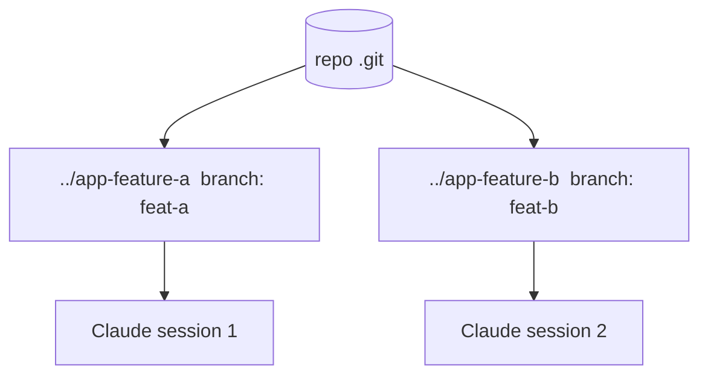

<LevelBadge level="advanced" />

<Callout type="objectives" items={["O que é um git worktree — um repositório, vários diretórios de trabalho, cada um em seu próprio branch","O problema exato que ele resolve: impedir que sessões paralelas do Claude colidam nos mesmos arquivos","Os quatro comandos para adicionar, listar e remover worktrees","Quando a técnica vale a pena — e as três armadilhas que mordem na hora do merge","Como worktrees se combinam com subagentes: paralelismo entre sessões versus dentro de uma só"]} />

Um **git worktree** permite que um único repositório tenha **vários diretórios de trabalho**, cada um com checkout em um branch diferente. Combine isso com o Claude Code e você poderá executar **várias sessões em paralelo** no mesmo projeto — cada uma editando seus próprios arquivos, sem colisões.

## O problema que ele resolve

Se duas sessões do Claude editam o mesmo diretório de trabalho ao mesmo tempo, elas tropeçam nas mudanças uma da outra. Os worktrees dão a cada sessão seu **próprio diretório e branch**, de modo que o trabalho paralelo permanece isolado até você fazer o merge.

## O básico

Quatro comandos sustentam todo o fluxo de trabalho: adicionar um worktree (novo diretório + novo branch), listar o que existe e remover um quando você terminar.

<Steps items={[{title: "Adicione um worktree para uma feature", body: "A partir do seu repositório, git worktree add ../app-feature-a -b feat-a cria um novo diretório E um novo branch de uma só vez."},{title: "Adicione outro para um fix", body: "git worktree add ../app-fix-123 -b fix-123 — um segundo diretório/branch isolado, lado a lado com o primeiro."},{title: "Veja o que você tem", body: "git worktree list mostra cada diretório de trabalho e o branch em que ele está."},{title: "Faça a limpeza ao terminar", body: "git worktree remove ../app-feature-a desmonta um worktree para que diretórios obsoletos não se acumulem."}]} />

<PromptCard title="O fluxo de trabalho de quatro comandos">{`# from your repo
git worktree add ../app-feature-a -b feat-a   # new dir + new branch
git worktree add ../app-fix-123 -b fix-123
git worktree list
# when done with one:
git worktree remove ../app-feature-a`}</PromptCard>

Abra uma sessão do Claude Code em cada diretório de worktree e deixe-as trabalhar de forma independente.

## Quando vale a pena

- **Features/fixes paralelos** que você quer fazer progredir ao mesmo tempo.
- **Uma tarefa longa em execução** em um worktree enquanto você continua trabalhando em outro.
- **Experimentos arriscados** isolados do seu checkout principal.

## Armadilhas

<Callout type="warning" items={["Fique atento ao merge de volta: os branches acabarão sendo mesclados — os conflitos aparecem nesse momento, não durante. Mantenha os worktrees focados e de vida curta.","Não execute recursos compartilhados com estado (um único banco de dados de dev, uma única porta) a partir de dois worktrees sem separá-los.","Faça a limpeza com git worktree remove para que diretórios obsoletos não se acumulem."]} />

## Worktrees versus subagentes

Dois eixos diferentes de paralelismo — eles não competem, eles se empilham.

| | O que ele paraleliza | Isolamento |
| --- | --- | --- |
| **[Subagentes](/docs/claude-code/subagents)** | Trabalho *dentro* de uma sessão (delegação) | Contexto isolado |
| **Worktrees** | Trabalho *entre* sessões no disco | Branches/arquivos isolados |

Eles se combinam bem: uma sessão em um worktree pode, ela mesma, gerar subagentes.

<Callout type="tip" items={["Use um worktree quando precisar de duas sessões do Claude tocando no mesmo repositório ao mesmo tempo; use um subagente quando uma sessão precisar transferir um bloco de trabalho para um contexto isolado."]} />

<Quiz title="Teste-se" questions={[{q: "O que um git worktree oferece?", options: ["Vários branches em um único diretório de trabalho", "Vários diretórios de trabalho para um repositório, cada um em seu próprio branch", "Uma cópia de backup da sua pasta .git"], answer: 1, explain: "Um git worktree permite que um único repositório tenha vários diretórios de trabalho, cada um com checkout em um branch diferente — assim, sessões paralelas não colidem."}, {q: "Qual comando cria um novo diretório E um novo branch em uma única etapa?", options: ["git worktree list", "git worktree add ../app-feature-a -b feat-a", "git worktree remove ../app-feature-a"], answer: 1, explain: "git worktree add ../app-feature-a -b feat-a cria o novo diretório e o novo branch juntos. list mostra os worktrees existentes; remove desmonta um deles."}, {q: "Quando os conflitos de merge de worktrees paralelos realmente aparecem?", options: ["Continuamente, enquanto ambas as sessões editam", "Na hora do merge de volta, não durante", "Nunca, porque os branches são isolados"], answer: 1, explain: "Os branches permanecem isolados enquanto você trabalha, então os conflitos não aparecem durante — eles surgem no merge de volta. Mantenha os worktrees focados e de vida curta para limitá-los."}, {q: "Como worktrees e subagentes se relacionam?", options: ["São a mesma funcionalidade com dois nomes", "Worktrees paralelizam entre sessões no disco; subagentes paralelizam dentro de uma sessão — e eles se combinam", "Você precisa escolher um; usar ambos quebra o isolamento"], answer: 1, explain: "Subagentes são paralelismo dentro de uma sessão (contexto isolado); worktrees são paralelismo entre sessões no disco (branches/arquivos isolados). Uma sessão em um worktree pode, ela mesma, gerar subagentes."}]} />

<Callout type="takeaways" items={["Um git worktree = um repositório, vários diretórios de trabalho, cada um em seu próprio branch — a base para sessões paralelas do Claude livres de colisão.","Duas sessões em um único diretório de trabalho tropeçam uma na outra; um worktree por sessão mantém arquivos e branches isolados até você fazer o merge.","git worktree add ../dir -b branch cria diretório + branch; list os mostra; remove faz a limpeza.","Vale a pena para features/fixes paralelos, tarefas de longa duração ao lado de outro trabalho e experimentos arriscados isolados.","Cuidado com o merge de volta, não compartilhe recursos com estado (banco de dados, porta) entre worktrees e sempre faça a limpeza — e lembre-se de que worktrees se combinam com subagentes."]} />

## A seguir

- [Subagentes e Agentes Paralelos](/docs/claude-code/subagents)
- [Modo Headless e o Agent SDK](/docs/claude-code/headless-and-agent-sdk)
- [Gerenciamento de Contexto](/docs/claude-code/context-management)
