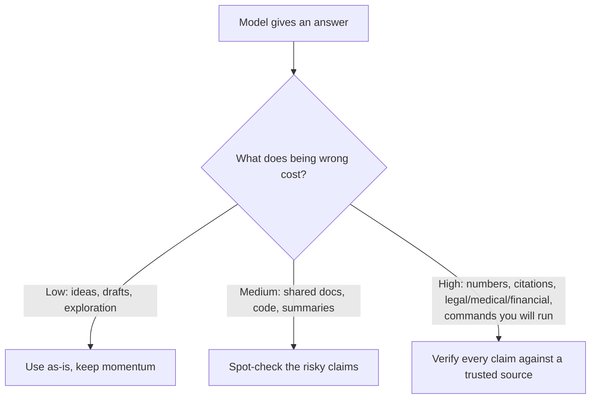

<LevelBadge level="intermediate" />

<Callout type="objectives" items={["Entender POR QUE os modelos inventam respostas confiantes e bem formuladas", "Reconhecer as 5 zonas de alto risco onde você deve ser mais cético", "Aplicar um kit de 6 partes para reduzir drasticamente as alucinações", "Usar um prompt anti-alucinação pronto para copiar e colar que fundamenta, dá uma saída e força citações", "Adotar a mentalidade que ajusta o esforço de verificação ao custo de estar errado"]} />

Uma **alucinação** é quando um modelo afirma algo falso com total confiança. Não é mentir nem estar quebrado — é o outro lado de como os LLMs funcionam: eles geram texto *plausível*, e plausível nem sempre é verdadeiro (veja [O que é um LLM?](/docs/foundations/what-is-an-llm)). Você não consegue eliminar isso totalmente via prompt, mas pode reduzi-lo drasticamente e detectar o resto.

## Por que acontece

O modelo prevê uma continuação provável. Quando ele não "sabe" algo, a continuação *de aparência mais provável* costuma ser uma resposta confiante, bem formulada — e errada. Não existe um sinal embutido de "não tenho certeza" a menos que você crie espaço para um.

<Callout type="tip" items={["A correção para a maioria das alucinações é criar deliberadamente espaço para a incerteza — dar ao modelo permissão para dizer que não sabe."]} />

## As zonas de alto risco

Seja mais cético quando a saída envolver:

- **Citações, frases e referências** — artigos inventados, URLs falsas, citações mal atribuídas.
- **Números, datas e estatísticas específicos** — valores plausíveis, porém inventados.
- **Fatos de nicho ou muito recentes** — além do que o modelo aprendeu de forma confiável.
- **Detalhes de APIs e bibliotecas** — métodos ou parâmetros que não existem.
- **Pessoas e especificidades jurídicas/médicas** — alto risco, fáceis de errar sutilmente.

## O kit de redução

Combine estes — cada um ajuda:

<Steps items={[
  {title: "Fundamente em fontes", body: "Cole o texto-fonte e diga \"responda apenas a partir do texto acima; se não estiver lá, diga isso.\" Essa é a ideia central por trás do RAG (/docs/foundations/rag)."},
  {title: "Dê uma saída", body: "Permita explicitamente \"Se você não tiver certeza, diga 'não sei'\" — isso reduz drasticamente os palpites confiantes."},
  {title: "Peça raciocínio e citações", body: "\"Cite a frase exata que sustenta cada afirmação.\" Afirmações sem suporte ficam óbvias."},
  {title: "Reduza a criatividade", body: "Para tarefas factuais em que o modelo expõe um controle de temperatura, abaixe-o (veja Controles de Amostragem em /docs/foundations/sampling-controls)."},
  {title: "Use ferramentas", body: "Para matemática, dados atuais ou consultas, dê ao modelo uma calculadora/busca/ferramenta (/docs/api/tool-use) em vez de confiar na memória."},
  {title: "Faça verificação cruzada", body: "Pergunte a mesma coisa de duas formas, ou faça uma segunda passagem criticar a primeira."}
]} />

## Um prompt anti-alucinação para copiar e colar

A maior parte do kit acima se condensa em um único wrapper reutilizável. Cole sua fonte onde indicado e faça sua pergunta — ele fundamenta a resposta, dá ao modelo uma saída e força citações de uma só vez:

<PromptCard title="Wrapper anti-alucinação">{`You answer ONLY from the SOURCE below.
Rules:
- If the answer is not in the SOURCE, reply exactly: "Not stated in the source."
- After every claim, quote the exact sentence from the SOURCE that supports it.
- Do not add outside knowledge, estimates, or assumptions.

SOURCE:
"""
[paste the document, transcript, or data here]
"""

QUESTION: [your question]`}</PromptCard>

Por que funciona: a saída de emergência "Not stated in the source" remove a pressão de adivinhar, e a regra de citar-a-frase torna impossível esconder qualquer afirmação sem suporte. Remova o bloco SOURCE quando você realmente quiser o conhecimento próprio do modelo — mas aí a verificação volta a ser sua responsabilidade.

## A mentalidade que de fato protege você

<Callout type="warning" items={["Nenhum prompt torna a saída 100% confiável. Para qualquer coisa relevante — um número em um relatório, uma citação, um comando que você vai executar, um detalhe médico/jurídico/financeiro — confira contra uma fonte confiável. Trate a IA como um rascunho rápido, não como uma autoridade final. Esse é o cerne do Uso Responsável (/docs/security/responsible-use)."]} />

Uma regra simples: **o custo de errar define a quantidade de verificação.** Fazendo brainstorming? Confie à vontade. Publicando uma estatística? Verifique sempre.

<Callout type="takeaways" items={["Alucinações são um subproduto da geração baseada em plausibilidade, não um bug que você consegue eliminar totalmente via prompt.", "Seja mais cético com citações, números/datas, fatos de nicho ou recentes, detalhes de API e especificidades sobre pessoas/jurídicas/médicas.", "Combine o kit: fundamente em fontes, dê uma saída, exija citações, reduza a temperatura, use ferramentas, faça verificação cruzada.", "Um único prompt-wrapper fundamenta + dá uma saída + força citações de uma só vez.", "Ajuste o esforço de verificação ao custo de errar — confie à vontade quando for barato, verifique cada afirmação quando for relevante."]} />

<Quiz title="Teste-se" questions={[
  {
    q: "Por que os modelos alucinam?",
    options: [
      "Eles estão mentindo deliberadamente para o usuário",
      "Eles preveem a continuação de aparência mais plausível, que nem sempre é verdadeira",
      "Eles estão quebrados e precisam ser retreinados",
      "Eles sempre ficam sem memória no meio da resposta"
    ],
    answer: 1,
    explain: "A alucinação é o outro lado de como os LLMs funcionam: eles geram texto plausível, e plausível nem sempre é verdadeiro. Quando o modelo não sabe algo, a continuação de aparência mais provável costuma ser confiante, bem formulada e errada."
  },
  {
    q: "Qual destas é uma zona de alto risco onde você deve ser mais cético?",
    options: [
      "Brainstorming aberto em busca de ideias",
      "Reformular uma frase que você já escreveu",
      "Números, datas e estatísticas específicos",
      "Pedir uma definição simples que você pode conferir rapidamente"
    ],
    answer: 2,
    explain: "Números, datas e estatísticas específicos são uma zona de alto risco — eles podem ser plausíveis, mas inventados. Outras zonas de alto risco incluem citações/frases, fatos de nicho ou recentes, detalhes de API e especificidades sobre pessoas/jurídicas/médicas."
  },
  {
    q: "Qual é o efeito mais direto de dar ao modelo uma saída explícita como \"Se você não tiver certeza, diga 'não sei'\"?",
    options: [
      "Torna o modelo mais rápido",
      "Reduz drasticamente os palpites confiantes",
      "Aumenta a temperatura automaticamente",
      "Conecta o modelo a uma busca ao vivo"
    ],
    answer: 1,
    explain: "Permitir explicitamente que o modelo diga que não sabe remove a pressão de produzir um palpite confiante, o que reduz drasticamente as respostas alucinadas."
  },
  {
    q: "Qual regra decide quanta verificação uma resposta precisa?",
    options: [
      "O comprimento da resposta",
      "O nível de confiança declarado pelo modelo",
      "O custo de errar",
      "Quanto tempo o prompt levou para ser escrito"
    ],
    answer: 2,
    explain: "O custo de errar define a quantidade de verificação. Fazendo brainstorming? Confie à vontade. Publicando uma estatística? Verifique sempre."
  },
  {
    q: "No prompt do wrapper anti-alucinação, o que torna impossível esconder qualquer afirmação sem suporte?",
    options: [
      "Reduzir a temperatura para zero",
      "A regra de citar a frase de suporte exata da SOURCE após cada afirmação",
      "Fazer a pergunta duas vezes",
      "Remover o bloco SOURCE"
    ],
    answer: 1,
    explain: "A regra de citar-a-frase força o modelo a sustentar cada afirmação com uma frase exata da SOURCE, então qualquer afirmação que não tenha suporte real fica óbvia. A saída de emergência \"Not stated in the source\" remove a pressão de adivinhar."
  }
]} />

## Próximo

- [Geração Aumentada por Recuperação (RAG)](/docs/foundations/rag)
- [Avaliando a Qualidade da IA (Evals)](/docs/foundations/evals)
- [Uso Responsável, Ética e Verificação](/docs/security/responsible-use)
