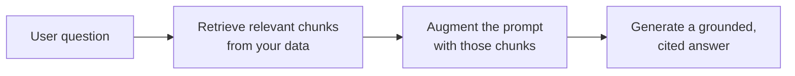

<LevelBadge level="intermediate" />

<Callout type="objectives" items={[
  "O que é RAG e o ciclo recuperar-aumentar-gerar",
  "Como indexar, recuperar, aumentar e gerar com citações",
  "Por que o RAG supera o fine-tuning para necessidades de 'responder sobre os meus documentos'",
  "Os cinco modos de falha que destroem a qualidade do RAG",
  "Um prompt de fundamentação pronto para copiar e colar que fecha as duas maiores lacunas"
]} />

O **RAG** faz um modelo responder a perguntas sobre os **seus** dados — documentos, uma base de conhecimento, uma base de código — com os quais ele nunca foi treinado. A ideia é simples: **recuperar** os trechos relevantes, **aumentar** o prompt com eles e então **gerar** uma resposta fundamentada nesses trechos.

## O ciclo

<Steps items={[
  {title: "Indexe os seus dados", body: "Divida em chunks, gere os embeddings deles (veja /docs/foundations/embeddings) e armazene em um índice vetorial (e/ou de palavra-chave)."},
  {title: "Recupere", body: "Puxe os principais chunks mais relevantes para a pergunta."},
  {title: "Aumente", body: "Coloque esses chunks no prompt com uma instrução como \"Responda apenas a partir do contexto abaixo; se não estiver lá, diga isso.\""},
  {title: "Gere", body: "Produza a resposta — e, idealmente, cite de qual chunk veio cada afirmação."}
]} />

Para a etapa de embedding na indexação, veja [Embeddings e Busca Vetorial](/docs/foundations/embeddings).

## Por que RAG em vez de fine-tuning?

<Callout type="tip" items={[
  "Atualizado: atualize os dados, não o modelo",
  "Verificável: fornece citações",
  "Barato: muito mais barato do que retreinar"
]} />

Para a maioria das necessidades de "responder sobre os meus documentos", o RAG é a primeira ferramenta certa — veja [Fine-tuning vs Prompting vs RAG](/docs/foundations/finetune-vs-prompt-vs-rag).

## Os modos de falha (onde a qualidade do RAG morre)

<Callout type="warning" items={[
  "Recuperação ruim = resposta ruim. Se o chunk certo não for recuperado, o modelo não pode usá-lo. A maioria dos problemas de 'o RAG está errado' são problemas de recuperação.",
  "Chunking grosso/fino demais arruína a relevância (veja embeddings).",
  "Sem instrução de fundamentação: o modelo mistura fatos recuperados com os próprios palpites. Diga a ele para responder apenas a partir do contexto e para admitir lacunas.",
  "Enfiar coisas demais: chunks irrelevantes diluem o sinal e custam tokens. Recupere poucos chunks de alta qualidade.",
  "Sem citações: você não consegue verificar, então não consegue confiar."
]} />

A falha de chunking remete a [embeddings](/docs/foundations/embeddings), e enfiar coisas demais custa [tokens](/docs/foundations/tokens-and-context).

<Callout type="tip" items={[
  "Avalie a recuperação separadamente: meça 'recuperamos o chunk certo?' à parte de 'o modelo respondeu bem?'. Isso localiza o problema rápido. Veja Evals (/docs/foundations/evals)."
]} />

## Copiar e colar: um prompt de fundamentação

A correção de maior alavancagem é uma instrução de fundamentação. Insira os seus chunks recuperados em um modelo como este — ele força o modelo a responder *apenas* a partir do contexto, citar cada afirmação e admitir lacunas em vez de chutar:

<PromptCard title="Prompt de fundamentação">{`You are answering strictly from the context below.

Rules:
- Use ONLY the context to answer. Do not use outside knowledge.
- Cite the source after each claim, like [chunk 2].
- If the answer is not in the context, reply exactly:
  "I don't have that in the provided sources."
- Quote numbers and names verbatim — never paraphrase a figure.

Context:
[chunk 1] ...
[chunk 2] ...
[chunk 3] ...

Question: <the user's question>`}</PromptCard>

Combine-o com *alguns* chunks de alta qualidade (não tudo o que você recuperou) e você fecha as duas maiores lacunas de uma vez: a mistura alucinada e as respostas não verificáveis. Depois [avalie](/docs/foundations/evals) a recuperação e a geração separadamente para saber qual metade ajustar.

## Domine os termos

<Flashcards cards={[
  {front: "RAG", back: "Recuperar os trechos relevantes dos seus dados, aumentar o prompt com eles e então gerar uma resposta fundamentada nesses trechos."},
  {front: "Etapa de indexação", back: "Dividir os dados em chunks, gerar os embeddings deles, armazenar em um índice vetorial e/ou de palavra-chave."},
  {front: "Etapa de aumento", back: "Colocar os chunks recuperados no prompt com uma instrução de fundamentação: responder apenas a partir do contexto, admitir lacunas."},
  {front: "Por que RAG em vez de fine-tuning", back: "Atualizado (atualize os dados, não o modelo), fornece citações, muito mais barato do que retreinar."},
  {front: "Modo de falha nº 1 do RAG", back: "Recuperação ruim. Se o chunk certo não for recuperado, o modelo não pode usá-lo — a maioria dos problemas de 'o RAG está errado' são problemas de recuperação."},
  {front: "Instrução de fundamentação", back: "Diga ao modelo para responder APENAS a partir do contexto, citar cada afirmação e avisar quando a resposta não estiver lá."}
]} />

<Quiz title="Teste seus conhecimentos" questions={[
  {
    q: "O que as três letras de RAG significam, em ordem?",
    options: ["Ler, Analisar, Gerar", "Recuperar, Aumentar, Gerar", "Classificar, Agregar, Agrupar", "Reduzir, Anexar, Gerar"],
    answer: 1,
    explain: "RAG = Recuperar (Retrieve) os chunks relevantes, Aumentar (Augment) o prompt com eles e então Gerar (Generate) uma resposta fundamentada."
  },
  {
    q: "Quando 'o RAG está errado', qual é mais frequentemente o problema real?",
    options: ["O modelo é pequeno demais", "Recuperação — o chunk certo não foi puxado", "Poucos tokens na janela de contexto", "Os embeddings foram ajustados com fine-tuning de forma errada"],
    answer: 1,
    explain: "Recuperação ruim = resposta ruim. Se o chunk certo não for recuperado, o modelo não pode usá-lo. A maioria dos problemas de 'o RAG está errado' são problemas de recuperação."
  },
  {
    q: "Por que o RAG costuma ser preferido em vez do fine-tuning para 'responder sobre os meus documentos'?",
    options: ["Ele torna o modelo maior", "Ele mantém o conhecimento atualizado, dá citações e é mais barato do que retreinar", "Ele elimina a necessidade de qualquer prompt", "Ele garante que o modelo nunca aluciona"],
    answer: 1,
    explain: "O RAG mantém o conhecimento atualizado (atualize os dados, não o modelo), fornece citações e é muito mais barato do que retreinar."
  },
  {
    q: "Qual é a única correção de maior alavancagem para impedir que o modelo misture fatos com palpites?",
    options: ["Recuperar todos os chunks possíveis", "Uma instrução de fundamentação que força respostas apenas a partir do contexto", "Aumentar a temperatura", "Pular as citações para economizar tokens"],
    answer: 1,
    explain: "Uma instrução de fundamentação força o modelo a responder apenas a partir do contexto, citar cada afirmação e admitir lacunas em vez de chutar."
  },
  {
    q: "Por que avaliar a recuperação separadamente da geração?",
    options: ["É exigido pelo provedor do modelo", "Localiza o problema rápido — você sabe qual metade ajustar", "Reduz o custo de tokens automaticamente", "A geração não pode ser medida de outra forma"],
    answer: 1,
    explain: "Medir 'recuperamos o chunk certo?' à parte de 'o modelo respondeu bem?' localiza o problema rápido e diz qual metade ajustar."
  }
]} />

<Callout type="takeaways" items={[
  "RAG = recuperar os chunks relevantes, aumentar o prompt, gerar uma resposta fundamentada e com citações.",
  "Indexar (chunk + embed + armazenar), recuperar os principais chunks, aumentar com uma instrução de fundamentação, gerar com citações.",
  "Prefira RAG em vez de fine-tuning para perguntas e respostas sobre documentos: atualizado, com citações, mais barato.",
  "A maioria das falhas são falhas de recuperação — recupere poucos chunks de alta qualidade, não tudo.",
  "Sempre adicione uma instrução de fundamentação e cite; avalie a recuperação e a geração separadamente."
]} />

## Próximo

- [Embeddings e Busca Vetorial](/docs/foundations/embeddings)
- [Fine-tuning vs Prompting vs RAG](/docs/foundations/finetune-vs-prompt-vs-rag)
- [Playbook de Pesquisa e Síntese](/docs/playbooks/research)
