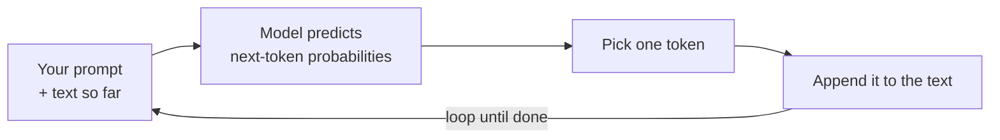

<LevelBadge level="beginner" />

Um **Large Language Model** (LLM) — a tecnologia por trás do Claude — faz uma coisa enganosamente simples: lê texto e **prevê o que vem a seguir**, um pedaço de cada vez. É isso. Todo o resto emerge de fazer isso surpreendentemente bem.

<Callout
  type="objectives"
  items={[
    "Captar o modelo mental em uma frase: um LLM é um autocompletar muito sofisticado",
    "Ver como o modelo constrói uma resposta um token de cada vez, em um laço",
    "Entender por que esse mecanismo explica tanto seus pontos fortes quanto suas peculiaridades",
    "Saber o que um LLM NÃO é — e como isso muda a forma como você o usa"
  ]}
/>

## O modelo mental em uma frase

> Um LLM é um autocompletar muito sofisticado que leu uma quantidade enorme de texto e aprendeu os padrões de como a linguagem — e as ideias dentro dela — tendem a continuar.

Quando você faz uma pergunta, o modelo não está "consultando" uma resposta. Ele está gerando a continuação mais plausível do seu texto, token a token (veja [Tokens e Contexto](/docs/foundations/tokens-and-context)). Continuações plausíveis de uma boa pergunta costumam ser boas respostas — e é por isso que isso funciona.

:::tip Analogia: teclado preditivo turbinado
Pense no autocompletar do seu celular que sugere a próxima palavra. Agora imagine que ele tivesse lido a maioria dos livros, artigos e códigos da internet — e sugerisse não apenas a próxima palavra, mas um ensaio inteiro, uma tradução ou um programa que se encaixa. Essa é a intuição por trás de um LLM.
:::

## Um token de cada vez

Todo o motor é um laço: leia tudo até agora, preveja o próximo pedaço, anexe-o, repita.

<Steps
  items={[
    {title: "Ler", body: "O modelo recebe o seu prompt mais tudo o que foi gerado até agora como um único bloco de texto."},
    {title: "Prever", body: "Ele calcula as probabilidades de qual poderia ser o próximo token."},
    {title: "Escolher", body: "Ele seleciona um token. Se isso é determinístico ou um pouco aleatório é o que controles de amostragem como a temperatura ajustam."},
    {title: "Anexar e repetir", body: "O token escolhido é adicionado ao texto, e o texto um pouco mais longo é realimentado — repetindo até a resposta estar completa."}
  ]}
/>

Cada etapa só prevê **um** token, e então realimenta o texto um pouco mais longo. O modelo não tem um plano para a resposta inteira de antemão — a coerência emerge de fazer essa previsão extremamente bem, milhares de vezes. Como a etapa de "escolher um token" se comporta (gananciosa vs. um pouco aleatória) é o que os [controles de amostragem](/docs/foundations/sampling-controls) como a temperatura ajustam.

## Por que isso explica seus pontos fortes

Como aprendeu padrões em textos, código e raciocínio, um LLM consegue, com fluidez, **escrever, resumir, traduzir, explicar e programar** — tarefas que são todas "continue este texto de forma sensata". Dê a ele uma configuração clara e ele produz uma forte continuação. É por isso que [prompting](/docs/prompting/basics) importa tanto: você está moldando o começo do texto que ele continua.

## Por que isso explica suas peculiaridades

O mesmo mecanismo explica as arestas:

- **Pode estar confiantemente errado.** Uma continuação que soa fluente nem sempre é verdadeira — isso é [alucinação](/docs/foundations/hallucinations).
- **Não "sabe" de verdade os fatos de hoje** a menos que você os forneça ou que ele tenha uma ferramenta para consultá-los.
- **Não tem memória** entre conversas, a menos que você lhe dê alguma.

## O que um LLM **não** é

:::warning Ajuste suas expectativas e você terá melhores resultados
- ❌ **Não é um banco de dados ou mecanismo de busca.** Ele gera, não recupera registros verificados.
- ❌ **Não é uma calculadora.** Ele consegue raciocinar sobre matemática, mas não há garantia de exatidão — dê a ele ferramentas para isso.
- ❌ **Não é uma pessoa.** Sem sentimentos, intenções ou memória contínua. É um motor de texto poderoso.
:::

Trate-o como um assistente brilhante, rápido e bem-lido que ocasionalmente se confunde — e **verifique** o que importa.

## Termos-chave

<Flashcards
  title="Revise os conceitos centrais"
  cards={[
    {front: "LLM (Large Language Model)", back: "A tecnologia por trás do Claude. Ele lê texto e prevê o que vem a seguir, um pedaço de cada vez."},
    {front: "Previsão do próximo token", back: "O laço central: ler o texto até agora, prever o próximo token, anexá-lo, repetir até concluir."},
    {front: "Token", back: "O pedaço de texto que o modelo prevê a cada etapa. O modelo só prevê um de cada vez."},
    {front: "Alucinação", back: "Uma continuação que soa fluente mas não é de fato verdadeira — um efeito colateral de gerar, não de recuperar."},
    {front: "Amostragem / temperatura", back: "Controla como a etapa de 'escolher um token' se comporta — gananciosa vs. um pouco aleatória."}
  ]}
/>

<Callout
  type="takeaways"
  items={[
    "Um LLM é um autocompletar muito sofisticado — ele prevê o próximo token, não consulta uma resposta",
    "A coerência emerge de executar esse laço de previsão um token de cada vez, milhares de vezes",
    "O mesmo mecanismo explica seus pontos fortes (escrever, resumir, traduzir, explicar, programar) e suas peculiaridades (confiantemente errado, sem fatos ao vivo, sem memória)",
    "Ele não é um banco de dados, uma calculadora ou uma pessoa — verifique o que importa"
  ]}
/>

## Teste seu conhecimento

<Quiz
  title="Teste seu conhecimento"
  questions={[
    {
      q: "O que um LLM faz fundamentalmente quando você lhe faz uma pergunta?",
      options: [
        "Consulta a resposta em um banco de dados de fatos verificados",
        "Gera a continuação mais plausível do seu texto, um token de cada vez",
        "Pesquisa na web ao vivo a resposta mais recente"
      ],
      answer: 1,
      explain: "Um LLM não está consultando nada — ele gera a continuação mais plausível do seu texto, token a token."
    },
    {
      q: "Por que um LLM pode estar confiantemente errado?",
      options: [
        "Uma continuação que soa fluente nem sempre é verdadeira — isso é alucinação",
        "Ele fica sem memória no meio da resposta",
        "Ele se recusa a responder perguntas que não conhece"
      ],
      answer: 0,
      explain: "Ele gera texto que soa plausível em vez de recuperar registros verificados, então uma continuação fluente ainda pode ser falsa — isso é alucinação."
    },
    {
      q: "Qual afirmação sobre um LLM está correta?",
      options: [
        "É um mecanismo de busca que recupera registros verificados",
        "É uma calculadora com garantia de exatidão",
        "Não é uma pessoa e não tem memória contínua entre conversas, a menos que você lhe dê alguma"
      ],
      answer: 2,
      explain: "Um LLM é um motor de texto poderoso — não um banco de dados, calculadora ou pessoa. Ele não tem memória entre conversas, a menos que você a forneça."
    }
  ]}
/>

## Próximo

- [Tokens, Contexto e Memória](/docs/foundations/tokens-and-context)
- [Alucinações e Como Reduzi-las](/docs/foundations/hallucinations)
- [Fundamentos de Prompting](/docs/prompting/basics)
