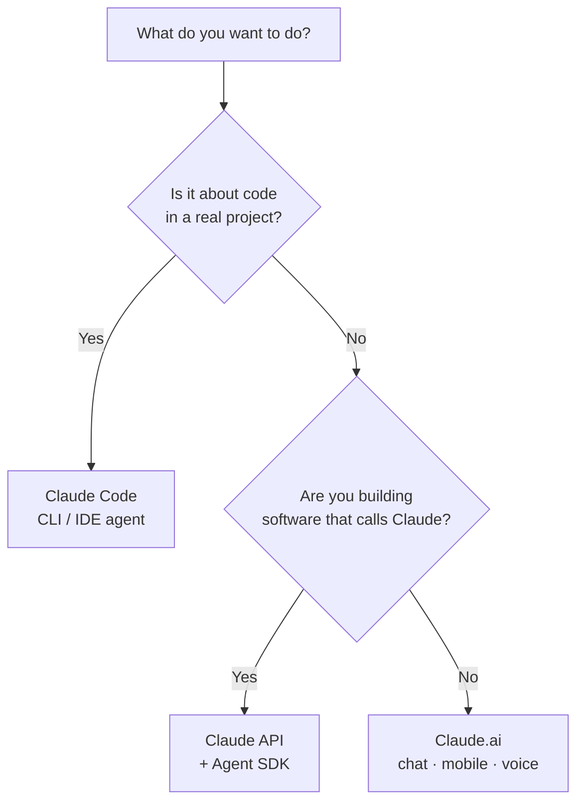

<LevelBadge level="beginner" />

O "Claude" vem em algumas versões. Escolha por **o que você está tentando fazer**, não por qual delas você já ouviu falar.

<Callout type="objectives" items={[
  "Combine seu objetivo com a superfície certa do Claude: chat, Claude Code ou a API",
  "Saiba quando o mobile e a voz se encaixam no quadro",
  "Entenda como as três superfícies funcionam juntas à medida que você evolui",
  "Tenha uma noção rápida de qual modelo escolher assim que começar a construir"
]} />

## A decisão em 30 segundos

## As três superfícies em resumo

| Superfície | Melhor para | Para quem | Comece aqui |
|---|---|---|---|
| **Claude.ai** | Escrita, pesquisa, análise, aprendizado, planejamento, perguntas do dia a dia | Todo mundo, sem configuração | [Primeiros Passos com o Claude.ai](/docs/claude-app/getting-started) |
| **Claude Code** | Trabalhar *em uma base de código* — ler, editar, executar comandos, corrigir testes | Desenvolvedores (e os tecnicamente curiosos) | [O que é o Claude Code](/docs/claude-code/what-is-claude-code) |
| **API & Agent SDK** | Apps, automações e agentes que chamam o Claude programaticamente | Desenvolvedores lançando um produto ou pipeline | [Sua Primeira Chamada de API](/docs/api/first-call) |

### Claude.ai — os aplicativos de chat

O Claude.ai é o ponto de partida sem configuração para todo mundo. Você também o tem no **mobile** ([iOS/Android](/docs/claude-app/mobile)) e por **[voz](/docs/claude-app/voice-mode)** — ótimo para capturar ideias em movimento. Potencialize-o com [Projetos](/docs/claude-app/projects), [instruções personalizadas](/docs/claude-app/custom-instructions) e [Artefatos](/docs/claude-app/artifacts).

### Claude Code — a ferramenta agêntica de programação

O Claude Code funciona *dentro* do seu projeto. Ele lê, edita, executa comandos e corrige testes — atuando nos seus arquivos com a sua permissão.

### A API & o Agent SDK — incorpore o Claude ao seu próprio software

A API e o Agent SDK permitem que seu próprio software chame o Claude programaticamente, para que você possa lançar recursos de IA, automações e agentes.

## Eles funcionam juntos

Estes não são produtos rivais — a maioria das pessoas evolui por todos eles:

| Você quer… | Use |
|---|---|
| Redigir um e-mail, resumir um PDF, fazer brainstorming | Claude.ai (ou voz/mobile) |
| Refatorar um módulo, adicionar testes, corrigir um bug | Claude Code |
| Adicionar um recurso de IA ao *seu* app | A API / Agent SDK |

:::tip Em dúvida? Comece pelo chat
O [Claude.ai](/docs/claude-app/getting-started) não exige nenhuma configuração e ensina como o Claude "pensa". As habilidades se transferem para todos os outros lugares.
:::

## Qual modelo, quando você começar a construir?

Escolher uma *superfície* é o passo um. Quando você passar para o Claude Code ou para a API, você também escolhe um *modelo* — Haiku, Sonnet ou Opus. Responda a três perguntas rápidas e este seletor sugere um ponto de partida:

<ModelPicker />

:::note Não fixe os nomes no código
As linhas de modelos e os preços mudam. Sempre confirme os IDs de modelo atuais na página [Escolhendo um Modelo Claude](/docs/api/choosing-a-model) antes de lançar.
:::

## Teste seus conhecimentos

<Quiz title="Teste seus conhecimentos" questions={[
  {
    q: "Você quer redigir um e-mail e resumir um PDF — sem configuração. Qual superfície?",
    options: ["Claude Code", "Claude.ai (chat / mobile / voz)", "A API & o Agent SDK"],
    answer: 1,
    explain: "O Claude.ai é a superfície de chat sem configuração para escrita, pesquisa e perguntas do dia a dia — disponível na web, no mobile e por voz."
  },
  {
    q: "Você precisa refatorar um módulo e corrigir testes que estão falhando dentro de um projeto real. Qual superfície?",
    options: ["Claude.ai", "Claude Code", "A API & o Agent SDK"],
    answer: 1,
    explain: "O Claude Code funciona dentro da sua base de código — lendo, editando, executando comandos e corrigindo testes com a sua permissão."
  },
  {
    q: "Onde você deve confirmar os nomes e preços atuais dos modelos?",
    options: ["Nesta página", "Na página Escolhendo um Modelo Claude", "No diagrama Mermaid acima"],
    answer: 1,
    explain: "As linhas de modelos mudam, então esta página não as fixa no código — confira a página Escolhendo um Modelo Claude para os IDs e preços atuais."
  }
]} />

<Callout type="takeaways" items={[
  "Claude.ai: chat sem configuração para escrita, pesquisa e trabalho do dia a dia — também no mobile e por voz",
  "Claude Code: um agente que atua dentro da sua base de código",
  "API & Agent SDK: incorpore o Claude ao seu próprio software",
  "Eles se combinam — a maioria das pessoas começa pelo chat e evolui para o Code e a API",
  "Escolha um modelo (Haiku / Sonnet / Opus) somente quando começar a construir, e verifique os IDs atuais antes de lançar"
]} />

## A seguir

- [Seus Primeiros 5 Minutos](/docs/start-here/your-first-5-minutes)
- [Trilhas de Aprendizado](/docs/start-here/learning-paths)
- [Escolhendo um Modelo Claude](/docs/api/choosing-a-model) (quando você começar a construir)
