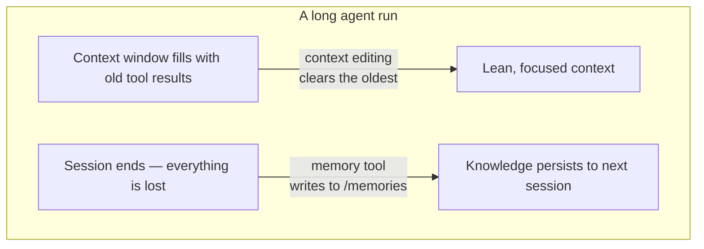

import Tabs from '@theme/Tabs';
import TabItem from '@theme/TabItem';

<LevelBadge level="advanced" />

<VerifyNote lastVerified="2026-06-26" source="https://platform.claude.com/docs/en/agents-and-tools/tool-use/memory-tool">
Обе функции находятся в бете. Строки типов инструментов, beta-заголовок, значения по умолчанию и заявленный прирост в бенчмарках меняются — сверьтесь с официальной документацией по memory-tool и context-editing, прежде чем строить на них.
</VerifyNote>

У долго работающего агента два врага: он **забывает** то, что узнал, в тот момент, когда диалог заканчивается, и его окно контекста **заполняется** устаревшим выводом инструментов до переполнения. Anthropic поставляет по одному примитиву для каждого — **memory tool** (постоянство) и **редактирование контекста** (очистку) — и они спроектированы для совместного использования.

<Callout type="objectives" items={["Что такое memory tool — клиентское файловое хранилище в /memories, которое реализуете вы, а не Anthropic", "Шесть команд, на которые должен отвечать ваш обработчик: view, create, str_replace, insert, delete, rename", "Почему проверка на обход путей (path-traversal) не подлежит обсуждению, когда вы это подключаете", "Как редактирование контекста автоматически очищает старые результаты инструментов, как только контекст пересекает порог токенов", "Как объединить оба под одним beta-заголовком, и подводные камни с кэшированием и порядком"]} />

## Две проблемы, два инструмента



Держите эти две идеи раздельно в голове:

- **Memory tool** = *постоянство между сессиями*. Claude читает и пишет файлы; **вы** их храните.
- **Редактирование контекста** = *очистка внутри сессии*. API отбрасывает устаревшие результаты инструментов из промпта, прежде чем он дойдёт до Claude.

Эта страница сочетается с [Кэшированием промптов](/docs/api/prompt-caching) и [экономикой токенов](/docs/power-user/token-economy) со стороны стоимости, а также с [Инженерией контекста](/docs/frontiers/context-engineering) и [харнессами для долго работающих агентов](/docs/frontiers/long-running-agent-harnesses) для понимания *почему*.

<Flashcards title="Словарь памяти и контекста" cards={[{front:"Memory tool","back":"Клиентский инструмент (тип memory_20250818), позволяющий Claude создавать/читать/обновлять/удалять файлы в директории /memories. Бэкенд хранилища реализуете вы."},{front:"/memories","back":"Единственная директория, которой ограничены все операции с памятью. Каждый путь должен быть проверен, чтобы оставаться внутри неё."},{front:"Редактирование контекста","back":"Серверная стратегия, которая очищает старые результаты инструментов из промпта, как только пересечён порог токенов — полная история по-прежнему живёт на вашем клиенте."},{front:"clear_tool_uses_20250919","back":"Стратегия редактирования контекста, которая удаляет самые старые результаты инструментов, заменяя их заполнителем, чтобы Claude знал, что они были очищены."},{front:"Компактификация","back":"Отдельная серверная функция, которая резюмирует весь диалог вблизи лимита контекста — дополняет клиентское редактирование контекста."}]} />

## Memory tool — это инструмент, который реализуете *вы*

Вот что сбивает людей с толку: включение memory tool **не** даёт вам хранилище, размещённое у Anthropic. Это **клиентский** инструмент. Claude испускает вызовы инструментов вроде `view` или `create`; ваше приложение выполняет их на любом бэкенде, который вы выберете — локальные файлы, база данных, зашифрованные блобы, облачное хранилище — и возвращает результат. Вы владеете тем, где живут байты (именно поэтому он также пригоден для [Zero-Data-Retention](/docs/foundations/privacy)).

Когда инструмент включён, Anthropic внедряет системную инструкцию, говорящую Claude **проверять свою директорию памяти прежде чем делать что-либо ещё**, и записывать прогресс по ходу работы, чтобы ничего не потерялось, если контекст сбросится.

### Шаг 1 — включите инструмент

Добавьте инструмент в свой запрос. Строка типа — датированная версия `memory_20250818`.

<Tabs groupId="lang">
<TabItem value="python" label="Python">

```python
import anthropic

client = anthropic.Anthropic()

message = client.messages.create(
    model="claude-opus-4-8",
    max_tokens=2048,
    messages=[{"role": "user", "content": "Help me respond to this support ticket."}],
    tools=[{"type": "memory_20250818", "name": "memory"}],
)

print(message)
```

</TabItem>
<TabItem value="typescript" label="TypeScript">

```typescript
import Anthropic from "@anthropic-ai/sdk";

const anthropic = new Anthropic();

const message = await anthropic.messages.create({
  model: "claude-opus-4-8",
  max_tokens: 2048,
  messages: [{ role: "user", content: "Help me respond to this support ticket." }],
  tools: [{ type: "memory_20250818", name: "memory" }],
});

console.log(message);
```

</TabItem>
</Tabs>

Официальные SDK поставляются с хелперами памяти, так что вам не нужно собирать интерфейс инструмента вручную — создайте подкласс `BetaAbstractMemoryTool` (Python, C#), используйте `betaMemoryTool` (TypeScript) или реализуйте `BetaMemoryToolHandler` (Java). Они дают вам чистый хук, куда вы подключаете своё хранилище.

### Шаг 2 — отвечайте на шесть команд

Ваш обработчик должен реализовать их. Строки, которые ожидает получить обратно Claude, конкретны — сопоставляйте их, чтобы модель корректно интерпретировала результаты.

<Steps items={[{title: "view", body: "Перечислите директорию (файлы до 2 уровней в глубину, с понятными человеку размерами) или верните содержимое файла с номерами строк, индексированными с 1. Опциональный view_range для чтения среза."},{title: "create", body: "Запишите новый файл из file_text. Ошибка, если он уже существует, вместо молчаливой перезаписи."},{title: "str_replace", body: "Замените точную old_str на new_str. Откажитесь, если old_str отсутствует или встречается более одного раза (неоднозначно) — сообщите номера строк."},{title: "insert", body: "Вставьте insert_text на insert_line. Проверьте, что строка находится в пределах [0, n_lines]."},{title: "delete", body: "Удалите файл, или директорию и её содержимое рекурсивно."},{title: "rename", body: "Переместите/переименуйте путь. Откажитесь, если назначение уже существует — никогда не затирайте."}]} />

Настоящий `view` директории возвращает примерно такое — обратите внимание на буквальный заголовок и размеры, разделённые табуляцией, которые модель обучена разбирать:

```text
Here're the files and directories up to 2 levels deep in /memories, excluding hidden items and node_modules:
4.0K	/memories
1.5K	/memories/customer_service_guidelines.xml
2.0K	/memories/refund_policies.xml
```

### Шаг 3 — заблокируйте пути (не пропускайте это)

Memory tool позволяет модели испускать произвольные строки путей. Отравленный диалог или полезная нагрузка prompt-injection могут попытаться выйти из `/memories` и прочитать или затереть файлы в другом месте на вашей машине. Относитесь к каждому входящему пути как к враждебному.

<Callout type="warning" items={["Отклоняйте любой путь, который не разрешается внутрь /memories.","Канонизируйте перед проверкой — в Python, Path(p).resolve(), затем убедитесь, что .relative_to(memories_root) не вызывает исключения.","Блокируйте ../, ..\\ и URL-кодированный обход вроде %2e%2e%2f.","Ограничивайте размеры файлов и длину чтения, чтобы вышедший из-под контроля агент не мог исчерпать диск или раздуть следующий промпт."]} />

Этот валидатор — это вся суть дела — закрепите его и протестируйте прежде, чем что-либо ещё отправится в продакшен:

<PromptCard title="Защита от обхода путей (Python)">{`from pathlib import Path

MEMORY_ROOT = Path("/srv/agent/memories").resolve()

def safe_path(requested: str) -> Path:
    # Map the model's /memories/... onto your real root, then prove containment.
    rel = requested.removeprefix("/memories").lstrip("/")
    candidate = (MEMORY_ROOT / rel).resolve()
    candidate.relative_to(MEMORY_ROOT)  # raises ValueError if it escaped
    return candidate`}</PromptCard>

## Редактирование контекста удерживает окно от переполнения

Память решает проблему *забывания*. Противоположная проблема — окно контекста, забитое старыми блоками `tool_result` из 40 веб-поисков назад — это то, что решает **редактирование контекста**. Как только промпт пересекает порог токенов, API очищает **самые старые** результаты инструментов (заменяя их коротким заполнителем, чтобы Claude знал, что они были удалены) прежде, чем промпт отправится в модель. Ваш клиент сохраняет полную, неотредактированную историю; обрезается только то, что доходит до модели.

Это работает на beta-заголовке:

```text
anthropic-beta: context-management-2025-06-27
```

Вы настраиваете это через массив `context_management.edits`. Основная стратегия — `clear_tool_uses_20250919`:

<Tabs groupId="lang">
<TabItem value="python" label="Python">

```python
message = client.beta.messages.create(
    model="claude-opus-4-8",
    max_tokens=2048,
    betas=["context-management-2025-06-27"],
    messages=[...],
    tools=[{"type": "memory_20250818", "name": "memory"}],
    context_management={
        "edits": [
            {
                "type": "clear_tool_uses_20250919",
                "trigger": {"type": "input_tokens", "value": 30000},  # start clearing past 30k
                "keep": {"type": "tool_uses", "value": 3},            # always keep the last 3
                "clear_at_least": {"type": "input_tokens", "value": 5000},
                "exclude_tools": ["memory"],                          # never clear memory calls
                "clear_tool_inputs": False,                           # keep the call args, drop results
            }
        ]
    },
)
```

</TabItem>
<TabItem value="typescript" label="TypeScript">

```typescript
const message = await anthropic.beta.messages.create({
  model: "claude-opus-4-8",
  max_tokens: 2048,
  betas: ["context-management-2025-06-27"],
  messages: [...],
  tools: [{ type: "memory_20250818", name: "memory" }],
  context_management: {
    edits: [
      {
        type: "clear_tool_uses_20250919",
        trigger: { type: "input_tokens", value: 30000 },
        keep: { type: "tool_uses", value: 3 },
        clear_at_least: { type: "input_tokens", value: 5000 },
        exclude_tools: ["memory"],
        clear_tool_inputs: false,
      },
    ],
  },
});
```

</TabItem>
</Tabs>

Что означают рычаги:

| Параметр | По умолчанию | Что контролирует |
|-----------|---------|------------------|
| `trigger` | 100 000 входных токенов | Когда включается очистка |
| `keep` | 3 использования инструментов | Сколько недавних пар использование/результат инструмента всегда сохраняется |
| `clear_at_least` | нет | Минимум токенов, освобождаемых за активацию — используйте это, чтобы инвалидация кэша действительно того стоила |
| `exclude_tools` | нет | Инструменты, которые никогда не очищаются (например, `memory`, `web_search`) |
| `clear_tool_inputs` | `false` | Отбрасывать ли также *аргументы вызова* инструмента, а не только результат |

Ответ сообщает вам, что он сделал, в `context_management.applied_edits` — например, `cleared_tool_uses` и `cleared_input_tokens` — так что вы можете логировать, сколько было освобождено.

Есть родственная стратегия, `clear_thinking_20251015`, которая очищает старые блоки [расширенного мышления](/docs/api/thinking-and-effort). Если вы используете обе, **укажите `clear_thinking_20251015` первой** в массиве `edits`.

<Callout type="tip" items={["Очистка результатов инструментов инвалидирует любой префикс prompt-кэша в точке очистки — сочетайте её с clear_at_least, чтобы вы платили за эту инвалидацию только когда освобождаете значимый кусок.","exclude_tools: [\"memory\"] — это обычный ход: вы хотите, чтобы собственные заметки агента сохранялись, а не сметались вместе с устаревшими результатами поиска.","Редактирование контекста (клиентская обрезка) и компактификация (серверное резюмирование) — разные функции — для очень длинных запусков вы можете наложить обе."]} />

## Зачем сочетать их — цифры

Используемые вместе, эти две функции позволяют агенту работать далеко за пределами одного окна контекста: редактирование контекста удерживает живое окно компактным, а всё, что имеет значение, записывается в память прежде, чем оно было бы очищено. Anthropic сообщает, что сочетание памяти с редактированием контекста дало **улучшение на 39%** в оценке агентного поиска, и что одно лишь редактирование контекста сократило расход токенов на **84%** в тесте веб-поиска из 100 ходов.

<VerifyNote lastVerified="2026-06-26" source="https://www.anthropic.com/news/context-management">
Эти проценты — собственные показатели бенчмарков Anthropic, и они отражают конкретные настройки оценки — относитесь к ним как к ориентировочным, а не как к гарантиям для вашей нагрузки. Сверьтесь в анонсе context-management.
</VerifyNote>

## Паттерн, который работает: журнал проекта между сессиями

Самое чистое использование памяти — намеренно её инициализировать, а не писать файлы как попало:

<Steps items={[{title: "Сессия-инициализатор", body: "Перед любой реальной работой запишите журнал прогресса, чек-лист функций и заметку, указывающую на любой стартовый скрипт, который нужен проекту."},{title: "Каждая последующая сессия открывается чтением этих файлов", body: "Она восстанавливает полное состояние проекта за секунды — без необходимости заново исследовать кодовую базу или отслеживать решения."},{title: "Каждая сессия закрывается обновлением журнала", body: "Запишите, что было сделано и что дальше, чтобы у следующей сессии была точная отправная точка."},{title: "По одной функции за раз, с проверкой", body: "Помечайте функцию завершённой только после сквозной проверки — а не сразу после того, как код написан — чтобы журнал оставался надёжным."}]} />

## Проверьте своё понимание

<Quiz questions={[{q:"Где на самом деле хранятся данные memory tool?",options:["На серверах Anthropic, управляемые за вас","В вашей собственной инфраструктуре — инструмент клиентский, и бэкенд реализуете вы","В весах модели","В prompt-кэше"],answer:1,explain:"Memory tool — клиентский. Claude испускает вызовы инструментов; ваше приложение выполняет их на хранилище, которое вы контролируете, ограниченном /memories."},{q:"Что удаляет стратегия редактирования контекста clear_tool_uses_20250919?",options:["Системный промпт","Самые недавние результаты инструментов","Самые старые результаты инструментов, как только пересечён порог токенов","Все сообщения пользователя"],answer:2,explain:"Она очищает самые старые результаты инструментов первыми, после порога триггера, сохраняя самые недавние (по умолчанию: последние 3) и оставляя полную историю на вашем клиенте."},{q:"Почему вы должны проверять каждый путь, который получает memory tool?",options:["Чтобы сэкономить место на диске","Чтобы предотвратить выходы за пределы /memories через обход директорий с помощью вводов вроде ../","Чтобы ускорить модель","Потому что Anthropic отклоняет длинные пути"],answer:1,explain:"Вредоносный или внедрённый путь может попытаться прочитать или перезаписать файлы за пределами /memories. Канонизируйте путь и докажите, что он остаётся внутри корня памяти, прежде чем действовать."}]} />

## Источники и дополнительное чтение

- [Memory tool — документация Claude API](https://platform.claude.com/docs/en/agents-and-tools/tool-use/memory-tool) — тип инструмента `memory_20250818`, шесть команд и руководство по безопасности.
- [Редактирование контекста — документация Claude API](https://platform.claude.com/docs/en/build-with-claude/context-editing) — бета `context-management-2025-06-27`, поля стратегии и значения по умолчанию.
- [Управление контекстом на платформе Claude Developer Platform](https://www.anthropic.com/news/context-management) — анонс с показателями бенчмарков 39% / 84%.
- [Эффективная инженерия контекста для ИИ-агентов](https://www.anthropic.com/engineering/effective-context-engineering-for-ai-agents) — паттерн извлечения «точно вовремя», для которого построена память.
- [Эффективные харнессы для долго работающих агентов](https://www.anthropic.com/engineering/effective-harnesses-for-long-running-agents) — кейс-стади с журналом проекта между сессиями.
- Связанное на AILmanac: [Инженерия контекста](/docs/frontiers/context-engineering) · [Харнессы для долго работающих агентов](/docs/frontiers/long-running-agent-harnesses) · [Кэширование промптов](/docs/api/prompt-caching) · [Использование инструментов](/docs/api/tool-use)
