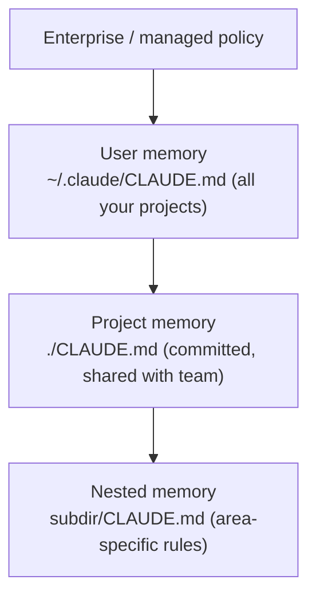

<LevelBadge level="beginner" />

<VerifyNote lastVerified="2026-06-20" source="https://code.claude.com/docs/en/memory">
Расположение файлов памяти и синтаксис импортов могут меняться — уточняйте детали в официальной документации по памяти Claude Code.
</VerifyNote>

Если вы сделаете **одну** вещь, чтобы улучшить [Claude Code](/docs/claude-code/what-is-claude-code), сделайте именно это. `CLAUDE.md` — это текстовый файл, который Claude читает в начале каждой сессии: постоянный брифинг по вашему проекту.

<Callout type="objectives" items={["Почему CLAUDE.md — единственная настройка Claude Code с максимальной отдачей", "Как иерархия памяти объединяется от глобального к специфичному для проекта", "Как сгенерировать стартовый файл с помощью /init и сократить его", "Что должно быть в CLAUDE.md — и что туда не стоит включать", "Как @imports позволяют ссылаться на документы, не дублируя их"]} />

## Почему это настройка с максимальной отдачей

Без него вы заново объясняете свой проект каждую сессию («мы используем pnpm, тесты лежат в `__tests__`, не трогай `/generated`…»). С ним Claude уже всё знает. Хорошие инструкции здесь сразу улучшают *каждое* будущее взаимодействие.

## Иерархия памяти

Claude Code читает память из нескольких мест и объединяет их, примерно от наиболее глобального к наиболее специфичному:

- **Пользовательская память** — ваши личные предпочтения во всех проектах.
- **Память проекта** (`./CLAUDE.md`, закоммичена) — как устроен *этот* репозиторий. Общая с вашей командой.
- **Вложенная** — положите `CLAUDE.md` в подпапку для правил, которые действуют только там.

<Flashcards title="Изучите слои памяти" cards={[{front: "Пользовательская память", back: "~/.claude/CLAUDE.md — ваши личные предпочтения, которые действуют во всех проектах."}, {front: "Память проекта", back: "./CLAUDE.md — закоммичена и общая с командой; описывает, как устроен этот репозиторий."}, {front: "Вложенная память", back: "subdir/CLAUDE.md — специфичные для области правила, которые действуют только внутри этой подпапки."}, {front: "Enterprise / managed policy", back: "Самый глобальный слой; политика уровня организации, стоящая над вашей пользовательской памятью."}]} />

## Сгенерируйте отправную точку

<Steps items={[{title: "Выполните /init в проекте", body: "Claude анализирует код и автоматически составляет для вас черновик CLAUDE.md."}, {title: "Сократите его", body: "Черновик — это отправная точка, а не финиш. Урежьте его до того, что верно и полезно."}, {title: "Возьмите шаблон", body: "Возьмите готовую заготовку со страницы шаблонов CLAUDE.md и адаптируйте её под свой репозиторий."}]} />

<PromptCard title="Сгенерировать черновик CLAUDE.md">{`/init`}</PromptCard>

Возьмите готовую заготовку в [Шаблонах CLAUDE.md](/docs/templates/claude-md).

## Что в него класть

- Что представляет собой проект, в двух предложениях.
- Технологический стек и как его **запускать / тестировать / линтить**.
- Соглашения, которые Claude не может вывести сам (именование, структура, стиль коммитов).
- **Ограничители**: «прогоняй тесты, прежде чем объявлять работу завершённой», «никогда не редактируй `/vendor`», «никогда не коммить секреты».

## Что в него НЕ класть

<Callout type="warning" items={["Claude следует CLAUDE.md буквально — устаревшие, расплывчатые или желаемые-за-действительное инструкции активно вредят.", "Описывайте, как проект на самом деле работает сегодня; короткое и правдивое лучше длинного и мечтательного.", "Избегайте огромных вставленных документов (вместо этого используйте @imports), секретов и правил, которым вы на самом деле не следуете.", "Периодически пересматривайте файл, чтобы он оставался точным по мере развития проекта."]} />

## Импорты

Подтягивайте существующие документы вместо их дублирования — например, ссылайтесь на ваш гайд по стилю через импорт `@path/to/file`, чтобы был единый источник истины. Точный синтаксис смотрите в [официальной документации по памяти](https://code.claude.com/docs/en/memory).

<Callout type="tip" items={["Единый источник истины: ссылайтесь на файл через @imports, а не вставляйте его содержимое в CLAUDE.md.", "Если документ уже существует, дайте на него ссылку — не копируйте его. Копии устаревают."]} />

## Проверьте себя

<Quiz title="Проверьте себя" questions={[{q: "Какой файл Claude Code читает в начале каждой сессии как постоянный брифинг по вашему проекту?", options: ["README.md", "CLAUDE.md", "package.json"], answer: 1, explain: "CLAUDE.md — это текстовый файл памяти, который Claude читает в начале каждой сессии."}, {q: "Что делает выполнение /init в проекте?", options: ["Коммитит CLAUDE.md в репозиторий вашей команды", "Составляет черновик CLAUDE.md, анализируя код, который вы затем сокращаете", "Удаляет устаревшие файлы памяти"], answer: 1, explain: "/init составляет стартовый CLAUDE.md на основе кода — черновик это отправная точка, поэтому после этого вы его сокращаете."}, {q: "Какой рекомендуемый способ включить большой существующий документ, например гайд по стилю?", options: ["Вставить весь документ в CLAUDE.md", "Сослаться на него через импорт @path/to/file", "Хранить его как секрет"], answer: 1, explain: "Используйте @imports, чтобы указать на файл, и тогда будет единый источник истины вместо дублированной, устаревающей копии."}]} />

<Callout type="takeaways" items={["CLAUDE.md — настройка с максимальной отдачей: она сразу улучшает каждую будущую сессию.", "Память объединяется от глобального к специфичному: enterprise-политика, затем пользовательские, проектные и вложенные файлы CLAUDE.md.", "Начните с /init, затем сократите черновик до того, что действительно верно.", "Включите краткое описание проекта, команды запуска/тестов/линта, соглашения и ограничители.", "Держите его коротким и правдивым — используйте @imports для больших документов и никогда не коммить секреты."]} />

## Дальше

- [Режим планирования](/docs/claude-code/plan-mode) — безопасные первые изменения
- [Разрешения и режимы](/docs/claude-code/permissions) — что Claude может делать без присмотра
- [Пошаговое руководство: настройка Claude Code для реального репозитория](/docs/walkthroughs/customize-claude-code)
