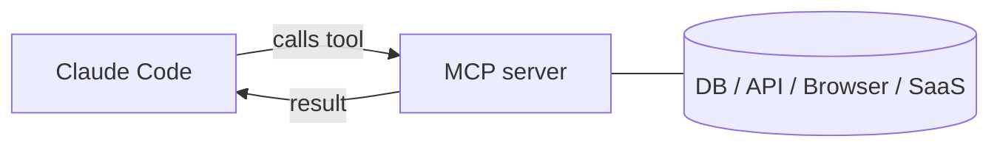

<LevelBadge level="advanced" />

<VerifyNote lastVerified="2026-06-23" source="https://code.claude.com/docs/en/mcp">
Команды `claude mcp`, области конфигурации и транспорты развиваются — сверяйтесь с официальной документацией Claude Code по MCP и на modelcontextprotocol.io.
</VerifyNote>

**Model Context Protocol (MCP)** — это открытый стандарт для подключения ИИ к внешним инструментам и данным. **MCP-сервер** предоставляет возможности (запросить базу данных, открыть PR на GitHub, управлять браузером); Claude Code подключается к нему и может **вызывать эти инструменты** во время сессии. Именно так вы расширяете Claude за пределы вашей файловой системы и оболочки.

<Callout type="objectives" items={["Объяснить, что такое MCP-сервер и как Claude Code вызывает его инструменты", "Различать два транспорта: локальный stdio и удалённый HTTP/SSE", "Добавить сервер с помощью claude mcp add и прочитать JSON, который он записывает", "Выбрать правильную область (local, project, user) — кто видит сервер", "Подключить настоящую базу данных к Claude от начала до конца", "Избежать ловушек безопасности и конфигурации, в которые попадают большинство"]} />

## Как это устроено



Вы объявляете серверы, которые Claude может использовать; каждый сервер публикует набор инструментов со схемами; Claude выбирает и вызывает их, как любой другой инструмент.

<Flashcards title="Словарь MCP" cards={[{front: "Model Context Protocol (MCP)", back: "Открытый стандарт для подключения ИИ к внешним инструментам и данным."}, {front: "MCP-сервер", back: "Программа, которая предоставляет возможности — запросить базу данных, открыть PR на GitHub, управлять браузером — в виде вызываемых инструментов."}, {front: "Инструмент", back: "Возможность, которую MCP-сервер публикует со схемой; Claude выбирает и вызывает её, как любой другой инструмент."}, {front: "Транспорт", back: "Как Claude достигает сервера: stdio (локальный процесс) или удалённый HTTP/SSE (размещённый, часто с OAuth)."}, {front: "Область", back: "Кто видит сервер: local (вы, этот проект), project (закоммиченный для команды) или user (вы, везде)."}]} />

## Транспорты

Есть два способа, которыми Claude достигает сервера. Выбирайте по тому, где работает сервер.

- **stdio** — локальный процесс, который запускает Claude (отлично для локальных инструментов/CLI).
- **Удалённый (HTTP/SSE)** — размещённый сервер, часто с OAuth.

## Конфигурирование серверов

Самый быстрый путь — команда `claude mcp add`, она пишет конфигурацию за вас. Следуйте этой последовательности, чтобы пройти путь от нуля до подключённого сервера.

<Steps items={[{title: "Добавьте локальный stdio-сервер", body: "Запустите claude mcp add — всё, что идёт после --, это команда запуска, которую Claude выполняет за вас."}, {title: "Или добавьте удалённый HTTP-сервер", body: "Передайте --transport http и область, затем URL сервера. Удалённые серверы часто размещены и используют OAuth."}, {title: "Посмотрите, что подключено", body: "Запустите claude mcp list, чтобы увидеть настроенные серверы и их статус подключения."}, {title: "Осмотрите и аутентифицируйтесь", body: "Используйте /mcp внутри сессии, чтобы осмотреть инструменты сервера и аутентифицироваться на удалённых серверах."}]} />

<PromptCard title="Добавьте локальный stdio-сервер">{`# A local stdio server (everything after -- is the launch command)
claude mcp add github -- npx -y @modelcontextprotocol/server-github`}</PromptCard>

<PromptCard title="Добавьте удалённый HTTP-сервер (общий для проекта)">{`# A remote HTTP server, shared with everyone on the project
claude mcp add --transport http --scope project linear https://mcp.linear.app/mcp`}</PromptCard>

Под капотом это просто JSON. Сервер с областью **project** попадает в `.mcp.json` в корне репозитория — закоммитьте его, и вся ваша команда получит одни и те же инструменты:

```json
{
  "mcpServers": {
    "github": { "command": "npx", "args": ["-y", "@modelcontextprotocol/server-github"] }
  }
}
```

### Область решает, кто видит сервер

| Область | Где находится | Для чего использовать |
|---|---|---|
| `local` (по умолчанию) | ваши пользовательские настройки, только этот проект | личные эксперименты, секреты |
| `project` | `.mcp.json` в репозитории (закоммичен) | инструменты, которыми должна пользоваться вся команда |
| `user` | ваши пользовательские настройки, все проекты | серверы, которые нужны вам везде |

Запустите `claude mcp list`, чтобы увидеть, что подключено, и `/mcp` внутри сессии, чтобы осмотреть инструменты и аутентифицироваться на удалённых серверах. См. [Конфигурация MCP и каркасы серверов](/docs/templates/mcp-config) для готовых к копированию заготовок.

## Разобранный пример: дайте Claude вашу базу данных

Допустим, вы хотите, чтобы Claude отвечал на вопросы по локальному Postgres, а не вы вставляли результаты запросов. Добавьте сервер (область project, чтобы коллеги его унаследовали):

<PromptCard title="Добавьте сервер Postgres с областью project">{`claude mcp add --scope project db -- npx -y @modelcontextprotocol/server-postgres "postgresql://localhost/app"`}</PromptCard>

Теперь в сессии вы можете задать вопрос на обычном языке и позволить Claude выполнить цикл запроса за вас:

<PromptCard title="Задайте вопрос к базе данных">{`How many users signed up last week? Check the DB.`}</PromptCard>

Claude вызывает инструмент `query` сервера, получает строки назад и отвечает — без цикла копирования-вставки. Поскольку область — project, коллега, который подтянет репозиторий, получит ту же возможность в тот момент, когда откроет Claude Code. Держите строку подключения доступной только для чтения, если вам нужны только чтения.

## Доверие и безопасность

<Callout type="warning" items={["MCP-сервер выполняет код и может читать данные и предпринимать действия — подключайте только те серверы, которым доверяете.", "Давайте каждому серверу наименьшие привилегии, которые ему нужны.", "Любой внешний контент, который возвращает сервер, может нести инъекцию промпта.", "Проверяйте сторонние серверы перед их подключением."]} />

:::warning Относитесь к MCP-серверам как к установке ПО
MCP-сервер выполняет код и может читать данные и предпринимать действия. Подключайте только те серверы, которым доверяете, давайте им **наименьшие привилегии**, которые нужны, и помните, что любой внешний контент, который они возвращают, может нести [инъекцию промпта](/docs/security/prompt-injection). Сначала проверяйте сторонние серверы — см. [Рецензирование стороннего кода](/docs/security/reviewing-third-party-code).
:::

## MCP в приложениях тоже

MCP также обеспечивает работу **Connectors** в приложениях Claude — тот же стандарт, другая поверхность. См. [Connectors (MCP) в приложениях](/docs/claude-app/connectors) и, для API, [MCP и подключение к инструментам](/docs/api/mcp).

## Частые ошибки

- **Неправильная область.** Сервер, добавленный с областью `local`, не появится у коллег; тот, который вы хотели только для себя, не должен коммититься с областью `project`. Выбирайте осознанно.
- **Слишком много серверов, слишком много инструментов.** Каждый подключённый сервер добавляет свои схемы инструментов в контекст. Подключайте то, что нужно задаче, а не весь свой каталог.
- **Сверхпривилегированные подключения.** Дайте серверу базы данных роль только на чтение, если только Claude действительно не нужно писать. MCP делает возможности реальными — ограничивайте их.
- **Забывание о риске инъекции.** Всё, что возвращает сервер (веб-страница, тело issue, строка), — это недоверенный текст, который может нести [инъекцию промпта](/docs/security/prompt-injection). Не подключайте мощный сервер с возможностью записи рядом с недоверенным сервером с возможностью чтения, не обдумав это.

<Quiz title="Проверьте себя" questions={[{q: "Какой транспорт является локальным процессом, который Claude запускает сам?", options: ["Удалённый HTTP/SSE", "stdio", "OAuth"], answer: 1, explain: "stdio — это локальный процесс, который запускает Claude, идеален для локальных инструментов и CLI. Удалённый HTTP/SSE — это размещённый сервер, часто с OAuth."}, {q: "Куда записывается сервер с областью project и в чём польза?", options: ["В ваши пользовательские настройки; видите его только вы", "В .mcp.json в корне репозитория; закоммитьте его, и вся команда получит одни и те же инструменты", "В скрытый глобальный кэш; никто не может его редактировать"], answer: 1, explain: "Область project попадает в закоммиченный .mcp.json в корне репозитория, поэтому коллеги, которые подтянут репозиторий, наследуют те же инструменты."}, {q: "Почему держать подключение к базе данных только на чтение, когда Claude нужно только читать?", options: ["Это ускоряет выполнение запросов", "Наименьшие привилегии — MCP делает возможности реальными, поэтому не предоставляйте доступ на запись, если он действительно не нужен", "Только чтение требуется протоколом"], answer: 1, explain: "Давайте серверам наименьшие привилегии, которые им нужны. MCP делает возможности реальными, поэтому роль только на чтение избегает непреднамеренных записей."}]} />

<Callout type="takeaways" items={["MCP — это открытый стандарт; MCP-сервер предоставляет инструменты, которые Claude Code вызывает, как любой другой инструмент.", "Два транспорта: локальный stdio (процесс, который запускает Claude) и удалённый HTTP/SSE (размещённый, часто OAuth).", "claude mcp add пишет конфигурацию за вас; под капотом это JSON, а область project живёт в закоммиченном .mcp.json.", "Область управляет видимостью: local (вы, этот проект), project (закоммичено для команды), user (вы, везде).", "Относитесь к серверам как к установке ПО: доверие, наименьшие привилегии и внимание к инъекции промпта во всём, что они возвращают."]} />

## Далее

- [Соберите и подключите ваш первый MCP-сервер (разбор)](/docs/walkthroughs/first-mcp-server)
- [Конфигурация MCP и каркасы серверов](/docs/templates/mcp-config)
- [Защита агентов и инструментов](/docs/security/securing-agents)
