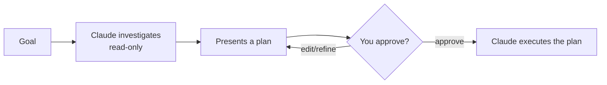

<LevelBadge level="beginner" />

<Callout type="objectives" items={["Объяснить, что делает режим планирования и почему он работает только для чтения", "Решить, когда нужно сначала планировать, а когда можно обойтись без этого", "Пройти цикл исследование-предложение-одобрение-выполнение", "Различать режим планирования и разрешения и использовать их вместе"]} />

<VerifyNote lastVerified="2026-06-20" source="https://code.claude.com/docs/en">
Способ входа в режим планирования (сочетание клавиш/флаг) может меняться от релиза к релизу — сверяйтесь с официальной документацией Claude Code.
</VerifyNote>

## Главная идея

Представьте, что вы отдаёте подрядчику ключи от дома — или сначала просите его пройтись по дому и расписать, *что именно* он собирается изменить. Режим планирования — это и есть тот обход.

**Режим планирования** переводит Claude Code в режим **только для чтения**: он может исследовать вашу кодовую базу, выполнять поиск и рассуждать — но он **не будет редактировать файлы или выполнять команды, изменяющие состояние**. Вместо этого он создаёт план и ждёт вашего одобрения.

<Callout type="tip" items={["Только для чтения означает, что Claude ДУМАЕТ, но не ДЕЙСТВУЕТ — никаких правок файлов, никаких изменяющих состояние команд, пока вы не дадите добро."]} />

## Почему это самый безопасный способ начать

Для всего крупного, рискованного или незнакомого вы хотите увидеть, *что* Claude намеревается сделать, прежде чем он тронет ваш репозиторий. Режим планирования разделяет **мышление** и **действие**:

Выигрыш: вы ловите неверные предположения *до* того, как они станут неверным кодом.

## Когда его использовать

<Callout type="tip" items={["ВСЕГДА для крупных или многофайловых изменений, миграций или рефакторингов", "Когда работаете в кодовой базе, которую ещё не полностью знаете", "Когда вам нужен пригодный для проверки план, чтобы поделиться с коллегой"]} />

Для крошечных, очевидных правок его можно пропустить — но при сомнении сначала планируйте.

## Как это работает на практике

Следуйте циклу. Каждый шаг открывает следующий — Claude переключается на редактирование только *после* вашего одобрения.

<Steps items={[{title: "Войдите в режим планирования и сформулируйте свою цель", body: "Переключитесь в режим только для чтения, затем опишите, чего хотите достичь."}, {title: "Claude исследует", body: "Он читает релевантные файлы и задаёт уточняющие вопросы."}, {title: "Claude возвращает пошаговый план", body: "Какие файлы менять, подход и как проверить результат."}, {title: "Вы одобряете или уточняете", body: "Только после одобрения Claude переключается на внесение изменений."}]} />

### Попробуйте сами

Скопируйте это в настоящую сессию планирования и понаблюдайте, как разворачивается цикл:

<PromptCard title="Запустите сессию планирования">{`I want to migrate our auth from sessions to JWT. Stay in Plan Mode: investigate the current setup, ask anything you need, then propose a step-by-step plan with files to change and how to verify — don't edit anything yet.`}</PromptCard>

:::tip Сочетайте с CLAUDE.md
Хороший [CLAUDE.md](/docs/claude-code/claude-md) делает планы точнее — Claude планирует, уже учитывая ваши соглашения и ограничители.
:::

## Режим планирования против разрешений

Классическая путаница. Они решают разные задачи и работают вместе:

- **Режим планирования** = «исследуй и предлагай, пока не действуй». (Эта страница.)
- **[Разрешения](/docs/claude-code/permissions)** = когда уже действуешь, *какие* действия разрешены без запроса.

Воспринимайте это как **действовать ли сейчас** (режим планирования) против **какие действия разрешены, когда уже действуешь** (разрешения).

<Flashcards cards={[{front: "В какое состояние режим планирования переводит Claude Code?", back: "Только для чтения — он может исследовать, искать и рассуждать, но не будет редактировать файлы или выполнять изменяющие состояние команды, пока вы не одобрите."}, {front: "В чём состоит цикл режима планирования?", back: "Исследование (только для чтения) → представление плана → вы одобряете или уточняете → Claude выполняет."}, {front: "Когда стоит прибегать к режиму планирования?", back: "По умолчанию для крупной, рискованной или незнакомой работы (многофайловые изменения, миграции, рефакторинги, незнакомые кодовые базы). Пропускайте только крошечные, очевидные правки."}, {front: "Режим планирования против разрешений?", back: "Режим планирования управляет тем, ДЕЙСТВОВАТЬ ли сейчас; разрешения управляют тем, КАКИЕ действия разрешены, когда уже действуешь."}]} />

<Callout type="takeaways" items={["Режим планирования работает только для чтения: Claude исследует и предлагает, но никогда не редактирует и не выполняет изменяющие состояние команды, пока вы не одобрите", "Используйте его по умолчанию для крупной, рискованной или незнакомой работы; пропускайте только крошечные очевидные правки", "Цикл — это исследование, затем предложение, затем одобрение/уточнение, затем выполнение", "Режим планирования управляет тем, ДЕЙСТВОВАТЬ ли сейчас; разрешения управляют тем, КАКИЕ действия разрешены, когда уже действуешь"]} />

<Quiz title="Проверьте себя" questions={[{q: "Что может делать Claude Code, находясь в режиме планирования?", options: ["Редактировать файлы и выполнять любые команды", "Исследовать, искать и рассуждать — но не редактировать файлы и не выполнять изменяющие состояние команды", "Только отвечать на вопросы, вообще без доступа к файлам"], answer: 1, explain: "Режим планирования работает только для чтения: Claude может исследовать кодовую базу, выполнять поиск и рассуждать, но не будет редактировать файлы или выполнять изменяющие состояние команды."}, {q: "Когда стоит прибегать к режиму планирования?", options: ["Только для исправления однострочных опечаток", "Для крупных или многофайловых изменений, миграций, рефакторингов или незнакомых кодовых баз", "Никогда — он только замедляет вас"], answer: 1, explain: "Используйте его всегда для крупных или многофайловых изменений, миграций или рефакторингов, а также когда работаете в кодовой базе, которую ещё не полностью знаете. Крошечные очевидные правки можно пропустить."}, {q: "Каков правильный порядок цикла режима планирования?", options: ["Выполнить, затем исследовать, затем одобрить", "Исследовать (только для чтения), представить план, вы одобряете или уточняете, затем Claude выполняет", "Сначала одобрить, затем Claude исследует и редактирует"], answer: 1, explain: "Claude исследует в режиме только для чтения, представляет план, вы одобряете или уточняете, и только тогда он переключается на выполнение плана."}, {q: "Чем различаются режим планирования и разрешения?", options: ["Это два названия одной и той же функции", "Режим планирования = исследуй и предлагай, пока не действуй; разрешения = когда уже действуешь, какие действия разрешены без запроса", "Разрешения решают, планировать ли; режим планирования решает, какие файлы редактировать"], answer: 1, explain: "Режим планирования отделяет мышление от действия. Разрешения управляют тем, какие действия разрешены без запроса, когда Claude уже действует. Они работают вместе."}]} />

## Дальше

- [Разрешения и режимы разрешений](/docs/claude-code/permissions)
- [Управление контекстом](/docs/claude-code/context-management) — поддерживайте эффективность длинных сессий
- [Пошаговое руководство: настройка Claude Code для реального репозитория](/docs/walkthroughs/customize-claude-code)
