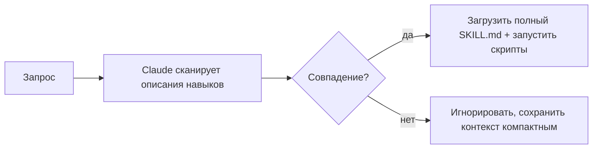

<LevelBadge level="advanced" />

<VerifyNote lastVerified="2026-06-23" source="https://code.claude.com/docs/en/skills">
Структура файла навыка, прогрессивное раскрытие и то, где навыки выполняются (Claude Code, Claude.ai, Cowork), продолжают развиваться — сверяйтесь с официальной документацией по Skills.
</VerifyNote>

<Callout type="objectives" items={["Определить, что такое навык и чем он отличается от запихивания всего в CLAUDE.md", "Прочитать и написать SKILL.md — фронтматтер плюс инструкции — и понять, почему описание является триггером", "Объяснить прогрессивное раскрытие и почему оно позволяет масштабировать множество навыков без раздувания контекста", "Знать три места, где живут навыки: личные, проектные и упакованные в плагин", "Правильно выбирать между навыком, слэш-командой, субагентом и MCP", "Избегать четырёх частых ошибок, из-за которых навыки не срабатывают"]} />

**Навык** (Skill) упаковывает экспертизу — инструкции плюс необязательные скрипты и ресурсы, — которую Claude загружает **только когда это уместно**. Вместо того чтобы запихивать всё в [CLAUDE.md](/docs/claude-code/claude-md), вы даёте Claude библиотеку возможностей, которые он подключает по запросу.

## Анатомия

Навык — это папка с файлом `SKILL.md`: YAML-фронтматтер плюс инструкции.

```markdown
---
name: pdf-forms
description: Use when the user needs to fill, read, or generate PDF forms.
---

# PDF Forms
Steps and rules for working with PDF forms…
(optionally reference scripts/ or resources/ in this folder)
```

<Callout type="tip" items={["Описание — это триггер: Claude читает его, чтобы решить, когда активировать навык. Пишите его как «Use when…», достаточно конкретно, чтобы он загружался в нужный момент и не загружался в остальных случаях."]} />

## Прогрессивное раскрытие (почему навыки масштабируются)

Claude не загружает полное тело каждого навыка заранее — он видит лёгкие `name` + `description` и подтягивает полные инструкции (и запускает скрипты) только тогда, когда запрос совпадает. Это поддерживает контекст компактным даже при множестве установленных навыков.



## Где они находятся

<Steps items={[{title:"Личные", body:"~/.claude/skills/<name>/SKILL.md — остаются вашими, доступны во всех ваших проектах."},{title:"Проектные (доступные для совместного использования)", body:".claude/skills/<name>/SKILL.md — закоммитьте их в git, и вся команда получит эту возможность."},{title:"Упакованные в плагин", body:"Упаковывайте навыки внутри плагина для распространения внутри команды. См. «Плагины и маркетплейсы»."}]} />

AILmanac поставляется с [7 готовыми наборами навыков](/docs/templates/skills) — скопируйте один к себе, чтобы попробовать.

## Разобранный пример: навык, который запускает сам себя

Создайте `~/.claude/skills/release-notes/SKILL.md`:

```markdown
---
name: release-notes
description: Use when the user asks to write release notes or a changelog from git history.
---

# Release Notes
1. Run `git log <last-tag>..HEAD --oneline` to get the commits.
2. Group them into Features / Fixes / Breaking changes.
3. Write user-facing notes — what changed for *users*, not commit messages.
4. Output Markdown ready to paste into a GitHub release.
```

Позже вы вводите промпт ниже. У Claude никогда не было этих шагов в контексте — но запрос совпадает с `description`, поэтому он подтягивает полный `SKILL.md`, запускает `git log` и выдаёт сгруппированные заметки. Вы ничего не вызывали по имени; **маршрутизацию выполнило описание**. Добавьте файл `scripts/` в ту же папку, и навык сможет запустить его как часть шага 1.

<PromptCard title="Запустите навык по намерению — имя не нужно">{`Draft release notes since v1.4.`}</PromptCard>

## Навык против команды, субагента и MCP

| Инструмент | Что это | Кто запускает: вы или Claude |
|---|---|---|
| [Слэш-команда](/docs/claude-code/slash-commands) | Сохранённый промпт | **Вы** вызываете её |
| **Навык** | Экспертиза по запросу + скрипты | **Claude** загружает его, когда это уместно |
| [Субагент](/docs/claude-code/subagents) | Делегированный агент с собственным контекстом | Claude делегирует |
| [MCP](/docs/claude-code/mcp) | Подключение к внешним инструментам/данным | Предоставляет инструменты для вызова |

<Callout type="takeaways" items={["Вы хотите запускать это по запросу → слэш-команда.", "Claude должен знать процедуру и применять её, когда это уместно → навык.", "Работа должна происходить в отдельном контексте → субагент.", "Вам нужно обратиться к внешней системе → MCP."]} />

## Частые ошибки

<Callout type="warning" items={["Описание, которое не срабатывает. «Helps with PDFs» слишком расплывчато; «Use when the user needs to fill, read, or generate PDF forms» точно говорит Claude, когда его загружать. Описание — это весь механизм активации: пишите его для сопоставления, а не для людей.", "Засовывание всего в CLAUDE.md вместо этого. CLAUDE.md загружается в каждой сессии и всегда расходует контекст; навык загружается только когда уместно. Перенесите ситуативные процедуры в навыки, а в CLAUDE.md оставьте всегда верные правила проекта.", "Один гигантский навык. Множество небольших, чётко описанных навыков маршрутизируются лучше, чем один универсальный — прогрессивное раскрытие помогает только если каждое описание конкретно.", "Забывание, что им можно делиться. Проектный навык в .claude/skills/, закоммиченный в git, даёт возможность всей команде; личный в ~/.claude/skills/ остаётся только вашим."]} />

## Повторим термины

<Flashcards cards={[{front:"Что такое навык?", back:"Папка с файлом SKILL.md, упаковывающая инструкции плюс необязательные скрипты и ресурсы, которую Claude загружает только когда это уместно."},{front:"Что является триггером навыка?", back:"Поле description — Claude читает его, чтобы решить, когда активировать навык. Пишите его как «Use when…», достаточно конкретно, чтобы он загружался в нужный момент и не загружался в остальных случаях."},{front:"Что такое прогрессивное раскрытие?", back:"Claude видит заранее только лёгкие name + description и подтягивает полный SKILL.md (и запускает скрипты) только тогда, когда запрос совпадает, — сохраняя контекст компактным даже при множестве навыков."},{front:"Где находятся личные и проектные навыки?", back:"Личные: ~/.claude/skills/<name>/SKILL.md (остаются вашими). Проектные: .claude/skills/<name>/SKILL.md (закоммитьте в git, чтобы поделиться с командой)."},{front:"Навык против слэш-команды?", back:"Слэш-команду вы вызываете по запросу; навык Claude загружает автоматически, когда запрос совпадает с его описанием."},{front:"Навык против CLAUDE.md?", back:"CLAUDE.md загружается в каждой сессии и всегда расходует контекст; навык загружается только когда уместно. Держите всегда верные правила в CLAUDE.md, а ситуативные процедуры — в навыках."}]} />

## Проверь себя

<Quiz title="Проверь себя" questions={[{q:"В файле SKILL.md что на самом деле решает, когда Claude активирует навык?", options:["Имя папки","Поле description во фронтматтере","Первый заголовок в теле","Ручной вызов пользователем"], answer:1, explain:"Описание — это триггер: Claude читает его, чтобы решить, когда активировать навык. Пишите его как «Use when…», достаточно конкретно, чтобы он загружался в нужный момент."},{q:"Что такое прогрессивное раскрытие?", options:["Claude заранее загружает полное тело каждого навыка","Claude видит только name + description и загружает полный SKILL.md только тогда, когда запрос совпадает","Навыки раскрывают свои шаги пользователю по одной строке за раз","CLAUDE.md загружается постепенно в течение сессии"], answer:1, explain:"Прогрессивное раскрытие означает, что Claude видит лёгкие name + description и подтягивает полные инструкции (и запускает скрипты) только тогда, когда запрос совпадает, — сохраняя контекст компактным даже при множестве установленных навыков."},{q:"Вы хотите, чтобы ВСЯ КОМАНДА получила возможность через git. Куда вы поместите навык?", options:["~/.claude/skills/<name>/SKILL.md","/etc/claude/skills/","\.claude/skills/<name>/SKILL.md, закоммиченный в git","Внутрь CLAUDE.md"], answer:2, explain:"Проектный навык в .claude/skills/, закоммиченный в git, даёт возможность всей команде; личный в ~/.claude/skills/ остаётся только вашим."},{q:"Вы хотите запускать что-то сами, по запросу, по имени. Какой инструмент подходит?", options:["Навык","Слэш-команда","Субагент","MCP"], answer:1, explain:"Правило большого пальца: вы хотите запускать это по запросу → слэш-команда. Claude загружает процедуру, когда уместно → навык; отдельный контекст → субагент; обратиться к внешней системе → MCP."},{q:"Почему предпочесть навык, а не помещение ситуативной процедуры в CLAUDE.md?", options:["CLAUDE.md не может содержать процедуры","CLAUDE.md загружается в каждой сессии и всегда расходует контекст, тогда как навык загружается только когда уместно","Навыки работают быстрее, чем CLAUDE.md","CLAUDE.md нельзя расшарить через git"], answer:1, explain:"CLAUDE.md загружается в каждой сессии и всегда расходует контекст; навык загружается только когда уместно. Перенесите ситуативные процедуры в навыки, а в CLAUDE.md оставьте всегда верные правила проекта."}]} />

## Дальше

- [Напишите свой первый навык (пошаговое руководство)](/docs/walkthroughs/first-skill)
- [Шаблоны SKILL.md](/docs/templates/skills)
- [Плагины и маркетплейсы](/docs/claude-code/plugins-marketplaces)
