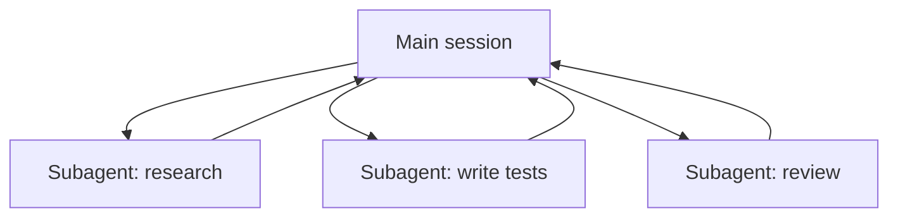

<LevelBadge level="advanced" />

<VerifyNote lastVerified="2026-06-23" source="https://code.claude.com/docs/en/sub-agents">
Поля frontmatter субагента, набор встроенных агентов и интерфейс `/agents` со временем меняются — сверяйтесь с официальной документацией.
</VerifyNote>

<Callout type="objectives" items={["Что такое субагент — отдельный экземпляр Claude со своим окном контекста и ограниченным набором инструментов","Три причины делегировать: защитить контекст, специализировать и распараллелить","Встроенные агенты, которым Claude уже делегирует задачи: Explore, Plan, General-purpose","Как определить собственного субагента в .claude/agents/ и почему description и tools — два ключевых поля","Когда НЕ стоит распараллеливать и как это связано с API-агентами и рабочими процессами масштаба флота"]} />

**Субагент** — это отдельный экземпляр Claude со **своим окном контекста** и **ограниченным набором инструментов**, которому ваша основная сессия делегирует часть работы. Он возвращает результат, а не весь свой транскрипт — поэтому основная сессия остаётся сосредоточенной и не захламляется.

## Зачем делегировать

Три задачи, один инструмент. Помните о них всякий раз, когда тянетесь к субагенту:

- **Защитить основной контекст.** Глубокое исследование или масштабный обход файлов могут сжечь тысячи токенов; сделайте это в субагенте, и вернётся только вывод.
- **Специализировать.** Дайте субагенту настроенный системный промпт и только нужные ему инструменты (например, рецензент только для чтения).
- **Распараллелить.** Запускайте независимые подзадачи одновременно — например, исследуйте три модуля параллельно.

## Встроенные агенты, которые у вас уже есть

Прежде чем определять собственного, знайте, что Claude Code поставляется с субагентами, которым делегирует задачи автоматически:

| Встроенный | Что он делает |
| --- | --- |
| **Explore** | Быстрый агент только для чтения (работает на более дешёвой модели) для поиска и понимания кодовой базы без её изменения. |
| **Plan** | Собирает контекст в режиме планирования, чтобы исследование не попадало в основной разговор, доступный только для чтения. |
| **General-purpose** | Агент с полным набором инструментов для сложной многошаговой работы, сочетающей исследование и изменения. |

Вы редко вызываете их по имени; Claude обращается к ним, когда задача им подходит. Пользовательские субагенты нужны для тех работников, которых *вы* постоянно пересоздаёте с одними и теми же инструкциями.

## Определение собственного

Субагент — это файл Markdown с YAML-frontmatter (тело становится его системным промптом). Обязательны только `name` и `description`; всё остальное опционально. Храните его для проекта в `.claude/agents/` (закоммитьте в git, чтобы команда им пользовалась) или для пользователя в `~/.claude/agents/`. Создайте его командой `/agents` или вручную.

<Steps items={[{title: "Выберите расположение", body: "Для проекта в .claude/agents/ (закоммитьте, чтобы команда им пользовалась) или для пользователя в ~/.claude/agents/."},{title: "Создайте файл", body: "Используйте команду /agents или напишите файл Markdown с YAML-frontmatter вручную."},{title: "Задайте обязательные поля", body: "Обязательны только name и description. Всё остальное опционально."},{title: "Напишите тело как системный промпт", body: "Тело Markdown под frontmatter становится системным промптом субагента."},{title: "Ограничьте инструменты", body: "Добавьте белый список инструментов, чтобы субагент мог делать только то, что требует его задача."}]} />

Стартовый субагент `code-reviewer`:

<PromptCard title="Субагент code-reviewer (.claude/agents/code-reviewer.md)">{`---
name: code-reviewer
description: Expert code reviewer. Use proactively after code changes.
tools: Read, Glob, Grep
model: sonnet
---

You are a senior reviewer. Read the changed files, then report only
high-confidence issues: correctness bugs, security risks, and missing
tests. For each, show the file:line, the problem, and a concrete fix.
Do not restate what the code does. Never edit files.`}</PromptCard>

Хорошим субагента делают две вещи:

- **`description` — это сигнал маршрутизации.** Claude читает его, чтобы решить, *когда* делегировать, поэтому пишите его как триггер — «Use proactively after code changes» подтягивает его автоматически; расплывчатое «helps with code» — нет. Это самая высокорычажная строка в файле.
- **Жёстко ограничивайте инструменты.** Поле `tools` — это белый список (или используйте `disallowedTools` как чёрный список). Рецензент, который может только `Read, Glob, Grep`, *не сможет* случайно отредактировать ваш код — ограничение является гарантией, а не подсказкой. Опустите `tools`, и субагент унаследует всё, что есть у основной сессии.

## Разобранный пример: параллельный веер рецензий

Вы закончили фичу, затронувшую три модуля, и хотите быструю независимую проверку каждого. В основной сессии:

<PromptCard title="Развернуть веером трёх рецензентов одновременно">{`Review the changes in auth/, billing/, and api/ — use the code-reviewer subagent on each, in parallel.`}</PromptCard>

Claude порождает три экземпляра `code-reviewer` одновременно. Каждый читает только свой модуль, тратит собственный контекст на содержимое файлов и возвращает короткий список находок. Ваша основная сессия никогда не видит сырых диффов — только три аккуратных отчёта — и всё завершается примерно за время самой медленной отдельной рецензии, а не за сумму всех трёх. Поскольку рецензент работает только на чтение, три агента, работающие одновременно, не могут столкнуться на записи.

## Когда НЕ распараллеливать

<Callout type="warning" items={["Зависимые шаги должны быть последовательными — не разворачивайте веером работу, где шаг B нуждается в выводе шага A.","Совместная запись в файлы может конфликтовать; изолируйте её (см. Git Worktrees) или сериализуйте.","Накладные расходы на координацию могут превысить выгоду для небольших задач. Делегируйте, когда подзадача весома и независима."]} />

Об изоляции конфликтующих записей см. [Git Worktrees](/docs/claude-code/worktrees).

## Субагент против «агентов» API/SDK

Эта страница — про встроенное делегирование Claude Code. Создание *собственных* агентов программно — это [Создание агентов на API](/docs/api/building-agents). Ментальная модель — цель, цикл инструментов, изолированный контекст — та же самая.

## Частые ошибки

<Flashcards title="Подводные камни — переверните каждую карточку, чтобы увидеть решение" cards={[{front: "Расплывчатое описание", back: "Если в нём не сказано, КОГДА использовать субагента, Claude не делегирует ему в нужный момент (или вовсе не делегирует). Начинайте с «Use when…» / «Use proactively after…»."},{front: "Оставление инструментов нараспашку", back: "Субагент, предназначенный для рецензирования, не должен иметь возможности записывать. Белый список превращает намерение в гарантию."},{front: "Ожидание общей памяти", back: "Субагент получает свой description, свой системный промпт и задачу, которую вы ему вручаете — но не ваш основной разговор. Передавайте нужный контекст в делегировании."},{front: "Веерное распределение зависимой работы", back: "Параллелизм помогает только для независимых подзадач; если B нуждается в выводе A, запускайте их последовательно."}]} />

## Когда нескольких агентов недостаточно

Делегирование горстки субагентов за ход — основа этой страницы. Когда задаче нужны **десятки или сотни** агентов — обход всей кодовой базы, миграция 500 файлов, исследование с перекрёстной проверкой по множеству источников — оркестрация перерастает одно окно контекста. Для этого существуют [Динамические рабочие процессы и ultracode](/docs/claude-code/dynamic-workflows): Claude пишет скрипт, который держит план, а среда выполнения веером запускает агентов в фоне.

<Quiz title="Проверьте себя" questions={[{q: "Какое поле в frontmatter субагента является сигналом маршрутизации, который Claude читает, чтобы решить, КОГДА делегировать?", options: ["name", "description", "model"], answer: 1, explain: "description — это самая высокорычажная строка: Claude читает её, чтобы решить, когда делегировать. Пишите её как триггер, например «Use proactively after code changes»."}, {q: "Субагенту-рецензенту заданы tools: Read, Glob, Grep. Что гарантирует этот белый список?", options: ["Он работает на более дешёвой модели", "Он не сможет случайно отредактировать ваш код", "Он наследует инструменты основной сессии"], answer: 1, explain: "Поле tools — это белый список, поэтому рецензент, ограниченный Read, Glob, Grep, не сможет записывать — ограничение является гарантией, а не подсказкой. Опущение tools, наоборот, унаследовало бы всё."}, {q: "Когда распараллеливание субагентов НЕ помогает?", options: ["Когда подзадачи независимы и весомы", "Когда шаг B нуждается в выводе шага A", "Когда каждый агент читает отдельный модуль"], answer: 1, explain: "Зависимые шаги должны выполняться последовательно. Параллелизм помогает только для независимых подзадач; если B нуждается в выводе A, запускайте их последовательно."}]} />

<Callout type="takeaways" items={["Субагент — это отдельный экземпляр Claude со своим окном контекста и ограниченным набором инструментов; он возвращает результат, а не свой транскрипт.","Делегируйте, чтобы защитить основной контекст, специализировать или распараллелить независимую работу.","Claude уже поставляется со встроенными Explore, Plan и General-purpose и обращается к ним автоматически.","name и description — единственные обязательные поля frontmatter, и именно description — сигнал маршрутизации, который решает, когда Claude делегирует.","Белый список инструментов превращает намерение в гарантию; разворачивайте веером только независимые подзадачи и изолируйте совместные записи."]} />

## Далее

- [Динамические рабочие процессы и ultracode](/docs/claude-code/dynamic-workflows) — оркестрация субагентов в масштабе флота
- [Спроектируйте мульти-субагентный рабочий процесс (разбор)](/docs/walkthroughs/multi-subagent-workflow)
- [Управление контекстом](/docs/claude-code/context-management)
- [Git Worktrees](/docs/claude-code/worktrees)
