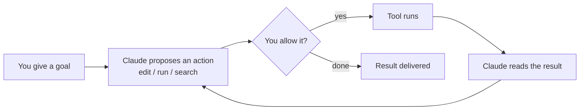

<LevelBadge level="beginner" />

<VerifyNote lastVerified="2026-06-20" source="https://code.claude.com/docs/en/overview">
Команды установки и точный набор возможностей часто меняются. Считайте официальную документацию Claude Code источником истины для настройки.
</VerifyNote>

<Callout type="objectives" items={["Объяснить, что делает Claude Code агентным, а не просто окном чата", "Представить агентный цикл: цель, действие, разрешение, наблюдение, повтор", "Назвать интерфейсы, где работает Claude Code, и как настройки путешествуют вместе с вами", "Упорядочить то, что вы настраиваете, по отдаче, начиная с CLAUDE.md", "Пройти по структуре безопасной первой сессии с использованием режима планирования"]} />

**Claude Code** — это *агентный* инструмент Anthropic для написания кода. В отличие от окна чата, он действительно может **делать что-то в вашем проекте**: читать и редактировать файлы, выполнять команды оболочки, искать по кодовой базе и вызывать внешние инструменты — и всё это с вашего разрешения.

## Ментальная модель: агентный цикл

Это одна идея, которая делает понятным всё остальное. Вы формулируете цель обычным языком («добавь тесты для модуля авторизации и исправь то, что падает»). Claude **планирует, действует, наблюдает за результатом и повторяет** до тех пор, пока цель не будет достигнута. Вы сохраняете контроль через [разрешения](/docs/claude-code) и [режим планирования](/docs/claude-code).

<Callout type="tip" items={["Цикл продвигается только на тех действиях, которые вы разрешаете. Ничто не редактируется и не запускается без прохождения через этот шлюз разрешений — именно поэтому следующие разделы так важны."]} />

## Где его можно запускать

Тот же самый Claude Code следует за вами на разных интерфейсах — он **использует общие настройки, хуки и разрешения** везде, где вы работаете.

- **Терминал (CLI)** — исходный интерфейс; работает в любой оболочке.
- **Расширения для IDE** — VS Code и JetBrains, со встроенными diff'ами.
- **Десктоп и веб** — и он использует общие настройки, хуки и разрешения между всеми интерфейсами.

## Что вы будете настраивать (примерно в порядке убывания отдачи)

Думайте об этом как о лестнице: сначала освойте верхние ступени, а мощные возможности добавляйте только тогда, когда появляется реальная потребность.

<Steps items={[{title: "CLAUDE.md", body: "Постоянные инструкции для проекта. Максимальный эффект при минимальных усилиях — начните отсюда."}, {title: "Режим планирования", body: "Исследуйте и предлагайте до того, как будут выполнены какие-либо правки."}, {title: "Разрешения", body: "Решите, что Claude может делать, не спрашивая."}, {title: "settings.json", body: "Полная система конфигурации, лежащая в основе всего."}, {title: "Мощные возможности", body: "Слэш-команды, хуки, навыки, субагенты и серверы MCP — добавляются по мере необходимости."}]} />

Каждая ступень ведёт в собственный урок: [CLAUDE.md](/docs/claude-code), [режим планирования](/docs/claude-code), [разрешения](/docs/claude-code), [settings.json](/docs/claude-code), [слэш-команды](/docs/claude-code), [хуки](/docs/claude-code), [навыки](/docs/claude-code), [субагенты](/docs/claude-code) и [серверы MCP](/docs/claude-code).

## Ваша первая сессия (как это выглядит)

<Steps items={[{title: "Установите и пройдите аутентификацию", body: "Актуальные команды смотрите в официальной документации."}, {title: "Откройте проект", body: "Перейдите (cd) в проект и запустите Claude Code."}, {title: "Сгенерируйте стартовый CLAUDE.md", body: "Выполните /init, чтобы создать каркас инструкций для проекта."}, {title: "Попросите что-нибудь небольшое и конкретное", body: "Попробуйте: Объясни, как работает маршрутизация в этом приложении."}, {title: "Сначала внесите изменение в режиме планирования", body: "Просмотрите предложенный план, затем дайте ему выполниться."}]} />

Две команды из этой первой сессии, которые стоит запомнить:

<PromptCard title="Создать каркас инструкций для проекта">{`/init`}</PromptCard>

<PromptCard title="Безопасный первый запрос только для чтения">{`Explain how routing works in this app.`}</PromptCard>

Актуальные команды установки и аутентификации смотрите в [официальной документации](https://code.claude.com/docs/en/overview).

<Callout type="tip" items={["Начинайте в режиме только для чтения. Для первой реальной задачи используйте режим планирования — Claude исследует и показывает вам план, не трогая файлы. Это самый безопасный способ выстроить доверие."]} />

## Ключевые термины с первого взгляда

<Flashcards title="Словарь Claude Code" cards={[{front: "Агентный инструмент", back: "Инструмент, который совершает действия в вашем проекте — читает/редактирует файлы, выполняет команды, ищет по коду, вызывает внешние инструменты — а не просто окно чата."}, {front: "Агентный цикл", back: "Цель обычным языком, затем Claude планирует, действует, наблюдает за результатом и повторяет, пока цель не будет достигнута."}, {front: "Режим планирования", back: "Claude исследует и предлагает план до того, как будут выполнены какие-либо правки — самый безопасный способ начать."}, {front: "CLAUDE.md", back: "Постоянные инструкции для проекта. Максимальный эффект при минимальных усилиях; генерируется командой /init."}, {front: "Разрешения", back: "Шлюз контроля: что Claude может делать, не спрашивая вас сначала."}]} />

<Quiz title="Проверь себя" questions={[{q: "Чем Claude Code отличается от окна чата?", options: ["Он пишет более длинные ответы", "Он может совершать действия в вашем проекте — редактировать файлы, выполнять команды, искать по коду — с вашего разрешения", "Он работает только в терминале"], answer: 1, explain: "Claude Code агентный: он действует в вашем проекте (читает/редактирует файлы, выполняет команды оболочки, ищет, вызывает инструменты), и всё это с вашего разрешения."}, {q: "В агентном цикле что происходит сразу после того, как Claude предлагает действие?", options: ["Инструмент запускается автоматически", "Вы решаете, разрешить ли его", "Результат доставляется"], answer: 1, explain: "Каждое предложенное действие проходит через шлюз разрешений — инструмент запускается только если вы разрешите."}, {q: "Какой шаг настройки даёт максимальный эффект при минимальных усилиях?", options: ["Серверы MCP", "Хуки", "CLAUDE.md"], answer: 2, explain: "CLAUDE.md — постоянные инструкции для проекта — указан первым, потому что даёт максимальный эффект при минимальных усилиях."}]} />

<Callout type="takeaways" items={["Claude Code агентный: он действует в вашем проекте с вашего разрешения, а не просто общается.", "Цикл — это цель, предложение, разрешение, запуск, наблюдение, повтор — вы контролируете его через разрешения и режим планирования.", "Он работает в терминале, в VS Code/JetBrains, а также на десктопе и в вебе, используя общие настройки, хуки и разрешения между интерфейсами.", "Настраивайте по отдаче: сначала CLAUDE.md, затем режим планирования, разрешения, settings.json, потом мощные возможности.", "Начните первую сессию в режиме только для чтения в режиме планирования, чтобы выстроить доверие, прежде чем давать выполнять правки."]} />

## Дальше

- Настройка с максимальной отдачей → [CLAUDE.md и файлы памяти](/docs/claude-code)
- Сделать всё от начала до конца → [Пошаговое руководство: настройка Claude Code для реального репозитория](/docs/walkthroughs)
- Создайте собственные автоматизации → [Шаблоны и рецепты](/docs/templates)
