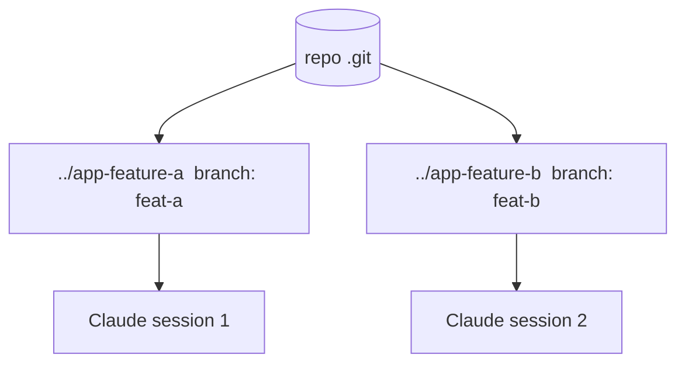

<LevelBadge level="advanced" />

<Callout type="objectives" items={["Что такое git worktree — один репозиторий, несколько рабочих каталогов, каждый на своей ветке","Какую именно проблему это решает: не давать параллельным сессиям Claude сталкиваться на одних и тех же файлах","Четыре команды, чтобы добавить, перечислить и удалить worktree","Когда приём оправдывает себя — и три подводных камня, которые кусают при слиянии","Как worktree сочетаются с субагентами: параллелизм между сессиями против параллелизма внутри одной"]} />

**git worktree** позволяет одному репозиторию иметь **несколько рабочих каталогов**, каждый из которых переключён на свою ветку. Соедините это с Claude Code — и вы сможете запускать **несколько сессий параллельно** на одном проекте: каждая редактирует свои файлы, без столкновений.

## Какую проблему это решает

Если две сессии Claude редактируют один и тот же рабочий каталог одновременно, они мешают изменениям друг друга. Worktree дают каждой сессии **собственный каталог и ветку**, поэтому параллельная работа остаётся изолированной до момента слияния.

## Основы

Весь рабочий процесс держится на четырёх командах: добавить worktree (новый каталог + новая ветка), посмотреть, что есть, и удалить worktree, когда закончили.

<Steps items={[{title: "Добавьте worktree для фичи", body: "Из вашего репозитория git worktree add ../app-feature-a -b feat-a создаёт новый каталог И новую ветку за один шаг."},{title: "Добавьте ещё один для исправления", body: "git worktree add ../app-fix-123 -b fix-123 — второй изолированный каталог/ветка рядом с первым."},{title: "Посмотрите, что у вас есть", body: "git worktree list показывает каждый рабочий каталог и ветку, на которой он находится."},{title: "Уберите за собой, когда закончили", body: "git worktree remove ../app-feature-a сносит worktree, чтобы устаревшие каталоги не накапливались."}]} />

<PromptCard title="Рабочий процесс из четырёх команд">{`# from your repo
git worktree add ../app-feature-a -b feat-a   # new dir + new branch
git worktree add ../app-fix-123 -b fix-123
git worktree list
# when done with one:
git worktree remove ../app-feature-a`}</PromptCard>

Откройте сессию Claude Code в каталоге каждого worktree и дайте им работать независимо.

## Когда это того стоит

- **Параллельные фичи/исправления**, по которым вы хотите продвигаться одновременно.
- **Долгая задача**, выполняющаяся в одном worktree, пока вы продолжаете работать в другом.
- **Рискованные эксперименты**, изолированные от вашего основного checkout.

## Подводные камни

<Callout type="warning" items={["Следите за обратным слиянием: ветки рано или поздно сольются — конфликты всплывают именно тогда, а не в процессе. Держите worktree сфокусированными и недолговечными.","Не запускайте из двух worktree общие ресурсы с состоянием (одна dev-БД, один порт), не разделив их.","Убирайте за собой с помощью git worktree remove, чтобы устаревшие каталоги не накапливались."]} />

## Worktree против субагентов

Две разные оси параллелизма — они не конкурируют, а складываются.

| | Что распараллеливается | Изоляция |
| --- | --- | --- |
| **[Субагенты](/docs/claude-code/subagents)** | Работа *внутри* одной сессии (делегирование) | Изолированный контекст |
| **Worktree** | Работа *между* сессиями на диске | Изолированные ветки/файлы |

Они хорошо сочетаются: сессия в worktree может сама порождать субагентов.

<Callout type="tip" items={["Используйте worktree, когда вам нужны две сессии Claude, одновременно работающие с одним репозиторием; используйте субагента, когда одной сессии нужно выгрузить часть работы в изолированный контекст."]} />

<Quiz title="Проверь себя" questions={[{q: "Что даёт вам git worktree?", options: ["Несколько веток в одном рабочем каталоге", "Несколько рабочих каталогов для одного репозитория, каждый на своей ветке", "Резервную копию вашей папки .git"], answer: 1, explain: "git worktree позволяет одному репозиторию иметь несколько рабочих каталогов, каждый из которых переключён на свою ветку — так параллельные сессии не сталкиваются."}, {q: "Какая команда создаёт новый каталог И новую ветку за один шаг?", options: ["git worktree list", "git worktree add ../app-feature-a -b feat-a", "git worktree remove ../app-feature-a"], answer: 1, explain: "git worktree add ../app-feature-a -b feat-a создаёт новый каталог и новую ветку вместе. list показывает существующие worktree; remove сносит один из них."}, {q: "Когда конфликты слияния от параллельных worktree на самом деле всплывают?", options: ["Постоянно, пока обе сессии редактируют", "При обратном слиянии, а не в процессе", "Никогда, потому что ветки изолированы"], answer: 1, explain: "Пока вы работаете, ветки остаются изолированными, поэтому конфликты не появляются в процессе — они всплывают при обратном слиянии. Держите worktree сфокусированными и недолговечными, чтобы их ограничить."}, {q: "Как соотносятся worktree и субагенты?", options: ["Это одна и та же возможность с двумя названиями", "Worktree распараллеливают работу между сессиями на диске; субагенты распараллеливают внутри одной сессии — и они сочетаются", "Нужно выбрать что-то одно; использование обоих ломает изоляцию"], answer: 1, explain: "Субагенты — это параллелизм внутри одной сессии (изолированный контекст); worktree — это параллелизм между сессиями на диске (изолированные ветки/файлы). Сессия в worktree может сама порождать субагентов."}]} />

<Callout type="takeaways" items={["git worktree = один репозиторий, несколько рабочих каталогов, каждый на своей ветке — основа для бесконфликтных параллельных сессий Claude.","Две сессии в одном рабочем каталоге мешают друг другу; отдельный worktree на каждую сессию держит файлы и ветки изолированными до момента слияния.","git worktree add ../dir -b branch создаёт каталог + ветку; list показывает их; remove убирает за собой.","Оправдано для параллельных фич/исправлений, долгих задач параллельно с другой работой и изолированных рискованных экспериментов.","Опасайтесь обратного слияния, не делите между worktree ресурсы с состоянием (БД, порт) и всегда убирайте за собой — и помните, что worktree сочетаются с субагентами."]} />

## Дальше

- [Субагенты и параллельные агенты](/docs/claude-code/subagents)
- [Headless-режим и Agent SDK](/docs/claude-code/headless-and-agent-sdk)
- [Управление контекстом](/docs/claude-code/context-management)
