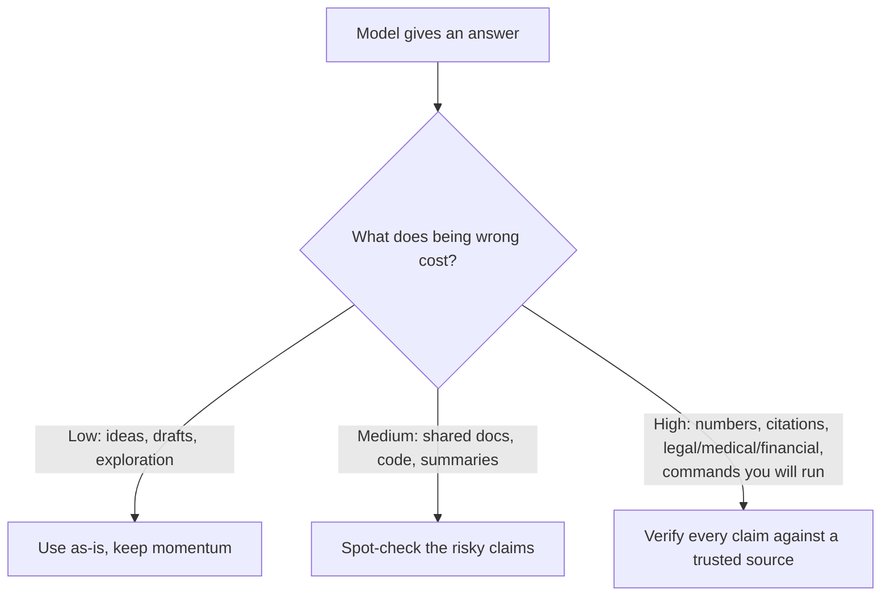

<LevelBadge level="intermediate" />

<Callout type="objectives" items={["Понять, ПОЧЕМУ модели выдают уверенные, грамотно оформленные ложные ответы", "Распознавать 5 зон повышенного риска, где стоит быть наиболее скептичным", "Применять набор из 6 инструментов, чтобы радикально снизить галлюцинации", "Использовать один готовый антигаллюцинационный промпт, который привязывает ответ к источнику, даёт возможность отступить и требует цитат", "Принять образ мышления, при котором объём проверки соответствует цене ошибки"]} />

**Галлюцинация** — это когда модель с полной уверенностью утверждает что-то ложное. Она не лжёт и не сломана — это обратная сторона того, как работают LLM: они генерируют *правдоподобный* текст, а правдоподобное не всегда истинно (см. [Что такое LLM?](/docs/foundations/what-is-an-llm)). Полностью убрать это с помощью промпта нельзя, но можно резко снизить частоту и отловить остальное.

## Почему это происходит

Модель предсказывает вероятное продолжение. Когда она чего-то «не знает», *наиболее правдоподобным на вид* продолжением часто оказывается уверенный, грамотно оформленный — и неверный — ответ. Встроенного сигнала «я не уверена» нет, если только вы сами не создадите для него место.

<Callout type="tip" items={["Способ исправить большинство галлюцинаций — намеренно создать место для неуверенности: дать модели разрешение сказать, что она не знает."]} />

## Зоны повышенного риска

Будьте максимально скептичны, когда вывод касается:

- **Цитат, ссылок и источников** — выдуманные статьи, фальшивые URL, неверно приписанные цитаты.
- **Конкретных чисел, дат и статистики** — правдоподобные, но придуманные цифры.
- **Узкоспециальных или совсем свежих фактов** — за пределами того, что модель надёжно усвоила.
- **Деталей API и библиотек** — методы или параметры, которых не существует.
- **Сведений о людях и юридических/медицинских деталей** — высокие ставки, легко ошибиться в нюансах.

## Набор инструментов для снижения

Комбинируйте их — каждый помогает:

<Steps items={[
  {title: "Опирайтесь на источники", body: "Вставьте исходный текст и скажите «отвечай только по тексту выше; если этого там нет, так и скажи». Это основная идея, лежащая в основе RAG (/docs/foundations/rag)."},
  {title: "Дайте возможность отступить", body: "Явно разрешите «Если не уверен, скажи „Я не знаю“» — это резко снижает уверенные догадки."},
  {title: "Просите рассуждения и цитаты", body: "«Процитируй точное предложение, подтверждающее каждое утверждение». Неподтверждённые утверждения становятся очевидными."},
  {title: "Снижайте креативность", body: "Для фактологических задач там, где модель предоставляет управление температурой, уменьшайте её (см. «Управление сэмплингом» по адресу /docs/foundations/sampling-controls)."},
  {title: "Используйте инструменты", body: "Для математики, актуальных данных или поиска дайте модели калькулятор/поиск/инструмент (/docs/api/tool-use), а не полагайтесь на память."},
  {title: "Перепроверяйте", body: "Задайте один и тот же вопрос двумя способами или сделайте второй проход с критикой первого."}
]} />

## Готовый антигаллюцинационный промпт для копирования

Большая часть набора инструментов выше сводится к одной многоразовой обёртке. Вставьте свой источник в указанное место и задайте вопрос — она привязывает ответ к источнику, даёт модели возможность отступить и требует цитат за один раз:

<PromptCard title="Антигаллюцинационная обёртка">{`You answer ONLY from the SOURCE below.
Rules:
- If the answer is not in the SOURCE, reply exactly: "Not stated in the source."
- After every claim, quote the exact sentence from the SOURCE that supports it.
- Do not add outside knowledge, estimates, or assumptions.

SOURCE:
"""
[paste the document, transcript, or data here]
"""

QUESTION: [your question]`}</PromptCard>

Почему это работает: лазейка «Not stated in the source» снимает давление, заставляющее угадывать, а правило цитирования предложения делает невозможным скрыть любое неподтверждённое утверждение. Убирайте блок SOURCE, когда вам действительно нужны собственные знания модели — но тогда проверка снова ложится на вас.

## Образ мышления, который действительно вас защищает

<Callout type="warning" items={["Ни один промпт не делает вывод на 100% надёжным. Для всего значимого — числа в отчёте, ссылки, команды, которые вы запустите, медицинских/юридических/финансовых деталей — сверяйте это с надёжным источником. Относитесь к ИИ как к быстрому первому черновику, а не как к финальному авторитету. В этом суть Ответственного использования (/docs/security/responsible-use)."]} />

Простое правило: **цена ошибки определяет объём проверки.** Мозговой штурм? Доверяйте свободно. Публикуете статистику? Проверяйте каждый раз.

<Callout type="takeaways" items={["Галлюцинации — это побочный продукт генерации на основе правдоподобия, а не баг, который можно полностью убрать промптом.", "Будьте максимально скептичны с цитатами, числами/датами, узкоспециальными или свежими фактами, деталями API и сведениями о людях/юридических/медицинских деталях.", "Комбинируйте набор инструментов: опирайтесь на источники, давайте возможность отступить, требуйте цитат, снижайте температуру, используйте инструменты, перепроверяйте.", "Одна обёртка-промпт привязывает ответ к источнику + даёт возможность отступить + требует цитат за один раз.", "Соотносите объём проверки с ценой ошибки — доверяйте свободно, когда дёшево, проверяйте каждое утверждение, когда это значимо."]} />

<Quiz title="Проверь себя" questions={[
  {
    q: "Почему модели галлюцинируют?",
    options: [
      "Они намеренно лгут пользователю",
      "Они предсказывают наиболее правдоподобное на вид продолжение, которое не всегда истинно",
      "Они сломаны и их нужно переобучить",
      "У них всегда заканчивается память посреди ответа"
    ],
    answer: 1,
    explain: "Галлюцинация — это обратная сторона того, как работают LLM: они генерируют правдоподобный текст, а правдоподобное не всегда истинно. Когда модель чего-то не знает, наиболее правдоподобным на вид продолжением часто оказывается уверенный, грамотно оформленный и неверный ответ."
  },
  {
    q: "Что из перечисленного является зоной повышенного риска, где стоит быть наиболее скептичным?",
    options: [
      "Свободный мозговой штурм для генерации идей",
      "Перефразирование предложения, которое вы уже написали",
      "Конкретные числа, даты и статистика",
      "Запрос простого определения, которое вы можете проверить на здравый смысл"
    ],
    answer: 2,
    explain: "Конкретные числа, даты и статистика — это зона повышенного риска: они могут быть правдоподобными, но придуманными. Другие зоны повышенного риска включают цитаты/ссылки, узкоспециальные или свежие факты, детали API и сведения о людях/юридических/медицинских деталях."
  },
  {
    q: "Каков самый прямой эффект от того, что вы даёте модели явную возможность отступить, например «Если не уверен, скажи „Я не знаю“»?",
    options: [
      "Это делает модель быстрее",
      "Это резко снижает уверенные догадки",
      "Это автоматически повышает температуру",
      "Это подключает модель к живому поиску"
    ],
    answer: 1,
    explain: "Явное разрешение модели сказать, что она не знает, снимает давление, заставляющее выдавать уверенную догадку, что резко снижает галлюцинированные ответы."
  },
  {
    q: "Какое правило определяет, сколько проверки требует ответ?",
    options: [
      "Длина ответа",
      "Заявленный уровень уверенности модели",
      "Цена ошибки",
      "Сколько времени ушло на написание промпта"
    ],
    answer: 2,
    explain: "Цена ошибки определяет объём проверки. Мозговой штурм? Доверяйте свободно. Публикуете статистику? Проверяйте каждый раз."
  },
  {
    q: "В антигаллюцинационной обёртке-промпте что делает невозможным скрыть любое неподтверждённое утверждение?",
    options: [
      "Снижение температуры до нуля",
      "Правило цитировать после каждого утверждения точное подтверждающее предложение из SOURCE",
      "Задавание вопроса дважды",
      "Удаление блока SOURCE"
    ],
    answer: 1,
    explain: "Правило цитирования предложения заставляет модель подкреплять каждое утверждение точным предложением из SOURCE, поэтому любое утверждение, которое на самом деле не подтверждено, становится очевидным. Лазейка «Not stated in the source» снимает давление, заставляющее угадывать."
  }
]} />

## Дальше

- [Генерация с дополнением из поиска (RAG)](/docs/foundations/rag)
- [Оценка качества ИИ (Evals)](/docs/foundations/evals)
- [Ответственное использование, этика и проверка](/docs/security/responsible-use)
