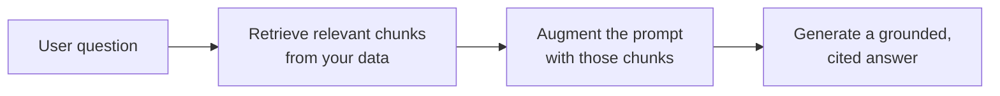

<LevelBadge level="intermediate" />

<Callout type="objectives" items={[
  "Что такое RAG и цикл извлечь-дополнить-сгенерировать",
  "Как индексировать, извлекать, дополнять и генерировать с цитатами",
  "Почему RAG превосходит дообучение для задач «ответь по моим документам»",
  "Пять режимов сбоев, которые убивают качество RAG",
  "Готовый к копированию промпт заземления, закрывающий два самых больших пробела"
]} />

**RAG** заставляет модель отвечать на вопросы по **вашим** данным — документам, базе знаний, кодовой базе, — на которых она никогда не обучалась. Идея проста: **извлечь** релевантные фрагменты, **дополнить** ими промпт, затем **сгенерировать** ответ, заземлённый на этих фрагментах.

## Цикл

<Steps items={[
  {title: "Проиндексируйте ваши данные", body: "Разбейте на чанки, эмбеддьте их (см. /docs/foundations/embeddings) и сохраните в векторный (и/или ключевой) индекс."},
  {title: "Извлеките", body: "Достаньте топ чанков, наиболее релевантных вопросу."},
  {title: "Дополните", body: "Поместите эти чанки в промпт с инструкцией вроде «Отвечай только по контексту ниже; если этого там нет — так и скажи»."},
  {title: "Сгенерируйте", body: "Выдайте ответ — и в идеале процитируйте, из какого чанка взято каждое утверждение."}
]} />

Про шаг эмбеддинга при индексировании см. [Эмбеддинги и векторный поиск](/docs/foundations/embeddings).

## Почему RAG вместо дообучения?

<Callout type="tip" items={[
  "Свежо: обновляете данные, а не модель",
  "Проверяемо: предоставляет цитаты",
  "Дёшево: гораздо дешевле переобучения"
]} />

Для большинства потребностей «отвечать по моим документам» RAG — правильный первый инструмент, см. [Дообучение против промптинга против RAG](/docs/foundations/finetune-vs-prompt-vs-rag).

## Режимы сбоев (где умирает качество RAG)

<Callout type="warning" items={[
  "Плохое извлечение = плохой ответ. Если нужный чанк не извлечён, модель не может его использовать. Большинство проблем «RAG ошибается» — это проблемы извлечения.",
  "Слишком грубый/мелкий чанкинг рушит релевантность (см. эмбеддинги).",
  "Нет инструкции по заземлению: модель смешивает извлечённые факты со своими собственными догадками. Скажите ей отвечать только по контексту и признавать пробелы.",
  "Впихивание слишком многого: нерелевантные чанки разбавляют сигнал и стоят токенов. Извлекайте мало качественных чанков.",
  "Нет цитат: вы не можете проверить, поэтому не можете доверять."
]} />

Сбой чанкинга связан с [эмбеддингами](/docs/foundations/embeddings), а перегрузка контекста стоит [токенов](/docs/foundations/tokens-and-context).

<Callout type="tip" items={[
  "Оценивайте извлечение отдельно: измеряйте «извлекли ли мы нужный чанк?» отдельно от «хорошо ли ответила модель?». Это быстро локализует проблему. См. Evals (/docs/foundations/evals)."
]} />

## Готово к копированию: промпт заземления

Единственное исправление с наибольшим рычагом — это инструкция заземления. Вставьте извлечённые чанки в шаблон вроде этого — он заставляет модель отвечать *только* по контексту, цитировать каждое утверждение и признавать пробелы вместо догадок:

<PromptCard title="Промпт заземления">{`You are answering strictly from the context below.

Rules:
- Use ONLY the context to answer. Do not use outside knowledge.
- Cite the source after each claim, like [chunk 2].
- If the answer is not in the context, reply exactly:
  "I don't have that in the provided sources."
- Quote numbers and names verbatim — never paraphrase a figure.

Context:
[chunk 1] ...
[chunk 2] ...
[chunk 3] ...

Question: <the user's question>`}</PromptCard>

Сочетайте его с *несколькими* качественными чанками (не со всем, что вы извлекли), и вы закроете два самых больших пробела разом: галлюцинаторное смешивание и непроверяемые ответы. Затем [оцените](/docs/foundations/evals) извлечение и генерацию отдельно, чтобы знать, какую половину настраивать.

## Освойте термины

<Flashcards cards={[
  {front: "RAG", back: "Извлечь релевантные фрагменты ваших данных, дополнить ими промпт, затем сгенерировать ответ, заземлённый на этих фрагментах."},
  {front: "Шаг индексирования", back: "Разбить данные на чанки, эмбеддить их, сохранить в векторный и/или ключевой индекс."},
  {front: "Шаг дополнения", back: "Поместить извлечённые чанки в промпт с инструкцией заземления: отвечать только по контексту, признавать пробелы."},
  {front: "Почему RAG, а не дообучение", back: "Свежо (обновляете данные, а не модель), предоставляет цитаты, гораздо дешевле переобучения."},
  {front: "Режим сбоя №1 в RAG", back: "Плохое извлечение. Если нужный чанк не извлечён, модель не может его использовать — большинство проблем «RAG ошибается» — это проблемы извлечения."},
  {front: "Инструкция заземления", back: "Скажите модели отвечать ТОЛЬКО по контексту, цитировать каждое утверждение и сообщать, когда ответа там нет."}
]} />

<Quiz title="Проверь себя" questions={[
  {
    q: "Что означают три буквы в RAG, по порядку?",
    options: ["Read, Analyze, Generate", "Retrieve, Augment, Generate", "Rank, Aggregate, Group", "Reduce, Append, Generate"],
    answer: 1,
    explain: "RAG = Retrieve (извлечь) релевантные чанки, Augment (дополнить) ими промпт, затем Generate (сгенерировать) заземлённый ответ."
  },
  {
    q: "Когда «RAG ошибается», в чём чаще всего настоящая проблема?",
    options: ["Модель слишком маленькая", "Извлечение — нужный чанк не был достан", "Слишком мало токенов в контекстном окне", "Эмбеддинги дообучены неправильно"],
    answer: 1,
    explain: "Плохое извлечение = плохой ответ. Если нужный чанк не извлечён, модель не может его использовать. Большинство проблем «RAG ошибается» — это проблемы извлечения."
  },
  {
    q: "Почему RAG обычно предпочтительнее дообучения для «ответить по моим документам»?",
    options: ["Это делает модель больше", "Это сохраняет знания свежими, даёт цитаты и дешевле переобучения", "Это снимает необходимость в любом промпте", "Это гарантирует, что модель никогда не галлюцинирует"],
    answer: 1,
    explain: "RAG сохраняет знания свежими (обновляете данные, а не модель), предоставляет цитаты и гораздо дешевле переобучения."
  },
  {
    q: "Какое единственное исправление с наибольшим рычагом останавливает смешивание моделью фактов с догадками?",
    options: ["Извлечь все возможные чанки", "Инструкция заземления, которая заставляет отвечать только по контексту", "Повысить температуру", "Пропустить цитаты, чтобы сэкономить токены"],
    answer: 1,
    explain: "Инструкция заземления заставляет модель отвечать только по контексту, цитировать каждое утверждение и признавать пробелы вместо догадок."
  },
  {
    q: "Почему оценивать извлечение отдельно от генерации?",
    options: ["Это требуется провайдером модели", "Это быстро локализует проблему — вы знаете, какую половину настраивать", "Это автоматически снижает стоимость токенов", "Генерацию иначе нельзя измерить"],
    answer: 1,
    explain: "Измерение «извлекли ли мы нужный чанк?» отдельно от «хорошо ли ответила модель?» быстро локализует проблему и подсказывает, какую половину настраивать."
  }
]} />

<Callout type="takeaways" items={[
  "RAG = извлечь релевантные чанки, дополнить ими промпт, сгенерировать заземлённый ответ с цитатами.",
  "Проиндексируйте (чанк + эмбеддинг + хранение), извлеките топ чанков, дополните инструкцией заземления, сгенерируйте с цитатами.",
  "Предпочитайте RAG дообучению для Q&A по документам: свежо, с цитатами, дешевле.",
  "Большинство сбоев — это сбои извлечения: извлекайте мало качественных чанков, а не всё подряд.",
  "Всегда добавляйте инструкцию заземления и цитируйте; оценивайте извлечение и генерацию отдельно."
]} />

## Дальше

- [Эмбеддинги и векторный поиск](/docs/foundations/embeddings)
- [Дообучение против промптинга против RAG](/docs/foundations/finetune-vs-prompt-vs-rag)
- [Плейбук исследований и синтеза](/docs/playbooks/research)
