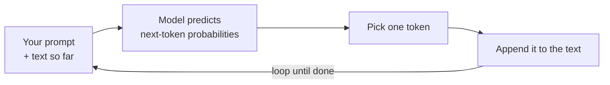

<LevelBadge level="beginner" />

**Большая языковая модель** (LLM) — технология, стоящая за Claude, — делает одну обманчиво простую вещь: она читает текст и **предсказывает, что идёт дальше**, по одному фрагменту за раз. Вот и всё. Всё остальное возникает из того, что она делает это поразительно хорошо.

<Callout
  type="objectives"
  items={[
    "Усвоить ментальную модель в одно предложение: LLM — это очень изощрённое автодополнение",
    "Увидеть, как модель строит ответ по одному токену за раз, в цикле",
    "Понять, почему этот механизм объясняет и её сильные стороны, и её причуды",
    "Знать, чем LLM НЕ является — и как это меняет способ её использования"
  ]}
/>

## Ментальная модель в одно предложение

> LLM — это очень изощрённое автодополнение, которое прочитало огромное количество текста и усвоило закономерности того, как язык — и идеи внутри него — склонны продолжаться.

Когда вы задаёте вопрос, модель не «ищет» ответ. Она генерирует наиболее правдоподобное продолжение вашего текста, токен за токеном (см. [Токены и контекст](/docs/foundations/tokens-and-context)). Правдоподобные продолжения хорошего вопроса обычно являются хорошими ответами — вот почему это вообще работает.

:::tip Аналогия: предиктивная клавиатура на стероидах
Вспомните автодополнение на вашем телефоне, которое подсказывает следующее слово. А теперь представьте, что оно прочитало большинство книг, статей и кода в интернете — и подсказывает не просто следующее слово, а целое эссе, перевод или программу, которые подходят по смыслу. Вот интуиция, стоящая за LLM.
:::

## По одному токену за раз

Весь движок — это цикл: прочитать всё, что есть на данный момент, предсказать следующий фрагмент, добавить его, повторить.

<Steps
  items={[
    {title: "Чтение", body: "Модель принимает ваш промпт плюс всё, что сгенерировано на данный момент, как единый блок текста."},
    {title: "Предсказание", body: "Она вычисляет вероятности того, каким мог бы быть следующий токен."},
    {title: "Выбор", body: "Она выбирает один токен. Будет ли это детерминированным или немного случайным — это то, что регулируют параметры сэмплирования, такие как температура."},
    {title: "Добавление и повтор", body: "Выбранный токен добавляется к тексту, и чуть более длинный текст подаётся обратно — цикл продолжается, пока ответ не будет готов."}
  ]}
/>

Каждый шаг всегда предсказывает только **один** токен, а затем подаёт чуть более длинный текст обратно. У модели нет заранее составленного плана всего ответа целиком — связность возникает из того, что это предсказание выполняется крайне хорошо, тысячи раз. То, как ведёт себя шаг «выбрать один токен» (жадно или немного случайно), регулируют [параметры сэмплирования](/docs/foundations/sampling-controls), такие как температура.

## Почему это объясняет её сильные стороны

Поскольку она усвоила закономерности в текстах, коде и рассуждениях, LLM может плавно **писать, резюмировать, переводить, объяснять и кодить** — задачи, которые все сводятся к «продолжи этот текст осмысленно». Дайте ей чёткую завязку, и она выдаст сильное продолжение. Вот почему [промптинг](/docs/prompting/basics) так важен: вы формируете начало текста, который она продолжает.

## Почему это объясняет её причуды

Тот же механизм объясняет шероховатости:

- **Она может быть уверенно неправа.** Гладко звучащее продолжение не всегда правдиво — это [галлюцинация](/docs/foundations/hallucinations).
- **Она по-настоящему не «знает» сегодняшние факты**, если вы их не предоставите или у неё нет инструмента, чтобы их найти.
- **У неё нет памяти** между разговорами, если вы её не дадите.

## Чем LLM **не является**

:::warning Скорректируйте свои ожидания — и получите результаты лучше
- ❌ **Не база данных и не поисковик.** Она генерирует, а не извлекает проверенные записи.
- ❌ **Не калькулятор.** Она может рассуждать о математике, но точность не гарантирована — дайте ей для этого инструменты.
- ❌ **Не человек.** Никаких чувств, намерений или непрерывной памяти. Это мощный текстовый движок.
:::

Относитесь к ней как к блестящему, быстрому, начитанному ассистенту, который иногда что-то путает, — и **проверяйте** то, что важно.

## Ключевые термины

<Flashcards
  title="Повторите основные концепции"
  cards={[
    {front: "LLM (большая языковая модель)", back: "Технология, стоящая за Claude. Она читает текст и предсказывает, что идёт дальше, по одному фрагменту за раз."},
    {front: "Предсказание следующего токена", back: "Основной цикл: прочитать текст на данный момент, предсказать следующий токен, добавить его, повторять до готовности."},
    {front: "Токен", back: "Фрагмент текста, который модель предсказывает на каждом шаге. Модель всегда предсказывает только один за раз."},
    {front: "Галлюцинация", back: "Гладко звучащее продолжение, которое на самом деле не является правдивым — побочный эффект генерации, а не извлечения."},
    {front: "Сэмплирование / температура", back: "Регулирует, как ведёт себя шаг «выбрать один токен» — жадно или немного случайно."}
  ]}
/>

<Callout
  type="takeaways"
  items={[
    "LLM — это очень изощрённое автодополнение: она предсказывает следующий токен, а не ищет ответ",
    "Связность возникает из выполнения этого цикла предсказания по одному токену за раз, тысячи раз",
    "Тот же механизм объясняет и её сильные стороны (писать, резюмировать, переводить, объяснять, кодить), и её причуды (уверенно неправа, нет актуальных фактов, нет памяти)",
    "Это не база данных, не калькулятор и не человек — проверяйте то, что важно"
  ]}
/>

## Проверьте себя

<Quiz
  title="Проверьте себя"
  questions={[
    {
      q: "Что фундаментально делает LLM, когда вы задаёте ей вопрос?",
      options: [
        "Ищет ответ в базе данных проверенных фактов",
        "Генерирует наиболее правдоподобное продолжение вашего текста, по одному токену за раз",
        "Ищет в реальном вебе самый свежий ответ"
      ],
      answer: 1,
      explain: "LLM ничего не ищет — она генерирует наиболее правдоподобное продолжение вашего текста, токен за токеном."
    },
    {
      q: "Почему LLM может быть уверенно неправа?",
      options: [
        "Гладко звучащее продолжение не всегда правдиво — это галлюцинация",
        "У неё посреди ответа заканчивается память",
        "Она отказывается отвечать на вопросы, которых не знает"
      ],
      answer: 0,
      explain: "Она генерирует правдоподобно звучащий текст, а не извлекает проверенные записи, поэтому гладкое продолжение всё равно может быть ложным — это галлюцинация."
    },
    {
      q: "Какое утверждение об LLM верно?",
      options: [
        "Это поисковик, который извлекает проверенные записи",
        "Это калькулятор, гарантированно точный",
        "Это не человек, и у неё нет непрерывной памяти между разговорами, если вы её не дадите"
      ],
      answer: 2,
      explain: "LLM — это мощный текстовый движок, а не база данных, калькулятор или человек. У неё нет памяти между разговорами, если вы её не предоставите."
    }
  ]}
/>

## Дальше

- [Токены, контекст и память](/docs/foundations/tokens-and-context)
- [Галлюцинации и как их уменьшить](/docs/foundations/hallucinations)
- [Основы промптинга](/docs/prompting/basics)
