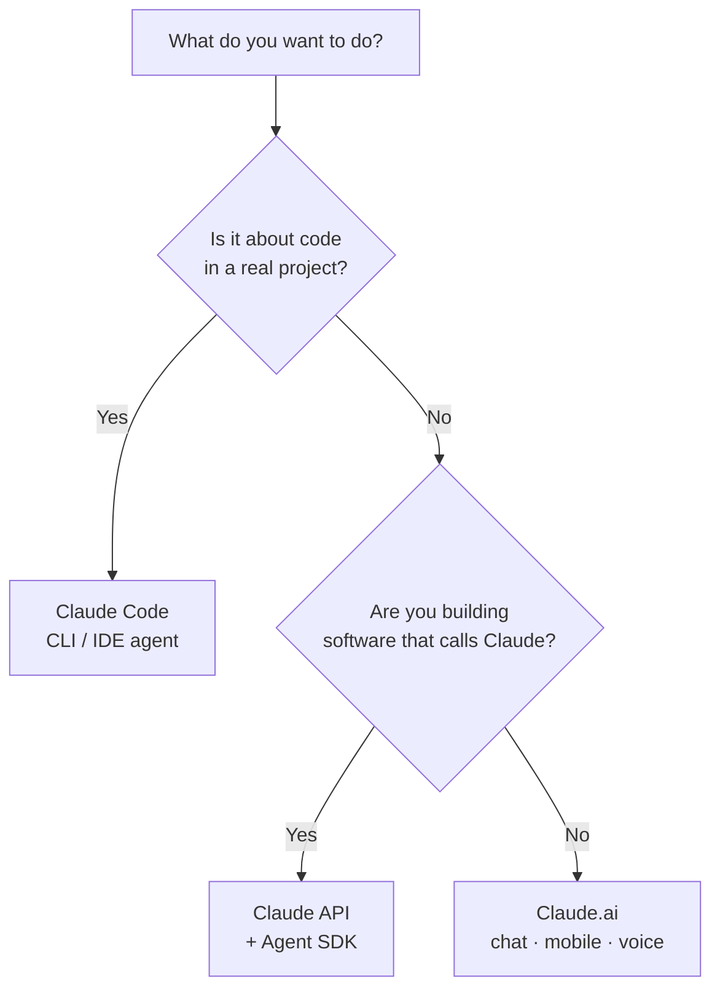

<LevelBadge level="beginner" />

«Claude» бывает в нескольких вариантах. Выбирайте по тому, **что вы пытаетесь сделать**, а не по тому, о каком вы слышали.

<Callout type="objectives" items={[
  "Сопоставьте свою цель с подходящей поверхностью Claude: чат, Claude Code или API",
  "Поймите, когда в картину вписываются мобильный и голос",
  "Разберитесь, как три поверхности работают вместе по мере вашего роста",
  "Получите быстрое представление о том, какую модель выбрать, когда начнёте строить"
]} />

## Решение за 30 секунд

## Три поверхности с первого взгляда

| Поверхность | Лучше всего для | Кому | Начните здесь |
|---|---|---|---|
| **Claude.ai** | Письмо, исследования, анализ, обучение, планирование, повседневные вопросы | Всем, без настройки | [Начало работы с Claude.ai](/docs/claude-app/getting-started) |
| **Claude Code** | Работа *внутри кодовой базы* — чтение, редактирование, выполнение команд, исправление тестов | Разработчикам (и технически любопытным) | [Что такое Claude Code](/docs/claude-code/what-is-claude-code) |
| **API и Agent SDK** | Приложения, автоматизации и агенты, которые вызывают Claude программно | Разработчикам, выпускающим продукт или конвейер | [Ваш первый вызов API](/docs/api/first-call) |

### Claude.ai — чат-приложения

Claude.ai — это отправная точка без настройки для всех. Вы также получаете его на **мобильном** ([iOS/Android](/docs/claude-app/mobile)) и через **[голос](/docs/claude-app/voice-mode)** — отлично подходит, чтобы фиксировать идеи на ходу. Усильте его с помощью [Проектов](/docs/claude-app/projects), [кастомных инструкций](/docs/claude-app/custom-instructions) и [Артефактов](/docs/claude-app/artifacts).

### Claude Code — агентный инструмент для кодинга

Claude Code работает *внутри* вашего проекта. Он читает, редактирует, выполняет команды и исправляет тесты — действуя с вашими файлами с вашего разрешения.

### API и Agent SDK — встройте Claude в собственное ПО

API и Agent SDK позволяют вашему собственному ПО вызывать Claude программно, так что вы можете выпускать ИИ-функции, автоматизации и агентов.

## Они работают вместе

Это не конкурирующие продукты — большинство людей постепенно переходят между ними:

| Вы хотите… | Используйте |
|---|---|
| Набросать письмо, резюмировать PDF, провести мозговой штурм | Claude.ai (или голос/мобильный) |
| Отрефакторить модуль, добавить тесты, исправить баг | Claude Code |
| Добавить ИИ-функцию в *ваше* приложение | API / Agent SDK |

:::tip Не уверены? Начните с чата
[Claude.ai](/docs/claude-app/getting-started) не требует никакой настройки и обучает вас тому, как Claude «думает». Эти навыки переносятся на всё остальное.
:::

## Какую модель выбрать, когда начнёте строить?

Выбор *поверхности* — это шаг первый. Когда вы переходите к Claude Code или API, вы также выбираете *модель* — Haiku, Sonnet или Opus. Ответьте на три быстрых вопроса, и этот помощник предложит отправную точку:

<ModelPicker />

:::note Не зашивайте имена в код
Линейки моделей и цены меняются. Всегда сверяйте актуальные ID моделей на странице [Выбор модели Claude](/docs/api/choosing-a-model), прежде чем выпускать.
:::

## Проверьте себя

<Quiz title="Проверьте себя" questions={[
  {
    q: "Вы хотите набросать письмо и резюмировать PDF — без настройки. Какая поверхность?",
    options: ["Claude Code", "Claude.ai (чат / мобильный / голос)", "API и Agent SDK"],
    answer: 1,
    explain: "Claude.ai — это чат-поверхность без настройки для письма, исследований и повседневных вопросов — доступна в вебе, на мобильном и через голос."
  },
  {
    q: "Вам нужно отрефакторить модуль и исправить падающие тесты внутри реального проекта. Какая поверхность?",
    options: ["Claude.ai", "Claude Code", "API и Agent SDK"],
    answer: 1,
    explain: "Claude Code работает внутри вашей кодовой базы — читает, редактирует, выполняет команды и исправляет тесты с вашего разрешения."
  },
  {
    q: "Где следует сверять актуальные имена моделей и цены?",
    options: ["На этой странице", "На странице «Выбор модели Claude»", "На диаграмме Mermaid выше"],
    answer: 1,
    explain: "Линейки моделей меняются, поэтому эта страница не зашивает их в код — сверяйте актуальные ID и цены на странице «Выбор модели Claude»."
  }
]} />

<Callout type="takeaways" items={[
  "Claude.ai: чат без настройки для письма, исследований и повседневной работы — также на мобильном и через голос",
  "Claude Code: агент, который действует внутри вашей кодовой базы",
  "API и Agent SDK: встройте Claude в собственное ПО",
  "Они складываются вместе — большинство начинают с чата и переходят к Code и API",
  "Выбирайте модель (Haiku / Sonnet / Opus) только когда начнёте строить, и проверяйте актуальные ID перед выпуском"
]} />

## Дальше

- [Ваши первые 5 минут](/docs/start-here/your-first-5-minutes)
- [Пути обучения](/docs/start-here/learning-paths)
- [Выбор модели Claude](/docs/api/choosing-a-model) (когда начнёте строить)
