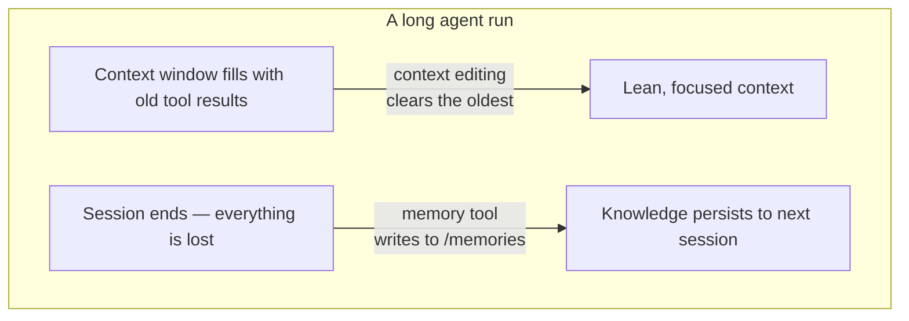

import Tabs from '@theme/Tabs';
import TabItem from '@theme/TabItem';

<LevelBadge level="advanced" />

<VerifyNote lastVerified="2026-06-26" source="https://platform.claude.com/docs/en/agents-and-tools/tool-use/memory-tool">
这两项功能均处于 beta 阶段。工具类型字符串、beta 标头、默认值以及所报告的基准测试增益都会发生变化 —— 在以它们为基础进行构建之前，请先在官方的 memory-tool 和 context-editing 文档中确认。
</VerifyNote>

一个长时间运行的智能体有两个敌人：对话一结束它就**遗忘**了刚学到的东西，而它的上下文窗口会被陈旧的工具输出**填满**直到溢出。Anthropic 为每个问题各提供了一个原语 —— **memory tool**（持久化）和**上下文编辑**（修剪）—— 它们的设计就是要配合使用。

<Callout type="objectives" items={["memory tool 是什么 —— 一个由你（而非 Anthropic）实现的、位于 /memories 的客户端文件存储", "你的处理程序必须响应的六个命令：view、create、str_replace、insert、delete、rename", "为什么在接入它时路径穿越校验是不可妥协的", "上下文编辑如何在上下文越过某个 token 阈值后自动清除旧的工具结果", "如何在同一个 beta 标头下组合使用两者，以及关于缓存和顺序的注意事项"]} />

## 两个问题，两个工具



在头脑中把这两个概念分开：

- **memory tool** = *跨会话的持久化*。Claude 读写文件；**由你**来存储它们。
- **上下文编辑** = *会话内的修剪*。API 在提示词到达 Claude 之前从中丢弃陈旧的工具结果。

本页与 [Prompt Caching](/docs/api/prompt-caching) 和 [token economy](/docs/power-user/token-economy) 配套，覆盖成本层面；与 [Context Engineering](/docs/frontiers/context-engineering) 和 [long-running agent harnesses](/docs/frontiers/long-running-agent-harnesses) 配套，覆盖*为什么*。

<Flashcards title="记忆与上下文术语" cards={[{front:"memory tool","back":"一个客户端工具（类型为 memory_20250818），让 Claude 在 /memories 目录中创建/读取/更新/删除文件。存储后端由你实现。"},{front:"/memories","back":"所有记忆操作都被限定在这唯一一个目录内。每条路径都必须经过校验以确保留在其中。"},{front:"上下文编辑","back":"一种服务端策略，一旦越过某个 token 阈值就从提示词中清除旧的工具结果 —— 完整历史仍保留在你的客户端上。"},{front:"clear_tool_uses_20250919","back":"上下文编辑策略，移除最旧的工具结果，并用一个占位符替换它们，让 Claude 知道它们被修剪了。"},{front:"Compaction","back":"另一项独立的服务端功能，在接近上下文上限时对整段对话进行摘要 —— 与客户端的上下文编辑互为补充。"}]} />

## memory tool 是一个由*你*实现的工具

这一点常让人困惑：启用 memory tool **并不**为你提供 Anthropic 托管的存储。它是一个**客户端**工具。Claude 发出诸如 `view` 或 `create` 之类的工具调用；你的应用针对你所选择的任何后端 —— 本地文件、数据库、加密 blob、云存储 —— 执行它们并返回结果。字节存放在哪里由你掌控（这也是它符合 [Zero-Data-Retention](/docs/foundations/privacy) 资格的原因）。

启用该工具后，Anthropic 会注入一条系统指令，告诉 Claude 在做任何其他事之前**先检查它的记忆目录**，并在工作过程中记录进度，这样即使上下文被重置也不会丢失任何东西。

### 第 1 步 —— 启用工具

把该工具添加到你的请求中。类型字符串是带日期的版本 `memory_20250818`。

<Tabs groupId="lang">
<TabItem value="python" label="Python">

```python
import anthropic

client = anthropic.Anthropic()

message = client.messages.create(
    model="claude-opus-4-8",
    max_tokens=2048,
    messages=[{"role": "user", "content": "Help me respond to this support ticket."}],
    tools=[{"type": "memory_20250818", "name": "memory"}],
)

print(message)
```

</TabItem>
<TabItem value="typescript" label="TypeScript">

```typescript
import Anthropic from "@anthropic-ai/sdk";

const anthropic = new Anthropic();

const message = await anthropic.messages.create({
  model: "claude-opus-4-8",
  max_tokens: 2048,
  messages: [{ role: "user", content: "Help me respond to this support ticket." }],
  tools: [{ type: "memory_20250818", name: "memory" }],
});

console.log(message);
```

</TabItem>
</Tabs>

官方 SDK 自带 memory 辅助工具，这样你就不必手工拼写工具接口 —— 继承 `BetaAbstractMemoryTool`（Python、C#）、使用 `betaMemoryTool`（TypeScript），或实现 `BetaMemoryToolHandler`（Java）。它们给你一个干净的钩子，让你在其中接入自己的存储。

### 第 2 步 —— 响应这六个命令

你的处理程序必须实现这些命令。Claude 期望返回的字符串是特定的 —— 请与之匹配，以便模型正确解读结果。

<Steps items={[{title: "view", body: "列出一个目录（深度最多 2 层的文件，附带人类可读的大小），或返回某个文件的内容并带有从 1 开始的行号。可选的 view_range 用于读取一个切片。"},{title: "create", body: "用 file_text 写入一个新文件。如果它已存在则报错，而不是悄悄覆盖。"},{title: "str_replace", body: "用 new_str 替换一段精确的 old_str。如果 old_str 缺失，或出现不止一次（有歧义），则拒绝 —— 并报告行号。"},{title: "insert", body: "在 insert_line 处插入 insert_text。校验该行处于 [0, n_lines] 范围内。"},{title: "delete", body: "删除一个文件，或递归删除一个目录及其内容。"},{title: "rename", body: "移动/重命名一个路径。如果目标已存在则拒绝 —— 绝不覆盖。"}]} />

对目录执行一次真实的 `view` 会返回类似下面的内容 —— 注意那行字面量标头和以制表符分隔的大小，模型经过训练能够解析它们：

```text
Here're the files and directories up to 2 levels deep in /memories, excluding hidden items and node_modules:
4.0K	/memories
1.5K	/memories/customer_service_guidelines.xml
2.0K	/memories/refund_policies.xml
```

### 第 3 步 —— 锁定路径（不要跳过这一步）

memory tool 允许模型发出任意的路径字符串。一段被投毒的对话或一个提示词注入载荷可能试图逃出 `/memories`，去读取或覆盖你机器上其他地方的文件。把每一个传入的路径都当作充满敌意来对待。

<Callout type="warning" items={["拒绝任何解析后不在 /memories 内部的路径。","在检查之前先规范化 —— 在 Python 中，先 Path(p).resolve()，然后验证 .relative_to(memories_root) 不会抛出异常。","拦截 ../、..\\，以及像 %2e%2e%2f 这样的 URL 编码穿越。","限制文件大小和读取长度，这样失控的智能体就无法耗尽磁盘或撑爆下一个提示词。"]} />

这个校验器就是全部胜负所在 —— 在其他一切上线之前先把它钉死并测试它：

<PromptCard title="路径穿越防护（Python）">{`from pathlib import Path

MEMORY_ROOT = Path("/srv/agent/memories").resolve()

def safe_path(requested: str) -> Path:
    # Map the model's /memories/... onto your real root, then prove containment.
    rel = requested.removeprefix("/memories").lstrip("/")
    candidate = (MEMORY_ROOT / rel).resolve()
    candidate.relative_to(MEMORY_ROOT)  # raises ValueError if it escaped
    return candidate`}</PromptCard>

## 上下文编辑让窗口免于溢出

记忆解决的是*遗忘*。相反的问题 —— 上下文窗口被 40 次网页搜索之前的旧 `tool_result` 块塞满 —— 正是**上下文编辑**所解决的。一旦提示词越过某个 token 阈值，API 会在提示词被发送给模型之前清除**最旧的**工具结果（用一个简短的占位符替换它们，让 Claude 知道它们被移除了）。你的客户端保留着完整、未经编辑的历史；只有到达模型的那部分才被裁剪。

它依赖于一个 beta 标头：

```text
anthropic-beta: context-management-2025-06-27
```

你用一个 `context_management.edits` 数组来配置它。主要策略是 `clear_tool_uses_20250919`：

<Tabs groupId="lang">
<TabItem value="python" label="Python">

```python
message = client.beta.messages.create(
    model="claude-opus-4-8",
    max_tokens=2048,
    betas=["context-management-2025-06-27"],
    messages=[...],
    tools=[{"type": "memory_20250818", "name": "memory"}],
    context_management={
        "edits": [
            {
                "type": "clear_tool_uses_20250919",
                "trigger": {"type": "input_tokens", "value": 30000},  # start clearing past 30k
                "keep": {"type": "tool_uses", "value": 3},            # always keep the last 3
                "clear_at_least": {"type": "input_tokens", "value": 5000},
                "exclude_tools": ["memory"],                          # never clear memory calls
                "clear_tool_inputs": False,                           # keep the call args, drop results
            }
        ]
    },
)
```

</TabItem>
<TabItem value="typescript" label="TypeScript">

```typescript
const message = await anthropic.beta.messages.create({
  model: "claude-opus-4-8",
  max_tokens: 2048,
  betas: ["context-management-2025-06-27"],
  messages: [...],
  tools: [{ type: "memory_20250818", name: "memory" }],
  context_management: {
    edits: [
      {
        type: "clear_tool_uses_20250919",
        trigger: { type: "input_tokens", value: 30000 },
        keep: { type: "tool_uses", value: 3 },
        clear_at_least: { type: "input_tokens", value: 5000 },
        exclude_tools: ["memory"],
        clear_tool_inputs: false,
      },
    ],
  },
});
```

</TabItem>
</Tabs>

这些旋钮的含义：

| 参数 | 默认值 | 它控制什么 |
|-----------|---------|------------------|
| `trigger` | 100,000 input tokens | 何时开始清除 |
| `keep` | 3 tool uses | 始终保留多少对最近的工具使用/结果 |
| `clear_at_least` | 无 | 每次激活至少释放的 token 数 —— 用它来确保一次缓存失效确实物有所值 |
| `exclude_tools` | 无 | 永不被清除的工具（例如 `memory`、`web_search`） |
| `clear_tool_inputs` | `false` | 是否也丢弃工具的*调用参数*，而不仅仅是结果 |

响应会在 `context_management.applied_edits` 下告诉你它做了什么 —— 例如 `cleared_tool_uses` 和 `cleared_input_tokens` —— 这样你就能记录回收了多少。

还有一个姊妹策略 `clear_thinking_20251015`，它修剪旧的[扩展思考](/docs/api/thinking-and-effort)块。如果你同时使用两者，请在 `edits` 数组中**把 `clear_thinking_20251015` 列在前面**。

<Callout type="tip" items={["清除工具结果会使清除点处的任何提示词缓存前缀失效 —— 把它和 clear_at_least 搭配使用，这样只有在释放一大块有意义的内容时才付出那次失效的代价。","exclude_tools: [\"memory\"] 是惯常做法：你希望智能体自己的笔记得以保留，而不是和陈旧的搜索结果一起被清扫掉。","上下文编辑（客户端裁剪）和 compaction（服务端摘要）是不同的功能 —— 对于非常长的运行，你可以把两者叠加使用。"]} />

## 为什么要配对使用 —— 数字

二者结合使用，能让智能体的运行远远超出单个上下文窗口：上下文编辑让实时窗口保持精简，而任何重要的东西都会在它被清除之前写入记忆。Anthropic 报告称，将记忆与上下文编辑结合，在一项智能体搜索评测上带来了 **39% 的提升**，而单是上下文编辑就在一项 100 轮的网页搜索测试中把 token 用量削减了 **84%**。

<VerifyNote lastVerified="2026-06-26" source="https://www.anthropic.com/news/context-management">
这些百分比是 Anthropic 自己的基准测试数字，反映的是特定的评测设置 —— 请把它们当作方向性参考，而非对你工作负载的保证。请在 context-management 公告中确认。
</VerifyNote>

## 一个行之有效的模式：多会话项目日志

记忆最干净利落的用法是有意识地引导它，而不是临时随手写文件：

<Steps items={[{title: "初始化会话", body: "在任何实际工作之前，写下一份进度日志、一份功能清单，以及一条指向项目所需任何启动脚本的备注。"},{title: "之后每个会话以读取这些文件开始", body: "它在几秒内就恢复了完整的项目状态 —— 无需重新探索代码库或回溯各项决策。"},{title: "每个会话以更新日志结束", body: "记录完成了什么以及下一步是什么，这样下一个会话就有一个准确的起点。"},{title: "一次只做一个功能，并经过验证", body: "只有在端到端验证之后才把一个功能标记为完成 —— 而不仅仅是在代码写完之后 —— 这样日志才能保持可信。"}]} />

## 检验你的理解

<Quiz questions={[{q:"memory tool 的数据实际存储在哪里？",options:["在 Anthropic 的服务器上，为你托管","在你自己的基础设施中 —— 该工具是客户端的，由你实现后端","在模型的权重中","在提示词缓存中"],answer:1,explain:"memory tool 是客户端的。Claude 发出工具调用；你的应用针对你所掌控的存储执行它们，并被限定在 /memories 内。"},{q:"上下文编辑的 clear_tool_uses_20250919 策略移除什么？",options:["系统提示词","最近的工具结果","越过某个 token 阈值后最旧的工具结果","所有用户消息"],answer:2,explain:"它在触发阈值之后先清除最旧的工具结果，同时保留最近的那些（默认：最后 3 个），并把完整历史留在你的客户端上。"},{q:"为什么必须校验 memory tool 收到的每一条路径？",options:["为了节省磁盘空间","为了防止通过像 ../ 这样的输入逃出 /memories 的目录穿越","为了加快模型速度","因为 Anthropic 会拒绝长路径"],answer:1,explain:"一条恶意的或被注入的路径可能试图读取或覆盖 /memories 之外的文件。在采取行动之前先规范化路径，并证明它留在记忆根目录内部。"}]} />

## 来源与延伸阅读

- [memory tool —— Claude API 文档](https://platform.claude.com/docs/en/agents-and-tools/tool-use/memory-tool) —— 工具类型 `memory_20250818`、六个命令以及安全指南。
- [上下文编辑 —— Claude API 文档](https://platform.claude.com/docs/en/build-with-claude/context-editing) —— `context-management-2025-06-27` beta、策略字段以及默认值。
- [在 Claude 开发者平台上管理上下文](https://www.anthropic.com/news/context-management) —— 包含 39% / 84% 基准测试数字的公告。
- [面向 AI 智能体的有效上下文工程](https://www.anthropic.com/engineering/effective-context-engineering-for-ai-agents) —— 记忆为之而生的即时检索模式。
- [面向长时间运行智能体的有效骨架](https://www.anthropic.com/engineering/effective-harnesses-for-long-running-agents) —— 多会话项目日志案例研究。
- AILmanac 上的相关内容：[Context Engineering](/docs/frontiers/context-engineering) · [Long-running agent harnesses](/docs/frontiers/long-running-agent-harnesses) · [Prompt Caching](/docs/api/prompt-caching) · [Tool Use](/docs/api/tool-use)
