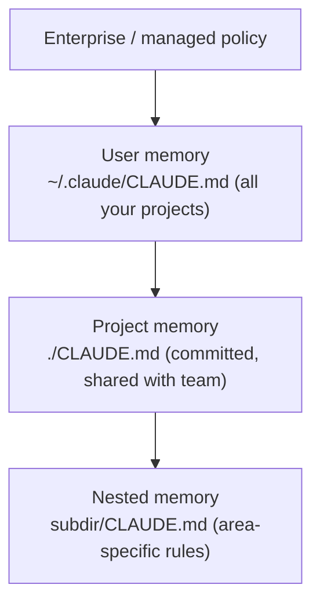

<LevelBadge level="beginner" />

<VerifyNote lastVerified="2026-06-20" source="https://code.claude.com/docs/en/memory">
记忆文件的位置和导入语法可能会变化——具体细节请以 Claude Code 官方记忆文档为准。
</VerifyNote>

如果你只做**一件**事来让 [Claude Code](/docs/claude-code/what-is-claude-code) 变得更好，那就做这件。`CLAUDE.md` 是一个纯文本文件，Claude 会在每次会话开始时读取它——它是你项目的常驻简报。

<Callout type="objectives" items={["为什么 CLAUDE.md 是收益最高的单一 Claude Code 设置", "记忆层级如何从全局合并到项目专属", "如何用 /init 生成一份起始文件并精简它", "什么内容应该写进 CLAUDE.md——以及什么应该排除在外", "@imports 如何让你引用文档而无需重复其内容"]} />

## 为什么它是收益最高的设置

没有它，你每次会话都要重新解释你的项目（"我们用 pnpm，测试在 `__tests__` 里，别碰 `/generated`……"）。有了它，Claude 早已知晓。这里写好的指令会一次性改善*未来每一次*交互。

## 记忆层级

Claude Code 会从多个位置读取记忆并将它们合并，大致从最全局到最具体：

- **用户记忆**——你在所有项目中的个人偏好。
- **项目记忆**（`./CLAUDE.md`，已提交）——*这个*仓库如何运作。与团队共享。
- **嵌套记忆**——在子文件夹里放一个 `CLAUDE.md`，规则只在那里生效。

<Flashcards title="了解你的记忆层级" cards={[{front: "用户记忆", back: "~/.claude/CLAUDE.md——你在所有项目中通用的个人偏好。"}, {front: "项目记忆", back: "./CLAUDE.md——已提交并与团队共享；描述这个仓库如何运作。"}, {front: "嵌套记忆", back: "subdir/CLAUDE.md——只在该子文件夹内生效的区域专属规则。"}, {front: "Enterprise / managed policy", back: "最全局的层级；位于你的用户记忆之上的组织级策略。"}]} />

## 生成一个起点

<Steps items={[{title: "在项目里运行 /init", body: "Claude 会检查代码并自动为你起草一份 CLAUDE.md。"}, {title: "把它精简下来", body: "草稿只是起点，而非终点。把它修剪成真实且有用的内容。"}, {title: "借用一个模板", body: "从 CLAUDE.md 模板页面取一份现成的起始模板，并按你的仓库进行调整。"}]} />

<PromptCard title="生成一份 CLAUDE.md 草稿">{`/init`}</PromptCard>

从 [CLAUDE.md 模板](/docs/templates/claude-md)里取一份现成的起始模板。

## 应该写什么

- 用两句话说明项目是什么。
- 技术栈，以及如何**运行 / 测试 / lint**。
- Claude 推断不出来的约定（命名、结构、提交风格）。
- **护栏**："声明完成前先跑测试"、"绝不编辑 `/vendor`"、"绝不提交密钥"。

## 不应该写什么

<Callout type="warning" items={["Claude 会字面地遵循 CLAUDE.md——过时、含糊或一厢情愿的指令反而有害。", "描述项目当下实际的运作方式；简短且真实，胜过冗长且理想化。", "避免粘贴巨大的文档（改用 @imports），避免密钥，避免你实际并不遵循的规则。", "定期复查它，让它随项目演进而保持准确。"]} />

## 导入

引入已有文档而不是复制它们——例如用 `@path/to/file` 导入引用你的风格指南，这样就只有一个权威来源。确切语法见[官方记忆文档](https://code.claude.com/docs/en/memory)。

<Callout type="tip" items={["单一权威来源：用 @imports 引用文件，而不是把它的内容粘贴进 CLAUDE.md。", "如果文档已经存在，链接它——别复制它。副本会逐渐过时。"]} />

## 自测一下

<Quiz title="自测一下" questions={[{q: "Claude Code 在每次会话开始时读取哪个文件作为你项目的常驻简报？", options: ["README.md", "CLAUDE.md", "package.json"], answer: 1, explain: "CLAUDE.md 是 Claude 在每次会话开始时读取的纯文本记忆文件。"}, {q: "在项目里运行 /init 会做什么？", options: ["它会把 CLAUDE.md 提交到团队的仓库", "它通过检查代码起草一份 CLAUDE.md，然后由你精简", "它会删除过时的记忆文件"], answer: 1, explain: "/init 通过检查代码起草一份起始 CLAUDE.md——草稿只是起点，所以你之后要把它精简下来。"}, {q: "包含像风格指南这样的大型已有文档，推荐的做法是什么？", options: ["把整份文档粘贴进 CLAUDE.md", "用 @path/to/file 导入引用它", "把它作为密钥存储"], answer: 1, explain: "用 @imports 指向该文件，这样就只有一个权威来源，而不是一份会逐渐过时的重复副本。"}]} />

<Callout type="takeaways" items={["CLAUDE.md 是收益最高的设置：它会一次性改善未来每一次会话。", "记忆从全局到具体合并：先是企业策略，然后是用户、项目和嵌套的 CLAUDE.md 文件。", "从 /init 开始，然后把草稿精简成真正真实的内容。", "包含项目摘要、运行/测试/lint 命令、约定和护栏。", "保持简短且真实——大型文档用 @imports，并且绝不提交密钥。"]} />

## 下一步

- [规划模式](/docs/claude-code/plan-mode)——安全的首次改动
- [权限与模式](/docs/claude-code/permissions)——Claude 可以无人值守做哪些事
- [实战演练：为真实仓库定制 Claude Code](/docs/walkthroughs/customize-claude-code)
